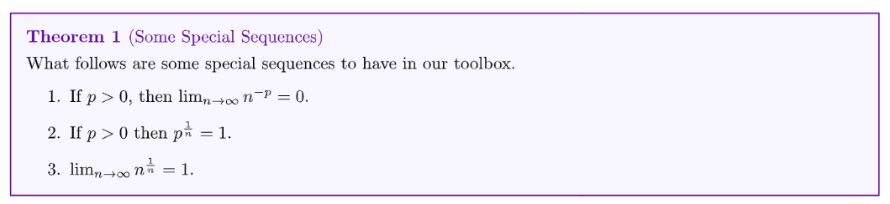
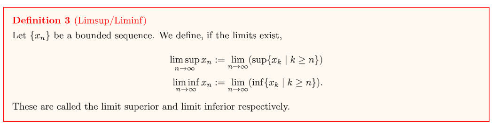
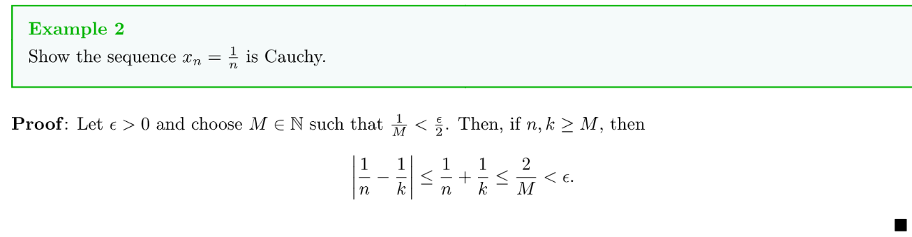
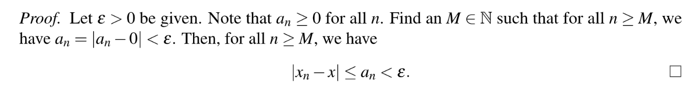
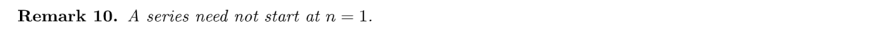

[Lecture Note 9.pdf](https://www.yuque.com/attachments/yuque/0/2022/pdf/12393765/1668496647902-bb325d17-e25b-424d-b0e8-2a2741463b51.pdf)
[Lecture Note 10.pdf](https://www.yuque.com/attachments/yuque/0/2022/pdf/12393765/1668496647294-96c126a0-9134-4f39-afed-153c1c4fa38a.pdf)

# 1 Special Sequences
## Power Sequences
> **Binomial Theorem:**
> $\forall n\in \mathbb{N}, x,y\in \mathbb{R}, (x+y)^n=\sum_{k=0}^n(_k^n)x^{n-k}y^{k}$, $(_k^n)=\frac{n!}{(n-k)!k!}$
> 通过上述二项式定理我们可以得出一个很有用的推论:
> 如果$x>0,n\in \mathbb{N}$, 则$(1+x)^n\geq 1+nx$
> 
> 第三个结论在第`5`小节会使用`Ratio Test`加以证明，更加简便。 

**Proof of 1(Easy)**
**Proof of 2(Medium)**
**我们证明一下**$p^{\frac{1}{n}}-1>0$**这个结论, 使用数学归纳法:**

1. 当$n=1$时，因为$\frac{1}{n}=1$, 所以$p^{\frac{1}{n}}-1=p-1>0$
2. 假设$n=k$时，$p^{\frac{1}{k}}>1$成立，则$n=k+1$时，如果$p^{\frac{1}{k}}$
**Proof of 3(Hard using Binomial Theorem/Medium using ratio test)**

## Recursively Defined Sequences
> 

# 2 Limsup&Liminf
> 我们有很多种方法从`Bounded Sequence`中创造出`Monotone Sequence`, 本节将介绍一种非常有用的子序列构造法。

## Prove Zero Identity**⭐⭐⭐**
> [!info]
> 在证明一个实数$x\in \mathbb{R}$为零或者小于等于零的过程中，一个非常好用的方法是:
> - 如果$\forall \epsilon>0, |x|<\epsilon$, 则$x=0$
> - 如果$\forall \epsilon>0, x<\epsilon$, 则$x\leq 0$
> 
> 下面证明`Theorem 4`的过程中就会用到这个方法。

 
## Definition&Examples
> [!important]
> 
> **直观理解limsup和liminf:** [https://www.youtube.com/watch?v=EvTpC5FlirE](https://www.youtube.com/watch?v=EvTpC5FlirE)
> 
> **总的来说，对于任意一个**`Bounded Sequence`$\{x_n\}$**, $\lim_{n\to \infty}x_n$可能不存在，但是:**
> 1. $\forall n\in \mathbb{N}, \lim_{n\to \infty} \sup\{x_k|k\geq n\}$一定存在。
> 2. $\forall n\in \mathbb{N}, \lim_{n\to \infty} \inf\{x_k|k\geq n\}$也一定存在。
> 3. $\forall n\in \mathbb{N},a_n=\sup\{x_k|k\geq n\}$是递减数列，且有界。
> 4. $\forall n\in \mathbb{N},b_n=\inf\{x_k|k\geq n\}$是递增数列，且有界。
> 
> **注意事项:**
> $\{x_k|k\geq n\}$是数列$\{x_n\}$的子序列。但是由$a_n=\sup\{x_k|k\geq n\}$或者$b_n=\inf\{x_k|k\geq n\}$组成的序列$\{a_n\}$和$\{b_n\}$不一定是$\{x_n\}$的子序列。在下面的例子中我们将会看到。

> [!proof]
> **Lemma and Proof
> If $A,B\subset \mathbb{R}$**, **$A,B\neq \emptyset$且$A,B$都是有界的，则:**$A\subset B\implies infB\leq infA\leq supA\leq supB$
> **Proof(Easy): **首先因为$A\subset B$**, **所以$sup B$是$A$的一个`Upper Bound`, 根据$sup$的定义，我们有$supA\leq sup B$, 同理可证$infB\leq infA$。而我们知道$inf A\leq supA$恒成立，于是证毕。
> **Proof of Theorem 4(Medium)⭐⭐⭐**根据定义, 我们知道$a_n=\sup\{x_k:k\geq n\}$, $b_n=\inf\{x_k:k\geq n\}$
> 1. **证明数列**$\{a_n\}$**是递减的,**$\{b_n\}$**是递增的**。首先为了证明$\{a_n\}$是递减的，我们只需要证明$\forall n\in \mathbb{N}, a_{n+1}\leq a_n$。根据定义$A_1=\{x_k:k\geq n+1\}\subset B_1=\{x_k:k\geq n\}$, 根据我们刚刚证明的`Lemma`，所以$supA\leq supB$, 于是$a_{n+1}\leq a_n,\forall n\in \mathbb{N}$, 证毕。然后为了证明$\{b_n\}$是递增的，我们只需要证明$\forall n\in \mathbb{N}, b_{n}\leq b_{n+1}$，$A_2=\{x_k:k\geq n+1\}\subset B_2=\{x_k:k\geq n\}$,根据我们刚刚证明的`Lemma`，所以$infB\leq infA$, 于是$b_{n}\leq b_{n+1},\forall n\in \mathbb{N}$, 证毕。
> 2. **证明数列**$\{a_n\}$**和**$\{b_n\}$**都是有界的。**因为$\{x_n\}$有界，所以$\exists B\leq 0,~~s.t.~~\forall n\in \mathbb{N} , -B\leq x_n\leq B$, 而我们知道集合$\{x_k:k\geq n\}\subset \{x_n\}$, 所以$-B\leq \{x_k:k\geq n\}\leq B$, 所以根据`Greatest Lower Bound`的性质, 我们有$-B\leq \inf\{x_k:k\geq n\}\leq \sup\{x_k:k\geq n\}\leq B$, 于是$-B\leq a_n\leq b_n\leq B$, 于是$\{a_n\}$和$\{b_n\}$都是有界的。证毕。
> 3. **证明**$\lim_{n\to \infty} b_n \leq \lim_{n\to \infty}a_n$。首先我们有$\forall n\in \mathbb{N} , b_n\leq a_n$成立，因为对于任意一个$n\in \mathbb{N}$, $b_n=\inf\{x_k:k\geq n\}, a_n=\sup\{x_k:k\geq n\}$, 而对于集合$\{x_k:k\geq n\}$来说，总有$\inf\{x_k:k\geq n\} \leq \sup\{x_k:k\geq n\}$成立，于是$\forall n\in \mathbb{N}, b_n\leq a_n$。而根据数列极限的基本性质[不等式关系](https://www.yuque.com/alexman/cbermo/whd7gt#G8Uw8)我们有: $\lim_{n\to \infty} b_n\leq \lim_{n\to \infty}a_n$，证毕。
> 
> **Examples⭐⭐**。在第二个例子中，我们看到由$a_n=\inf\{x_k|k\geq n\}$组成的序列就不是$\{x_n\}$的子序列。需要特别注意。同时上面的两个例子其实也顺便探究了$\limsup_{n\to \infty}x_n$和$\liminf_{n\to \infty}x_n$是否相等和数列$\{x_n\}$是否收敛之间的关系，而这个关系被`BW`封装成了一个定义，后面我们会详细介绍。

## limsup/liminf 不等式**⭐⭐⭐**
> [!property]
> 

> [!proof]
> **Proof(Medium)**
> 1. 首先我们证明中间的不等式，我们令集合$M=\{x_{n_k}:k\geq j\}$,  所以我们知道$\forall k\geq j$, $inf M\leq x_{n_k} \leq supM$, 即$\liminf_{k\to\infty}x_{n_k}\leq x_{n_k}\leq \limsup_{k\to \infty}x_{n_{k}}$
> 2. 我们证明第三个不等式:
> 3. 第一个不等式的证明思路类似:
> 假设$b_j:=\inf\{x_k:k\geq j\},d_j:=\inf\{x_{n_k}:k\geq j\}$, 注意到虽然$\{d_j\}$可能不是$\{b_j\}$的子序列（因为数列顺序不同），但是因为$n_k\geq k,\forall k\in \mathbb{N}$, 所以$\{x_{n_k}:k\geq j\}\subset \{x_k:k\geq j\}$, 于是$\inf\{x_{n_k}:k\geq j\}\geq\inf\{x_k:k\geq j\},\forall j$, 于是$\liminf_{k\to \infty}\{x_{n_k}:k\geq j\}\geq\liminf_{k\to \infty}\{x_k:k\geq j\}$, 即$\liminf x_n\leq \liminf x_{n_k}$
> 
> 综上，我们有$\liminf x_n\leq \liminf x_{n_k}\leq \limsup x_{n_k}\leq \limsup x_n$

# 3 Bolzano-Weierstress
## BW1:数列有界=存在子数列收敛
> [!lemma]
> 

> [!proof]
> **Proof of Theorem 2.3.4（Medium）**
> 1. 证明$\lim_{n\to \infty}x_{n_k}=\limsup_{n\to \infty}x_n$于是$n_1+1<n_2+1<\cdots<n_k+1$, 所以$\{a_{n_k+1}\}$是$\{a_n\}$的一个`Subsequence`而我们知道$\lim_{n\to \infty} a_n=\limsup_{n\to \infty}\{x_k:k\geq n\}\stackrel{From ~~Definition}=\limsup_{n\to \infty}x_n$ , 所以根据[Subsequence Convergence Theorem](https://www.yuque.com/alexman/cbermo/whd7gt#n4MgK), 任何$\{a_n\}$的子序列$\{a_{n_k+1}\}$都满足$\lim_{k\to \infty}a_{n_k+1}=\limsup_{n\to \infty}x_n$。于是，利用夹逼原理, $\lim_{n\to \infty}x_{n_k}=\limsup_{n\to \infty}x_n$, 证毕。
> 2. 证明$\lim_{k\to \infty}x_{m_k}=\liminf_{n\to \infty}x_n$, 我们有类似的论证思路，即利用$inf$的定义。
> Let $b_n=\inf \left\{x_k \mid k \geqslant n\right\}$. and $B=\left\{x_k \mid k \geqslant n\right\}$.
> $$\begin{aligned}& \because b_1=\inf \left\{x_k \mid k \geqslant 1\right\} \\& \therefore \exists n_1 \in N \text {, st. } b_1<x_{n_1}<b_1+1\end{aligned}$$
> Now we construct $b_{n_1+1}=\inf \left\{x_k \mid k \geqslant n_1+1\right\}$ and will have:$$\exists n_2>n_1 \text {, s.t } b_{n_1+1}<x_{n_2}<b_{n_1+1}+\frac{1}{2}$$
> Continuing this process we could get a sequence of integer $n_1<n_2<\ldots$ such that:$$\begin{aligned}& b_{n_k+1}<x_{n_k}<b_{n_k+1}+\frac{1}{k} \\& \because n_1<n_2<\cdots<n_k \\& \therefore n_1+1<n_2+1<\cdots<n_k+1 \\& \therefore\left\{b_{n_k+1}\right\} \text { is a subsequence of }\left\{b_n\right\} \\& \therefore \lim _{k \rightarrow \infty} b_{n_k+1}=\lim _{k \rightarrow \infty} b_n=\lim _{n \rightarrow \infty}\left(\operatorname{linf}_{n \rightarrow \infty}\left\{x_k \mid k \geqslant n\right\}\right)=\liminf _{n \rightarrow \infty} b_n \\& \quad \lim _{k \rightarrow \infty} b_{n_k+1}+\frac{1}{k}=\lim _{n \rightarrow \infty} b_n+\frac{1}{k}=\lim _{n \rightarrow \infty} \inf b_n+0=\liminf _{n \rightarrow \infty} b_n .\end{aligned}$$
> $\therefore\left\{b_{n_k+1}\right\}$ is a subsequence of $\left\{b_n\right\}$
> $\therefore$ By squeeze theorem, we have $\lim _{k \rightarrow \infty} x_{n_k}=\lim _{n \rightarrow \infty} b_n$

## BW2: 每个有界数列都有收敛的子序列
> 

## 数列有界, 收敛=(limsup=liminf=lim)
> [!thm]
> 

> [!proof]
> **Proof of Theorem 11(Easy)**
> 1. ($\Longleftarrow$),  $\liminf x_n=\limsup x_n$means $\{x_n\}$is convergent)。首先我们知道$\inf\{x_k:k\geq n\}\leq x_n\leq \sup\{x_k:k\geq n\}$(很显然)，因为$\liminf x_n=\limsup x_n$, 所以根据夹逼原理我们有$\liminf\{x_k:k\geq n\}\leq \lim_{n\to \infty}x_n\leq \limsup\{x_k:k\geq n\}$, 即$\liminf x_n\leq \lim_{n\to \infty}x_n\leq\limsup x_n$, 而因为$\liminf x_n=\limsup x_n$, 所以$\lim_{n\to \infty}x_n=\liminf x_n=\limsup x_n$, $\{x_n\}$收敛，证毕。
> 2. ($\Longrightarrow$), $\{x_n\}$is convergent means $\liminf x_n=\limsup x_n$)。
> 
> 我们令$L=\lim_{n\to \infty}x_n$. 根据之前的`Limit of Subsequences`定理，我们知道（如果数列收敛与$x$, 则其所有子数列也都收敛于$x$）:
> - 存在$\{x_n\}$的子序列$\{x_{n_k}\}$使得$\lim_{k\to \infty}x_{n_k}=\limsup x_n\implies L=\limsup x_n$
> - 存在$\{x_n\}$的子序列$\{x_{m_k}\}$使得$\lim_{k\to \infty}x_{m_k}=\liminf x_n\implies L=\liminf x_n$
> 
> 于是$\liminf x_n=\limsup x_n=L$, 证毕。

## Negation on BW Theorem
> 对于一个`Unbounded Sequence`, 不意味着所有的`Subsequence`都是发散的，比如$a_n=\begin{cases} n&n~~is~~odd\\ 0&n~~is~~even\end{cases}$。存在$\lim_{k\to \infty} a_{2k}=0$

# 4 Completeness of Real Numbers
## Cauchy Sequence
### Definition
> [!info]

本质上，`Cauchy`描述了一个在$n\geq M_0\in \mathbb{N}$后元素两两很接近的数列。

> [!example]
> 

### Counter-Definition
> [!def]
> 

> [!example]
> 

## Theorems on Cauchy Sequence**⭐⭐**
### Cauchy => Boundedness
> [!thm]
> 

> [!proof]
> 类比[Convergent Sequence is Bounded](https://www.yuque.com/alexman/cbermo/whd7gt#FCUzp)的思想，我们有:

### Subsequence Convergence
> [!thm]
> 
> **Remark:**
> - 对于一个任意数列来说，如果存在一个收敛的子数列，原数列不一定收敛。
> - 而对于一个柯西数列来说，但凡存在一个收敛的子数列，那么这个柯西数列就是收敛的。

> [!proof]
> **Proof of Theorem 6(Easy, just by definition)**
> $n_M\geq M$的结论是应用了我们之前证明过的一个引理:
> 假设$1\leq n_1<n_2<\cdots<n_k$, 则$n_k \geq k,\forall k\in \mathbb{N}$
> 证明: [引理证明](https://www.yuque.com/alexman/cbermo/whd7gt#n6PiQ)

### Prove Cauchy**⭐⭐⭐**
:::info

这个结论的证明过程融合了我们之前学习的很多理论，值得反复练习。
:::
**Proof(Medium)**
> **注意: 如果我们的数列**$\{x_n\}$**是由**`**Rational Numbers**`**组成的，则即便它收敛，也不是柯西数列。**
> $\mathbb{R}$**和**$\mathbb{Q}$**的区别就是前者具有**`**Least Upper Bound Property**`**, 而这个性质也使得上面的**`**定理7**`**能双向成立。**

**Example**取$\{x_n\},~~s.t.~~x_n\in \mathbb{Q}$且$x_n\to \sqrt{2}\in \mathbb{R}$, 则根据上面的定理，我们知道因为这个数列收敛，于是数列一定是一个`Cauchy Sequence`, 但是它不收敛于$\mathbb{Q}$。

## Summary on Cauchy Sequence
> 实数柯西数列的重要性在于，对于一些很复杂的数列来说，通常判断其收敛性是比较困难的(我们可能会需要给出一个可行的收敛值，这将耗费大量的时间)，于是我们可以尝试对数列的性质进行分析，看看它是否是一个实数柯西数列，如果是，那么我们就知道他肯定是收敛的。
> **下面我们来梳理几个**`**Cauchy Sequence**`**的几个常用逻辑链:**
> 1. 如果数列是`Cauchy`, 则其一定是`Bounded`的。
> 2. 如果数列是`Cauchy`, 则如果存在一个收敛的子数列，则原数列收敛。
> 3. 一个由实数组成的数列，则`Cauchy`==`Convergent` 

# 5 Convergence Test
## 5.0 Important Lemma
> 如果一个数列$\{a_n\}_{n=1}^{\infty}$在$n\geq M_0, M_0\in \mathbb{N}$时候如果收敛，则我们可以说整个数列收敛。

## 5.1 Squeeze Theorem Test
> 

**Proof**

## 5.2 P-Test
> 

**Proof(Medium)**

## 5.3 Ratio Test
> 
> **注意:**
> 

**Proof(Hard)**证明`Ratio Test`最重要的技巧就是将其转化为一个递增或者递减的数列。之后的`Series Ratio Test`中我们还会用到。

**Applications**

# 6 Infinite Limits
## Definition
> 

## Proposition
> 

**Example**

# 7 Series
:::info
Series are the original motivation for analysis.
:::

## Definition&Convergence
> 

**Examples**
1. $\sum_{n=1}^{\infty} \frac{1}{n(n+1)}$converges.

2. $\sum_{n=1}^{\infty}(-1)^n$diverges.

**Proof:** 我们先计算`Partial Sum`
$s_m=\sum_{n=1}^m(-1)^n=\begin{cases} -1&m~is~odd\\0&m~is~even\end{cases}$
所以数列$\{s_m\}$在$-1$和$1$之间震荡而不收敛，所以根据定义，$\sum s_n$发散。

## 几何级数
> 

**Proof**

## 级数收敛=尾部收敛
> 
> 其实这个定理可以类比我们在数列中对于收敛的定义得出: 对于一个数列$\{x_n\}$来说，对于 $M\in \mathbb{N}$，如果$\{x_n\}$的子数列$\{x_k: k\geq M\}$收敛，则原数列$\{x_n\}$收敛， 反之亦然。
> 所以类比到级数上就有了上面的定理。

**Proof(Easy, decomposition)**

## 柯西级数=级数收敛=尾部有界
> 

**Proof of Theorem 16(Easy)**($\Longrightarrow$)根据级数的定义，我们可以将`Cauchy Sequence`看成一个由级数的`Partial Sums`组成的数列$\{s_m\}$，而之前我们已经证明过`If A sequence of real number`$\{x_n\}$`is Cauchy, then`$\{x_n\}$converges. 正方向证毕。
($\Longleftarrow$)根据级数的定义，我们可以将`Cauchy Sequence`看成一个由级数的`Partial Sums`组成的数列$\{s_m\}$, $\sum x_n$收敛(假设收敛于$s$), 则这意味着$\forall \frac{\epsilon}{2}>0, \exists M_0\in \mathbb{N}, ~~s.t.~~\forall l>m\geq M_0, |s_m-s|<\frac{\epsilon}{2}$，
而我们根据三角不等式，$|s_l-s-(s_m-s)|\leq |s_l-s|+|s_m-s|<\frac{\epsilon}{2}+\frac{\epsilon}{2}=\epsilon$, 即$|s_l-s_m|<\epsilon$, 所以$\sum x_n$是`Cauchy Series`， 证毕。
**Proof of Theorem 17(Easy)**
($\Longleftarrow$): 如果$\forall \epsilon>0, \exists M\in \mathbb{N},~~s.t.~~\forall m\geq M~and~l>m$, $|\sum_{n=m+1}^l x_n|=|s_l-s_{m}|<\epsilon$, 而这就是柯西级数的定义，证毕。

## 级数收敛=数列收敛于零
> 
> 如果$\lim_{n\to \infty}x_n\neq 0, \sum x_n$diverges.(逆否命题也成立)
> 如果$\lim_{n\to \infty}x_n=0$, 则$\sum x_n$也不一定收敛，比如$\sum \frac{1}{n}$发散。后面会进行证明。

**Proof of Theorem 18(Easy)**如果$\sum x_n$收敛，则根据级数收敛的定义, $\forall \epsilon>0, \exists M_0\in \mathbb{N},~~s.t.~~\forall l>m\geq M_0, |\sum_{n=m+1}^lx_n|<\epsilon$
所以我们可以取$M=M_0+1$, 此时$\forall m\geq M, m-1\geq M_0, let~~l=m,we~~have~~|\sum_{n=m-1}^mx_n|=|x_m|<\epsilon$
于是$\lim_{n\to \infty}x_n=0$, 证毕。

# 7 Assignment
[hw5.pdf](https://www.yuque.com/attachments/yuque/0/2022/pdf/12393765/1668604425430-0cb82a8b-f80b-43ad-8ae8-7a3d405a5e41.pdf)

## P1 Ratio Test
> 

**Proof(Easy)**令$a_n=|x_{n}-x|$, 则根据`Ratio Test`我们可以得到: $\lim_{n\to \infty} a_n=0$, 即$\lim_{n\to \infty}|x_n-x|=0$, 这意味着$\lim_{n\to \infty} x_n=x$
 

## P2 找出数列的limsup/liminf
> 

**(a)**We know since $\lim_{n\to \infty}|\frac{(-1)^n}{n}-0|=\lim_{n\to \infty}\frac{1}{n}=0$, 于是$x_n=\frac{(-1)^n}{n}$is convergent, thus $\limsup x_n=\liminf x_n=\lim_{n\to\infty} x_n=0$
**(b)**根据`limsup/liminf`不等式，我们有$\liminf x_n\leq \liminf x_{n_k}\leq \limsup x_{n_k}\leq \limsup x_n$
即$\begin{cases} \liminf x_n\leq -1\\ \limsup x_n\geq 1\end{cases}$, 如果我们取$x_{2k}$和$x_{2k-1}$($k\in \mathbb{N}$)这两个子序列的话。
而我们知道 $-1<x_n<1,\forall n\in\mathbb{N}$, 即$x_n$is bounded above by $1$and bounded below by $-1$, 于是我们有$\begin{cases} \sup x_n\leq 1 \\\inf x_n\geq -1\end{cases}$成立，而因为$\begin{cases} \limsup x_n\leq \sup x_n\\\liminf x_n\geq \inf x_n\end{cases}$, 于是$\begin{cases} \limsup x_n\leq 1 \\\liminf x_n\geq -1\end{cases}$, 于是综上$\begin{cases} \limsup x_n= 1 \\\liminf x_n=-1\end{cases}$, 证毕。

## P3 limsup/liminf 不等式
> 

**Proof(Easy)**
1. 证明$\limsup_{n\to \infty} x_n\leq \limsup_{n\to \infty}y_n$

根据定义，令$a_n=\sup\{x_k:k\geq n\}$, $b_n=\sup\{y_k:k\geq n\}$
因为$x_n\leq y_n,\forall n$, 则$\sup\{x_k:k\geq n\}\leq \sup\{y_k:k\geq n\},\forall n\in \mathbb{N}$
即$a_n\leq b_n, \forall n$, 于是$\lim_{n\to \infty}a_n\leq \lim_{n\to \infty}b_n$, 即$\limsup_{n\to \infty} x_n\leq \limsup_{n\to \infty}y_n$, 证毕。

2. 证明$\liminf_{n\to \infty} x_n\leq \liminf_{n\to \infty}y_n$

根据定义，令$c_n=\sup\{x_k:k\geq n\}$, $d_n=\sup\{y_k:k\geq n\}$
因为$x_n\leq y_n,\forall n$, 则$\inf\{x_k:k\geq n\}\leq \inf\{y_k:k\geq n\},\forall n\in \mathbb{N}$
即$c_n\leq d_n, \forall n$, 于是$\lim_{n\to \infty}c_n\leq \lim_{n\to \infty}d_n$, 即$\liminf_{n\to \infty} x_n\leq \liminf_{n\to \infty}y_n$, 证毕。

## P4 liminf 不等式
> 

**(a) Proof(Easy)**因为$\{x_n\}$和$\{y_n\}$是有界的，于是$\exists B_0, B_1\in \mathbb{N},~~s.t.~~|x_n|\leq B_0, |y_n|\leq B_1,\forall n\in \mathbb{N}$
而根据三角不等式$|x_n+y_n|\leq |x_n|+|y_n|\leq B_0+B_1,\forall n\in \mathbb{N}$, 这表明$x_n+y_n$是有界的， 证毕。
**(b) Proof(Medium)**
**(c) Proof(Medium)**

## P5 limsup绝对收敛
> 

**Proof(Easy, using theorem 11)**($\Longrightarrow$):  因为$\lim_{n\to \infty} x_n=0$, 所以$\lim_{n\to \infty}|x_n|=0$, 于是$\{|x_n|\}_{i=1}^{\infty}$收敛于$0$, 而根据`Theorem 11`, $\limsup_{n\to \infty} |x_n|=\lim_{n\to \infty}|x_n|=0$, 证毕。
($\Longleftarrow$): 根据定义我们令$a_n=\limsup_{n\to \infty}|x_n|=\sup\{|x_k|:k\geq n\}$。因为$0\leq |x_n|\leq \sup\{|x_k|:k\geq n\}$, 且$\lim_{n\to \infty} a_n=0$, 于是根据夹逼定理，$\lim_{n\to \infty} |x_n|=0$, 即$\lim_{n\to \infty}x_n=0$。 

## P6 找出满足要求的数列
> 

**Proof(Easy using theorem 11)**不存在，因为如果中间那项成立，则意味着数列$\{x_n\}$收敛于零，根据`Theorem 11`这意味着$\liminf_{n\to \infty}x_n=\limsup_{n\to \infty}x_n=0$, 而这和其他两项矛盾。于是不存在这样的数列。

## P7 Cauchy Sequence
> 

**Proof**我们可以提供一个反例。比如$\{1,1,2,2,\cdots, \frac{1}{n},\frac{1}{n},\cdots\}$。
