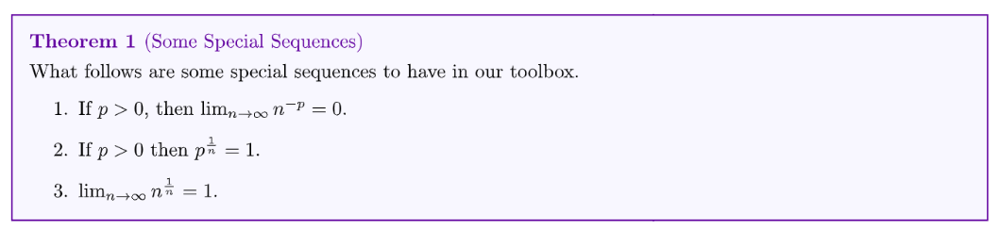
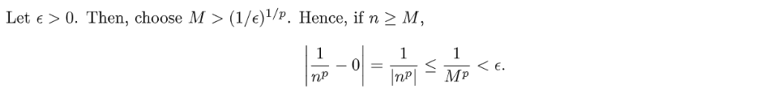
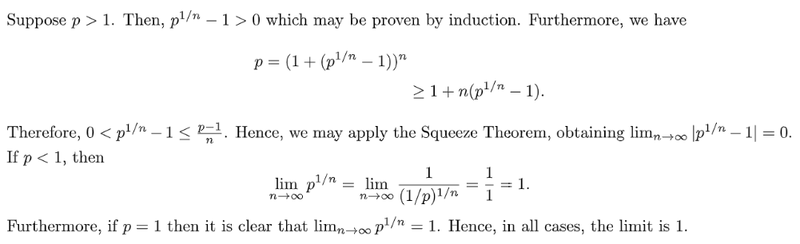

# Useful Lemmas
## Partial Order
> [!important]
> 

## Limit Doesn't Preserve Strict Inequality
> [!important]
> 

## Binomial Theorem to find Boundedness
### Proof for Limit
> [!important]
> 

> [!important]
> 

### Euler Number
> [!important]
> 

## Useful Sequences' Convergence
> [!important]
> 

> [!proof] Proof for 1
> 

> [!proof] Proof for 2
> 

> [!proof] Proof for 3
> 

> [!proof] Proof for 3
> 

# How to prove Sequence Convergence
## Using Definition
> [!example]
> 

## Using Monotone and Boundedness
> 

## Using Subsequence Convergence
### Euler Number
> [!example]
> 

## Using Limsup and Liminf Equality
> 

# How to prove Sequence Divergence
## Using Definition
> 

## Using Contradiction of Definition
> [!example]
> 

## Using Unboundedness
> 

## Using Limsup and Liminf Inequality
> 

