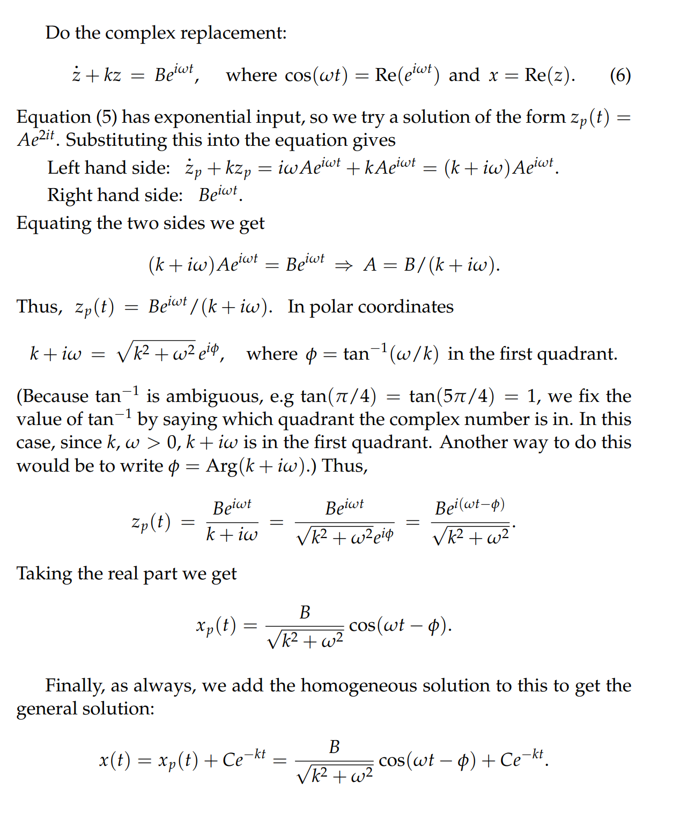

# 1 First Order Response to Exponential Input
[First Order Response to Exponential Input.pdf](https://www.yuque.com/attachments/yuque/0/2022/pdf/12393765/1658385692600-5004676a-35b3-4f05-bce5-cf7714b4b37a.pdf)
## Method of Optimism
> 对于一个`Linear ODE`$\dot{x} +kx=Be^{kt}$, 输入为`Exponential`。求解的一种方法可以是我们猜测这个微分方程的特解是$x_p(t)=Ae^{kt}$的形式，然后将其代入上述微分方程，然后求出对应的系数$A$。
> 

# 2 First Order Response to Sinusoidal Input
[First Order Response to Sinusoidal Input.pdf](https://www.yuque.com/attachments/yuque/0/2022/pdf/12393765/1658385794412-92ba9ba4-afb0-40ed-908b-ebd36de4ebf1.pdf)
## Definition
> 

## Simple Example
> 

## General Case
> 

# 3 Amplitude Phase, Gain and Bode Plots**⭐⭐⭐**
[Amplitude, Gain, and Phase Lag.pdf](https://www.yuque.com/attachments/yuque/0/2022/pdf/12393765/1658589157330-a380097c-e213-445d-bd64-34d54b0ed9d2.pdf)

## Terminology**⭐⭐⭐**
> 

## Bode Plot
> 
> 

## Mathlet**⭐⭐⭐**
> 

# 4 Problem Sets
[MIT18_03SCF11_rec_05s9.pdf](https://www.yuque.com/attachments/yuque/0/2023/pdf/12393765/1683596336330-eff0cfce-36e9-4740-9d93-a461b301a829.pdf)
[MIT18_03SCF11_rec_05s9_sol.pdf](https://www.yuque.com/attachments/yuque/0/2023/pdf/12393765/1683596336359-ffe44386-d199-4ad8-8f68-63f12275d474.pdf)
[MIT18_03SCF11_ps2_s8_9q.pdf](https://www.yuque.com/attachments/yuque/0/2023/pdf/12393765/1683596336320-a4b93d22-d613-4001-b0ae-d9f0be89d9ec.pdf)
[MIT18_03SCF11_ps2_s8_9s.pdf](https://www.yuque.com/attachments/yuque/0/2023/pdf/12393765/1683596336327-5459c364-94d4-4026-9ff0-a7913ecd3c6f.pdf)
[MIT18_03SCF11_ps2_II_s8_9q.pdf](https://www.yuque.com/attachments/yuque/0/2023/pdf/12393765/1683596360655-ef27b394-156e-4258-aa3c-2be8407bcc8d.pdf)
[MIT18_03SCF11_ps2_II_s8_9s.pdf](https://www.yuque.com/attachments/yuque/0/2023/pdf/12393765/1683596360675-9354798a-80fc-494a-95bd-9bd2945422c1.pdf)

## Method of Optimism
### P1
> 

**Solution**

### P2
> 

**Solution (a)**
**Solution (b)**

## Complex Replacement
### P1
> 

**Solution**

## Sinusoidal Input&Output
> 

**Solution (a)**
**Solution (b) Optimism**
**Solution (c) Complex Replacement**

