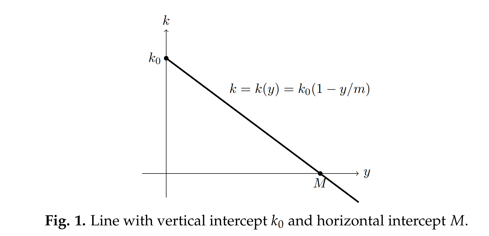
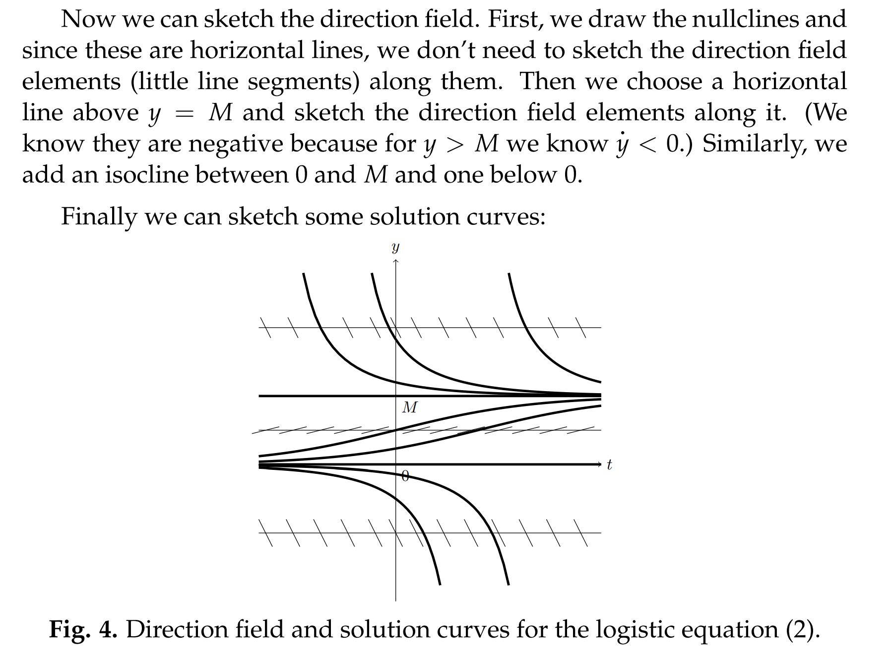

# 1 First Order Autonomous Equation
[intro.pdf](https://www.yuque.com/attachments/yuque/0/2022/pdf/12393765/1658283472518-1247a499-e472-46bd-b869-0f932dc7739a.pdf)
## Definition
:::info
$\dot{x} = f(x)$, `Autonomous`意味着**我们的**$x$**的变化率只和**$x$**本身相关，而和时间无关**
注意，`Autonomous First Order Ordinary Differential Equation` 一般是非线性的，取决于$f(x)$的最高次幂, 如果大于`1`就是非线性的

往往这类方程比较难求出特定的解，但是我们可以得到关于解的一些重要的性质，比如:
$x(t)$是人口数量，我们就想知道人口数量会不会爆炸, 或者急剧萎缩，或者稳定在某个水平
$x(t)$是一个物理系统的位移状态，我们就像知道这个系统是不是自我修正的，还是会逐渐溃散(变得没有章法)
:::

## Properties
:::info

:::

# 2 Logistic Model
[Logistic Model.pdf](https://www.yuque.com/attachments/yuque/0/2022/pdf/12393765/1658284849008-4481ea0c-b2cf-4049-80ad-68bf52800cf6.pdf)
## Simple Examples
:::info
我们假定微分方程形如$\dot{y}=f(y)$

- `Example 1`是`Linear ODE`
- `Example 2`是`Non Linear ODE`
:::

## Logistic Population Model**⭐**
### Definition
:::info

也就是如下的微分方程$\dot{y}=k_0(1-\frac{y}{M})y$
这是一个`Non-Linear`的微分方程，但它是`Autonomous`的; 而且这种模型其实比我们的自然增长模型$\dot{y}=ky$更具现实意义
:::
 

### Graph of k(y)
:::info
根据上面对于$k(y)$的描述，我们知道，在$y$很小时, $k(y)=k_0$,$k(y)$在$y>M$时是负数, 于是我们可以构造一个$k$关于$y$的线性关系, 比如:
$k(y)=k_0(1-\frac{y}{M})$

:::

### Solution Curves
> 我们将给出关于解的一些性质(而不是真正去求解):

#### 求常数解
:::info
求常数解: $y(t) =y_0$, 代入微分方程求$y_0$, 得到$0 = f(y_0)$, 所以$k_0(1-\frac{y_0}{M})y_0=0$,所以$y_0=0\space or\space M$

- 于是我们有**两个**`**Equilibrium Solutions**`$y(t)=0\space or\space y(t)= M$**，解不随时间变化**
- 我们称$y_0$和$M$为`**Critical Points of DE**`
- **我们说**$f(y_0)=0$**,**$y(t)=y_0$**is an equilibrium 和**$y=y_0$**is a critical point 其实是一个意思**
- **注意到，我们在用**`**Separable Variables**`**的时候的**`**Lost Solutions**`**也就是我们的**`**Critical Points**`
:::

##### 画出nullcline
:::info
画出`nullcline`$f(y)=0$, 我们知道，在$y=0\space or\space M$的时候，$\dot{y}=0$,就是说沿着`nullcline`我们正好得到了我们的常数解

:::
 

#### 求非常数解
##### 画出其他isoclines
:::info
画出其他的`Isoclines`,$f(y)$就是`Isocline`的斜率，随着不同的$y$而变化，所以我们将$f(y)$的图像画出

:::

##### 画出`Direction Field`
> 
> 这个图有如下的几个性质：
> 
> 

## Stable and Unstable Equilibria
> 

## Logistic Model With Harvesting
### Defintion
> $\dot{y} = f(y)= ay-by^2-h$,$h$是收割速度, 其中:
> 1. $a>0$
> 2. $b>0$
> 3. $h>0$

### Solution Curves
> 
> 当$h=0$时，和之前的`Logistic Population Model`一样，有两个`Critical Points`。
> 
> 当$h$在$0$和$\infty$之间变化时，会逐渐从两个`Critical Points`过渡到一个`Critical Point`最后过渡到没有`Critical Point`。
> 
> 当$h$很大的时候，函数$f(y)$与水平轴无交点，说明没有`Critical Points`。

## Summary
> 

# 3 Phase Lines
[Phase Lines.pdf](https://www.yuque.com/attachments/yuque/0/2022/pdf/12393765/1658291205176-7f56a37b-1cac-4ad5-8df7-0f9ac06d4c20.pdf)

## Definition
> 

## Logistic Model Example
> 

## Time-Shifted Solution
> 

## Semistable 
> 

# Quizzes
## Stability
> 

## Local Maximum
> 

## Inflection Point
> `Infection Point`就是$\frac{d^2y}{dx^2}=0$的点$(x,y)$
> 

# *Problem Sets
[Problem Set 1.pdf](https://www.yuque.com/attachments/yuque/0/2022/pdf/12393765/1658292526594-066be5f3-eb5a-4b06-9959-b75159d93151.pdf)
[Problem Set 2.pdf](https://www.yuque.com/attachments/yuque/0/2022/pdf/12393765/1658292554071-b19800ee-4370-407f-af32-3683b4232c6c.pdf)

## Phase Lines
> 

**Solution (a)**
**Solution (b)**
**Solution (c)**
**Solution (d)**

## Stability
> 

**Solution (a)**
**Solution (b)**
**Solution (c)**

## Autonomous Equation
> 

**Solution (a)**
**Solution (b)**
**Solution (c)**
**Solution (d)**
**Solution (e)**

# Applet
[Guidance Video.mp4](https://www.yuque.com/attachments/yuque/0/2022/mp4/12393765/1658291577529-43f01c8b-8a42-4f80-a4f5-13dbcde00c72.mp4?_lake_card=%7B%22src%22%3A%22https%3A%2F%2Fwww.yuque.com%2Fattachments%2Fyuque%2F0%2F2022%2Fmp4%2F12393765%2F1658291577529-43f01c8b-8a42-4f80-a4f5-13dbcde00c72.mp4%22%2C%22name%22%3A%22Guidance%20Video.mp4%22%2C%22size%22%3A13210126%2C%22ext%22%3A%22mp4%22%2C%22source%22%3A%22%22%2C%22status%22%3A%22done%22%2C%22download%22%3Atrue%2C%22type%22%3A%22video%2Fmp4%22%2C%22mode%22%3A%22title%22%2C%22taskId%22%3A%22u6ca296bd-280e-4a07-b9b8-88adf9030ce%22%2C%22taskType%22%3A%22upload%22%2C%22__spacing%22%3A%22both%22%2C%22id%22%3A%22YUnfN%22%2C%22margin%22%3A%7B%22top%22%3Atrue%2C%22bottom%22%3Atrue%7D%2C%22card%22%3A%22file%22%7D)
[Phase Lines](https://ocw.mit.edu/ans7870/18/18.03SC/phaseLines.html)

