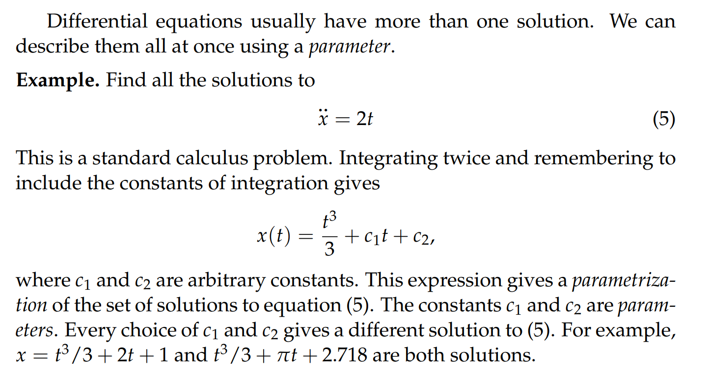

# 1 Definition of ODE
## Definition
> 

## Order of ODE
> 

# 2 Solving an ODE
## Checking by substitution
> 

## Rejecting by Substitution
> 

# 3 Parametrizing Solutions of ODE
> 

# 4 IVP
> 

# 5 Acronyms
> 

