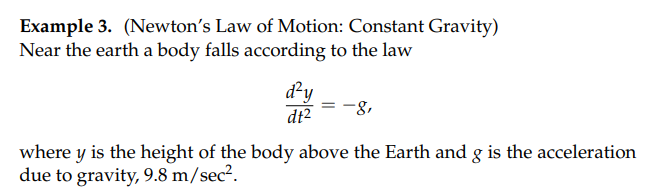
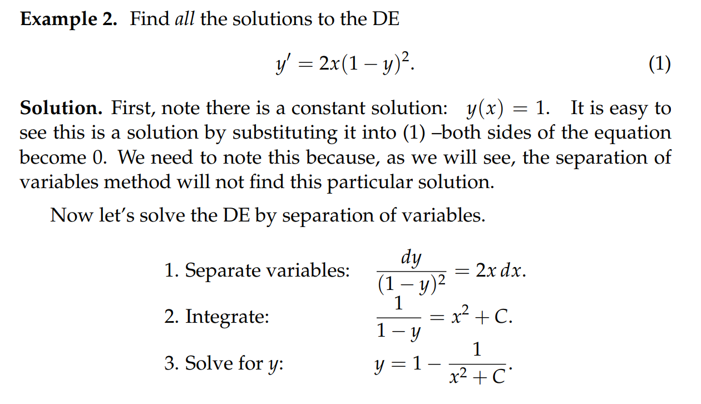
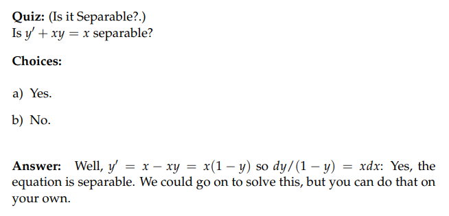
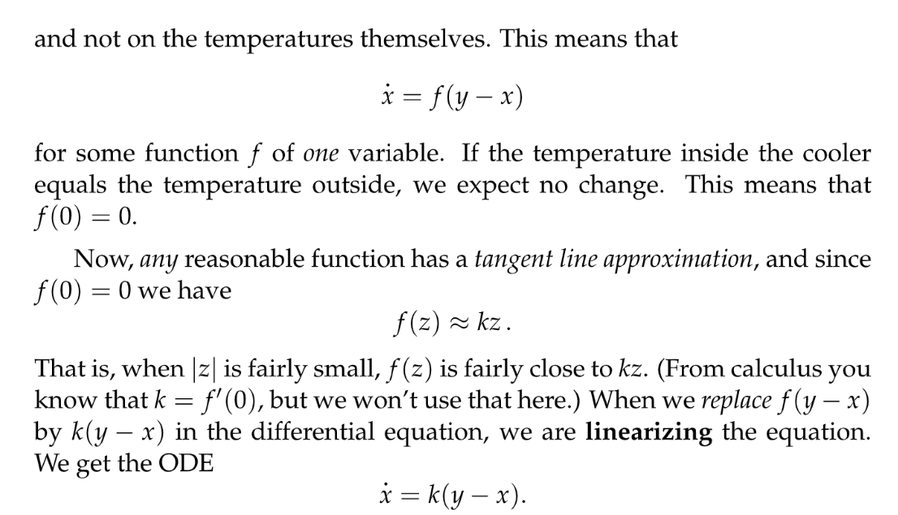
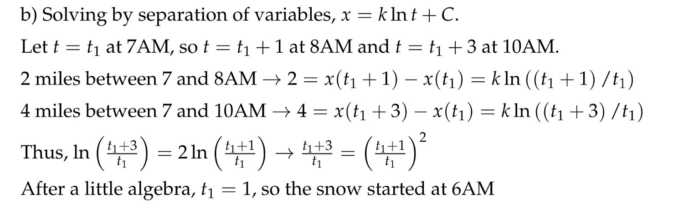

# 1 Most Important DE
[Basic DEs.pdf](https://www.yuque.com/attachments/yuque/0/2022/pdf/12393765/1658286243115-63e126d3-75a8-4164-8bb4-faa1d08b5593.pdf)
## Definition
:::info
最简单也是最重要的微分方程是$\dot{y}=ay$
也就是$y$的变化率和$y$成比例, 有四种书写形式:

:::

## Growth&Decay
> 

## Examples
[Other Examples.pdf](https://www.yuque.com/attachments/yuque/0/2022/pdf/12393765/1658286326665-69647472-7fc7-42a8-a949-1fe1556bd65c.pdf)
### Heat Diffusion

### Newton's Law of Gravitation

### Simple Harmonic Oscillator

### Damped Harmonic Oscillator

# 2 Separable Variables
[Separable Variables.pdf](https://www.yuque.com/attachments/yuque/0/2022/pdf/12393765/1658286496700-7e5933d9-5752-40b4-85f1-6fed8e1919ae.pdf)

## Separable Variable Methods

:::info
需要注意我们在进行两边同除以$y-1$的时候要注意，我们实际上忽略了$y(t)=1$这个**特解**，但是后面通过让常数$C=0$我们就能找回这个特解
:::

## Lost Solution**⭐⭐⭐**
### Defintion
:::info
下面的例子展示了我们在解微分方程的时候丢掉**特解**的的情况

我们在两边同除以$(y-1)^2$的时候丢掉了$y(t)=1$的**特解, 本质是因为同除以之后，分母出现了**$(y-1)^2$**,分母不能为零，于是**$y(t\neq 1)$
**我们称丢掉的解是**`**Lost Solutions**`
**对于所有**`**Separable DE**`$\dot{y}=f(x)g(y)$**, 所有**$g(y)$**的根都是**`**Lost Solutions**`
:::

### Example**⭐⭐⭐**
:::info
我们解$\dot{y}=ky$

我们通过`Separable Variables`找到的解$y(t)=Ce^{kt}$似乎包括了我们的特解$y(t)=0$但实际上在我们将$\pm e^{c_1}=C$的时候，$C\neq 0$, 其实我们通过让$C=0$就是变相地找回了特解, 我们可以写得数学化一些:
$y(t)=\begin{cases} 0&if \space C=0\\Ce^{kt} &if\space C\neq 0   \end{cases}$, 综合起来就是$y(t)=Ce^{kt},\forall C$
:::

## Quizzes
### Separation of Variables
> 

### Is it Separable?
> 

# 3 Solutions that blow up**⭐⭐⭐**
[Solutions that blows up.pdf](https://www.yuque.com/attachments/yuque/0/2022/pdf/12393765/1658287575049-8df1bd77-523c-4f3e-9d3d-fd33e2cdb763.pdf)
:::info

:::
:::info
注意到我们的解有两段，并且在$x=1$处不连续，我们称$y(t)$`blows up at` $x=1$
我们倾向于认为，这个微分方程的解有两个，$x>1$的部分和$x<1$的部分, 
取哪一个部分取决于我们的`Initial Conditions`, 比如在这里我们的`Initial Condition`是$y(0)=1$,所以我们的解是左边的那一段

:::
> **我们的原则是，我们倾向于认为我们的微分方程的解的定义域是一个单一的区间**
> 

# 4 Modeling By First Order Linear ODE's
[Modeling by First Order Linear ODE's.pdf](https://www.yuque.com/attachments/yuque/0/2022/pdf/12393765/1658287978191-01ac455d-3d4c-4ae3-a651-88144910f66a.pdf)
[Practice Problem.pdf](https://www.yuque.com/attachments/yuque/0/2022/pdf/12393765/1658288041548-f880f3a9-d0d7-43a6-acc7-d6f6185fe8dc.pdf)

## Saving Model**⭐⭐**
> 假设现在我们想对银行账户中的余额进行建模，我们首先决定一下我们需要的变量:
> 1. $x(t)$, 一个随时间变化的值，表示银行账户中的余额，单位是`dollars`
> 2. $r$, 一个常数，表示利率，单位是`percent/year`
> 3. $q$, 一个常数，表示我往账户中每年添加的金额，单位是`dollars/year`
> 
则假设过去了$\Delta t$时间，现在模型的状态是:
> $\Delta x = rx(t) \Delta t + q\Delta t$
> 两边同除以$\Delta t$, 并对$\Delta t\to 0$，我们得到最终的模型:
> $\dot{x}(t) = rx(t) + q$
> 现实生活中, $r$和$q$的值可能都不是常数，可能都是随时间变化的变量$r(t), q(t)$, 甚至是$r(x,t), q(x,t)$这样和余额也相关的变量(此时微分方程不是线性的)。

## Harvesting Model**⭐⭐⭐⭐⭐**
### Modeling
> 
> 我们首先需要确定模型变量:
> 1. $x(t)$表示`oryx population`, 单位是`units`
> 2. $k$表示`natural growth rate`, 单位是`percent/year`, $k\cdot x(t)$表示每年自然增长了多少
> 3. $a$表示`harvesting rate`，单位是`units/year`
> 
所以假设过了$\Delta t$时间，我们有$\Delta x = k\cdot x(t)\Delta t-a\cdot \Delta t$, 然后两边同除以$\Delta t$, 得到$\frac{\Delta x}{\Delta t} = k\cdot x(t)-a$, 最终的`Harvesting Model`:
> $\dot{x}(t) = k\cdot x(t)-a, k>0,a\geq0$

### Doubling Time
> 这是一个非常重要的概念，换句话说就是我们关注的变量$x(t)$翻倍的时间。假设$t_1$时刻，$x$的值是$x(t_1)$, 则$t_2$时刻，$x$的值是$x(t_2)$($t_2>t_1$), 则`Doubling Time`$\Delta t_d$可以通过下列方程求出:
>   $\frac{x(t_2)}{x(t_1)}=2，\Delta t_d=t_2-t_1...................(1)$
> 假设上面的模型中$a=0$(为了简化模型)，我们首先需要求解出$x(t)$具体的形式是什么, 因为
> $\dot{x}(t) = k\cdot x(t)$
> 我们使用`Separation of Variables`可以得到$x(t)=Ce^{kt},k>0,C=\pm e^{c}\in \mathbb{R}$。
> 现在求解$(1)$中的方程，所以$\frac{x(t_2)}{x(t_1)}=\frac{Ce^{kt_1}}{Ce^{kt_2}}=2$, 所以$k(t_1-t_2)=k\Delta t=ln2$, 于是$\Delta t=\frac{ln2}{k}$

### Half Time
> **假设**$x(t)$**为**$t$**时刻的人口数量, 实际上**$k$**可以取任意值, 下面有几种情况:**
> 1. 当$k>0$时，$k$为自然增长率(`natural rate of growth`)。此时我们有`Doubling Time`的概念。
> 2. 当$k<0$时，$k$为自然衰减率(`natural rate of decay`)。此时我们有`Half Time`的概念，表示$x(t)$变为原来的一半时所需的时间。
> 
对于$\dot{x}(t)=k\cdot x(t)$来说，`Half Time/Doubling Time`的公式由$\frac{ln2}{k}$给出
> 3. 当$k=0$时，$x(t)$不随时间的改变而改变。此时`Doubling Time`和`Half Time`都未被定义，也没有任何意义，也可以理解为$\infty$。

### Initial Value
> 解的形式是$x(t)=Ce^{kt},k>0,C=\pm e^{c}\in \mathbb{R}$，于是令$t=0$得到`Initial Value`是$C$。如果我们知道$x(0)$的值，就可以求出$C$的值，也就得到了通解的具体形式。

### General Solution
> 下面我们求解$\dot{x}(t) = k\cdot x(t)-a, k>0,a\geq0$这个微分方程的通解。
> 首先意识到$k$有三种情况需要考虑，所以我们分类讨论:
> 1. $k=0$, 此时$\dot{x}(t)=-a$，即$\frac{dx}{dt}=-a$, 所以$x(t)=-at+C$, `Initial Value`是$x(0)=C$。
> 2. $k\neq 0$时，此时可能是自然增长也可能是自然衰减，此时利用`Separation of Variable`可知:
> 
$\frac{dx}{kx-a}=dt$(注意此时会丢掉一个解$x=\frac{a}{k}$), 两边求积分得到$\frac{1}{k}ln|kx-a|=t+c$, 即$kx-a=\pm e^{kc}e^{kt}$，且$x=\pm \frac{e^{kc}}{k}e^{kt}+\frac{a}{k}=Ce^{kt}+\frac{a}{k}，C\in \mathbb{R}$(注意$C=0$时会将丢失的解找回来)。`Initial Value`是$x(0)=\frac{a}{k}+C$。
> **我们将解代回可得:**
> 
> 3. `Constant Solution`, $kx-a=0$时，$\frac{dx}{dt}=0$, 也就是一旦$x(t)$在某个时刻等于了$\frac{a}{k}$, 则之后$x(t)$就再也不会发生变化了。此时$x(t)$就是`Constant Solution`。
>    1. $k=0$, 此时$a=0$。
>    2. $k\neq 0$, 此时$x(t)=\frac{a}{k}$。另一种方式是通过我们刚刚求出的`General Solution`$x=\pm \frac{e^{kc}}{k}e^{kt}+\frac{a}{k}=Ce^{kt}+\frac{a}{k}，C\in \mathbb{R}$。我们把$x=Ce^{kt}+\frac{a}{k}$代入原微分方程得到$\frac{dx}{dt}=k\cdot (Ce^{kt}+\frac{a}{k})-a=Cke^{kt}$, 因为常数解使得$\frac{dx}{dt}=0$成立，所以$Cke^{kt}=0$成立，因为$k\neq 0$, 于是$C=0$, 所以$x(t)=\frac{a}{k}$。

 

### Graph the Solution
> 
> 图像基本取决于$x(0),a,k$的值，因为这样可以求出$C$的值(也就是我们的通解表达式中的常量)。换句话说，自然增长率$k$和收割率$a$是超参数，固定之后，$x(0)$决定了$k\cdot x(0)-a$的值，也就是在初始状态下的增长率，也简介决定了`General Solution`的渐进形式（向上还是向下还是不变）。
> 对于$\dot{x}(t)=kx(t)-a$这个微分方程，$k$在通解中的形式为指数增长，$a$在通解中为一个线性衰减因子。

## Linear Insulation Model
### Linearization of Equation
> 

### Coupling Constant
> 

# Problem Set**⭐⭐⭐**
## PS1
[Problem Set 1.pdf](https://www.yuque.com/attachments/yuque/0/2022/pdf/12393765/1658288252636-c0bf0123-064c-4b84-bef1-caaa23a3fc7c.pdf)

### Medicine Decaying
> 

**Solution**

### Snowplow
> 

**Solution (a)**一般而言降雪量是以`Cubic Meter`衡量的，单位一般是`Cubic meters/hour`。假设道路的宽为$w$(meters), 降雪高度速率为$k_1$`meters/hour`, 铲雪车的清雪速率为$k_2$`cubic meters/hour`, 所以假设从开始下雪已经过了$t$时间, 则积雪高度是$k\cdot t$。假设从$t$时间开始又过了$\Delta t$时间，假设此时铲雪车行进了$\Delta x$的距离，则我们有$\Delta x\cdot k_1\cdot (t+\Delta t)\cdot w=k_2\cdot \Delta t\cdot w$。
我们对等式左侧做线性化估计得到$\Delta x\cdot k_1\cdot t=k_2\cdot \Delta t$, 此时$\frac{\Delta x}{\Delta t}=\frac{k_2}{k_1\cdot t}=\frac{k}{t}$, 其中$k$是常数。
**Solution (b)**

### 溶液和溶剂
> 
> 🔔: 对于溶液溶质的建模问题，我们一般选取对溶质的含量进行建模。

**Solution (a)**
**Solution (b)**

## PS2
[Problem Set 2.pdf](https://www.yuque.com/attachments/yuque/0/2022/pdf/12393765/1658288292402-7081ddea-5f03-4450-9380-6091c3e5f8d7.pdf)
> 都是非常好的题目

