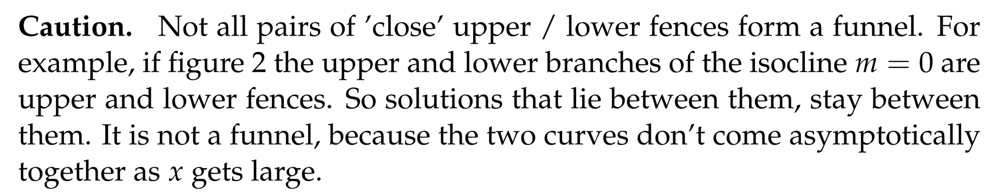
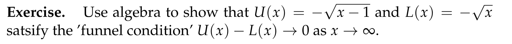
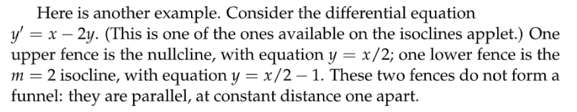
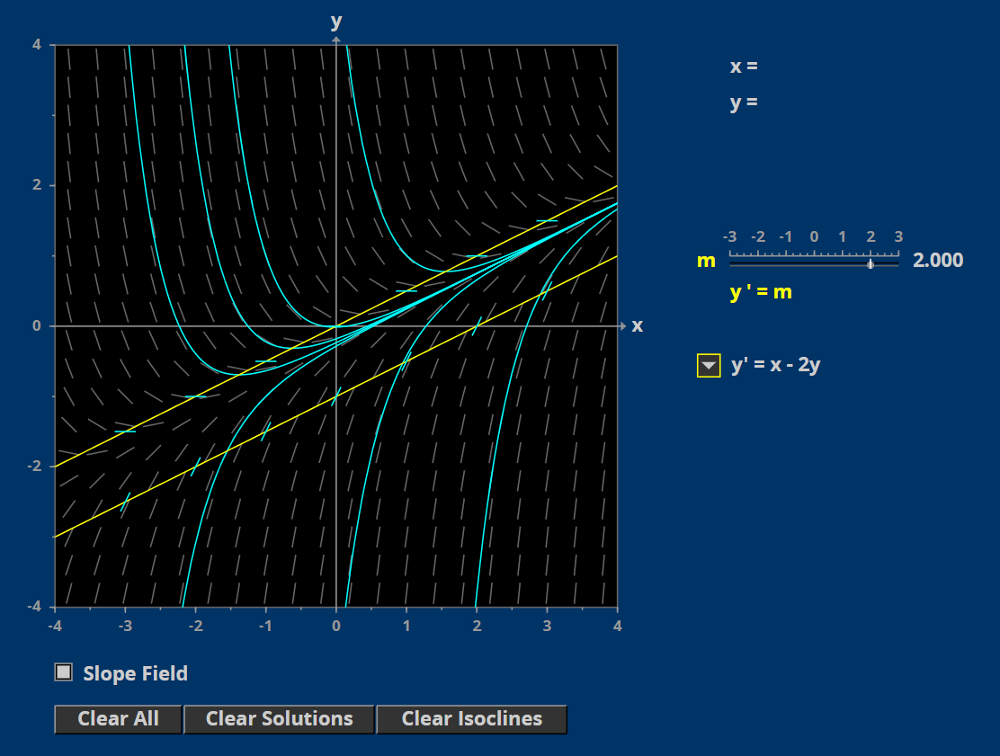
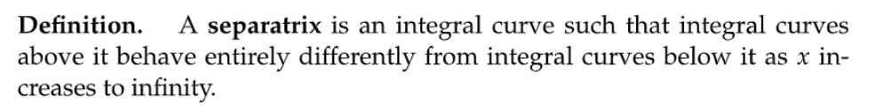

# 1 Direction Field, IsoClines, Integral Curves
[Direction Field, IsoClines, Integral Curves.pdf](https://www.yuque.com/attachments/yuque/0/2022/pdf/12393765/1658288400013-61f03c05-162a-46ff-b10d-3f3b80dbb010.pdf)
## 1.1 Direction Field
> 对于一个标准的一阶线性微分方程: $\dot{y}=f(x,y)$,我们可以画出它的`Directional Field`
> 假如我们有一个微分方程$\frac{dy}{dx}=2x$
> - 它的`Dircetional Field`可以由计算机尝试所有的$x$值后得到
> 

> - 我们手动画的话需要一定的技巧, 我们需要运用一个叫做`Isocline`等斜线的东西

## 1.2 Isocline
### Definition
> $f(x,y)=m$
> 所有在个图像上的$x,y$点处，微分方程因变量的斜率$\dot{y}$一致
> 我们最为关心$m=0$时候的图像, 这时候`Direction Field`上所有$x,y$点处的$y(t)$的斜率是`0`

### Example
> 
> 

## 1.3 Integral Curves
### Definition
> 在有了`Direction Field`之后，我们可以沿着趋势画出`Integral Curves/Solution Curves`
> 

## 1.4 Time Invariance
:::info
从上面的`Solution Curve/Integral Curve`可以看出，如果一个自治方程$y'=f(x,y)$,那么$(x(t),y(t))$构成的参数曲线可以在`xy-plane`上被绘制出来。由于参数曲线的轨迹是固定的，我们的$t_0$的选取不会改变参数曲线的形状，所以$(x(t-a),y(t-a))$对应的参数曲线轨迹和$(x(t),y(t))$一致，这其实就是`Time Invariance`的几何解释。
:::

# 2 Existence and Uniqueness Theorem for ODE's
[Existence and Uniqueness Theorem for ODE's.pdf](https://www.yuque.com/attachments/yuque/0/2022/pdf/12393765/1658291924806-e1a3a8d4-5a9b-497d-bfbf-6061b841cfd1.pdf)
## 2.1 唯一性 Part 1
> 
> 

## 2.2 唯一性 Part 2
> 

# 3 Long-Term Behaviors: Fences, Funnels and Separatrices
[Fences, Funnels,and Separatrices.pdf](https://www.yuque.com/attachments/yuque/0/2022/pdf/12393765/1658290069603-c855fecf-8c58-4694-8c9d-412c894097b9.pdf)
## 3.1 Fences
### 3.1.1 Lower Fences
> 
> 

### 3.1.2 Upper Fences
> 

### 3.1.3 注意事项
> 

### 3.1.4 算例
> 
> 

## 3.2 Funnels
### 3.2.1 定义
> 有一个`Lower Fence`和一个`Upper Fence`组成
> 
> 
> 1. `**Fences**`**成为**`**Funnel**`**的情况**
> 

> 2. `**Fences**`**不形成**`**Funnel**`**的情况**
> 

### 3.2.2 算例
#### 算例1
> 

#### 算例2
> 
> 

## 3.3 Separatrices
> 
> 
> 

# Applet
[MIT18_03SCf11_app2.mp4](https://www.yuque.com/attachments/yuque/0/2022/mp4/12393765/1658291950252-a5ae9df3-124c-4c6d-8263-7c3099fda728.mp4?_lake_card=%7B%22src%22%3A%22https%3A%2F%2Fwww.yuque.com%2Fattachments%2Fyuque%2F0%2F2022%2Fmp4%2F12393765%2F1658291950252-a5ae9df3-124c-4c6d-8263-7c3099fda728.mp4%22%2C%22name%22%3A%22MIT18_03SCf11_app2.mp4%22%2C%22size%22%3A16615758%2C%22type%22%3A%22video%2Fmp4%22%2C%22ext%22%3A%22mp4%22%2C%22source%22%3A%22%22%2C%22status%22%3A%22done%22%2C%22mode%22%3A%22title%22%2C%22download%22%3Atrue%2C%22taskId%22%3A%22uc80681e2-a259-4e5b-bfae-1f00dc12f4c%22%2C%22taskType%22%3A%22upload%22%2C%22__spacing%22%3A%22both%22%2C%22id%22%3A%22ua4cf4957%22%2C%22margin%22%3A%7B%22top%22%3Atrue%2C%22bottom%22%3Atrue%7D%2C%22card%22%3A%22file%22%7D)
[Guidance on Applet.pdf](https://www.yuque.com/attachments/yuque/0/2022/pdf/12393765/1658289865251-e962834c-7f2f-45ce-bfb0-4867e45b6252.pdf)

# Quizzes
## Isoclines

# Practice Problem
[Practice Problems.pdf](https://www.yuque.com/attachments/yuque/0/2022/pdf/12393765/1658290105444-5c97d493-fb0c-4dce-922c-e25fae42b09d.pdf)

# Problem Sets
[Problem Set 1.pdf](https://www.yuque.com/attachments/yuque/0/2022/pdf/12393765/1658290154346-aedf7343-b62a-43d4-ae70-505b2d109bfc.pdf)
[Problem Set2.pdf](https://www.yuque.com/attachments/yuque/0/2022/pdf/12393765/1658290172440-509691ad-1075-4ade-90b4-d457f3e8ec1b.pdf)

