# 0 前言
[Introduction.pdf](https://www.yuque.com/attachments/yuque/0/2022/pdf/12393765/1659450842327-b93af4db-8d7c-4732-b8f7-932ad4201c08.pdf)

# 1 Euler's Method
[Euler's Method.pdf](https://www.yuque.com/attachments/yuque/0/2022/pdf/12393765/1659450842307-85dcadc1-2c1b-48c6-82cf-d1531d8d647e.pdf)
## Method Intuition
> 

## Terminology
> 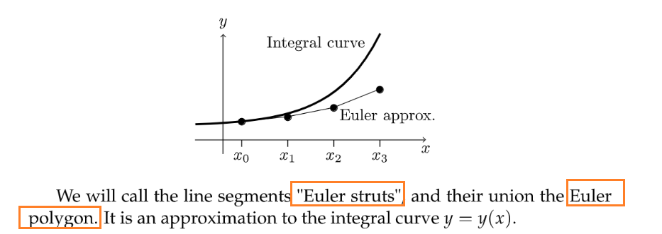

## Example
> 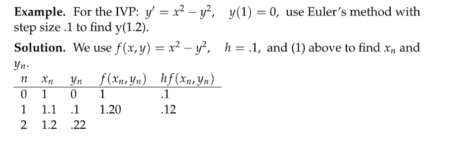

# 2 Errors in Euler's Method
[Errors in Euler's Method.pdf](https://www.yuque.com/attachments/yuque/0/2022/pdf/12393765/1659450842256-56540c42-6701-458f-b0f4-38c4f8c01ed0.pdf)

## Convexity&Concavity
> 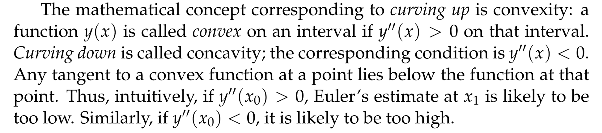

## Numerical Example 1
### Iteration Table
> 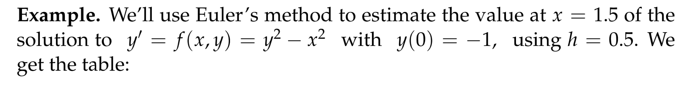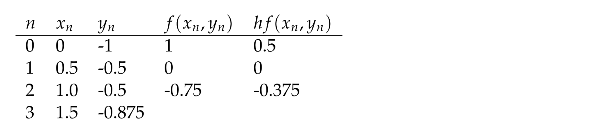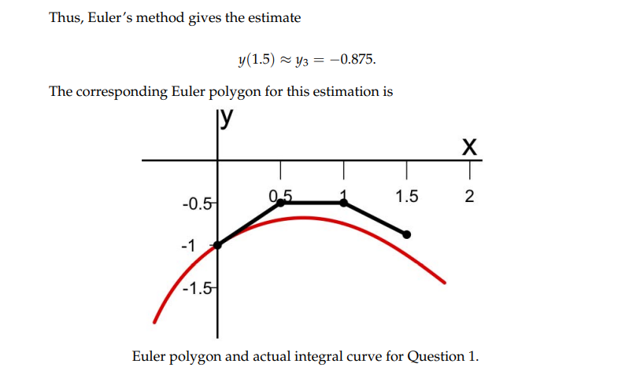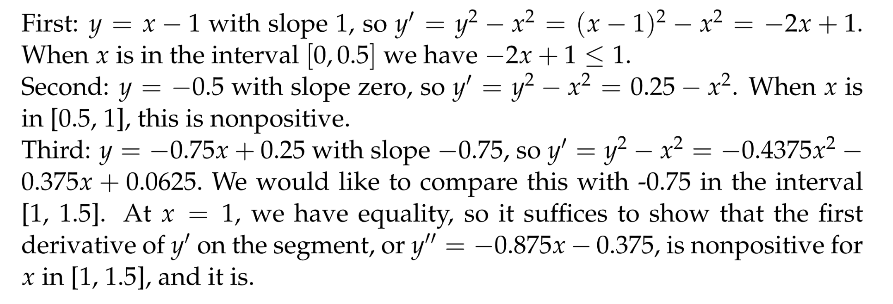

### Error Analysis
> 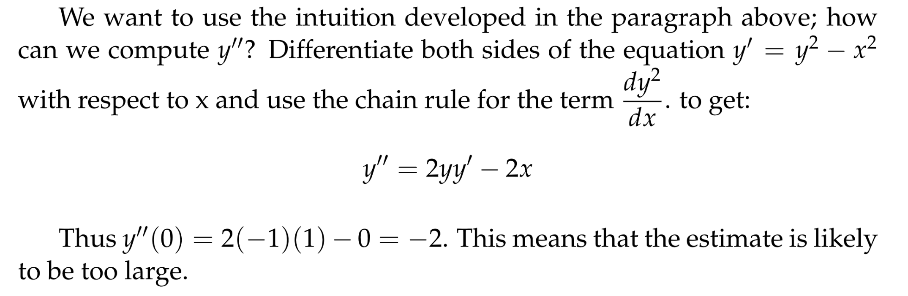

## Numerical Example 2
### Problem Setting
> 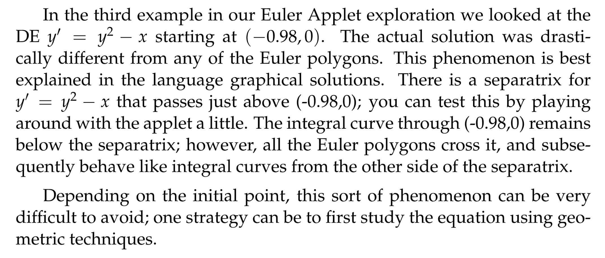

### Euler Iteration Table
> 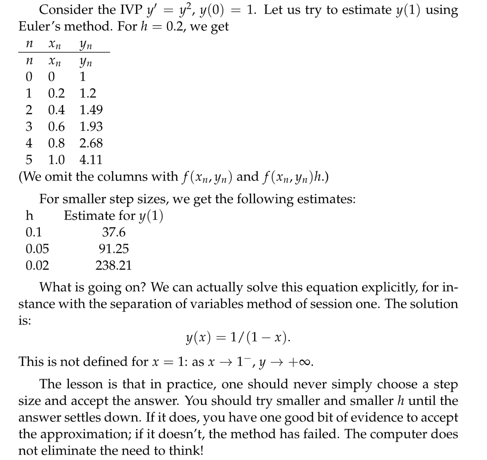

### Graphical Example
> 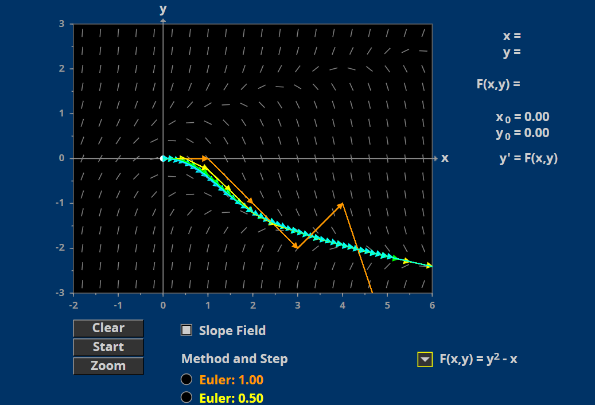
> 🔔: `Takeaway`就是，我们需要在选取`Step Size`上尽可能的精确(尽量小)，才能保证结果的准确性。

# Problem Sets
[Problem Set 1.pdf](https://www.yuque.com/attachments/yuque/0/2023/pdf/12393765/1682567611642-9698a402-9e02-42f4-8365-76c52e1df1b0.pdf)
[Problem Set 2.pdf](https://www.yuque.com/attachments/yuque/0/2023/pdf/12393765/1682567611633-d47beefc-ca2f-404c-98f2-55fbb6b27760.pdf)

# Applet
[Guidance Video.mp4](https://www.yuque.com/attachments/yuque/0/2022/mp4/12393765/1659451074967-be3e1636-ee8d-451a-9be0-bf0697c1909e.mp4)
[Guidance.pdf](https://www.yuque.com/attachments/yuque/0/2022/pdf/12393765/1659450953747-3a2680de-108b-435e-bd55-de21dbf047da.pdf)
[Euler’s Method](https://ocw.mit.edu/ans7870/18/18.03SC/eulersMethod.html)
