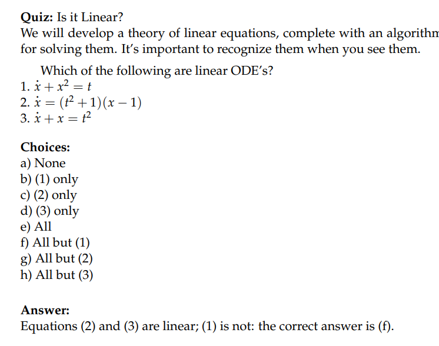

# 1 Linear ODE Definition
[First Order Linear DE.pdf](https://www.yuque.com/attachments/yuque/0/2022/pdf/12393765/1658224539144-bec6be84-5a5b-4e04-9817-8a42a650874f.pdf)
## Definitions
:::info

:::

## How to judge?
> 将微分方程写成$\dot{x(t)}=f(x(t),t)$, 然后判断$f$是否是关于$x$和$t$的线性函数即可。

# 2 Homogeneous/Inhomogeneous
## Definitions
:::info

:::

## Oryx Population Harvest Model
:::info
**假设我们要建立一个关于大羚羊的数量**$x(t)$**的模型**
假设大羚羊的数量是$x(t)$, 我们假设羚羊的自然增长系数是$k\space ({year}^{-1})$, 同时宰杀率是$h\space (units/year)$
物品，我们可以建立从头建立模型, 遵循以下几个步骤:

1. 假设在$t$时刻大羚羊的数量是$x(t)$
2. 在$\Delta t$的时间之内，大羚羊的数量增加$\Delta x$, 我们有$\Delta x \approx kx\Delta t-h\Delta t$
3. 两边同除以自变量$t$，得到$\frac{\Delta x}{\Delta t}\approx kx-h$
4. 对$\Delta t$和$\Delta x$取极限, 得到$\lim_{\Delta t\to 0}\frac{\Delta x}{\Delta t}\approx \frac{dx}{dt}=\dot{x}=kx-h$
:::

## Bank Deposit Model
### Periodic Deposits
> 

### Continuous Deposits
> 

### Modeling
:::info
假设我们有一个银行账户, 里面有$x(t)\space dollars$，利率是$r\space (year^{-1})$, 存钱的速度是$q\space (dollars/year)$
我们从头搭建一个模型, 描述$x(t)$的变化:

1. 在$\Delta t$的时间之内, 银行账户中的钱增加$\Delta x$,我们有$\Delta x\approx rx\Delta t-q\Delta t$
2. 两边同除以自变量$t$，得到$\frac{\Delta x}{\Delta t}\approx rx-q$
3. 对$\Delta t$和$\Delta x$取极限, 得到$\lim_{\Delta t\to 0}\frac{\Delta x}{\Delta t}\approx \frac{dx}{dt}=\dot{x}=rx-q$

实际生活中，我们的$q$可能随着时间变化，也就是说，我们最好写成$q(t)$, 包括利率也一样，写成$r(t)$
所以一般来说我们的微分方程是$\dot{x}-r(t)x=q(t)$
:::

# 3 Terminology: Systems and Signals
[Terminology.pdf](https://www.yuque.com/attachments/yuque/0/2022/pdf/12393765/1658228946361-edd59fd8-4564-4ab7-9ec5-856d39551999.pdf)
:::info
简而言之，方程左侧就是`System`,右侧是`Input Signal`, 方程的解就是`System Response`
**第二大章有详细介绍各种输入**
:::

## Systems&Input&Output
> 

## Block Diagram
> 

# 4 RLC Introduction
## Simple Modular Introduction
> 
> 本质上是含有源（电压源/电流源），电阻，和电容的一种电路。在`EECS16B`中会有更加深入的介绍。

## Model Formulation
> 

## System Input&Output
> 
> 这里要注意`System Input`不一定就是右侧的函数，有可能是右侧函数的一个`Transform`。

## Block Diagram
> 

# 5 Superposition Principle**⭐**
[Superposition Principle.pdf](https://www.yuque.com/attachments/yuque/0/2022/pdf/12393765/1658229198260-0ed2ede8-6d65-4fff-ad82-91bfc3d389cd.pdf)
## Principle
:::info
给定一个微分方程$\dot{y}+p(t)y=q(t)$

:::

## Examples
> 假设我们知道下列输入和输出的对应关系:
> 
> **则利用**`**Superposition Principle**`**我们有:**
> 1. $\dot{x}+2x=1+e^{-2t}$的通解是$1\cdot \frac{1}{2}+1\cdot t e^{-2t}+Ce^{-2t}=\frac{1}{2}+t\cdot e^{-2t}+Ce^{-2t}$
> 2. $\dot{x}+2x=2+3e^{-2t}$的通解是$2\cdot \frac{1}{2} + 3\cdot t\cdot e^{-2t}+Ce^{-2t}=1+3te^{-2t}+Ce^{-2t}$
> 3. $\dot{x}+2x=1$的通解是$1\cdot \frac{1}{2}+Ce^{-2t}$

 

# 6 Quizzes
## Is it Linear?
> 

## Interpret the Graph
> 假设这里$Q(t)$就是表示银行的余额总量。且例子中我们有$\dot{Q}(t)=q(t)$, 所以我们只需要关注$A$点处图像的斜率即可，为正就说明我们是在存钱，反之就是在取钱。
> 

# 7 Practice Problem**⭐**
[Practice Problems.pdf](https://www.yuque.com/attachments/yuque/0/2022/pdf/12393765/1658229400728-c0dcc907-712e-4a6a-bc80-fe21ef2bda38.pdf)

## Linear Models
> 

**Solution (1)**
**Solution (2)**
**Solution (3)**

## RLC Model**⭐⭐⭐**
> 

**Solution**
