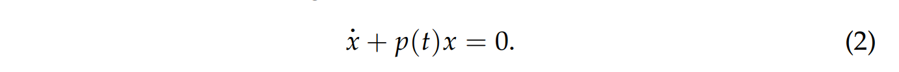
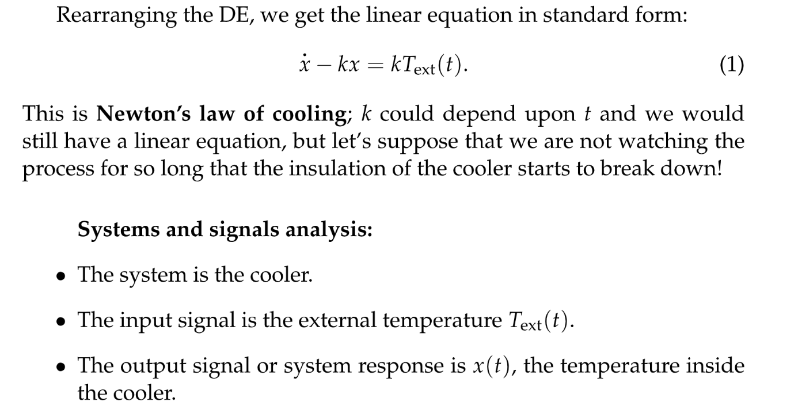

# 1 Solutions to Linear First Order ODE's
[Solution to Linear First Order ODEs.pdf](https://www.yuque.com/attachments/yuque/0/2022/pdf/12393765/1658224416250-629c3dd1-6485-4f61-88c0-0c91d813f321.pdf)
## First Order Linear Equations
:::info

:::
## 
## Solutions to the Homogeneous Equations
### 求解步骤
:::info
对于`associated homogeneous equation`$\dot{x}+p(t)x=0$来说

我们求解分为以下几步:

其实这里的整个求解过程可以使用`Integrating Factor`来加快速度
注意，这里的$e^{-\int p(t)dt}$我们称为`Homogeneous Solution`(不包括$C$的) 
:::

### Examples
:::info

:::

## Integrating Factor and Proof
> 

### 证明方法
:::info
我们从$\dot{x}+p(t)x=q(t)$这个微分方程开始推导, 这里我们将$u(t),p(t),q(t)$写成$u,p,q$简化记号:

1. 两边同乘$u(t)$: $u\dot{x}+upx=uq$
2. 将左侧看成是一个求导的结果: $u\dot{x}+upx=\frac{d(ux)}{dt}$
3. 因为$\frac{d(ux)}{dt}=u\dot{x}+\dot{u}x$, 所以我们让$\dot{u}=pu$
4. 我们求解$\dot{u}=pu$, 两边关于$t$求不定积分: $ln(|u|)=\int p(t)dt$,所以$u(t)=e^{\int p(t)dt}$, 这里不用加什么常数`C`, 选一个能`work out`的就行
5. 原微分方程变形为: $\frac{d}{dt}(ux)=uq$
6. 两边求积分: $u(t)x(t)=\int u(t)q(t)dt+C$, 所以$x(t)=\frac{1}{u(t)}(\int u(t)q(t)dt+C)$

**注意, **`**Integrating Factor**`**得到的就是**`**General Solution**`
:::

### Examples
:::info

:::

## Another Proof of Superposition Principle
### Superposition Recap
:::info

:::

### Another Proof
:::info
**给定微分方程**$\dot{x}+p(t)x=q(t)$
**对于两个不同的输入**$q_1(t)$**和**$q_2(t)$**, 我们通过**`**Integrating Factors**`**求得:**
$x_1(t) = \frac{1}{u(t)}(\int u(t)q_1(t)dt+C_1)$和$x_2(t) = \frac{1}{u(t)}(\int u(t)q_2(t)dt+C_2)$
**现在对于一个输入**$aq_1(t)+bq_2(t)$**, 我们再次通过**`**Integrating Factors**`**求解:**
$x(t) = \frac{1}{u(t)}(\int u(t)aq_1(t)dt+\int u(t)bq_2(t)dt+C_1+C_2)\newline =\frac{a}{u(t)}(\int u(t)q_1(t)dt+C_1)+\frac{b}{u(t)}(\int u(t)q_2(t)dt+C_2)\newline =ax_1(t)+bx_2(t)$
证毕
:::

# 2 Heat Diffusion
[Heat Equations.pdf](https://www.yuque.com/attachments/yuque/0/2022/pdf/12393765/1658231372264-2926788d-d956-4e85-b253-2eb7b3097dd6.pdf)

## Model Formulation
> 我们有如下定义:
> 1. $x(t)$表示$t$时刻室内的温度，$T_{ext}(t)$表示$t$时刻室外的温度
> 2. 我们的最简单的线性模型是: $\dot{x}(t)=k(T_{exp}(t)-x(t))$, 其中$k>0$, 我们进行`Validity Check`:
>    1. 当室外温度大于室内温度时，$T_{exp}(t)-x(t)>0$, 所以$k(T_{exp}(t)-x(t))>0$, 此时$\dot{x}(t)>0$, 符合常识。
>    2. 当室外温度小于室内温度时，$T_{exp}(t)-x(t)<0$, 所以$k(T_{exp}(t)-x(t))<0$, 此时$\dot{x}(t)<0$, 符合常识。
> 
下面我们整理一下微分方程，可以得到:
> 

## Fitting the parameters
> 

## Solving the Equation
> 

## Real-World Applications
> 

# 3 Particular/General Solution
[Particular & General Solutions.pdf](https://www.yuque.com/attachments/yuque/0/2022/pdf/12393765/1658231932911-eb0aaf09-ba69-4cb7-8bf4-95a2ddc6f29f.pdf)

## Method
:::info
前文我们得到, 对于一个微分方程$\dot{x}+p(t)x=q(t)$ 

- 我们使用`Integrating Factors`得出的解是$x(t)=\frac{1}{u(t)}(\int u(t)q(t)dt+C)$(这个其实就是我们的`General Solution`,只是这里我们假装没看见, 让$C=0$去得到`**Particular Solution**`）,就有了所谓的`**Particular Solution**`$x_p=\frac{1}{u(t)}\int u(t)q(t)dt$
- 同时我们的`**Homogeneous Solution**`**通过**`**Integrating Factor**`**可以得出是**$x_h(t)=\frac{1}{u(t)}=\frac{1}{e^{\int p(t)dt}}=e^{-\int p(t)dt}$
- **我们的**`**General Solution**`**是**$x(t) = x_p(t)+cx_h(t)$

:::

## Basic Examples
### Example 1
:::info

**先用**`**Separate Variable**`**找**$x_h(t)$**:**

**再用**`**Integrating Factor**`**找到**$x_p(t)$

**最后得到**`**General Solution**`$x(t)$

:::

### Example 2
:::info

:::

### Example 3
:::info

:::

## Sinusoidal Example
> 
> 本例我们将要探讨的是与大海连接的池塘的水平面高度$x(t)$和海平面高度$y(t)$之间的关系，本质上，池塘水平面高度和(海平面与水平面高度之差)成正比。

### Model Formulation
> 

### Steady State Solution
> 假设现在海平面随之间变化的表达式由$y(t)=cos(wt)$给出，现在我们求解:
> $\dot{x}+kx=kcos(wt)$
> 使用之前的`Integrating Factor`方法我们有:
> 1. $u(t)=e^{\int k dt} = e^{kt}$
> 2. $x(t)=e^{-kt}(\int kcos(wt)e^{kt}dt + C)$, $C$是一个常数
> 3. 需要重点计算的部分是这个积分$\int e^{kt}cos(wt)dt$, 我们给出计算步骤，本质是用两次`Integration by parts`, 我们令$S=\int e^{kt}cos(wt)dt$, 则:
>    - $S = \frac{1}{w}sin(wt)e^{kt}-\int \frac{k}{w}sin(wt)e^{kt}dt$
>    - $S = \frac{1}{k}cos(wt)e^{kt}-\int \frac{w}{k}sin(wt)e^{kt}dt$
>    - 消去$\int sin(wt)e^{kt}dt$可得$S=\frac{kcos(wt)e^{kt}+wsin(wt)e^{kt}}{k^2+w^2}$
> 4. 所以$x(t)=Ce^{-kt}+\frac{kcos(wt)e^{kt}+wsin(wt)e^{kt}}{k^2+w^2}$
> 
注意到这个解的构成中$Ce^{-kt}$($k> 0$)的部分是`Transient`的，也就是说在$t\to \infty$的时候这一部分会衰减为零。换句话说，在足够长的时间后，$x(t)$只含有`Periodic Part`, 此时我们称这种解为`Steay State Solution`。
> 如果$k=0$时, $x(t)=C=x(0)$, 表明入海口从一开始就被封死了。

## Solving IVP⭐⭐⭐
[Problem Solving Video.mp4](https://www.yuque.com/attachments/yuque/0/2022/mp4/12393765/1658397557678-51e2db61-8f24-48ad-b593-64e838f682b0.mp4)
> **Solve the IVP**: $\dot{y}+ty=t, y(0)=3$
> 总结：求解`**IVP**`的微分方程都是在求$x_p$的过程

**By Indefinite Integrals**: Integrating Factors
1. 假设我们的`Integrating Factor`是$u$, 两边同乘以$u(t)$
2. $u\dot{y}+u\times ty=u\times t$. 看成$\dot{u}=ut,u=e^{\int tdt}=e^{\frac{t^2}{2}}$, 这里不用加常数，随便取一个满足条件的常数即可
3. 左侧变为 $\dot{(yu)}$, 右侧代入`Integrating Factor`, 得到新的微分方程$\dot{(uy)}=te^{\frac{t^2}{2}}$
4. 两侧取**不定积分**，$\int (\dot{uy}) dt=\int te^{\frac{t^2}{2}} dt$, 得到$uy=\int te^{\frac{t^2}{2}} dt+C$,
5. 化简求值， $y=\frac{e^{\frac{t^2}{2}} +C}{e^{\frac{t^2}{2}}}=e^{-\frac{t^2}{2}}(e^{\frac{t^2}{2}}+C)$
6. 代入`Initial Condition`$y(0)=3$，$C=2$
7. 所以，最终，IVP的解是$y(t)=e^{-\frac{t^2}{2}}(e^{\frac{t^2}{2}}+2)$
**By Definite Integrals**
1. 假设我们的`Integrating Factor`是$u$, 两边同乘以$u(t)$
2. $u\dot{y}+u\times ty=u\times t$. 看成$\dot{u}=ut,u=e^{\int tdt}=e^{\frac{t^2}{2}}$, 这里不用加常数，随便取一个满足条件的常数即可, 注意$u(0)=1$
3. 左侧变为 $\dot{(yu)}$, 右侧代入`Integrating Factor`, 得到新的微分方程$\dot{(uy)}=te^{\frac{t^2}{2}}$
4. 两侧取**定积分**，$\int_0^{t} (\dot{uy}) dt=\int_0^{t} se^{\frac{s^2}{2}} ds$, 得到$uy\big|^t_0=e^{\frac{s^2}{2}}\big|^{s=t}_{s=0}$(这里是定积分和不定积分的主要区别)
5. 求定积分，$u(t)y(t)-u(0)y(0)=e^{\frac{t^2}{2}}-1, where \space\space u(0)=1, y(0)=3$
6. 所以，最终，$y(t)=e^{-\frac{t^2}{2}}(e^{\frac{t^2}{2}}+2)$

## Geometric&Analytic
> [https://ocw.mit.edu/ans7870/18/18.03SC/isoclines.html](https://ocw.mit.edu/ans7870/18/18.03SC/isoclines.html)

**Nullcline**
**Straight Line Solution****Graphically:**

**Analytically:**

## Derivative Trick
> 
> 

# 4 Transforming the Problem 
> `Integrating Factor`固然好用，但是需要我们先将微分方程化为标准形式: $\dot{x(t)}+P(t)x=Q(t)$, 下面我们看两个例子:

## Example 1
> 
> 可以直接除以$x(t)$的原因就是我们$x(1)=7$, 这就直接否决了$x(t)=0$的可能，所以可以两边同时除以。

## Example 2
> 

# Summary
> 

# Quizzes
## Is It Particular
> 

# Problem Sets
[Practice Problems.pdf](https://www.yuque.com/attachments/yuque/0/2022/pdf/12393765/1658292360015-c306b78d-37b5-424b-b0fc-0ea46822ffb7.pdf)
[Problem Set 1.pdf](https://www.yuque.com/attachments/yuque/0/2022/pdf/12393765/1658292387253-eb591618-118b-4f83-8c14-59f8746286a0.pdf)
[Problem Set 2.pdf](https://www.yuque.com/attachments/yuque/0/2022/pdf/12393765/1658292411783-9e58a6fe-375c-430a-9465-1edbf9993157.pdf)

## Water Reservoir
> 

**Solution**

## Linear Models&IVP
> 

**Solution (a)**
**Solution (b)**
**Solution (c)**
**Solution (d) IVP**⭐⭐⭐⭐⭐即使没有显式地给出$x(0)$的值，如果我们知道了$x(T)$的值，也是可以求出`General Solution`中的常数$C$的。

## Particle Decaying⭐⭐⭐⭐⭐
> 

**Solution (b) Modeling **
**Solution (c) Solving IVPs**
**Solution (d) Critical Point**
我们在这里使用了$\dot{y}=0=\frac{1}{2}\sigma e^{-\sigma t}-\mu y$, 当然做出这样的判断是依赖于我们对$y(t)$图像的走势分析得到的，因为$y(0)=0, y(\infty)=0$, 所以根据中值定理其中必然存在一个时刻使得$\dot{y}=0$。
当然我们也可以直接对$y$关于$t$求导，令$\frac{dy}{dt}=0$, 也可以求得相同的结果，且这个方法更保险，不依赖于图像。
**Solution (e)**
可以通过重新求解来验证。
**Solution (f)**

