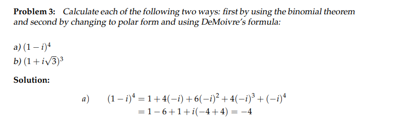
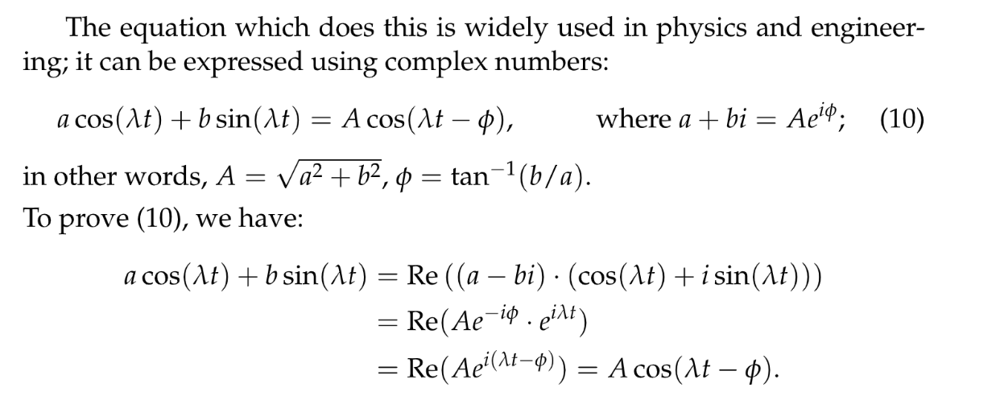
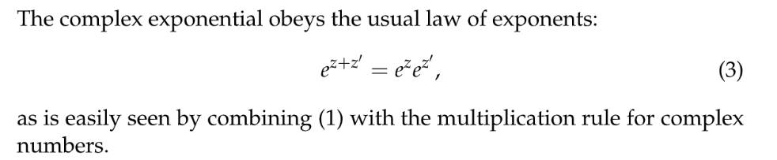
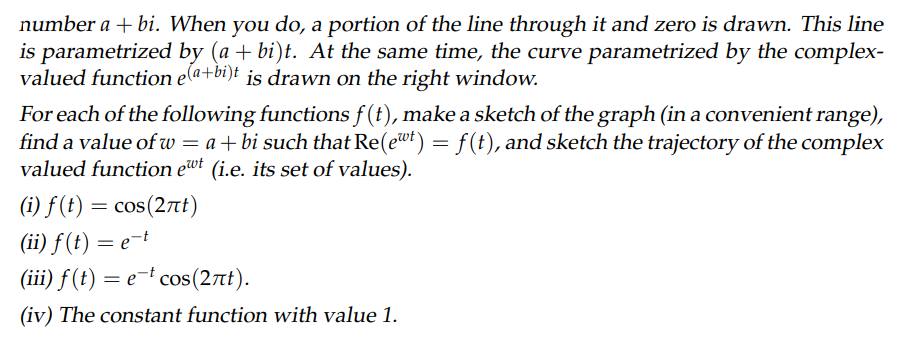

# 1 欧拉公式, 极坐标
[欧拉公式，极坐标.pdf](https://www.yuque.com/attachments/yuque/0/2022/pdf/12393765/1658060886584-0dec7573-e3d3-4c72-aa7d-b87ac37500ac.pdf)

## Complex Plane
> $a+ib\in \mathbb{C}$, $a,b\in \mathbb{R}$, 其中$(a,b)$表示这个点在二维`Cartesian Coordinate`中，这个二维平面称为`Complex Plane`

### Cartesian/Polar Form⭐⭐
> 
> **其中:**
> 1. $x+iy$称为复数的`Cartesian/Rectangular Form`，$x=r(cos(\theta)+i\cdot sin(\theta))$称为复数的`Polar Form`，下文我们将看到，我们实际上可以将其简化成$re^{i\theta}$的写法。
> 2. $(x,y)=(rcos(\theta),rsin(\theta))$被称为复数的`Cartesian Coordinates`。 
> 3. 对于$z=x+iy$来说，$(r,\theta)=(\sqrt{x^2+y^2},Arg(z))$被称为`Polar Coordinates`。
> 4. $r$被称为`Absolute Value`或者`Modulus`, 每个复数有唯一确定的`Absolute Value`。
> 5.  $\theta=arg(x+iy)$称为`Polar Angle`或者`Argument`, 每个复数的`Polar Angle`不唯一，一般为$\theta+2k\pi, k\in \mathbb{Z}$。
> 6. 为了使得每个复数对应的$\theta$都唯一，我们令$0\leq \theta < 2\pi$, 此时我们称$\theta$为`Principle Value of the polar angle`, 记为$Arg(x+iy)$。比如$Arg(-1)=\pi$, $arg(-1)=\pm\pi, \pm 3\pi, \pm 5\pi,\cdots$。

### Graphics
> 
> 笛卡尔坐标和极坐标可以相互转化。
> 

### Mutual Coversion Examples
> 

## Euler's Formula⭐⭐⭐⭐
> 

## Polar Form Algebras
### Useful Formulas
> 

### Demoivre's Formula⭐⭐⭐⭐
> 

### Examples
> 

## Sinusoidal Combination⭐⭐⭐
> 

# 2 Complex Exponentials
[复数指数.pdf](https://www.yuque.com/attachments/yuque/0/2022/pdf/12393765/1658060957013-06242334-4a77-451c-b053-245390341d8b.pdf)
[复指数例子.pdf](https://www.yuque.com/attachments/yuque/0/2022/pdf/12393765/1658061068839-052fe5c7-8a0e-4dec-94f6-57c42df29d72.pdf)

## Definition
> 
> 一个常用性质是: $|e^{a+ib}|=|e^a||e^{ib}|=|e^a|=e^a$

## Basic Algebras⭐
> 
> **Proof:**
> 令$z=a+ib, z'=a'+ib'$, 则$e^{z}e^{z'}=e^{a+ib}e^{a'+ib'}=e^ae^{ib}e^{a'}e^{ib'}$(by definition)。
> 然后利用`Multicative Rule`有$e^{ib}e^{ib'}=e^{i(b+b')}$, 所以$e^ae^{ib}e^{a'}e^{ib'}=e^{a+a'}e^{i(b+b')}=e^{(a+a')+i(b+b')}=e^{z+z'}$, 证毕。

## Expression for Sinusoidals⭐⭐⭐⭐⭐
> 
> 将$cos(wx)$或者$sin(wx)$这样的三角函数视为`Complex Exponentials`是非常重要的思维模式，后面会经常用到。
> 

## Complex-Valued Function⭐⭐⭐
### Definition
> 在`18.04`中会更加深入探究
> 
> 和实数域上的运算性质基本没有区别。

### Examples⭐⭐⭐
> 

## Polar Angle - Rotation
> 
> 这个例子非常重要，实际上，因为对于一个复数$z=re^{i\theta}$来说($\theta = Arg(z)$), $\theta$实际上是一个旋转角度，$r$是旋转后的复数的模长。所以$z^2=z\cdot z=r_1e^{i\theta_1}\cdot r_2 e^{i\theta_2}=r_1r_2e^{i(\theta_1+\theta_2)}$, 其中$r_1r_2$是旋转后的新的复数的模长, $\theta_1+\theta_2$是旋转后的新的复数绕$x$轴逆时针旋转的角度。于是我们有:
> $z=2e^{i\frac{\pi}{3}}$, $z^2=4e^{i\frac{2\pi}{3}}$, $z^3=8e^{i\pi}$, $z^4=16e^{i\frac{4\pi}{3}}$
> 
> $z=2e^{i\frac{\pi}{3}}$, $z^{-1}=\frac{1}{2}e^{-i\frac{\pi}{3}}$, $z^{-2}=\frac{1}{4}e^{-i\frac{2\pi}{3}}$, $z^{-3}=\frac{1}{8}e^{-i\pi}$, $z^{-4}=\frac{1}{16}e^{-i\frac{4\pi}{3}}$
> 

 

## Finding Complex Exponential
> 
> 对于问题的第一部分，我们利用复指数性质，$e^{a+bi}=e^ae^{bi}=e^a(cosb+isinb)$, 所以$\begin{cases} e^acosb=1\\e^asinb=\sqrt{3}\end{cases}$, 于是两式相比得到$tanb=\sqrt{3}$, 所以$b=\frac{\pi}{3}$(最小的)。此时$e^a=2$
> 对于第二部分，我们有:
> 

# 3 寻找nth-root⭐⭐⭐⭐⭐
[n-th roots.pdf](https://www.yuque.com/attachments/yuque/0/2022/pdf/12393765/1658061004686-8d1cc0c4-1f25-43e9-8abb-0fd63b9b30d0.pdf)
> 本章节的思想非常重要，值得反复练习。本章节我们主要探讨如何求出$z^n=\alpha, z,\alpha\in \mathbb{C}$的解。

## z^n=1
### Anaytics
> 对于$z^n=1$, 我们可以看成$z^n=1+0\cdot i=e^{i2k\pi}$, 同时$z=re^{i\theta}$, 于是根据复数运算基本定则我们有:
> 

**Remarks about k**
> 

### Graphical
> 

### Examples
> 

## z^n=w
> 

## Examples
### Solving z^n=w
> 

### Solving Quadratic Equations
> 
> 🔔: 总的来说对于$z^n=w$，先找到$w$的极坐标表示，从而找到$z_0=re^{i\theta}$中的$\theta$(`Principle Value of the polar angle`), 然后乘上一个固定的常数(也就是$z^n=1$的解)$\zeta^0,\zeta^1,\cdots, \zeta^{n-1}$得到所有的解。

# Problem Sets
[MIT18_03SCF11_ps2_s6q.pdf](https://www.yuque.com/attachments/yuque/0/2023/pdf/12393765/1682866910316-e4b6560c-90ed-427f-9f4c-4dd3421cf144.pdf)
[MIT18_03SCF11_ps2_s6s.pdf](https://www.yuque.com/attachments/yuque/0/2023/pdf/12393765/1683517328705-a66007de-1d6c-4692-96ab-f970c9533195.pdf)
[MIT18_03SCF11_ps2_II_s6q.pdf](https://www.yuque.com/attachments/yuque/0/2023/pdf/12393765/1682866910341-5db4bab9-db44-4290-9aa7-5c5e2921a94d.pdf)
[MIT18_03SCF11_ps2_II_s6s.pdf](https://www.yuque.com/attachments/yuque/0/2023/pdf/12393765/1683517295813-2f600c9f-2f00-483f-bcce-a81abc2e23c0.pdf)

## P1 Complex Numbers&Roots of Unity
> 

**Solution (a)**
**Solution (b)**

## P2 Complex Exponentials, Sinusoids
> 

**Solution (a)**
**Solution (b)**
**Solution (c)**
**Solution (d)** $f(t)=cos(2\pi t)=Re(e^{i2\pi t})$, where $w = 2\pi i$

$f(t)=e^{-t}$, where $w=-1$

$f(t)=e^{-t}cos(2\pi t)=Re(e^{-t}e^{i2\pi t})=Re(e^{(-1+2\pi i)t})$, where $w=-1+2\pi i$

$1=e^0$, where $w=0$

# Applet Resources
[https://ocw.mit.edu/ans7870/18/18.03SC/complexExponential.html](https://ocw.mit.edu/ans7870/18/18.03SC/complexExponential.html)
