[Sinusoidal Functions.pdf](https://www.yuque.com/attachments/yuque/0/2022/pdf/12393765/1657438119257-b8c30a89-717c-457f-bb8a-18d5688ca944.pdf)
[The Sinusoidal Identity.pdf](https://www.yuque.com/attachments/yuque/0/2023/pdf/12393765/1682867490574-ce329914-a9f5-4877-ab3e-9c1a770d39c7.pdf)

# Sinusoidal Function
> 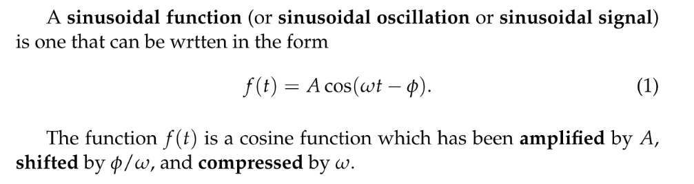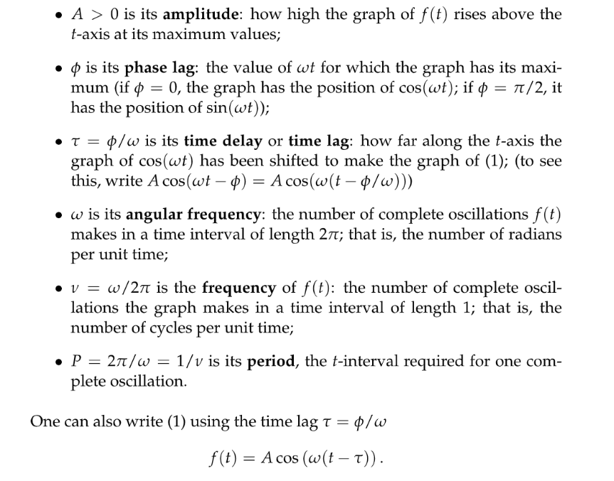

# Sinusoidal Identity
## Formula
> 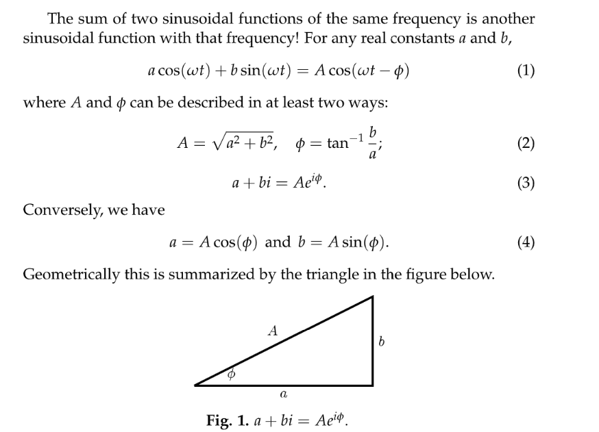

## Proof 1: Cosine Addition Function
> 

## Proof 2: Euler's Formula
> 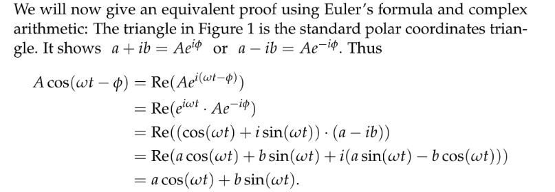

## Proof 3: Geometry
> 假设有一个向量是$\langle a,b\rangle$, 另一个向量是$\hat{u}_{\theta}=\langle cos(\theta), sin(\theta)\rangle$, 则他们的内积:
> $\langle a,b\rangle \cdot \langle cos(\theta), sin(\theta)\rangle=\|\langle a,b\rangle\|\cdot \|\langle cos(\theta), sin(\theta)\rangle\|=\sqrt{a^2+b^2}cos(\theta-\phi)$, $\phi=tan^{-1}(\frac{b}{a})$
> 假设$\theta$`Counter Clockwise`的角度比$\phi$大。

## Examples
### Example 1
> 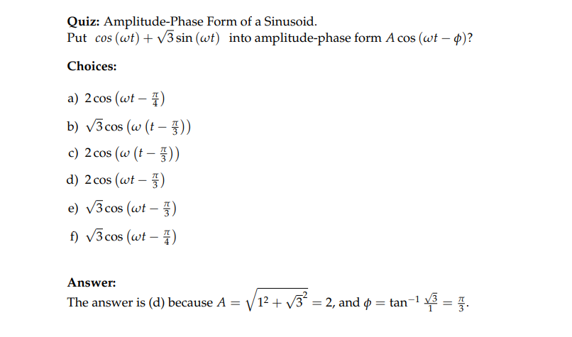

### Example 2
> 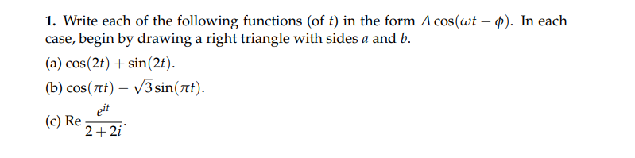

**(a)**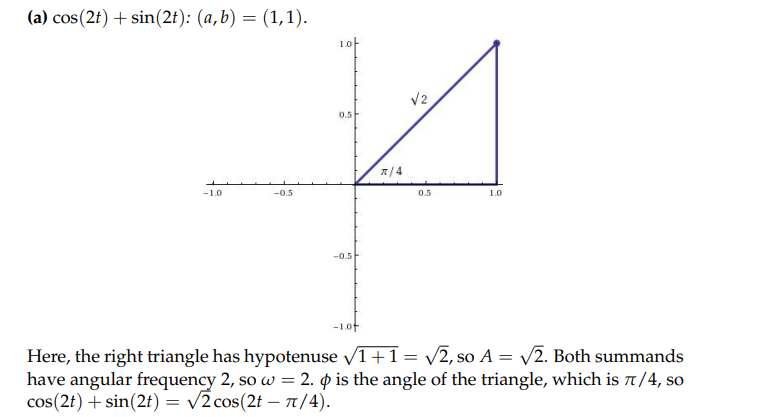
**(b)**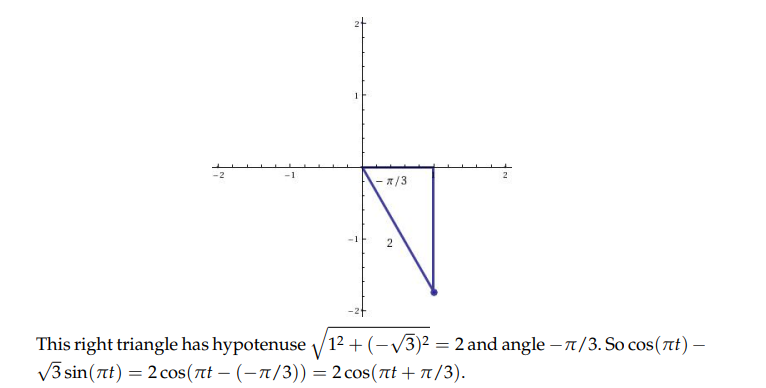
**(c)**⭐⭐⭐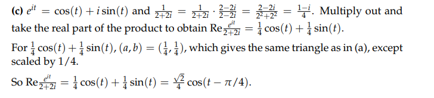
Another way is to first convert $2+2i$into $\sqrt{2^2+2^2}e^{\frac{\pi}{4}i}=2\sqrt{2}e^{\frac{\pi}{4}i}$
Then $Re\frac{e^{it}}{2+2i}=Re\frac{e^{it}}{2\sqrt{2}e^{i\frac{\pi}{4}}}=Re\frac{\sqrt{2}}{4}e^{i(t-\frac{\pi}{4})}=\frac{\sqrt{2}}{4}cos(t-\frac{\pi}{4})$

# Problem Sets
[MIT18_03SCF11_ps2_s7q.pdf](https://www.yuque.com/attachments/yuque/0/2023/pdf/12393765/1683522363616-8c8664cc-d10d-4ac9-aa91-0501581d97bf.pdf)
[MIT18_03SCF11_ps2_s7s.pdf](https://www.yuque.com/attachments/yuque/0/2023/pdf/12393765/1683522363644-63f84ac9-2021-4a8b-947f-6d5200e618e3.pdf)
## P1 Conversion
> 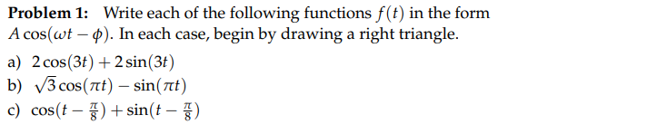

**Solutions**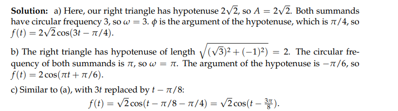

## P2 Integral
> 

**Solution**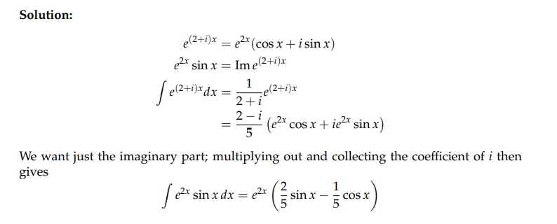

# Applet Resources
[https://ocw.mit.edu/ans7870/18/18.03SC/trigId.html](https://ocw.mit.edu/ans7870/18/18.03SC/trigId.html)
