[Intro.pdf](https://www.yuque.com/attachments/yuque/0/2022/pdf/12393765/1658231622714-a321a449-8494-4c61-b3e8-b79383ca72ad.pdf)
> 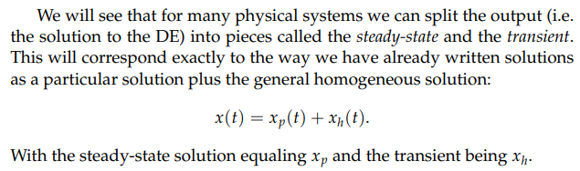

# 1 常系数微分方程
[Solutions to Constant Coefficient First Order Equation.pdf](https://www.yuque.com/attachments/yuque/0/2022/pdf/12393765/1658231650464-0ccd94c0-6135-4ee4-9c9a-d07aee0b1592.pdf)
## 定义
:::info
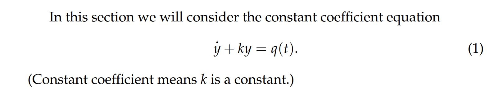
我们使用`Integrating Factor`去解这个方程:
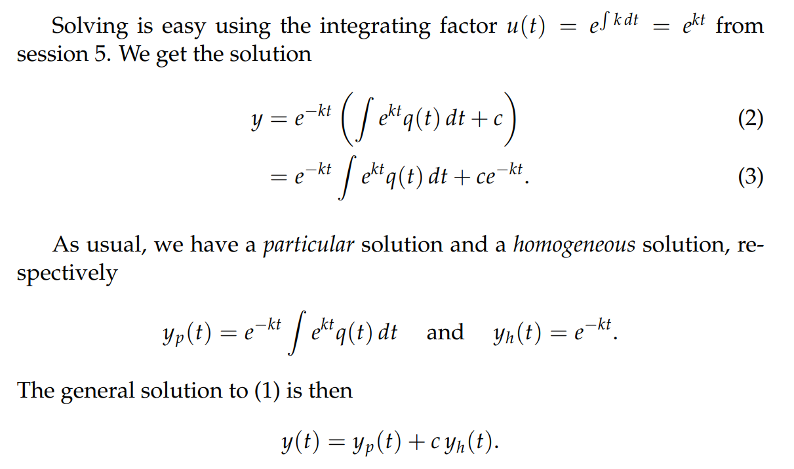
分情况讨论$k$的大小:

- $k>0$: 是指数衰减, 当`Input Signal`$q(t)=0$时, $y(t)=ce^{-kt}$, 当$t\to \infty$时，$y(t)$衰减到$0$,**所以此时我们称**$ce^{-kt}$**是**`**Transient**`**, **$e^{-kt}\int e^{kt}q(t)dt$**是**`**Steady-State/Long-term Behaviors**`**。常数**$c$**的值是被IVP决定的，但是**`**Initial Conditions**`**只影响**`**Transient**`**不会影响**`**Long-term Behavior**`

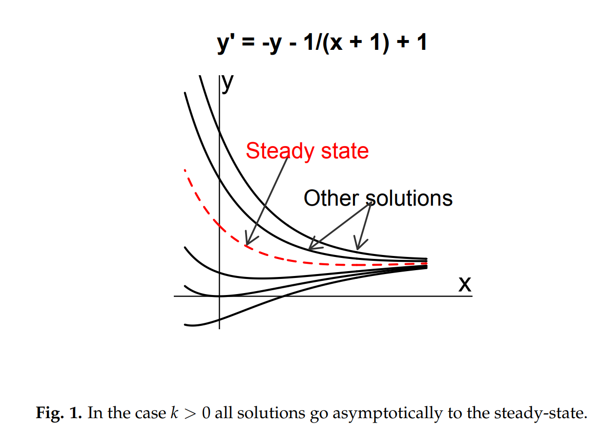

- 当$k<0$： 

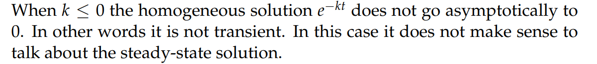
:::

# 2 常系数微分方程的例子
[Examples of Constant Coefficient Equations.pdf](https://www.yuque.com/attachments/yuque/0/2022/pdf/12393765/1659491741874-897dd609-ec19-4d75-8432-185d271a4b8b.pdf)

## 2.1 放射物质衰变
> 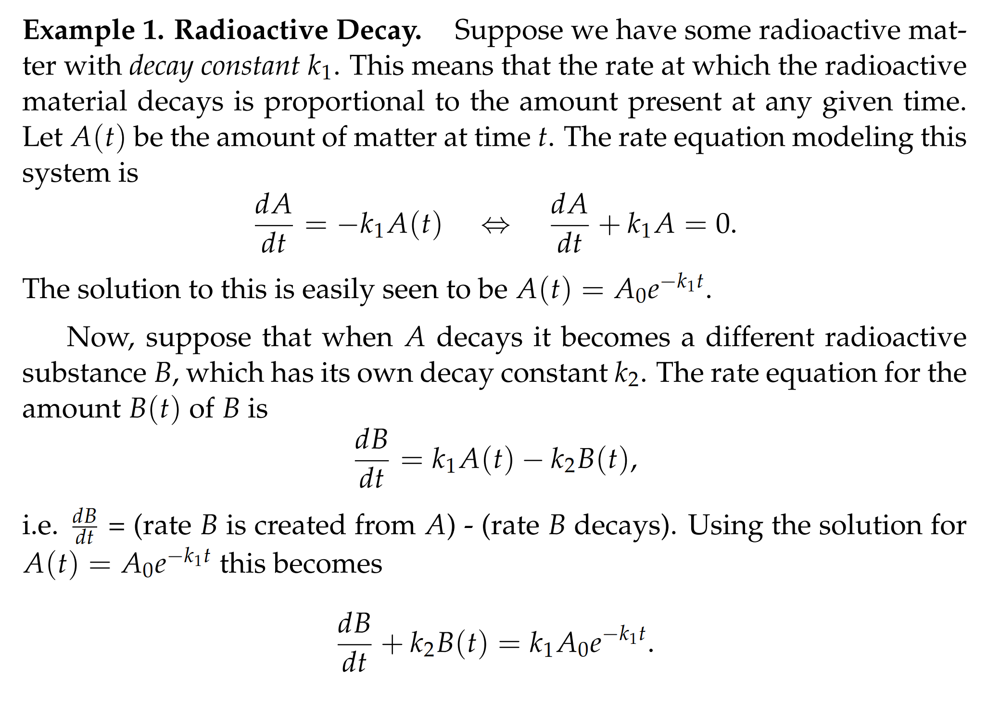

## 2.2 热扩散模型**⭐**
> 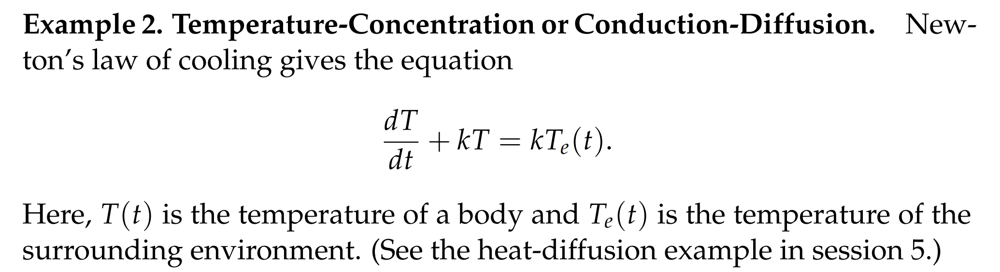

## 2.3 缸内混合模型**⭐⭐**
### 2.3.1  建模过程
> 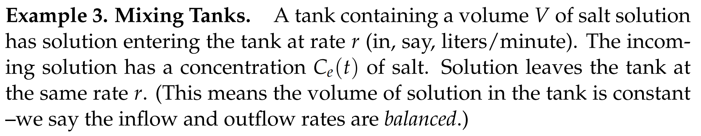

:::info
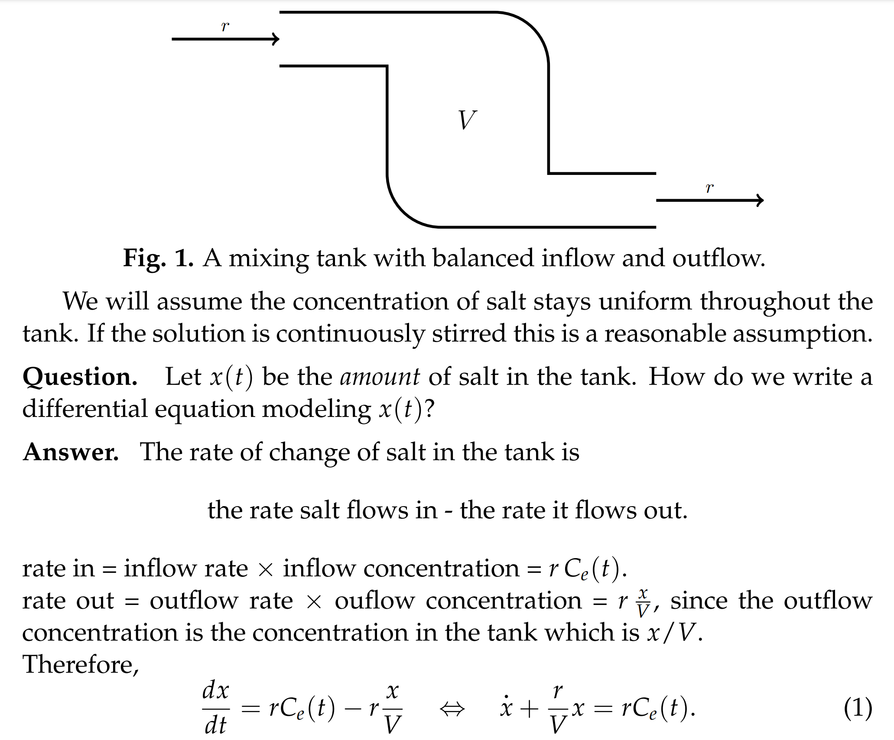
:::

### 2.3.2  注意事项
#### 变量的选取
:::info
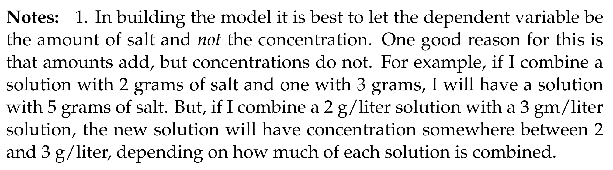
两个浓度不同的溶液相混合，溶质质量可以直接相加，但是浓度不能直接相加，取决于溶液的质量关系，假设我有两种溶液, 质量和浓度分别为$m_1,C_1,m_2,C_2$, 如果我们要求混合之后的浓度，我们有: $C=\frac{m_1C_1+m_2C_2}{m_1+m_2}$, 只有当$m_1=m_2$的时候，$C=\frac{C_1+C_2}{2}$, 其他情况，浓度关系取决于质量的相对大小关系， 所以变量最好选取溶质的量
:::

#### 转化成浓度
> 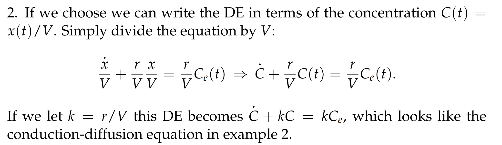
> 有了溶质的变化关系，我们可以轻易的得出浓度的变化关系，前提是溶质的体积不变。

#### 流入流出不平衡
> 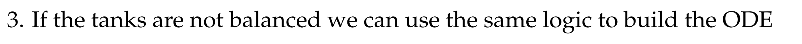
> 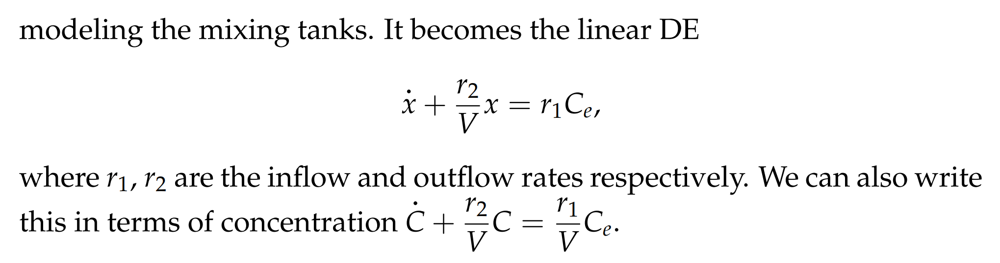

## 2.4 RC 电路
:::info
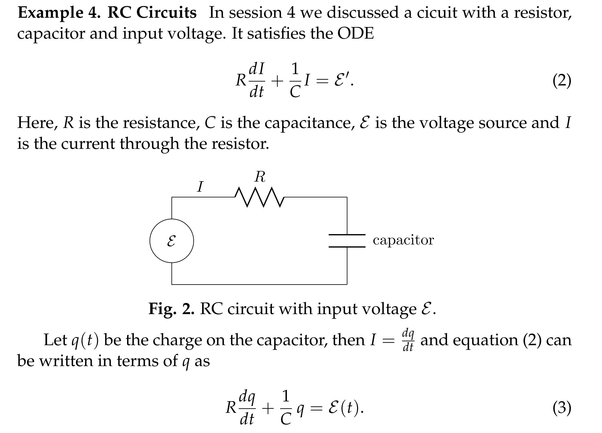
这里我们认为输入是$\mathcal{E}$的导数, 而不是$\mathcal{E}$本身，属于是`Modified Input`, 在后续的`Unit 3.11` 中有介绍这类`LTI System`的`Transfer Function`的求法。
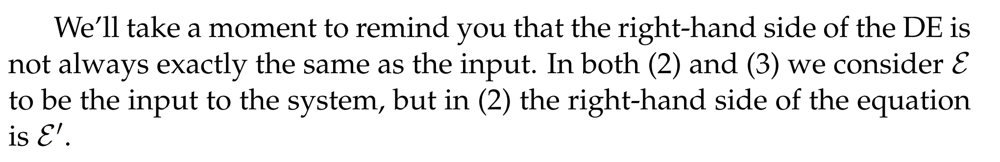
:::

# 3 输入不连续的例子**⭐⭐**
[Response to Discontinuous Input.pdf](https://www.yuque.com/attachments/yuque/0/2022/pdf/12393765/1659491754528-0baea680-6c54-471d-a4c8-8b0b005a8d7d.pdf)
> 本小节我们将介绍如果输入$f(t)$不是一个连续函数的情况，由于目前我们只接触了一阶线性微分方程，所以我们讨论一阶线性微分方程$\dot{y}+ky=f(t)$在输入不连续的状况下的`System Response`

## 3.1 Unit Step Function
> 在现实生活中，如果我们的输入发生突变式增长/衰减，增长/衰减率比任何指数函数都要快，我们就可以使用`Unit Step Function`来模拟这种输入（在`Unit 3.4`中有详细介绍）
> **下面给出部分定义:**
> 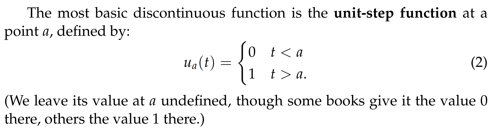

## 3.2 Canonical Example - Cooling
> 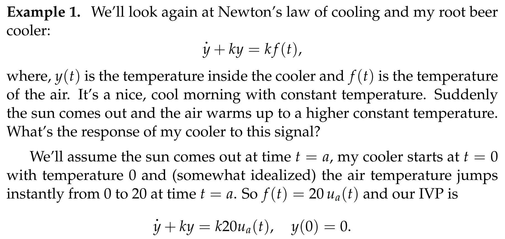

**Key**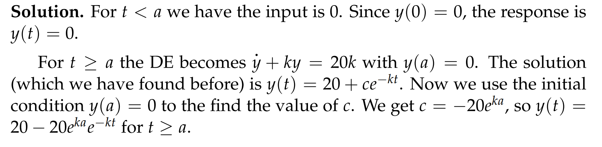
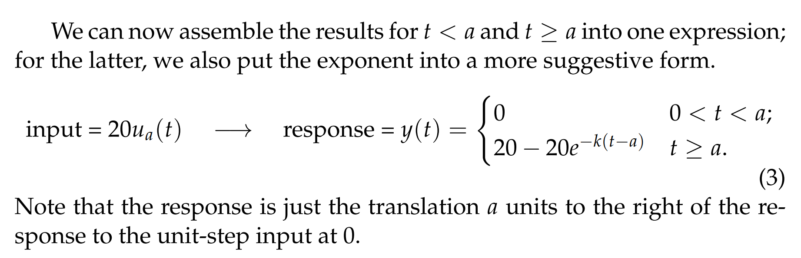

## 3.3 Unit Box Function**⭐⭐⭐**
> 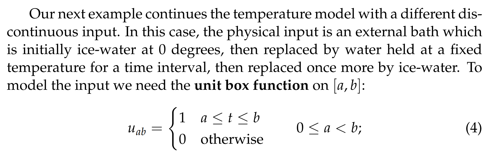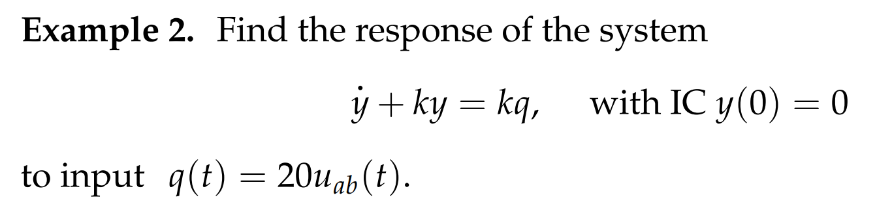
> 我们有三种方法来解这个微分方程:
> 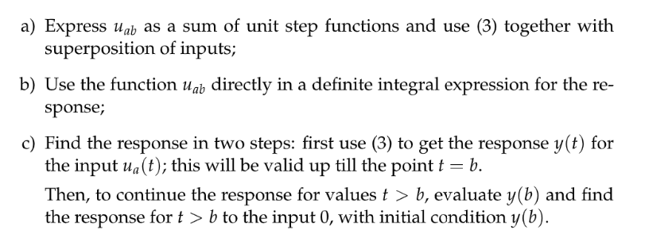

**Solution 1 Superposition**我们可以发现$u_{ab}(t)=u_a(t)-u_b(t)$读者可以自行验证。
当$\dot{y}+ky=20u_a(t)$时我们有:
$y_a(t)=\begin{cases}0&0<t<a\\ 20-20e^{-k(t-a)}&t\geq a \end{cases}$
$y_b(t)=\begin{cases}0&0<t<b\\ 20-20e^{-k(t-b)}&t\geq b \end{cases}$
所以最终的解就是$y(t)=y_a(t)-y_b(t)$在$t$的取$t\leq a$, $a<t\leq b$和$t>b$上分段讨论的结果，于是我们有:
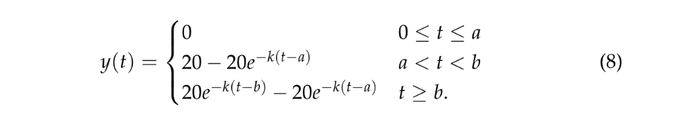
**Solution 2 Definite Integral**对于$\dot{y}+ky=k20u_{ab}(t)$来说，我们有`Integrating Factor`$u(t)=e^{\int kdt}=e^{kt}$, 所以我们有:
$(u(t)y(t))'=k20u_{ab}(t)u(t)$, 两边求定积分可得: $\int_0^t (u(t)y(t))'dt = \int_0^t k20u_{ab}(t)u(t)dt$
所以$u(t)y(t)-u(0)y(0)=\begin{cases} \int_0^t 0 dt=0&t\leq a\\\int_a^t k20e^{kt}dt=20e^{kt}\big|_a^t=20e^{kt}-20e^{ka}&a<t\leq b\\\int_{a}^bk20e^{kt}dt=20e^{kt}\big|_{a}^b=20e^{kb}-20e^{ka}&t>b\end{cases}$
因为$u(0)=1, y(0)=0$, 所以:

**Solution 3 Break Into Cases**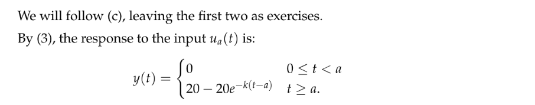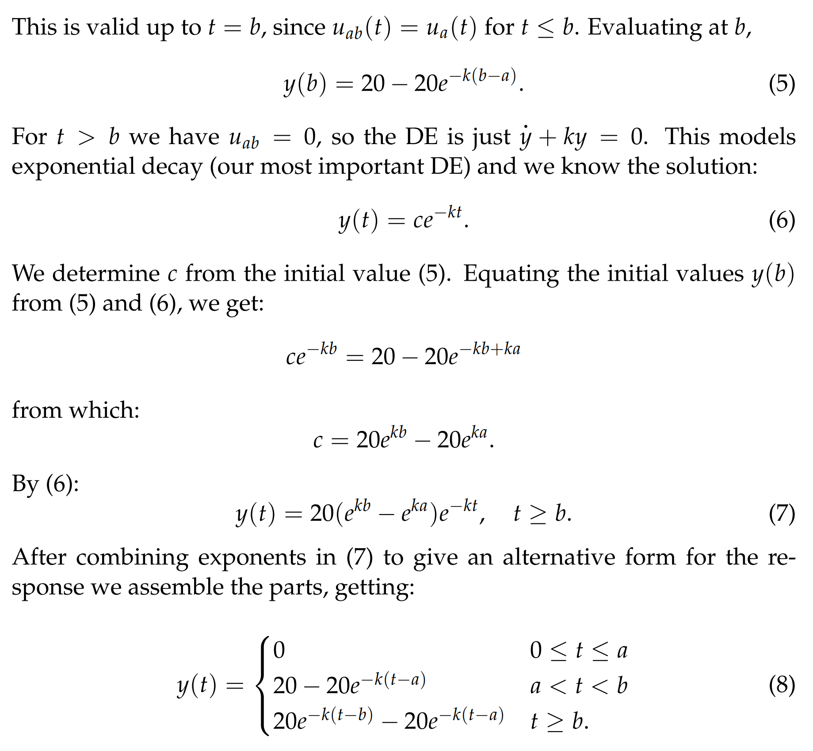
