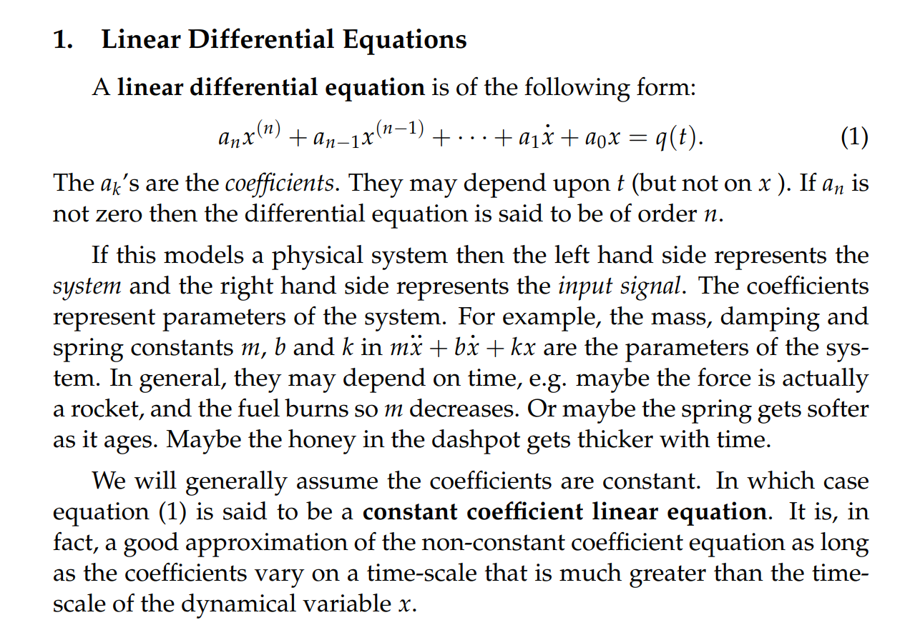
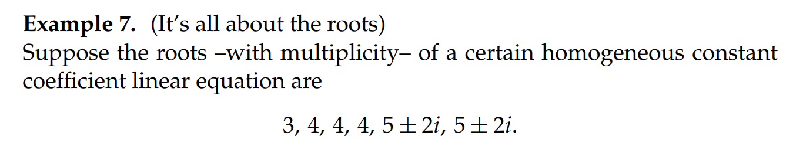

# 1 二阶物理系统
## 平衡位置
> 一个简单的二阶物理系统如图所示:
> 

## 受力分析
> 假设我们的系统受到弹力$F_{spr}$，摩擦力$F_{dash}$和一个外力$F_{ext}$， 由$F=ma$
> 我们有: $m\ddot{x} = F_{spr}+F_{dash}+F_{ext}$
> 下面我们在$x>0$是进行受力分析

### 弹力分析

### 摩擦力分析(damping)

## 标准方程
> 最后我们可以得到一个二阶常系数微分方程$m\ddot{x}+b\dot{x}+kx=F_{ext}$

# 2 线性微分方程
## 定义

## 二阶常系数微分方程

## 无阻尼的二阶常系数微分方程

# 3 特征多项式⭐⭐⭐
[Characteristic Polynomials.pdf](https://www.yuque.com/attachments/yuque/0/2022/pdf/12393765/1658385421116-75c3d151-88b4-49dd-9618-75d1cfc3ff0a.pdf)
## 二阶的情况
>  对于一个二阶微分方程$m\ddot{x}+b\dot{x}+kx = 0$来说，它的特征方程是$p(r) = mr^2+br+k=0$

> 

### Examples
> 
> 

## 推广到n阶

# 4 Modes and Roots⭐⭐⭐
> 特征方程的解成为`Modal Solution`,也被成为系统的`Mode`
> 在`Unit 1`中我们知道，特征方程的解$r$对应了系统的其中一个`homogeneous solution`$e^{rt}$
> 下面我们将讨论特征方程的根的情况

## 两个实数根

## 两个复数根
### Real Solution Theroem⭐⭐
> 如果$m\ddot{z}+b\dot{z}+kz=0$,且$z = u+vi$
> 那么$u\space or\space Re(z)$和$v\space or\space Im(z)$也是方程$m\ddot{x}+b\dot{x}+k=0$的解, 证明如下:

### 实例
#### 例1

#### 例2
> 注意，这里虽然看起来$a+bi$对应的根$e^{at}cos(bt),e^{at}sin(bt)$, $a-bi$对应的根$e^{at}cos(bt),e^{at}sin(bt)$会有 重复，但是上他们来自于不同的根，所以不用考虑线性无关性

## 重复的实根
> 重根需要**保持根与根之间的线性无关性**，所以需要在前面乘上一个自变量

# 5 练习

