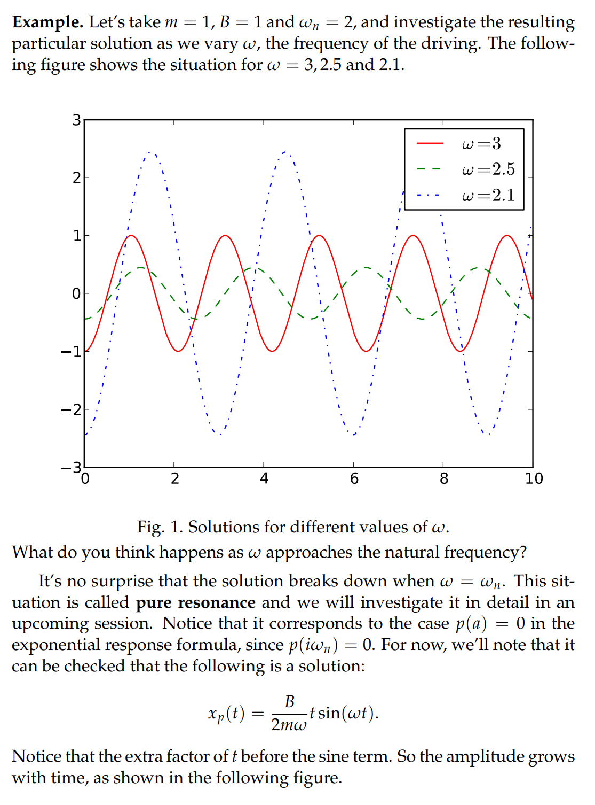
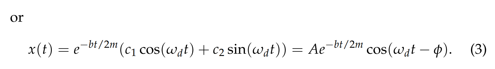
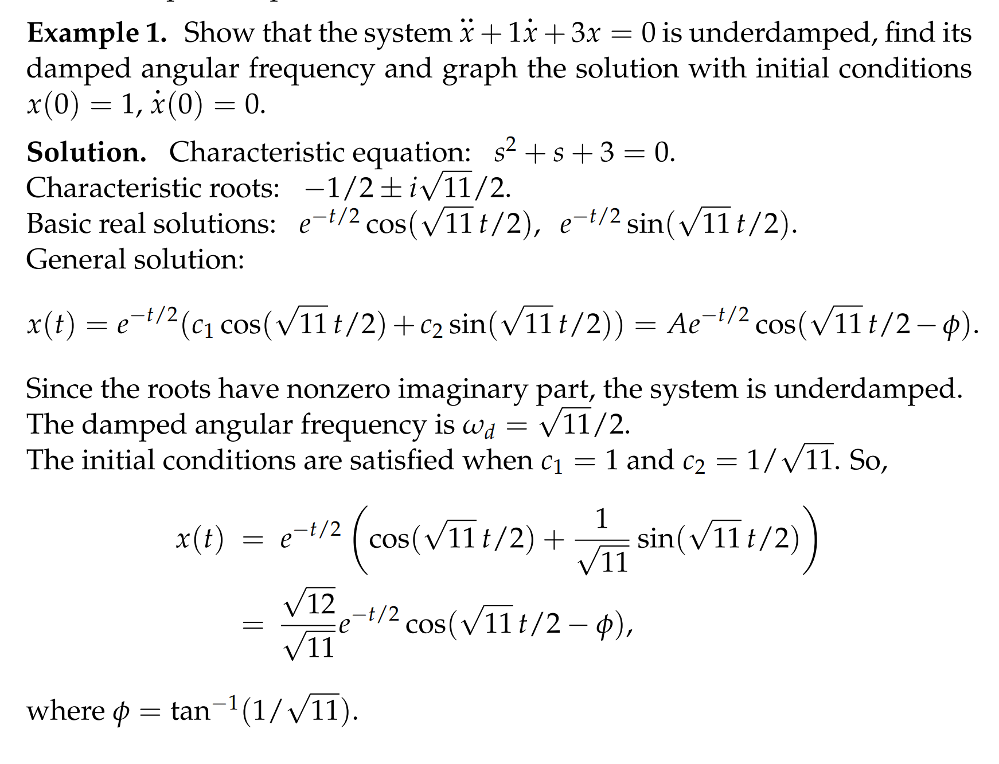

> 上一节我们已经得到了一个受到弹簧弹力($F_{str}$)，活塞的摩擦力($F_{dash}$)和外力($F_{ext}$)的二阶物理系统

> 
> 现在，我们假设$F_{ext}=0$, 得到一个`homogeneous equation`$m\ddot{x}+b\dot{x}+kx=0$
> 当然，因为这仍然是一个物理系统，我们需要对这个方程的系数做一些限制$m>0,b\geq0,k>0$ 
> **接下来，我们将对**$m,b,k$**三者的关系进行讨论，得到不同特性的**`**unforced oscillator**`

# 1 Undamped Harmonic Oscillator⭐
## Intro
> 当$b=0$时，$m\ddot{x}+kx=0$, 这个简谐振子(`simple harmonic oscillator`)的自然频率$w = \sqrt{\frac{k}{m}}$

## 分析

## 算例

## RRF(Resonant Response Formula)

# 2 Damped Harmonic Oscillator⭐⭐⭐
## 2.0 总览

## 2.1 Underdamping(non-real complex roots)
### 推导

### 分析
> 系统的`Response`形如 $x(t) = Ae^{\frac{-bt}{2m}}cos(w_dt-\phi)$
> - 由于$b\neq 0$,$e^{\frac{-bt}{2m}}$会随着$t$的增大逐渐变为$0$。也就是**振幅会越来越小,趋近于0**
> - **我们习惯于把**$w_d$**叫做**`**damped angular frequency**`**或者**`**pseudofrequency**`

### 算例

## 2.2 Overdamping(distinct real roots)
### 推导

> 由于$m>0,k>0$, 所以可以推导出，**两个实根一定都是负的**

### 分析
> 由于我们的$x(t)=c_1e^{r_1t}+c_2e^{r_2t}$中没有出现三角函数，**所以系统实际上是不会振动的, 最后趋近于稳定点**$x=0$
> 下面是一段弹簧门的描述: 
> 

### 算例

## 2.3 Critically Damping
### 推导

### 算例

## 2.4 比较分析

# 3 练习
## 课堂练习⭐
### 练习1
> Assume an unforced overdamped spring-mass dashpot started at $\dot{x}(0)=0$. Show that it never crosses the equilibrium position $x=0$for $t>0$  

:::success
我们有$m\ddot{x}+b\dot{x}+kx=0$,$\dot{x}(0)=0$

- 因为`overdamped`的情况下, 我们的$x(t) = c_1e^{r_1t}+c_2e^{r_2t},r_2<r_1<0,\therefore\frac{r_1}{r_2}<1$
- 我们有$\dot{x}(0)=0$,也就是$c_1r_1+c_2r_2=0$

接下来我们假设$x(t)$在某个$t^{*}>0$的瞬间与$x$轴相交了
$x(t^{*}) = 0 = c_1e^{r_1t^*}+c_2e^{r_2t^*}$， $\therefore -\frac{c_2}{c_1}=e^{(r_{1}-r_2)t^*}......(1)$
$\because c_1r_1+c_2r_2 = 0,\therefore -\frac{c_2}{c_1}=\frac{r_1}{r_2}...............(2)$
我们联立$(1)和(2)$,  得到： $t^*=\frac{ln(\frac{r_1}{r_2})}{(r_1-r_2)}$,$\because \frac{r_1}{r_2}<1,\therefore t^*<0$, 与我们的假设矛盾，所以不存在这样的$t$
:::

### 练习2
> Show that regardless of initial condition, an overdamped oscillator** can cross equilibrium position at most once**

:::success
根据$t^*=\frac{ln(\frac{r_1}{r_2})}{(r_1-r_2)}$,  当$\frac{r_1}{r_2}>0$时，有且仅有一个$t^*$满足
:::

## 课后作业
[Problem Set](https://ocw.mit.edu/courses/18-03sc-differential-equations-fall-2011/79f2349d10404454ea6ed6f959fc1d33_MIT18_03SCF11_rec_08s13_sol.pdf)
