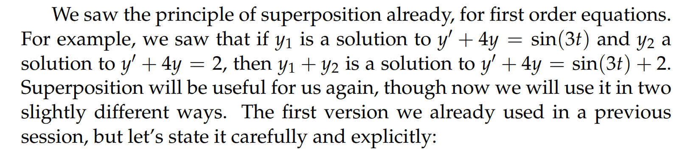

# 1 Superposition⭐⭐⭐

## 1.1 SuperPosition 1

## 1.2 Superposition 2

# 2 Exponential Input
> 在`Characteristic Equation`章节中，我们有$m\ddot{x}+b\dot{x}+kx=F_{ext}$
> 现在我们我们假设$F_{ext}=Ae^{at}$, 比如$F_{ext}=3cos(2t)$

## 算例

> 对于`homogeneous solutions`,我们可以使用特征方程非常快的得到答案
> 对于`inhomogeneous solutions`, 我们使用猜测法，猜测$x_p=Ae^{2t}$,也就是和右侧的指数一样

## ERF⭐⭐
> 这个公式旨在求得**指数输入下的特殊解**
> **这个公式的由来就是我们对**`**exponential input**`**所用的猜测法**

## Generalized ERF⭐⭐⭐
> [!important]
> 

### 算例
#### 例1

#### 例2

### Proof
[Generalized ERF Proof Using Linear Operators](https://ocw.mit.edu/courses/18-03sc-differential-equations-fall-2011/126a06d9ea3f580dfb26d5b17aa4832b_MIT18_03SCF11_s17_6text.pdf)

# 3 Sinusoidal Input
> 比较简单，后面都有覆盖到关于`Gain`之类的概念，这里就跳过了

[Sinusoidal Input.pdf](https://www.yuque.com/attachments/yuque/0/2022/pdf/12393765/1658589465338-eb2ed141-0f55-4b7e-91b9-0440077d6174.pdf)

## 算例

# 4 简谐振子
[Simple Harmonic Oscillator.pdf](https://www.yuque.com/attachments/yuque/0/2022/pdf/12393765/1658589518450-4537b1fb-e27f-4e57-bf12-bb50201d7f48.pdf)

