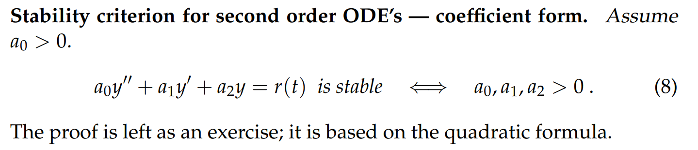

# 1 Stability**⭐⭐⭐**
[Stability.pdf](https://www.yuque.com/attachments/yuque/0/2022/pdf/12393765/1659494094305-6edc545f-023f-4df7-a3cd-e4786c0287fa.pdf)
:::warning
在第一章`Unit 1.9`中我们定义过关于一阶线性常系数微分方程的`Stability`, 由于一阶线性微分方程的齐次方程只有一个解$-k$，齐次解是$Ce^{-kt}$, 所以只要当$k>0$时，我们就称方程为稳定的，反之不稳定。
本章中我们将介绍二阶线性常系数微分方程的稳定性条件。
:::
## 1.1 定义
:::warning

:::
> 
> 

## 1.2 二阶ODE的稳定性条件
### 1.2.1 初步结论
> 
> 一个系统的`response`在长期来看和初始状态无关

### 1.2.2 根的分布视角
> 
> 这个结论非常显然，如果根$r=a\pm bi$有`negative real part`的话，则$a<0$
> 根$y(t)$的形式就是$y(t)=e^{(a+bi)t}=e^{at}e^{bti}=e^{at}(cos(bt)+isin(bt))$, 此时当$t\to \infty$时，$e^{at}\to 0, y(t)\to 0$, 所以系统是稳定的。

### 1.2.3 系数视角
> 
> **这个结论不是很显然，这里给出一个证明: **
> 我们通过求根公式给出特征方程$a_0r^2+a_1r+a_2=0$的解$r=\frac{-a_1\pm\sqrt{a_1^2-4a_0a_2}}{2a_0}$，我们根据`1.2.1`中的三个稳定性条件来推导: 
> 1. 方程有两个不等实根$r_1\neq r_2$，则$r_1<0,r_2<0$,由韦达定理,$r_1+r_2=\frac{-a_1}{a_0}<0,r_1r_2=\frac{a_2}{a_0}>0$ 所以$a_1a_0>0,a_0a_2>0$; 由于我们假设$a_0>0$, 所以$a_1>0,a_2>0$, 结论成立
> 2. 方程有两个相等实根$r_1=r_2$，我们仍然要保证这个根$r_1=r_2<0$, 所以和$(1)$中的推导一致
> 3. 方程有两个虚根$r=a\pm bi$，我们要保证实部小于零, 由于根的形式是$e^{rt}=e^{=\frac{-a_1\pm\sqrt{a_1^2-4a_0a_2}}{2a_0}t}=e^{\frac{-a_1}{2a_0}t}(cos(bt)+isin(bt)),b=\frac{\sqrt{a_1^2-4a_0a_2}}{2a_0}$, 于是$\frac{-a_1}{2a_0}<0$,得到$a_1a_0>0$; 同时由于是虚根，所以$a_1^2-4a_0a_2<0$, 于是$a_0a_2>0$, 由于$a_0>0$, 所以$a_1>0,a_2>0$，结论成立, 证毕

## 1.3 高阶ODE的稳定性条件
> 

### 1.3.1 根的分布式视角
> 

### 1.3.2 系数视角
> 

### 1.3.3 Routh-Hurwitz 条件
> 

# 2 p(D) Notations 
> 后续`Linear Operators`章节会介绍，这里简单说明

# 3 Definition of Phase Lag
## 定义

## 算例

# 4 练习
## 练习1

## 练习2

## 练习3

## 练习4

