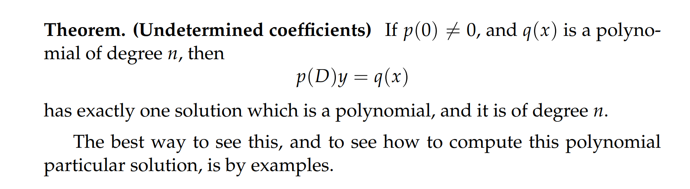
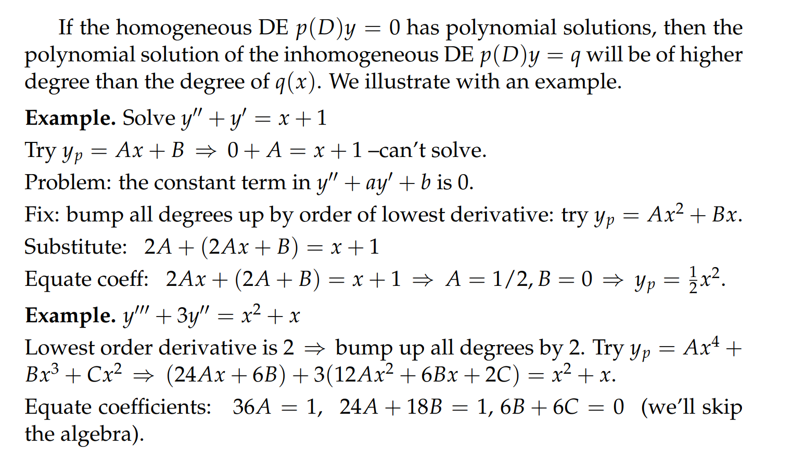
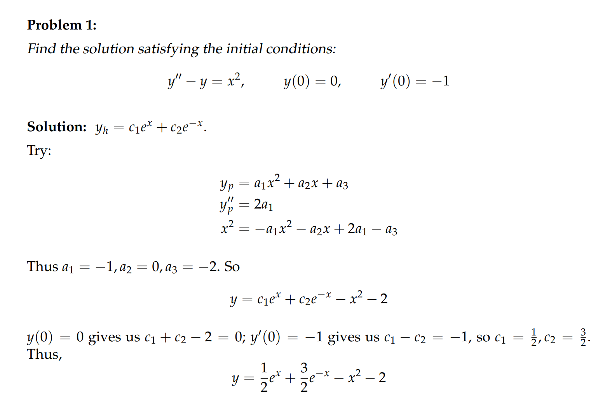
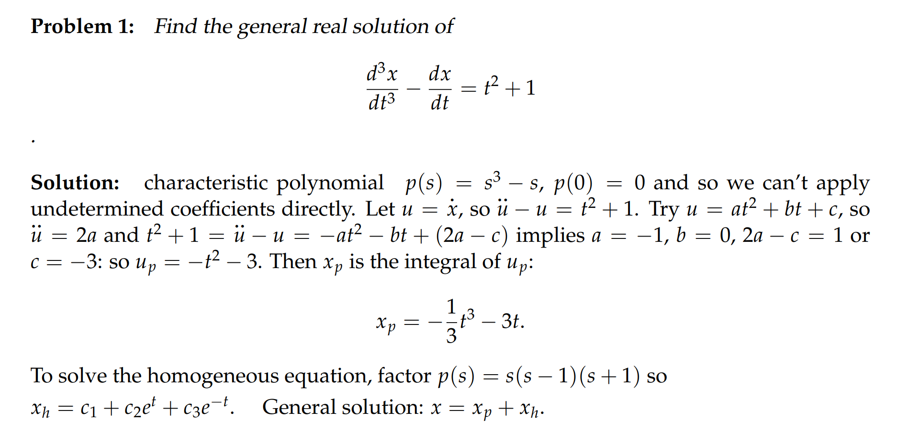
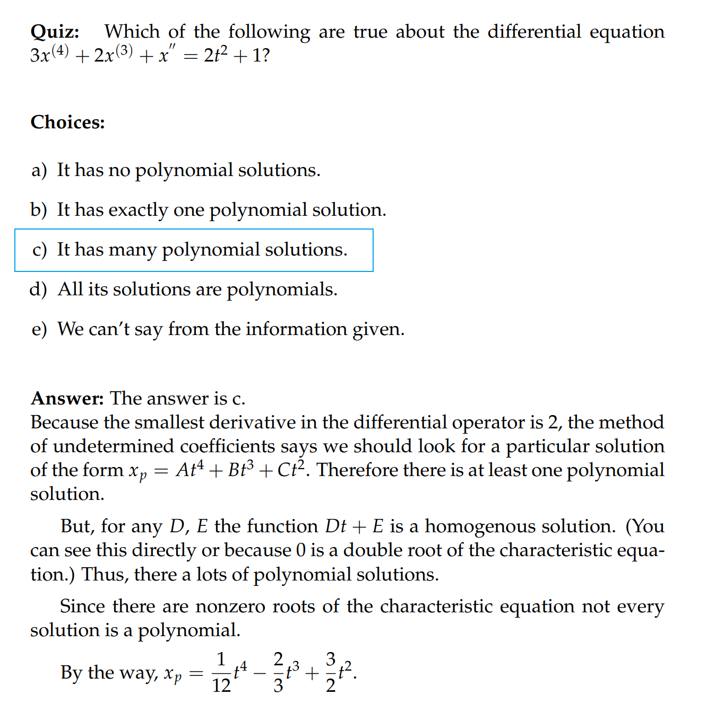
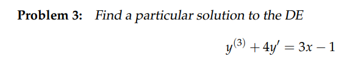
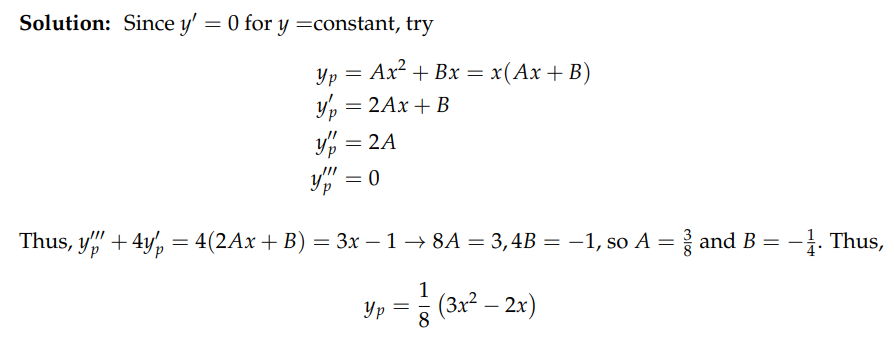
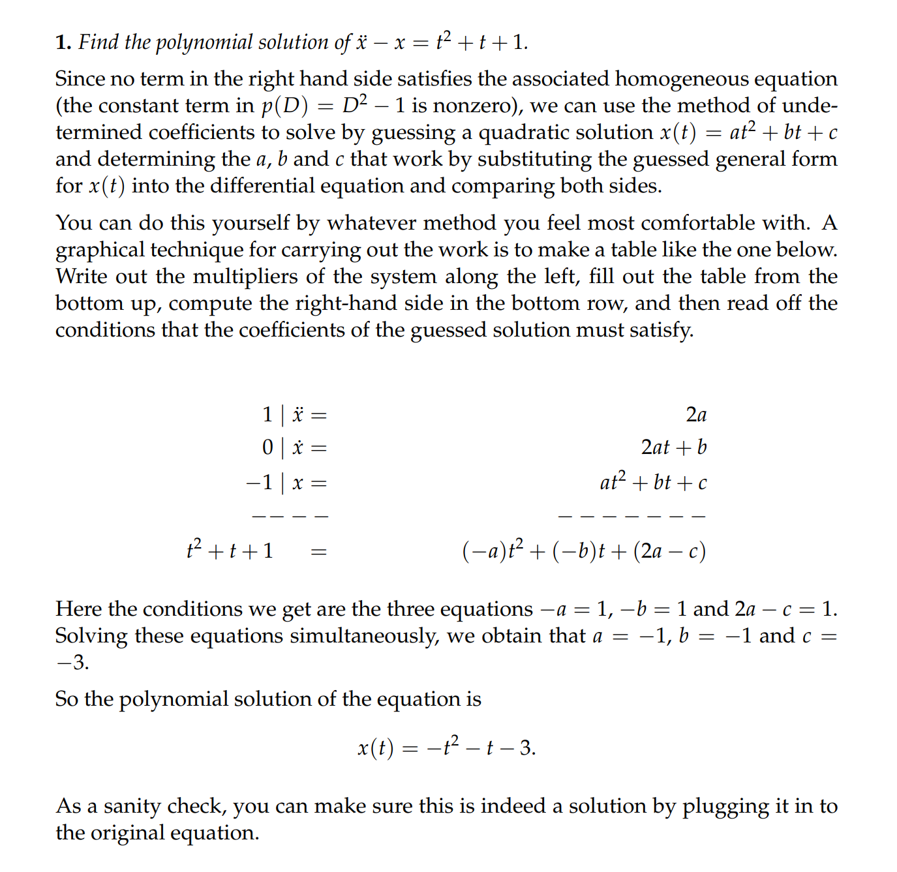

# 1 多项式输入
## 1.1 多项式的定义
> 我们使用$q(x) = a_nx^n + a_{n-1}x^{n-1}+...+a_0$定义一个多项式，其中, $a_n \neq0$,使得多项式$q(x)$的次数是$x^n$决定的，也就是$n$
> 这里，我们有$q(0) = a_0$以及$q'(0) = a_{1}$ 

## 1.2 定理

### 注意点

# 2 多项式输入例题
## 例1

## 例2 

## 例3

## 例4

## 例5

