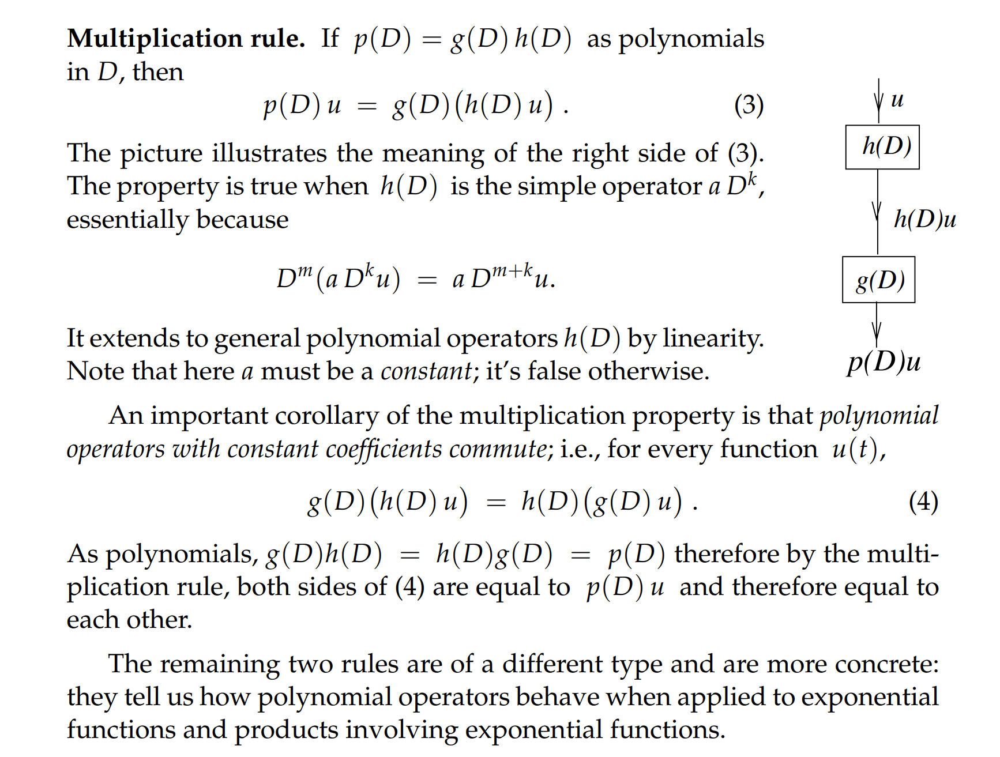
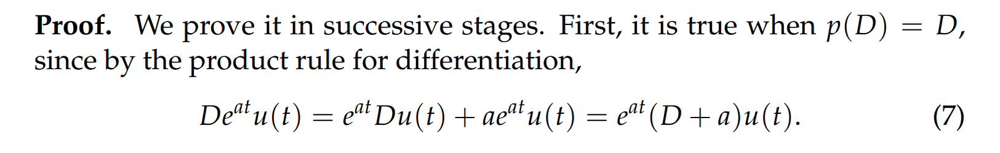
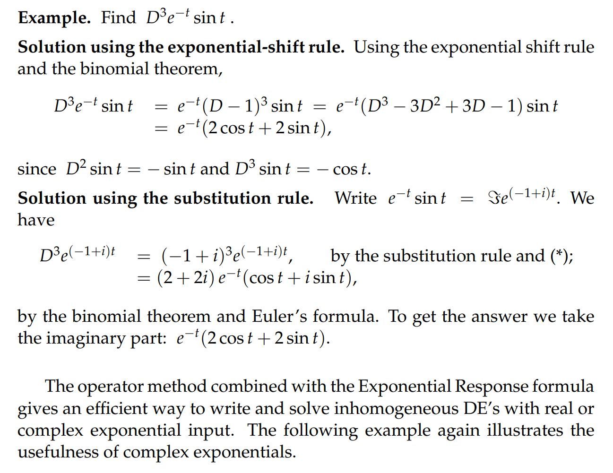

# 1 微分符号
## 定义
> `Operators`是定义在函数上的，输入输出均为函数
> 比如，我们有:
> - `Shift-by-a Operator`: 将$f(t)$映射为$f(t-a)$从而是函数图像向右移动$a$个单位
> - `Multiply-by-h(t) Operator`: 将$f(t)$映射为$h(t)f(t)$,实际上就是两个函数的组合
> 
这里，我们将介绍`Differentiation Operators`,其作用是将$f(t)$变为$f^{(n)}(x)$的形式，也就是对函数求微分

## 举例
> 我们使用$D$作为微分符号，我们有: $Df(t) = f'(t)$. $D^2f(t) = D* Df(t) = D*f'(t) = f''(t)$  

# 2 线性常系数微分方程中的微分符号
> 一个任意的$n$阶线性微分方程可以写成$y^{(n)} + p_1(t)y^{(n-1)}+...+p_n(t)y=q(t)$

:::success
**这里我们只考虑，**$p_{n}(t)$**是常数的情况**, 于是我们有:
$y^{(n)} + a_{1}y^{(n-1)}+...+a_{n}y = q(t)$, $D = \frac{d}{dt}$, 于是我们有
$p(D) = D^{n}+a_1D^{n-1}+...+a_{n}$
:::
:::warning
$p(D)$就是`**polynomial differential Operators with constant coefficients**`
**我们的输入就是一个**$y(x)$**的函数，输出就是**$p(D)y$
:::

# 3 微分符号的运算法则
## 3.1 线性法则

### 证明

## 3.2 乘法法则

## 3.3 替换法则

## 3.4 指数偏移法则

### 证明

### 算例

## 3.5 复数集上的推广

# 4 Time Invariance**⭐**
[Time Invariance.pdf](https://www.yuque.com/attachments/yuque/0/2022/pdf/12393765/1658284423588-7cb9b409-6b64-4f76-8e0b-5c98f357805a.pdf)
## 定义
> 输入信号$q(t)$和输出信号$x(t)$在$p(D)$的联系下具有一种关系:
> `Translation Invariance`: 如果$p(D)$是一个`constant-coefficient differential operator`,
> - 如果对于$p(D)x = q(t)$, 我们有$x_p = x(t)$
> - 则对于$p(D)y = q(t-c)$, 我们有$y_{p} = x(t-c)$
> 
**这种现象就是**$p(D)$**的**`**Time Invariance**`

## 算例

# 5 例题
## 例1
> 多项式输入和指数输入的结合，使用`superposition`即可

## 例2
> 此题较难
> **我们需要判断等式左侧的**$p(D)$**是否出现**$p(0)=0$**的现象; 发现没有出现，因此，我们可以采用和上一小节类似的猜测方式：**
> - 我们可以尝试先对$xe^x$求导看看，发现$(xe^x)' = e^x + xe^x$, 同时带有$e^x$和$xe^x$, 于是我们可以将这两项看成是多项式中的两项，
> - 同时我们发现等式左侧有$y$非导数项, 于是我们可以猜测，解的形式是$Ae^x+Bxe^x$

### 例3
> 要注意这里有其实有四个根，两两重合。
> 同时，我们注意到， 方程的$y_h$中含有$e^x$和$xe^x$, 因为我们的$y_{p}$必须和$y_h$线性无关(其实根于根之间都必须要线性无关), 所以我们猜测$y_p = x^2(Ax+B)e^x$

