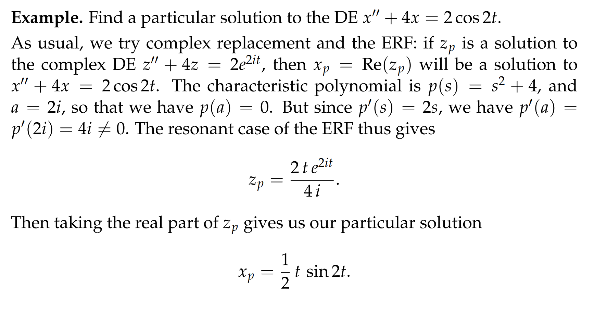
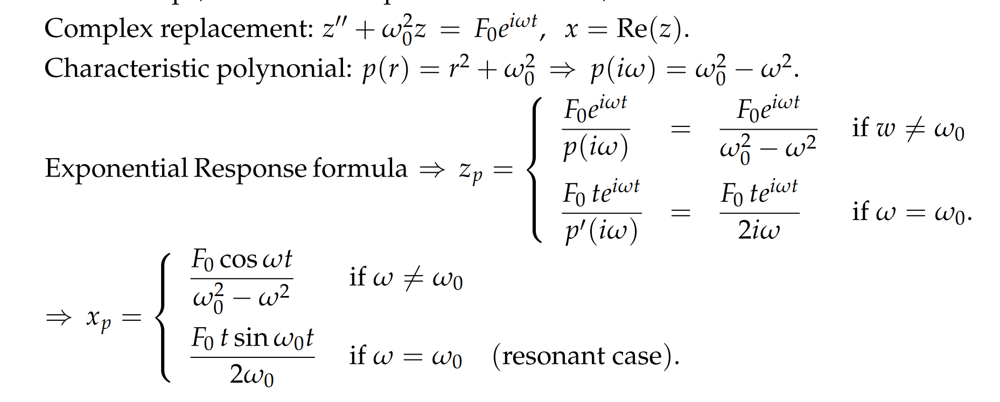
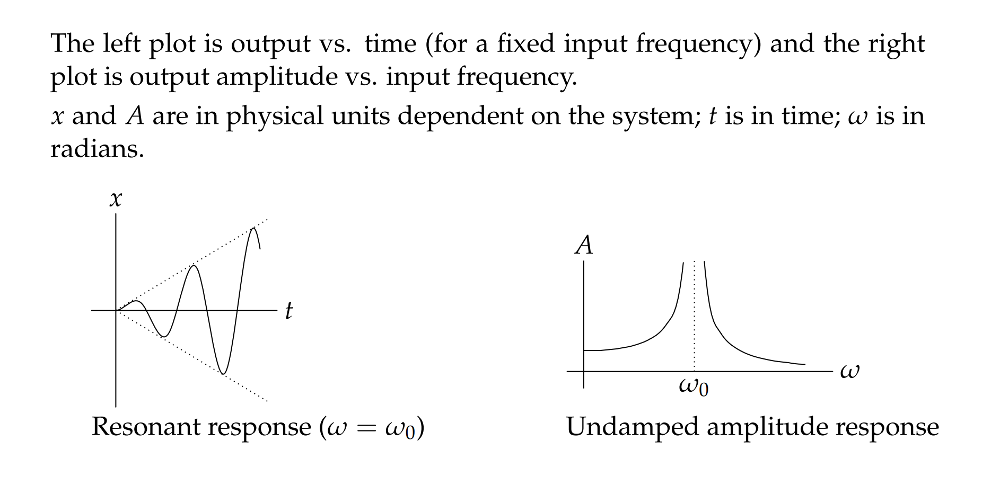

# 1 ERF（Exponential Response Formula: Resonant Case）
## 定义
> 在一般情况下，我们有$p(D)x=Be^{at}$, $x_p = \frac{Be^{at}}{p(a)}$, 如果$p(a)\neq0$
> 但是当$p(a) =0$的时候，我们的公式变为$x_p=\frac{Bte^{at}}{p'(a)}$, 如果$p'(a)\neq 0$

## 算例

# 2 Undamped Forced Systems
## 介绍
> 对于`undamped forced system`, 我们有$mx''+bx'+k=F_0cos(wt)$,并且$b = 0$
>  我们想要找$x''+w_0^2x=F_0cos(wt)$的$x_{p}$, 过程如下：
> 

## Bode Plot
> 从以上步骤，我们得知，解的振幅是$A=A(w) = |\frac{F_0}{w_0^2-w^2}|$, 是一个关于$w$的函数
> 当$w = w_0$的时候根据`ERF`公式，我们有$x_p=\frac{F_0tsin(w_0t)}{2w_0}$
> - 这时候的$x_p$就叫做`Pure Resonance`
> - 这时候的$w_0$就叫做`Natural Frequency`
> - $w$就叫做`Resonant Frequency`
> 
详见下面两幅图: 

# 

# 

