# 1 Introduction
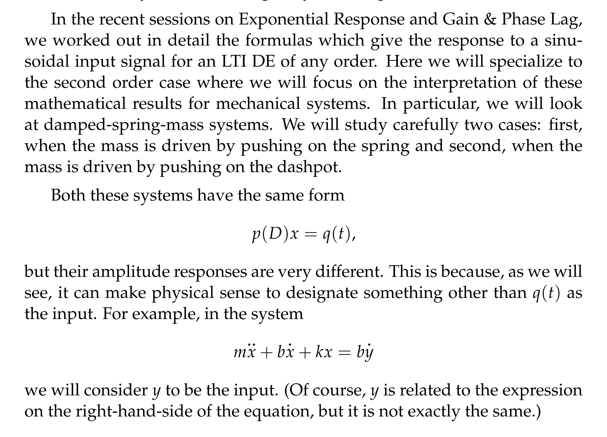
:::success
This session looks at how the response of a system with sinusoidal input changes as the frequency of the input changes. In particular, we will want to **understand the gain and the phase as functions of frequency**. 

- For the gain, which we call **frequency response(振幅),** we will want to find** the frequency that maximizes the response**. **When this frequency(频率) exists we will call it the resonant frequency** of the system. 
- **For undamped systems it is called pure resonance and corresponds to an infinite amplitude**. 
- **For damped systems it is called practical resonance and corresponds to a finite amplitude.**
:::

# 2 正弦驱动系统(Sinusoidally Driven Systems)
[Sinusoidally Driven Systems.pdf](https://www.yuque.com/attachments/yuque/0/2022/pdf/12393765/1659412324995-b9c7ff76-6dc4-4d5a-8ae0-0dfcb71e128e.pdf)
## Recap
> 对于一个二阶常系数线性微分方程（通常用于建立: `damped forced hormonic oscillator`）
> 我们有$mx''+bx'+k = Bcos(wt)$, $m$是质量, $b$是阻尼系数, $w_{0} = \sqrt{\frac{k}{m}}$  是系统的自然频率(`natural frequency`)，$Bcos(wt)$是正弦驱动力

:::success
我们想要预测这个系统在不同的$w$的取值下的不同回应
:::

## Frequency Response
:::info
对于一个$mx''+bx'+k = Bcos(wt)$的微分方程来说，我们有:

1. 微分方程的特征方程为$p(s) = ms^{2} + bs+k$
2. `Gain(**Amplitude Response**)`: $g(w) = \frac{1}{|p(iw)|} = \frac{1}{\sqrt{(k-mw^2)^2+b^2w^2}}$
3. `Phase Lag(**Phase Response**)`: $\phi = \phi(w) = Arg(p(iw)) = tan^{-1}(\frac{bw}{k-mw^2})$
4. `Time Lag`: $\frac{\phi}{w}$
5. `**Amplitude Response**`**和**`**Phase Response**`**统称为**`**Frequency Response**`
:::
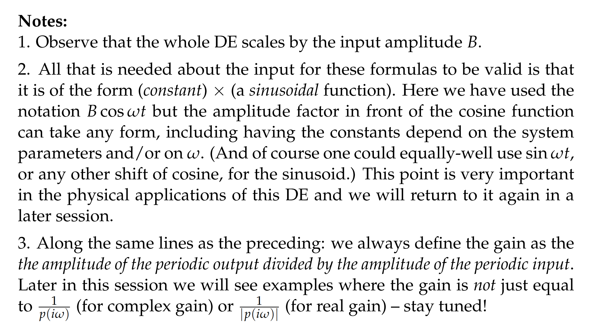

## Practical Response
[Frequency Response and Practical Resonance.pdf](https://www.yuque.com/attachments/yuque/0/2022/pdf/12393765/1659423427629-fdaa8103-d1a7-4ed3-8ca3-86dd1b63fa83.pdf)
> 我们知道， 对于$mx''+bx'+kx = Bcos(wt)$, $m>0$, $b>0$, $w_{0} = \sqrt{\frac{k}{m}}\in R^{+}$ , $B >0,w>0$, 我们有$g = g(w) = \frac{1}{\sqrt{(k-mw^2)^2+b^2w^2}}$

:::success
对于$g = g(w) = \frac{1}{\sqrt{(k-mw^2)^2+b^2w^2}}$, 我们想要知道在输入频率$w$变化的时候`Gain`的变化，我们很容易发现，对于分母我们定义:$h(w) = (k-mw^2)^2+b^2w^2 = (w^2)^2+(b^2-2mk)w^2+k^2=(w^2+\frac{b^2-2mk}{2})^2 + k^2 - (\frac{b^2-2mk}{2})^2$

- 当$b$很大的时候，$\frac{b^2-2mk}{2}$远大于$0$, 于是$\mathop{argmin}\limits_{w}(h(w)) = 0$
- 当$b$较小的时候，$\frac{b^2-2mk}{2}$小于0, 于是$\mathop{argmin}\limits_{w}(h(w)) = w_{r} =  \frac{2mk -b^2}{2}$, 此时，$g(w)$有最大值, 我们称这时的$w$为`Practical Response`

**当然我们也可以对**$g(w)$**求一阶导:**
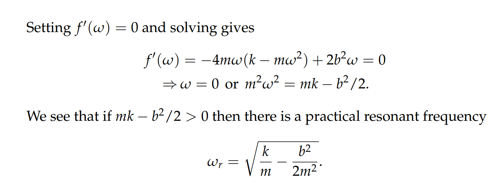
:::
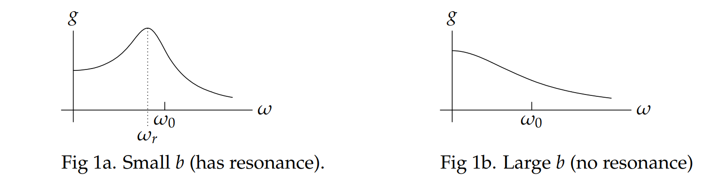

## Phase Lag
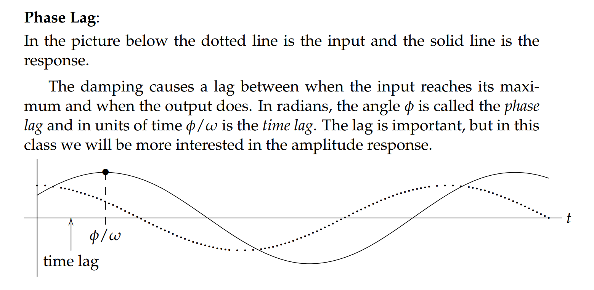

# 3 弹簧驱动机械振动系统1(Spring-Side Driven Mechanical System)
[Spring-Side Driven Mechanical System.pdf](https://www.yuque.com/attachments/yuque/0/2022/pdf/12393765/1659412377577-7b98b811-cd09-4dbb-987c-b9cd80518dd9.pdf)
## Intro
> 假设我们有一个弹簧缓冲系统（`spring-mass-dashpot system`）如下图所示, **弹簧的上端可以自由移动**
> 这个系统满足几个条件:
> 当`x = y`时，弹簧成自然状态
> 假设质点正在偏离平衡位置`x=0`向下运动,那么质点会受到两个力
> - 一个是弹簧在非自然状态下的力, 假设此时$x>y$, 则弹力大小为$k(y-x)$,方向向上
> - 另一个是`Dashpot`施加一个与质点的运动方向相反，大小与质点的运动速度$\dot{x}$成正比,大小为$-b\dot{x}$
> 
此时我们对质点`m`进行受力分析, 我们有$m\ddot{x}= k(y-x) - b\ddot{x}$, **化简之后我们得到**$m\ddot{x} + b\dot{x} +kx= ky$**.**

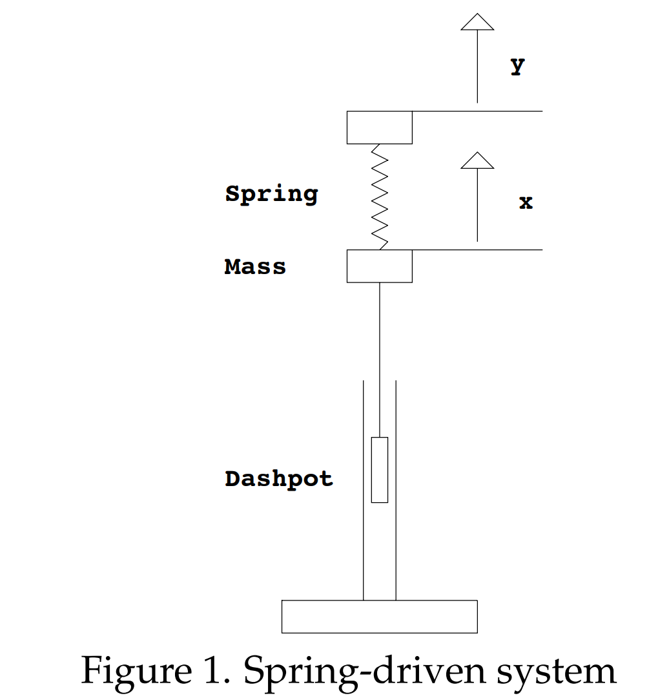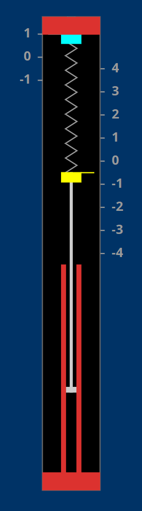

## Derivation
> 对于我们刚刚得到的$m\ddot{x}+b\dot{x}+kx=ky$, 
> 根据我们在正弦驱动系统中的分析，假设$y = B_{1}cos(wt)$ ,我们有
> - $x_{p} = Acos(wt-\phi)$.
> - $g(w) = \frac{A}{B_{1}}=\frac{k}{|p(iw)|}=\frac{k}{\sqrt{(k-mw^2)^2+b^2w^2}}$
> - $\phi(w) = tan^{-1}(\frac{bw}{k-mw^2})$
> - $w_{r} = \sqrt{\frac{k}{m}-\frac{b^2}{2m^2}}$
> 
我们发现，将输入增大`k`倍之后，我们的`Gain`相应的增大`k`倍, 但是**我们的**`**Practical Response**`**和我们的**`**Phase Lag**`**没有变化**

> 理论上，`Gain`可以无限大

## Practical Resonance Frequency
:::info
$g(w) = \frac{A}{B_{1}}=\frac{k}{|p(iw)|}=\frac{k}{\sqrt{(k-mw^2)^2+b^2w^2}}$, 和阻尼大小$b$以及劲度系数$k$相关
`**Practical Resonance Frequency**`: $w_{r} = \sqrt{\frac{k}{m}-\frac{b^2}{2m^2}}$, 和阻尼大小$b$以及劲度系数$k$相关, 用于最大化`Gain`或者`Amplitude Response`
:::

# 4 活塞驱动机械振动系统2(Dashpot-Side Driven Mechanical System)
[Dashpot-Side Driven Mechanical System.pdf](https://www.yuque.com/attachments/yuque/0/2022/pdf/12393765/1659412428811-7294082b-e87f-4fd7-805f-05e5f52d85e5.pdf)
## Intro
> 假设现在我们的弹簧上端固定，但是活塞可以在竖直方向自由移动
> **同时:**
> - 活塞施加在物体上的力与$y-x$的一阶导成正比, 也就是**和活塞与质点的相对运动速度成正比**
> - $x=0$时，施加的弹力为$0$
> 
**于是我们有:**
> -  $m\ddot{x} = -kx+b\frac{d}{dt}(y-x)$
> - $m\ddot{x}+b\dot{x}+kx=b\dot{y}$

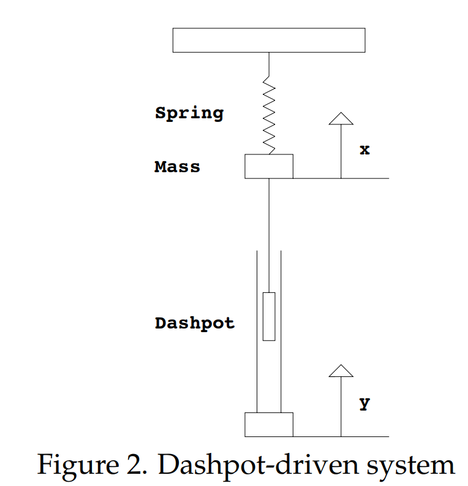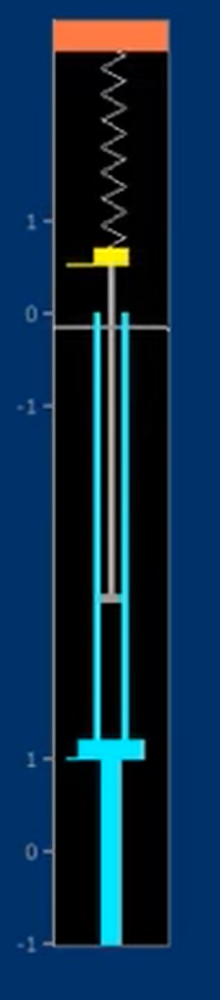

## Derivation
> 假设我们的输入信号$y = B_{1}cos(wt)$, 所以$\dot{y}=-wB_{1}sin(wt)$
> 因此，**我们的微分方程变为**$m\ddot{x}+b\dot{x}+kx=-bwB_{1}sin(wt)$

> 随后，我们可以套用之前求解二次实常系数正弦微分方程的流程:
> 1. 将$x_p$看做是$Re(z_p)$, $-bwB_{1}sin(wt)$看做$Re(ibwB_1e^{iwt})$,于是我们将微分方程变为$m\ddot{z} + b\dot{z}+kz=ibwB_{1}e^{iwt}$
> 2. 套用公式，我们有$z_p=\frac{-ibwB_{1}e^{iwt}}{p(iw)}$, $p(iw) = m(iw)^2+b(iw)+k$
> 3. `Complex Gain`$\tilde{g}(w)=\frac{iwb}{p(iw)}$, $z_{p}=B_1\tilde{g}(w)e^{iwt}$
> 4. 由于$\tilde{g} = a+bi$,是一个复数，我们可以将其写成: $\tilde{g} = \sqrt{a^2+b^2}(\frac{a}{ \sqrt{a^2+b^2}}+\frac{b}{ \sqrt{a^2+b^2}}i)=|\tilde{g}|e^{-i\phi},\space where\space \phi = -Arg(\tilde{g})$
> 5. $z_{p}=B_1|\tilde{g}|e^{i(wt-\phi)}$, $x_{p}=B_1|\tilde{g}|cos(wt-\phi)$

:::info
**我们有:**

- $p(iw) = m(iw)^2+biw+k=(k-mw^2)+biw$, 所以$\tilde{g}(w)=\frac{iwb}{p(iw)}=\frac{iwb}{(k-mw^2)+biw}$
- `**Gain**`:$g(w)=|\tilde{g}|(always\space hold)$=$\frac{|iwb|}{|p(iw)|}=\frac{wb}{\sqrt{(k-mw^2)^2+b^2w^2}}$
- `**Phase Lag**`: $\phi(w) = -Arg(\tilde{g}) = tan^{-1}(-\frac{k-mw^2}{bw})$
:::

## Practical Resonance Frequency
> **前面我们知道，**`**Practical Resonant Frequency**`**就是**`**Gain**`**的最大值时候的**`**Input Frequency**`
> - 我们要求的，就是$\mathop{argmax}\limits_{w}g(w)=\mathop{argmax}\limits_{w}\frac{1}{\sqrt{1+\frac{(k-mw^2)^2}{(wb)^2}}}$
> - 分子最小的时候，我们有$k = mw^2$, 此时$w_{r}=\sqrt{\frac{k}{m}}=w_{0}$, 也就是说，`Resonant Frenquency`和`Natural frequency`相同
> - 于是我们求得: 在$w_{r}=w_{0}$的时候,$\max{g(w)}=1$,也就是说`**Practical Response**`**是**`**1**`

> 我们发现，`Practical Resonant Frquency`$w_r$发生在$w_{r}=\sqrt{\frac{k}{m}}=w_{0}$, 且和$b$的取值，也就是阻尼系数的大小无关。

# 5 Applet Explorations
## 弹簧驱动
**Applet1**:  [Spring-Side Driven Mechanical System](https://ocw.mit.edu/ans7870/18/18.03SC/ampPhaseSecondOrderI.html)
> **可以验证:**
> - 我们的`Practical Response`会随着$b$和$k$的改变而改变
> - $w_r$**总是出现在**$w_{0}$**的左侧**
> - 随着阻尼系数$b$的减小，`Resonant Frequency`会逐渐增大到$w_0$

## 活塞驱动
**Applet2:**  [Dashpot-Side Driven Mechanical System](https://ocw.mit.edu/ans7870/18/18.03SC/ampPhaseSecondOrderII.html)
> **可以验证:**
> - 在阻尼系数$b$发生改变的时候，我们的`Practical Response`不会发生改变，一直是`1`
> - **阻尼系数**$b$**很小的时候，**$\phi$**改变符号的频率非常的大**

## 一起驱动
**Applet3:  **[Both-Side Driven Mechanical System](https://ocw.mit.edu/ans7870/18/18.03SC/ampPhaseSecondOrderIII.html)

## 奇怪驱动
Applet4: [Strangely Driven](https://ocw.mit.edu/ans7870/18/18.03SC/ampPhaseSecondOrderIV.html)

# 6 总结⭐
:::info
对于一个$mx''+bx'+k = Bcos(wt)$的微分方程来说，假设`**input signal**`是$Bcos(wt)$我们有如下性质:

1. 微分方程的特征方程为$p(s) = ms^{2} + bs+k$
2. 微分方程的一个复数特解为$z_{p} = \frac{Be^{iwt}}{p(iw)} = \frac{Be^{iwt}}{k-mw^2+ibw}$
3. 实数特解为$x_{p} = Re(z_{p}) = \frac{Bcos(wt-\phi)}{\sqrt{(k-mw^2)^2+b^2w^2}}, \phi=Arg(p(iw))=tan^{-1}(\frac{bw}{k-mw^2})$, $\phi\in [0,\pi]$
4. `Complex Gain`: $H(w)= \tilde{g}(w) =\frac{\frac{B}{p(iw)}}{B}= \frac{1}{p(iw)} = \frac{1}{k-mw^2+ibw}$
5. `Gain`: $g(w) =  \frac{\frac{B}{\sqrt{(k-mw^2)^2+b^2w^2}}}{B}=|H(w)|=|\tilde{g}(w)|=|\frac{1}{p(iw)}|=\frac{1}{|p(iw)|} = \frac{1}{\sqrt{(k-mw^2)^2+b^2w^2}}$
6. `**Amplitude Response**`**: 就是**`**Gain**`**的另一种叫法**
7. `**Phase Lag**(**Phase Response**)`: $\phi = \phi(w) = Arg(p(iw)) = tan^{-1}(\frac{bw}{k-mw^2})(如果分子上有复数，就不成立)\newline \phi=\phi(w)=-Arg(\tilde{g}(w))=-Arg(H(w))=-tan^{-1}(-\frac{bw}{k-mw^2})=tan^{-1}(\frac{bw}{k-mw^2})(一定成立，推荐使用)$
8. `Time Lag`: $\frac{\phi}{w}$
9. `**Amplitude Response**`**和**`**Phase Response**`**统称为**`**Frequency Response**`
10. `Complex Gain`到`Gain`的推导：$g(w)=|\tilde{g}(w)|*e^{-i\phi},\therefore\phi=-Arg(\tilde{g}(w))$
:::
> `**Bode Plot**`**: **$A(w)$**和**$\phi(w)$
> 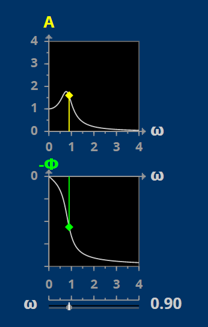
> `**Nyquist Plot**`**:**$H(w)$**,绿色的角度就**$-\phi$**,注意是负数**
> 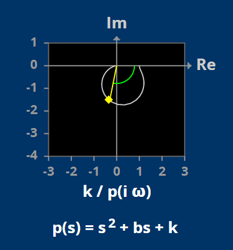

# 7 Problem Sets
## Practice Problem
### 练习1⭐
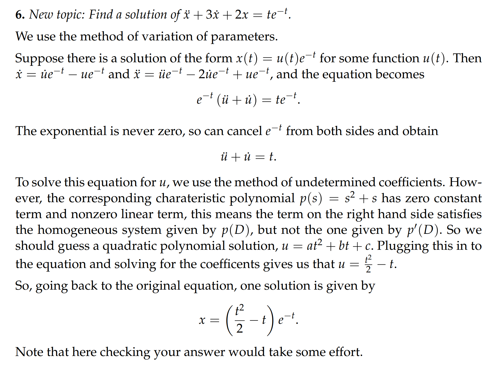

## Problem Set 1
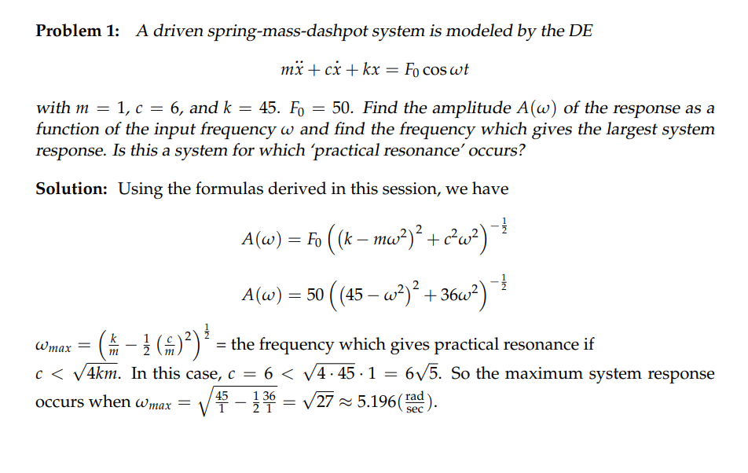

## Problem Set 2
### Problem 1
> 时刻记住，`Gain`的定义是`Output Amplitude/Input Amplitude`
> 在本题中，`Input signal`是$cos(2t)$， 注意不是$4cos(2t)$

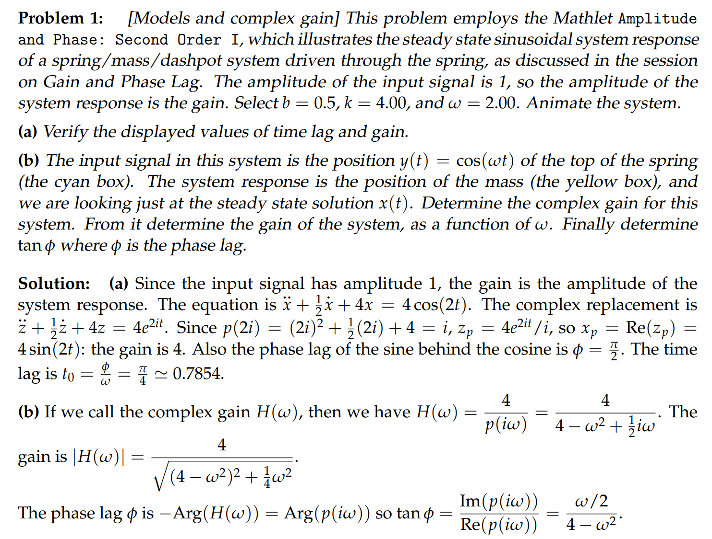
### 

