# 1 RLC电路
## 1.1 定义
> 包含了电阻(`Resistor`), 电感(`Inductor(L)`)和电容(`Capacitor`)的闭合回路, 如下图所示:

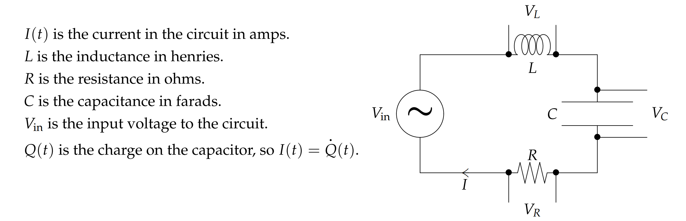
> 这里定义了物理量之间的关系，我们了解即可：
> 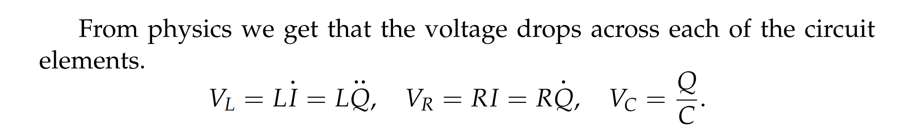
> 为了得到微分方程模型，这里运用了基尔霍夫电压定律,: **绕着闭合回路一圈的电压下降等于电动势的大小**
> $V_{in} = V_{L}+V_{R}+V_{C}$

## 1.2 模型建立
### 1.2.1 模型方程
> 我们通过基尔霍夫电压定律得到了四个等价的线性微分方程

> 其中,$(3)$就好比是弹簧驱动的机械振动系统，$(4)$就好比是活塞驱动的机械振动系统

### 
### 1.2.2 模型参数规范
:::info
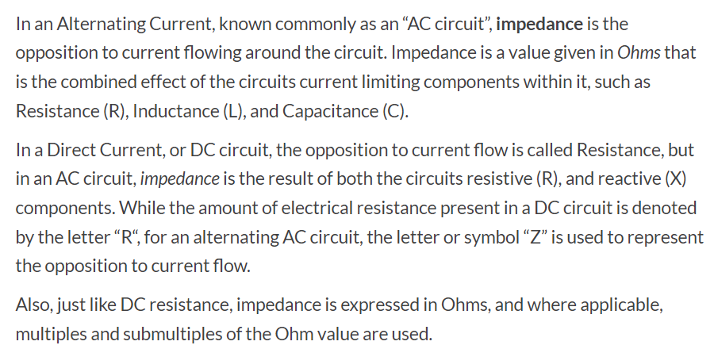
直流电中我们的电阻用$R$表示，但在交流电路中我们的电阻用$Z$表示， 详见
[Complex Impedance](http://hyperphysics.phy-astr.gsu.edu/hbase/electric/impcom.html)
:::
> `**Complex Replacement**`: 用$\tilde{x}$表示,  其中$\tilde{x}是x的复数表达形式$; 换句话说，如果$x=3$,那么$\tilde{x} = 3+0i$ 
> `**Complex Impedance**`: 在`AC`电路中使用
> 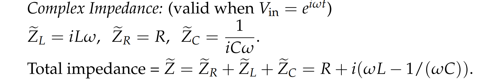
> `**Complex Ohm's Law**`: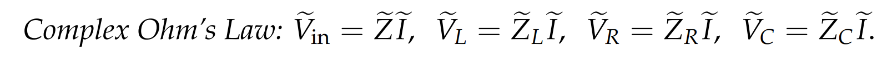
> `**Phasor**`**:**
> 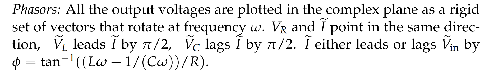
> `**Reactance**`: 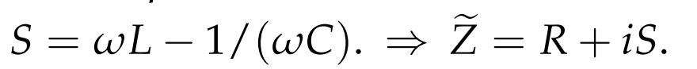
> `**Real Impedance**`:
> 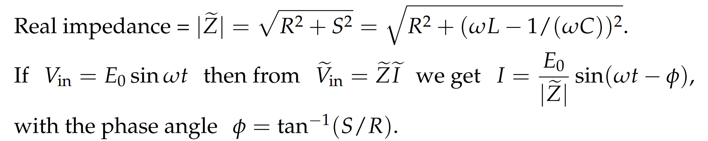
> `**Practical Resonance**`:

### 欧姆定律
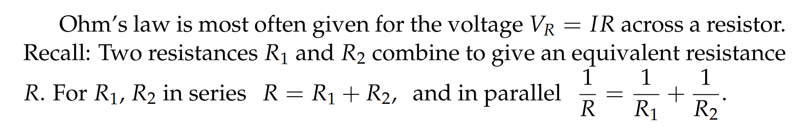

# 2 模型参数深入**⭐**
## 2.1 Simple Complex Arithmetic Fact
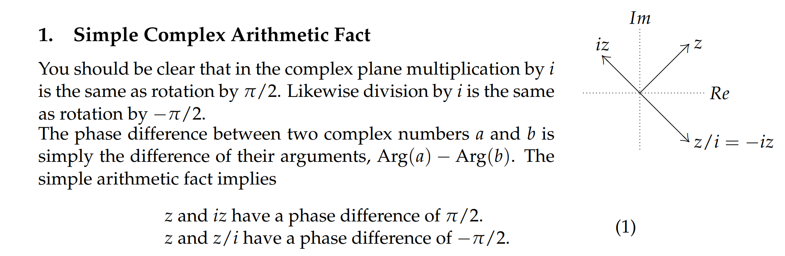

## 2.2 Complex Impedance
:::info
在`1.2.1`中，我们给出了`RLC`电路的四个微分方程，现在我们着重探讨$(2)和(3)$
$L\ddot{Q}+R\dot{Q}+\frac{1}{C}Q=V_{in}..........................................................(2)$
$L\ddot{I}+R\dot{I}+\frac{1}{C}Q = \dot{V_{in}}............................................................(3)$
:::
:::success
我们假设输入是交流电，假设$V_{in} = V_{0}sin(wt), \therefore \dot{V_{in}}=V_{0}wcos(wt)$
接着我们对$(3)$进行复数化操作: $L\tilde{I}''+R\tilde{I}'+\frac{1}{C}\tilde{I} = iV_{0}w(cos(wt)+isin(wt)) = iV_{0}we^{iwt}$
根据之前求解**以三角函数为输入**的微分方程的经验，我们知道$I = Im(\tilde{I})$
:::
:::warning
对这个$L\tilde{I}''+R\tilde{I}'+\frac{1}{C}\tilde{I} =  iV_{0}we^{iwt}$微分方程：
特征方程: $p(s)=Ls^2+Rs+\frac{1}{C}$,$\tilde{I} = \frac{iV_0we^{iwt}}{p(iw)}$
`Complex Gain`: $H(w)=\frac{iw}{p(iw)}=\frac{1}{iLw+\frac{1}{iCw}+R}$
`Complex Impedance`: $\tilde{Z} = iLw+\frac{1}{iCw}+R$
在直流电下，我们有$R_R,R_L,R_C$, 分别代表电阻，电感电阻，和电容电阻
而在交流电下，我们让$\tilde{Z}_{R} = R, \tilde{Z}_{L}= iLw, \tilde{Z}_C = \frac{1}{iCw}$, 同时我们的欧姆定律依旧成立:
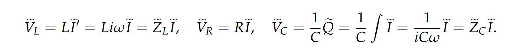
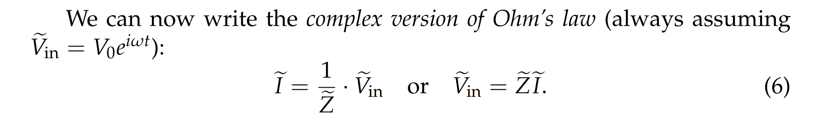
:::

## 2.3 Impedence In Parallel
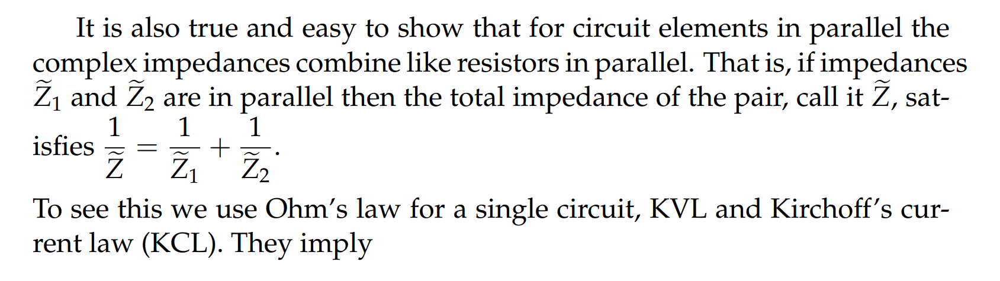
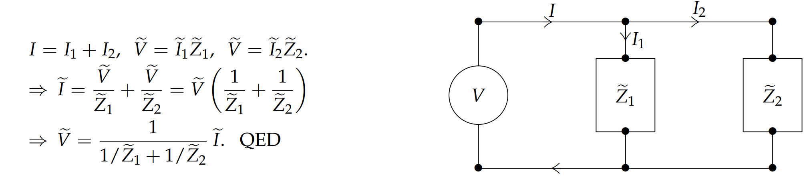

## 2.4 Amplitude-Phase Form and Real Impedance
### Reactance
> 我们对$\tilde{Z} = iLw+\frac{1}{iCw}+R$进行变形: 
> $\tilde{Z} = iLw+\frac{1}{iCw}+R = i(Lw-\frac{1}{Cw})+R=iS+R$
> **我们令**$S = Lw-\frac{1}{Cw}$**,称之为**`**Reactance**`
> **当**$S=0$**的时候，我们有**$w^2=\frac{1}{LC}$**,这个**$w$**我们在**`**2.6**`**中会详细介绍**

### Real Impedance
:::success
我们将$\tilde{Z} = iLw+\frac{1}{iCw}+R=iS+R$写成$\tilde{Z}=|\tilde{Z}|e^{i\phi}=\sqrt{S^2+R^2}e^{i\phi}, \phi=Arg(\tilde{Z})=tan^{-1}(\frac{S}{R}),\phi\in[-\frac{\pi}{2},\frac{\pi}{2}]$
同时$\tilde{I} = \frac{iV_0we^{iwt}}{p(iw)}=\frac{V_0e^{iwt}}{iLw+\frac{1}{iCw}+R} =  \frac{V_0e^{iwt}}{i(Lw-\frac{1}{Cw})+R} = \frac{V_0e^{iwt}}{\tilde{Z}}= \frac{V_0e^{iwt}}{\sqrt{S^2+R^2}e^{i\phi}}=\frac{V_0e^{i(wt-\phi)}}{\sqrt{S^2+R^2}},\newline \therefore I = Im(\tilde{I})=\frac{V_0sin(wt-\phi)}{\tilde{Z}}=\frac{V_0sin(wt-\phi)}{\sqrt{S^2+R^2}}\newline \therefore I|\tilde{Z}|=V_0sin(wt-\phi)$
注意到$I|\tilde{Z}|=V_0sin(wt-\phi)$和交流电欧姆定律$\tilde{I}\tilde{Z}=V_0e^{iwt}$很像,只是有$\phi$的`phase shift`
这里，$|\tilde{Z}|=\sqrt{S^2+R^2}$被称为`**Real Impedance**`
:::

## 2.5 Phasors
:::success
$\tilde{V}_{L}=\tilde{Z}_{L}\tilde{I}=Liw\tilde{I},\space \tilde{V}_{R}=R\tilde{I},\space \tilde{V}_{C}=\tilde{Z}_{C}\tilde{I}=\frac{1}{iCw}\tilde{I}$**, 这里**$\tilde{V}_{L}, \tilde{V}_{R}, \tilde{V}_{C}$**都算是**`**Phasors**`
同时我们注意到, $\tilde{V}_{L}, \tilde{V}_{C}$和$\tilde{V}_{R}$相差了一个`factor`$i$，由`2.1`中介绍的可知:

1. The phasors $\tilde{V}_{L}$and $\tilde{V}_{C}$ are respectively $π/2$ ahead and $π/2$ behind $\tilde{V}_{R}$.
2. The phasor $\tilde{V}_{R}$ is $\phi$ behind $\tilde{V_{in}}$(if $\phi$ is negative then $\tilde{V}_{R}$ is ahead of $\tilde{V_{in}}$.

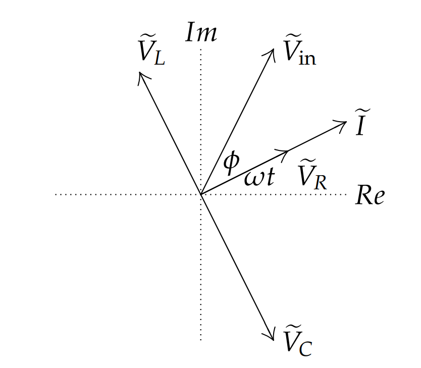
:::

## 2.6 Amplitude Response and Practical Resonance
> 由$L\ddot{I}+R\dot{I}+\frac{1}{C}Q = \dot{V_{in}}$我们知道，这个`RLC`系统的自然频率`Natural Frequency`是$w_{0}=\frac{1}{\sqrt{LC}},
这里的单位是L(Henry),C(Farad),w(rad/sec)$
> 同时由上文我们知道，这个系统在$V_{in}=V_0sin(wt)$时, $\tilde{I}= \frac{V_0e^{iwt}}{i(Lw-\frac{1}{Cw})+R},S = Lw-\frac{1}{Cw}$
> 所以$|\tilde{I}|=\frac{V_0}{\sqrt{(Lw-\frac{1}{Cw})^2+R^2}}$, 当$S=0$的时候，$|\tilde{I}|$取到最大值，也就是我们的`Amplitude Response`取到了最大值，**从前文我们知道, 此时的**`**Input frequency**`$w$**就是我们的**`**Practical Resonance Frequency**`** **
> 此时: $i(Lw-\frac{1}{Cw})=0,\tilde{Z}_{L}+\tilde{Z}_C=0, \newline \therefore \tilde{Z}=R, \tilde{I}=\frac{V_0}{R}e^{iwt}$
> 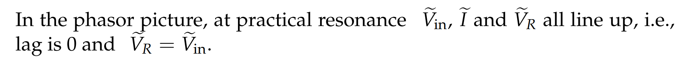
> 如下图所示，$w=\frac{1}{\sqrt{LC}}$时，$V_R,V_L,V_C,V_{in}$之间的相位关系关系如图所示: 
> **如果两个**`**response**`**之间的相位差是**`**0**`**, 我们称这两个**`**response**`**是**`**in phase**`**的**
> **如果两个**`**response**`**之间的相位差是**`**180度**`**, 我们称这两个**`**response**`**是**`**antiphase**`**的**

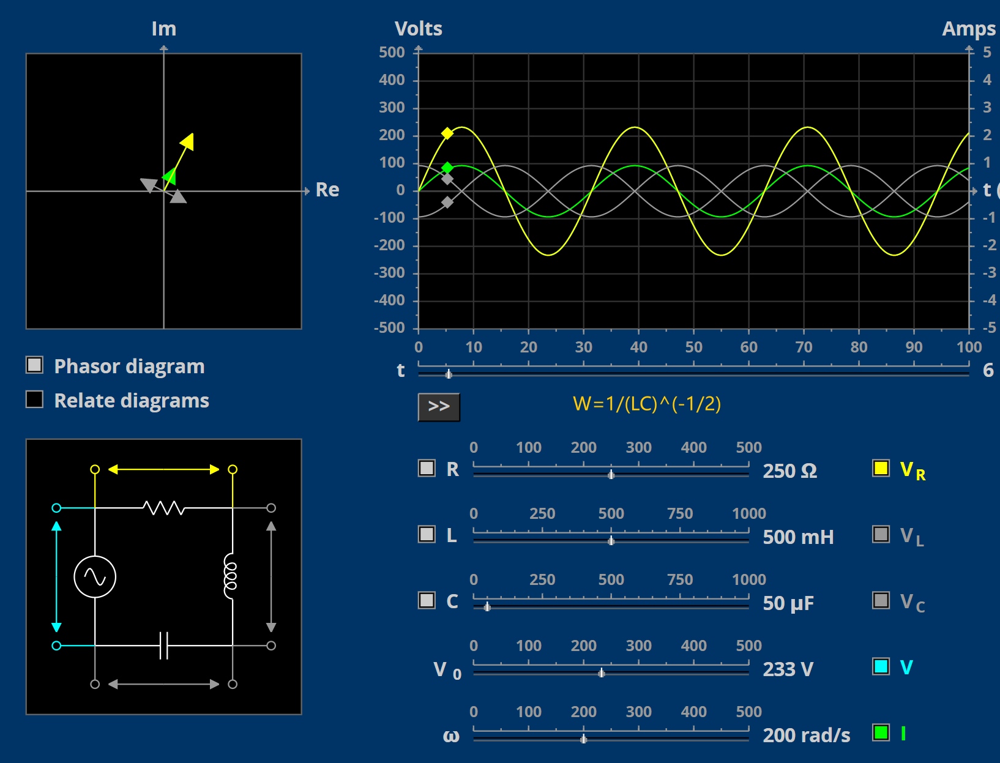

# 3 练习
[Applets](https://ocw.mit.edu/ans7870/18/18.03SC/seriesRLCCircuit.html)
[Problems and Solutions](https://ocw.mit.edu/courses/18-03sc-differential-equations-fall-2011/3cacbde6e024e8557b5d58420ed5544c_MIT18_03SCF11_ps5_II_s20s.pdf)

