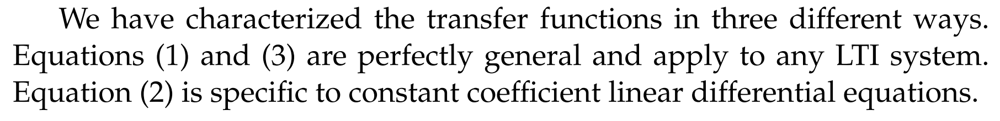
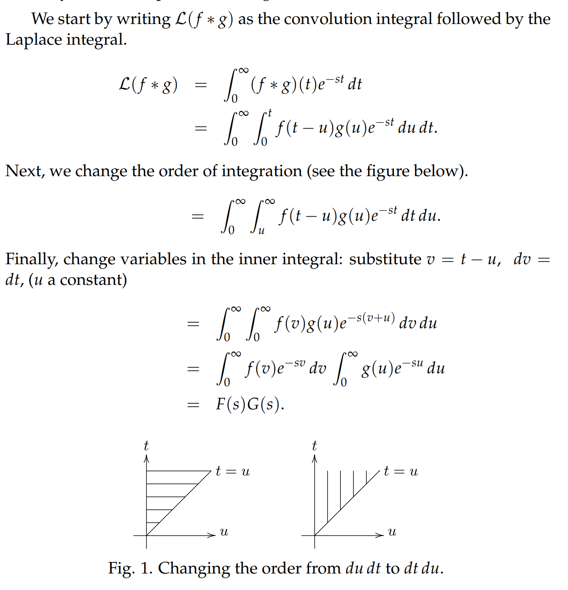
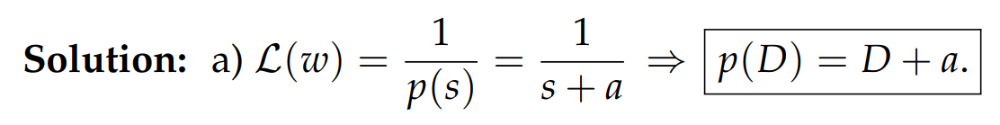
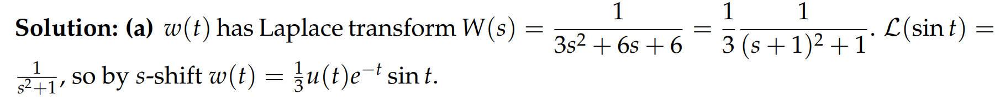

[Transfer and Weight Functions, Green Formula.pdf](https://www.yuque.com/attachments/yuque/0/2022/pdf/12393765/1659239859851-b5505a76-e571-49cd-aa77-2693b5bf0f62.pdf)
# 1 简介
## 1.1 什么是转移函数
> 本小节我们将介绍转移函数，也叫`System Function`, 对于一个$p(D)x=f(t)$的线性微分方程，转移方程一般就是$\frac{1}{p(s)}$, $p(r)$是特征方程
> $p(D)$包含了所有关于微分方程系统的信息，比如说`Stability`,`Oscillatory Behaviors`和`Resonant Frequencies`等，但是光看$p(D)$根本看不出这些。
> 转移函数$\bf W(s)=\frac{1}{p(s)}$也包含了线性微分方程$p(D)x=f(t)$的全部信息, 换句话说，如果我们知道了转移函数$\bf W(s)$, 我们也就知道了多项式$p(D)$, 所以转移函数包含了$p(D)$的信息。

## 1.2 转移函数的优点
> 
> **这里尤其注意第一条，**`**Transfer Function**`**能描述所有的**`**LTI Systems**`**, 不是所有的**`**LTI System**`**都来自形如**$p(D)x=f(t)$**的线性微分方程**

# 2 拉普拉斯转换表(V.3)
[Laplace Transform Table V3.pdf](https://www.yuque.com/attachments/yuque/0/2022/pdf/12393765/1659240688979-992aafbf-e777-4a5c-baab-10db5789df44.pdf)

# 3 转移函数
[The Transfer Function.pdf](https://www.yuque.com/attachments/yuque/0/2022/pdf/12393765/1659240722583-12265f3a-a127-4bb3-b886-5c5fcd83a10b.pdf)

## 3.1 定义
> 
> 也就是说，我们要想找到一个`LTI System`$p(D)x=f(t)$的`Transfer Function`, 我们只要找到这个系统的`Unit Impulse Response`, 也就是$p(D)x=\delta(t)$的解$w(t)$, 然后带入系统, 得到$p(D)w(t)=\delta(t)$, 之后两边使用拉普拉斯转换，得到的$W(s)=\mathcal{L}(w(t))$
> 这里的$W(s)$就是我们要找的`Transfer Function`

## 3.2 Examples
> 

## 3.3 Weight Function and System Function
> `**Weight Function**`: 一般就是`UNIT Impulse Response`
> `**System Function**`: 一般就是`Transfer Function`
> 

## 3.4 Formula for W(s)
### Formula
> 
> 分子式$1$, 分母是多项式，我们推测输入就是$f(t)$， 没有被修改过。

### Example 1
> 本章将介绍如何得到`Transfer Function`, 下面给出一个例子帮助说明公式：
> 
> 
> 能够得到和`Characteristic Equation`如此相似的表达式，原因就是我们的`Rest IC`, 有$w(0^-),\dot{w}(0^-)=0,...,w^{(n)}(0^-)=0$，将左侧拉普拉斯转换中的相应项都消去了。

### Example 2
> 

## 3.5 Transfer Function Characterization
> 
> 注意，这里的输入就是$f(t)$，没有求导；如果求导了，上面的公式的形式就变了
> 假设$\mathcal{L}f=F(s)$, 则如果输入是$f(t)$， 但是右侧是$\dot{f}(t)$, 则$\mathcal{Lf'}=sF(s)-f(0^-)$
> 由于`Rest IC`, 我们能去除所有的诸如$x(0^-)=0,\dot{x}(0^-)=0,...,x^{(n)}(0^-)=0$的项，所以左侧变为$p(s)X(s)$
> **综上，我们的**$p(D)x=f(t)$**在经过左右两侧的拉普拉斯转换后变成了**$p(s)X(s)=s(F(s)-f(0^-))$
> 所以$X(s)=s\frac{1}{p(s)}(F(s)-f(0^-))=sW(s)(F(s)-f(0^-))$
> 所以$W(s)=\frac{X(s)}{sF(s)-f(0^-)}$, 和上面的结果不一样。

## 3.6 总结
> 

## 3.7 Quizzes
### Q1: Transfer Function
> 

**Key**
由于$W(s)$的分子是$1$，所以`Transfer Function`对应的系统是一个线性微分方程$(D^2+5D+6I)x=f(t)$, 也就是能直接得到$p(D)$

### Q2: Not Exists?
> 

**Key**
由于$W(s)$的分子不是$1$，所以输入函数有可能被修改了。也就是$f(t)$不是我们的输入函数，输入函数可能是$f(t)=kg(t)$中的$g(t)$
注意，这里只是说不存在$p(D)$, 但没有说不存在`LTI System`满足$W(s)=\frac{s}{s^2+1}$
 

# 4 Modified Input
[Modified Input.pdf](https://www.yuque.com/attachments/yuque/0/2022/pdf/12393765/1659255352894-cc7aca21-3e95-4676-a62e-63c3991c212b.pdf)
> 回忆一下，我们最初介绍微分方程系统$p(D)t=f(t)$的输入的时候，右侧的输入是$f(t)$
> 但是当微分方程变为$p(D)t=\dot{f}(t)$时，我们不能说输入是$\dot{f}(t)$, 而是应该说$f(t)$
> **所以，对于**$p(D)t=f(t)$**的系统，右侧的**$f(t)$**不总是我们所说的输入， 也可能是**`**Modified Version Of the Input**`**.**

## Diffusion Equation
> 
> 这里我们就不会说$kT_e(t)$是系统的输入，而是说$T_e(t)$是系统的输入
> 其实一个系统的输入视我们的观测对象而定。

**Key**
这里我们发现$W(s)$的分子不是$1$, 所以输入经过了修改。不是$p(D)x=f(t)$中的$f(t)$

## LC Circuit
> 

**Key**

# 5 Green's Formula和卷积
[Green's Formula, Laplace Transform of Convolution.pdf](https://www.yuque.com/attachments/yuque/0/2022/pdf/12393765/1659255577416-3f79adfd-0a68-449f-a2a7-0cc2f04b2ac3.pdf)

## 5.1 Green 的时间/频率视角⭐
> 
> `Green's Formula`在时间空间和频率空间都有定义

## 5.2 卷积的时间和频率转换
> 

## 5.3 卷积的频率空间证明⭐⭐⭐
> 在`5.2`中我们了解到$\mathcal{L}(f*g)=F(s)G(s)$, 其中$f(t) \rightsquigarrow F(s)$, $g(t)\rightsquigarrow G(s)$
> **这个公式告诉我们实际上在时间空间中卷积是一种积分，也可以说是**`**Weight Sum**`**, 但在频率空间中卷积是一个乘积**
> 本小节中我们将证明这个公式:
> 

## 5.4 积分规则⭐⭐
> 1. **Intuition:**
> 
在拉普拉斯转换中，假如我们有$\mathcal{L}f(t)=G(s)$
> $f(t)$作为时间空间的函数，$G(s)$作为频率空间的函数, 也就是拉普拉斯转换后的函数
> - $f^{(n)}(t)\rightsquigarrow s^{n}G(s)+...$也就是**时间空间函数的导数会导致频率空间函数扩大**$s$**倍**
> - $\int_{0^-}^{t^+}f(\tau) d\tau \rightsquigarrow
\frac{G(s)}{s^{n}}+...$也就是**时间空间函数的积分会导致频率空间的函数缩小**$s$**倍。**
> 

> 2. **Integration Rules:**
> 

> 

# 6 Block Diagrams(opt.)
[Block Diagrams.pdf](https://www.yuque.com/attachments/yuque/0/2022/pdf/12393765/1659255790467-2229c974-5e45-475b-b6f5-95b1a02516db.pdf)
> 本小节我们介绍`Block Diagrams`, 一个非常有用的对系统输入输出的抽象图。
> **以下所有的讨论都是在频率空间进行， 包括系统的输入，我们用**$F(s)$**表示， 输出用**$X(s)$**表示。**

## 6.1 Block Diagrams⭐⭐
> 这个例子诠释了`Block Diagrams`的作用
> `Block Diagram`其实可以理解为一个转移矩阵，如果输入是$F$, 那么输出是$X=WF$
> 
> $F(s)$作为$p(D)x=f(t)$在频率空间的输入，$X(s)$就是在频率空间的输出

## 6.2 Cascading Systems
> `Cascading Systems`简单理解就是有两个彼此连接的系统，系统一的输出作为系统二的输入。

> 
> 

## 6.3 Parallel Systems
> `Parallel Systems`其实就是两个系统接收同一个输入

> 
> 
> 这里明显有线性代数的思想在里面，比如$X_1=W_1F$,$X_2=W_2F$`LTI System`的转换。
> $W_1$和$W_2$就代表了两个不同的`LTI`系统，通过$W_1$和$W_2$我们可以知道关于各自系统的一些基本信息。

## 6.4 Feedback Loops⭐⭐⭐
### Definition
> `FeedBack Loops`非常的重要，在计算机中，我们的加法运算器就是有`Feedback Loops`的思想在里面的，具体的介绍在操作系统的前置知识中
> 
> 这就是一个`Feedback Loop`, 输出被记录下来回去和新的输入叠加，所以上述的`Feedback Loop`实现了数字的循环累加。

### Black's Formula
> `**Black's Formula**`**给出了一个**`**Feedback Loop**`**系统的**`**output/input**`**的公式。**

> 

### Example
> 
> 

# 7 Problems
[Problem Set 1.pdf](https://www.yuque.com/attachments/yuque/0/2022/pdf/12393765/1659259868557-f967ebea-ac3a-4788-a1a0-e4151804cfa3.pdf)
[Problem Set 2.pdf](https://www.yuque.com/attachments/yuque/0/2022/pdf/12393765/1659259868566-1f4746f9-f20f-4d6b-922e-2746bd92d157.pdf)

:::info

:::

## P1 使用Transfer Function
:::info

:::
**(a)**
**(b)**
**(c)**

## P2 System Function and Weight Function
:::info

:::
**(a)**
**(b)**
**(c)**

## P3 Partial Fractions
:::info

:::
**(a)**
**(b)**
