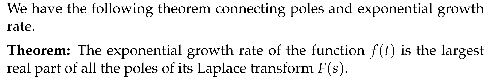
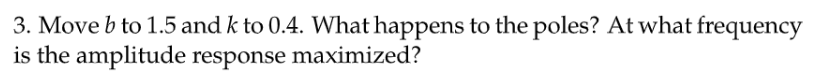
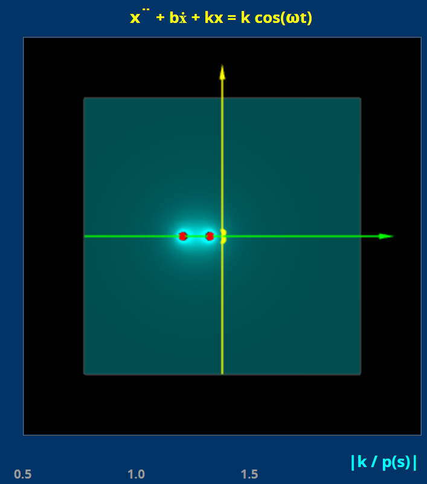
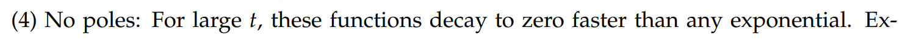
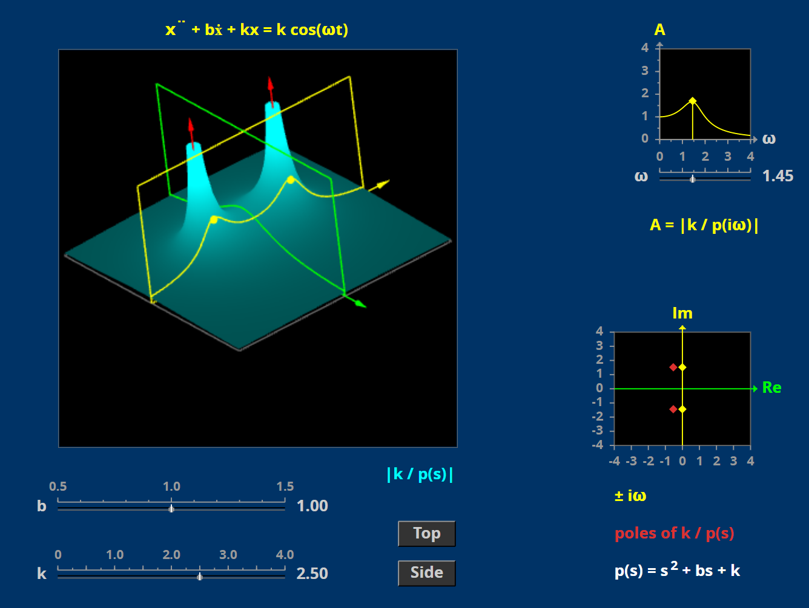

[Poles Diagram V2.pdf](https://www.yuque.com/attachments/yuque/0/2022/pdf/12393765/1659501935627-b856e1c6-4451-475c-8851-27c300b55338.pdf)
# 0 前言
[Poles, Amplitude Response, Connection to ERF.pdf](https://www.yuque.com/attachments/yuque/0/2022/pdf/12393765/1659261816037-60766d20-58f2-4cbd-8d1b-54f714621c38.pdf)
:::info
对于我们的$p(D)x=f$

- `Transfer function`是$W(s)=\frac{1}{p(s)}$
- `Poles`是特征多项式$p(s)=0$的根

**为什么我们要搞出一个**`**Poles**`**的概念呢？**

- 我们之前学过的其中一类`LTI System`就是`Constant Coefficient Linear ODE's`，它有所谓的特征多项式$p(s)$, 特征多项式的根成为`Characteristic Roots`
- 但并不是所有的`LTI System`都有特征多项式$p(s)$的，对于这些系统来说，我们使用`Poles of the transfer function`来描述类似于`Characteristic Roots`的概念

之前单元的学习我们主要聚焦于形如$p(D)x=f(t)$的`LTI System`
在`Unit 1`和`Unit 2`中，我们看到了`Characteristic Polynomial`能够用于计算出系统的`Stability`和`Amplitude Response`:$g(w)=\frac{1}{|p(iw)|}$
在`Unit 3`中，我们学习了拉普拉斯变换，如果我们把$f(t)$认为是输入，$x(t)$认为是系统的输出， `Transfer Function`是$W(s)=\frac{1}{p(s)}$, 也是由特征多项式决定的。
在本章节中，我们将要学习`LTI System`的`Poles`和`Pole Diagram`， 这个概念将我们之前学的`Stability`,`Amplitude Response`,`Transfer Function`都放入一个复平面中.
我们可以选择用`Pole Diagram`来图示一个系统的很多重要性质。
**下面是一些**`**Pole Diagram**`**的优点:**

:::
# 1 Definition of Poles
[Definition of Poles.pdf](https://www.yuque.com/attachments/yuque/0/2022/pdf/12393765/1659261816033-cc7ca12e-4c1c-4461-b8ca-002e6db73ce3.pdf)
## 1.1 简介
:::info
本小节我们将学习`Poles`的定义和`Poles Diagram`所蕴含的关于`LTI System`的各种意义。
:::

## 1.2 有理函数
:::info
有理函数定义为$\frac{q(s)}{p(s)}$

如果分子$q(s)$和分母$p(s)$没有公因子，则我们称$\frac{q(s)}{p(s)}$是`Reduced Form`

:::

## 1.3 Poles
:::info
对于一个最简的有理函数$\frac{q(s)}{p(s)}$,`Poles`被定义为使得$p(s)=0$的$s$, 也就是让有理函数未定义的$s$的取值

:::

## 1.4 Graphs Near Poles
### 1.4.1 二维图像
:::info
我们以$F_1(s)=\frac{1}{s}$和$F_2(s)=\frac{1}{s^2-4}$为例，$s$在**实数域**中
我们先画出$|F_1(s)|$和$|F_2(s)|$, 因为画出$|F(s)|$和画出$F(s)$能够提供给我们的信息一样多。
:::
> 
> 

### 1.4.2 三维图像
> $F_1(s)=\frac{1}{s}$和$F_2(s)=\frac{1}{s^2-4}$,$s$在**复数域**中
> 和之前一样，我们分别画出$|F_1(s)|$和$|F_2(s)|$

:::info

$|F(s)|$在$s$趋近于`Poles`的时候值无限大。
:::

## 1.5 指数增长率**⭐⭐**
### 1.5.1 概述
:::info
在`Unit 1.2`中我们介绍了最基础的微分方程$\dot{x}=kx$, 我们能够使用`Separation of Variables`或者`Integrating Factors`求出`General Solution`$x(t)=Ce^{kt}$，这里的$k$被称为指数增长率
对于一般的函数$f(t)$,如果$f_1(t)=e^{at},a>0$, 则$f_1(t)\to \infty,t\to \infty$; 相似的，$f_2(t)=e^{at}sin(bt)$的振幅随着时间增大而趋近于正无穷
我们称$f_1(t)$和$f_2(t)$中的$a$为函数的指数增长率(`Exponential Grwoth Rate`)
:::

### 1.5.2 定义
:::info

:::

## 1.6 Poles 和指数增长率 **⭐⭐**
:::info

:::
> 

:::warning

:::

## 1.7 Cases of no poles**⭐⭐**
> 
> 形如$e^{-as}$的乘子不会带来新的`Poles`
> 下面我们给出一些例子帮助理解

### Example 1
>  If$f(t) = 0$ for $t > A$ , then the improper integral $F(s) = \int_{0-}^A e^{-st} f(t) dt$isn't so improper. 这个积分对于所有的$s$都收敛, 同时$F(s)=C$, 没有`Poles`

### Example 2
> 假设我们有$f(t)\rightsquigarrow F(s)$, 则$u(t-a)f(t-a)\rightsquigarrow e^{-as}F(s)$
> 由于$e^{as}>0,\forall s$也就是说$e^{-as}$没有`Poles`, 于是$f(t)$在向右平移了$a$个时间单位之后得到的`Poles Diagram`和之前一样
> 所以我们得到:  `Time translation of f(t) doesn't affect the pole diagram of F(s) . So the pole diagram can't see phase.  `

# 2 Pole Diagrams**⭐⭐⭐⭐**
[Pole Diagrams.pdf](https://www.yuque.com/attachments/yuque/0/2022/pdf/12393765/1659261816018-0cce4d18-a1c5-4a7d-b550-798f46eb3ecc.pdf)
> `Pole Diagram`上的`Poles` 可以告诉我们有关函数$f(t)$的`Long-term behaviors`的信息，比如指数增长率和`Oscillation Frequency`的信息

## 2.1 定义
> 

## 2.2 算例
### 例1
> 

### 例2
> 
> 

### 例3
> 

**Key**

## 2.3 Pole Diagram for an LTI System
### 2.3.1 定义
> 

### 2.3.2 算例
#### 例1
> 
> 

**Key**
标准的`Unmodified Input`， 直接使用公式$W(s)=\frac{1}{p(s)}$得到。

#### 例2
> 

**Key**
这里求`Transfer Function`的方法是使用`Unit 3.10.4`中的$W(s)=\frac{I(s)}{O(s)}$, 也就是$\frac{\mathcal{L}(input)}{\mathcal{L}(output)}$(并且假设输入和输出都是`Rest IC`的情况下)

# 3 Poles and Stability**⭐⭐**
[Poles and Stability.pdf](https://www.yuque.com/attachments/yuque/0/2022/pdf/12393765/1659261816044-5612d691-dfdc-477c-a1d9-27f9ebe386c9.pdf)
## 3.1 Stability Recap
### 3.1.1 LTI System
> **对于一个**`**LTI**`**系统，我们有:**
> 
> **他的齐次方程是:**
> 

### 3.1.2 Stability Criteria
:::success
在`Unit 3.0x`中我们有复习过`Stable Solutions`的定义，说的是齐次解在$t\to \infty$的时候趋近于零，这里我们使用`Poles Diagram`来重新解释这个现象。
:::
> 

### 3.1.3 算例
:::success

:::

# 4 Poles and Amplitude Response**⭐⭐**
[Poles and Amplitude Response.pdf](https://www.yuque.com/attachments/yuque/0/2022/pdf/12393765/1659261816035-54da88ce-60b8-43ef-a281-1d2abd455e07.pdf)
:::success
第`3`小节中我们介绍了`Poles`在判断**齐次方程解**的稳定性时候的作用
本小节将要介绍我们该如何从`Poles Diagram`中结合`Transfer Function`读出和`Practical Resonant Frequency`相关的信息,也就是判断**非齐次方程解**的最大值问题
:::

## 4.1 Poles**⭐⭐**
### 例1
> 

### 例2
> 
> 
> 要非常注意，这里我们通过图给出的$s$只是一个相对合理的估算，不是精确的解。

## 4.2 Amplitude Response**⭐⭐⭐⭐**
### 4.2.1 定义
:::success
本小节对`**Amplitude Response(Gain)**`**和**`**Transfer Function(System Function)**`进行一个简短的复习
**我们将通过**$W(s)$**来找到**`**Practical Resonant Freuqnecy**`**,在**`**4.2.2**`**中进一步说明。**
:::
> 
> 要非常注意，我们可以通过`Pole Diagram`给出$w$的合理的估算，不是精确的解。如果需要得到精确的解，还是需要对$|W(iw)|$进行最值分析，就像我们在`Unit 2.8.2`中做的那样。详见作业第二题。

### 4.2.2 算例
:::success

:::
**Key**

# 5 Poles 和 收敛区间**⭐⭐**
## 5.1 结论
> `Poles`的位置解释了拉普拉斯转换的收敛区间
> `**Theorem**: The region of convergence is the half plane to the right of the rightmost pole.`
> 换句话说就是假如我们求出的`Rightmost Pole`是$a+bi$, 它的收敛区间$Re(s)>a$

## 5.2 算例
### 算例1
> 假设$f(t)=1$, 则$F(s)=\int_{0^-}^{\infty}e^{-st}f(t)dt=\int_{0^-}^{\infty}e^{-st}dt=\frac{1}{s}$, 假设$s=a+bi$,则这个`Improper Integral`的收敛区间就是$Re(s)>0$, 而$F(s)$对应的`Pole Diagram`的`Pole`就是$s=0$, 所以由`5.1`中的定理，收敛区间是$Re(s)>0$
> 另一种理解方式: ` The value of F(s) at a pole is infinite; this reflects the divergence of the improper integral.  `

### 算例2
> 假设$f(t)=\frac{1}{2}e^{-t}sin(2t)$
> 1. **根据拉普拉斯转换表:**
> 
$F(s)=\frac{1}{(s+1)^2 + 4}$, `Poles`是$\{-1\pm2i\}$, `Rightmost Pole`是$-1+2i$, 收敛区间是$Re(s)>Re(-1+2i)=-1$
> 2. **根据拉普拉斯的定义: **
> 
$F(s)=\int_{0^-}^{\infty}e^{-st}f(t)dt=\int_{0^-}^{\infty}e^{-st}\frac{1}{2}e^{-t}sin(2t)dt=\frac{1}{2}Im(\int_{0^-}^{\infty}e^{-(s+1)t}e^{i\cdot2t}dt)$, 假设$s=a+bi$,则这个`Improper Integral`变为$\frac{1}{2}Im(\int_{0^-}^{\infty}e^{-(s+1)t}e^{i\cdot2t}dt)=\frac{1}{2}Im(\int_{0^-}^{\infty}e^{-(a+bi+1)t}e^{i\cdot2t}dt)=\frac{1}{2}Im(\int_{0^-}^{\infty}e^{-(a+1)t}e^{i\cdot2t-ibt}dt)=\frac{1}{2}Im(\int_{0^-}^{\infty}e^{-(a+1)t}e^{(2-b)it})dt)$
> 的收敛区间就是$a+1>0,a>-1$,也就是$Re(s)>-1$ 
> **于是我们可以通过**`**Rightmost Pole**`**的实数部分来判断收敛区间。**
> **另一种理解方式: **` The value of F(s) at a pole is infinite; this reflects the divergence of the improper integral.  `

# 6 Poles 和 Long Term Behaviors**⭐⭐**
## 6.1 最右侧的Poles
> `The rightmost poles give the dominant information.  `
> $F(s)$ 的位置信息暗示了很多关于$f(t)$的振动和增长率的信息 ,这些信息仅仅通过画$f(t)$的图书无法直接得出的 ( 因为毕竟拥有不同指数增长率的函数长得样子都差不多) 
> 当我们使用拉普拉斯转换解微分方程(通常是`Rest IC`的)时, 我们通常会对等式两侧求拉普拉斯转换求$X(s)$, 我们不妨停下来观察$X(s)$, 求它的`Poles`,我们就可以知道解的`Long Term Behaviors`了。

## 6.2 Examples
### Example 1
> 如果$f(t) =sin(2t)$,$F(s)=\frac{4}{s^2+4}$, 则我们的`Poles`是$\{2i,-2i\}$
> **然和有这样的**`**Poles**`**的函数**$f(t)$**具有以下性质:**
> 1. Oscillation with circular frequency $w=2$.
> 2. Neither exponential growth nor exponential decay.  
> 
**结合我们在**`**1.7**`**中的论断**: 
> 假如$g(t)=tf(t)$, 则$G(s)=\mathcal{L}(g(t))=\mathcal{L(tf(t))}=-F'(s)=\frac{4s}{(s^2+4)^2}$
> $G(s)$和$F(s)$有着相同的`Poles`, 但是这个函数的指数增长率是$1$, 这样印证了我们仅仅通过$F(s)$的`Poles`是不能判断函数是否被偏移过了，也就不一定能够得到正确的原函数的信息。

### Example 2
>  $f(t) = e^{-t} sin(2t)$ . $F(s) = \frac{2s}{(s+1)^2+4}$ has poles at $-1+2i$ and $-1-2i$ . Any $f(t)$ such that $F(s)$ has this pole diagram exhibits (for large $t$)  
> 1. Oscillation with circular frequency 2 
> 2. Exponential decay on the order of $e^{-t}$ .  

### Example 3
> $f(t) = 1 + e^{-t} sin(2t)$,$F(t) = 1 + \frac{2s}{(s+1)^2+4}$ , which has poles at $\{0 , -1+2i,-1-2i \}$ . 
> **Any f(t) such that F(s) has this pole diagram exhibits (for large t ) **
> 1. Sub-exponential growth/decay, (i.e. for any $a > 0 , e^{-at} < |f(t)| < e^{at}$) . 就是$e^{0t}$，增长率为$0$
> 2. Oscillation with circular frequency 2 but with amplitude decaying like $e^{-t}$ .  

# 7 Applet
[Guidance.pdf](https://www.yuque.com/attachments/yuque/0/2022/pdf/12393765/1659261876557-8fa923a9-78f1-479b-8495-9f9901fb0efd.pdf)
[https://ocw.mit.edu/ans7870/18/18.03SC/ampRespPoleDiagram.html](https://ocw.mit.edu/ans7870/18/18.03SC/ampRespPoleDiagram.html)

## Questions
> 

### Q1 
:::success

:::
Key

### Q2
:::success

:::
**Key**

### Q3
:::success

:::
**Key**

### Q4
:::success

:::
**Key**

# 8 Problems 
[Problem Set 1.pdf](https://www.yuque.com/attachments/yuque/0/2022/pdf/12393765/1659425300293-841f66da-5eb1-4017-b5d9-927a17629a6d.pdf)
[Problem Set 2.pdf](https://www.yuque.com/attachments/yuque/0/2022/pdf/12393765/1659425300304-c3e979c6-0fe4-4505-a773-a35d6b7936bb.pdf)
## P1 计算Pole Diagram表达式
> 

**(a)**
**(b)**
**(c)**

## P2 Pole Diagrams**⭐⭐⭐**
> 

**(a)**

其中$(4)$中使用了 `T-shift Rule`；结合本章中`1.6`中的定理，我们知道这类没有`Poles`的$f(t)$没有最大的`Real Part`, 所以增长率/衰减率会无限大，也就是会比任何指数阶函数都增长/衰减地快。所以记住**任何具有突变性质的函数都比指数阶函数增长的快，于是就没有**`**Poles**`**的存在**
**(b)**> 
> 方法一是观察法, 根据$(a)$问中对于形如$e^{-at}sin(bt)(a\geq 0,b\neq 0)$快速给出$s=a+bi$的方法来做的。
> 方法二就是传统的使用拉普拉斯转换通过$w(t)$求$W(s)$, 然后根据$p(s)=\frac{1}{W(s)}$的推论得出$p(D)$的表达式。

> 

:::warning

注意`Pole Diagram`的定义: 

所以这里的$\frac{3}{2}$仅仅是使得`Transfer Function`的绝对值$|W(s)|$取最大值的$s$,而不是我们本题中要求的`Practical Resonant Frequency`
我们要求的这个频率$w_r$, 必须求使得$|W(iw)|$最大的$w$的值。
方法就是`Unit 2.8.2`中介绍过的方法。

:::
:::info

**这幅图里蕴含了关于一个**`**LTI System**`**中的所有信息。**
输入频率$w$体现在图中的$Im$轴上，因为对于形如$kcos(wt)$的输入来说，我们会使用`Complex Replacement`将$kcos(wt)$转换成$ke^{iwt}$，此时我们为了求解`Gain(Amplitude Response)`的时候会使用$A=|\frac{k}{p(iw)}|$的公式, 也就是$A=\frac{k}{|p(iw)|}$, 也就是$A=k|W(iw)|$, 而$W(s)$正是我们的`Pole Diagram`。
由于我们在改变`Input Frequency`$w$的时候，**相当于**$iw$**在虚轴上自由滑动的过程**，所以**黄色的钻石店代表的就是我们选取的输入频率**$w$，这个频率的选取会影响我们的`Amplitude Response`.
**红色的钻石点**$s=a+bi$**可以在整个复平面上任意滑动**，我们第二问求出来的$\frac{1}{2}\pm \frac{3}{2}i$就是使得$|W(s)|$最大的$s$
**总结：**
我们在求一个形如$p(D)x=f(t)$,$f(t)=Bcos(wt)$的`LTI System`的时候，我们会去找他的齐次解(`Homogeneous Solutions`)和非齐次解(`Inhomogeneous Solutions`)

- 在寻找齐次解的时候，我们会计算$p(s)=0$的$s$,也就是使得$\frac{1}{p(s)}$趋近于正无穷的$s$,会利用到$\frac{1}{|p(s)|}$
- 在寻找非齐次解的时候，我们会计算$x_p=\frac{B}{|p(iw)|}cos(wt)$,也会利用到$\frac{1}{|p(s)|}$
- 于是我们对于这种`LTI System`抽象出所谓的`Transfer Function`, 定义为$W(s)=\frac{1}{p(s)}$(参考`Unit 3.10.3.4`), 然后将$|W(s)|=\frac{1}{|p(s)|}$的图称为`Pole Diagram`
- 因此从`Pole Diagram`上我们可以读出一个`LTI`系统的特征方程的解，一个`LTI`系统的`Practical Resonant Frequency(Damped Case)`
:::
