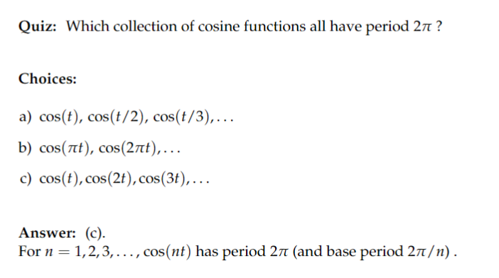
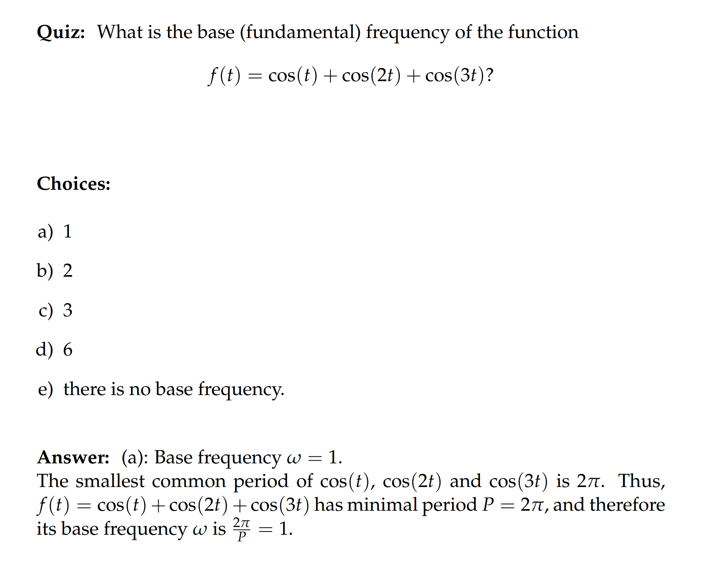
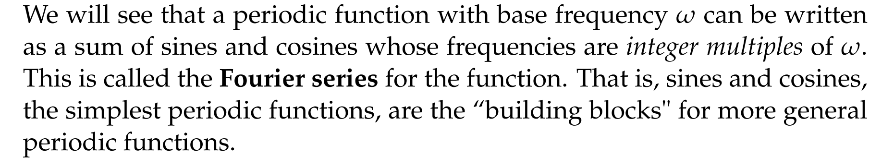
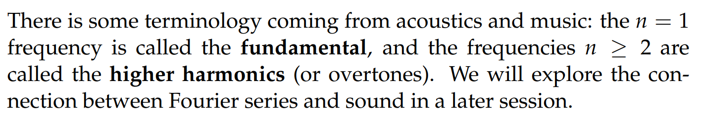
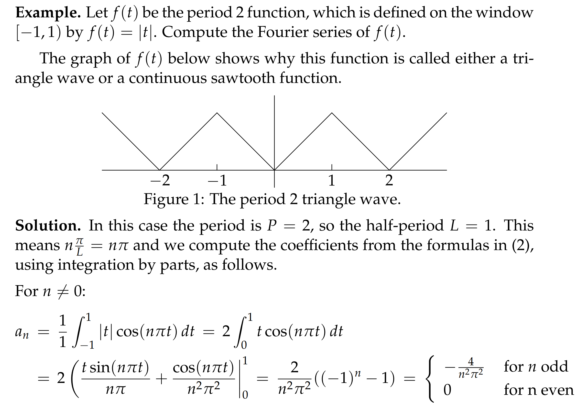
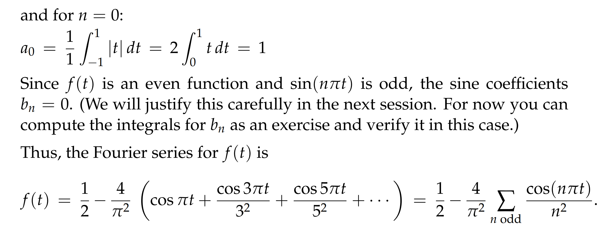
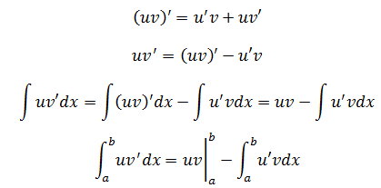

# 0 简介
[0_intro.pdf](https://www.yuque.com/attachments/yuque/0/2022/pdf/12393765/1657524613292-9ae4988a-4586-45ec-a62a-fe43900309b4.pdf)
:::success
傅里叶级数可以用于解`Inhomogeneous LTI DE`:$p(D)t = f(t)$
人体的内耳有一个细胞阵列结构和傅里叶级数的功能相仿，就是可以通过共振的方式来汲取出声波中的不同频率的波段
:::

# 1 周期函数
[1_周期函数.pdf](https://www.yuque.com/attachments/yuque/0/2022/pdf/12393765/1657524653491-69de608f-9209-4417-a3c5-666a2b01b03f.pdf)
:::success
一个函数$f(t)$是周期函数当$f(t + P) = f(t)\space \forall t, P>0$
`**Base Period**`: 就是**一个周期函数的最小周期,** **但对于**`**Constant Function**`**来说最小周期不存在**，这种情况下$P=0$,但一般我们不会让$P=0$,否则所有函数都满足周期函数的定义了，所以这是一个例外。

`**Window**`: 包含一个最小周期的区间, 如果周期函数的周期为$P$, 则$[-\frac{P}{2},\frac{P}{2}]$和$[0,P)$都可以成为`window`, 总之任何长度为$P$的区间都可以
`**Angular Frequency**`: 也叫作`Circular Frequency`, 单位是$radians/unit \space time$; $cos(wt)$中的$w$是`angular Frequency`, 但是一般也被叫做`Frequency`, 需要注意
`**Frequency**`: 单位是$cycles/unit \space time$, 因为一个`cycles`就是$2\pi \space radians$, 所以有这样的关系$angular frequency=2\pi\times frequency$
`**Base/Fundamental Angular Frequency**`: 就是在`Base Period`的情况下的`Angular Frequency` $w = \frac{2\pi}{P}$, 这里$P$是`Base Period`;

**注意: 多个周期函数相加的时候的周期是跟着周期最大的函数走的**
:::

# 2 傅里叶级数
[2_Fourier_Series_Definitions.pdf](https://www.yuque.com/attachments/yuque/0/2022/pdf/12393765/1657525734170-c7dd7ab6-1d8d-4ad9-9c2a-8b6579c1b042.pdf)
## 2.1 由来
> 

## 2.2 周期为`2pi`的傅里叶定理
### 定理
> 一个**周期为**$2\pi$**的函数**$f(t)$可以**近似表示**成:
> $f(t) \sim \frac{a_0}{2}+a_1cos(t)+a_2cos(2t)+a_3cos(3t)+...+b_1sin(t)+b_2sin(2t)+b_3sin(3t)+...\newline =\frac{a_0}{2}+\sum_{n=1}^{\infty}a_ncos(nt)+b_nsin(nt) ......................(1)$
> 其中$a_0 = \frac{1}{\pi}\int_{-\pi}^{\pi}f(t)dt,a_n=\frac{1}{\pi}\int_{-\pi}^{\pi}f(t)cos(nt)dt,b_n=\frac{1}{\pi}\int_{-\pi}^{\pi}f(t)sin(nt)dt................(2)$

:::success
$(1)$中的式子称为`**Fourier Series**`
$(2)$中的系数们成为`**Fourier Coefficients**`
:::
:::warning

:::

### 算例
[3_Fourier_Examples.pdf](https://www.yuque.com/attachments/yuque/0/2022/pdf/12393765/1657527918507-31fa4055-16c7-4d96-8be7-ac5a6f4e2eca.pdf)

## 2.3 周期为2L的傅里叶定理**⭐**
[4_Fouriers for Period 2L.pdf](https://www.yuque.com/attachments/yuque/0/2022/pdf/12393765/1657530774759-4715d74a-1898-428d-afcc-4ab3efb20dd1.pdf)

### 定理
> 一个**周期**$P=2L$**的函数**$f(t)$可以**近似表示**成:
> $f(t) \sim \frac{a_0}{2}+a_1cos(\frac{\pi}{L}t)+a_2cos(\frac{2\pi}{L}t)+a_3cos(\frac{3\pi}{L}t)+...+b_1sin(\frac{\pi}{L}t)+b_2sin(\frac{2\pi}{L}t)+b_3sin(\frac{3\pi}{L}t)+...\newline =\frac{a_0}{2}+\sum_{n=1}^{\infty}a_ncos(\frac{n\pi}{L}t)+b_nsin(\frac{n\pi}{L}t) ......................(1)$
> 其中$a_0 = \frac{1}{L}\int_{-L}^{L}f(t)dt,a_n=\frac{1}{L}\int_{-L}^{L}f(t)cos(n\frac{n\pi}{L}t)dt,b_n=\frac{1}{L}\int_{-L}^{L}f(t)sin(n\frac{n\pi}{L}t)dt................(2)$

:::success
`**Half-Period**`: $L=\frac{P}{2}$
:::

### 算例
> 
> 

# 3 函数垂直性关系⭐
[5_Orthogonal_Relations.pdf](https://www.yuque.com/attachments/yuque/0/2022/pdf/12393765/1657540622233-09a85c61-4c91-43b1-922c-873effb2bb70.pdf)

## 3.1 垂直性推导
:::success
这里我们探究的是不同三角函数是否`Orthogonal`的问题,我们先给出结论:
$\begin{equation} \frac{1}{L}\int_{-L}^{L}cos(n\frac{\pi}{L}t)cos(m\frac{\pi}{L}t)dt=
 \begin{cases} 1& n=m \neq0\\ 
      0&n \neq m\\
2&\text{n = m =0}\end{cases}

\end{equation}$
$\frac{1}{L}\int_{-L}^{L}cos(n\frac{\pi}{L}t)sin(m\frac{\pi}{L}t)dt=0 .............................(2)$
$\begin{equation} \frac{1}{L}\int_{-L}^{L}sin(n\frac{\pi}{L}t)sin(m\frac{\pi}{L}t)dt= \begin{cases} 1& n=m \neq 0\\ 0&n\neq m \\ \end{cases}\end{equation}...(3)$
:::
:::info
`**Proof**`**:**
**我们着重看**$(1)$**式和**$(3)$**式中的**$n \neq m$**的情况, 其余情况非常简单:**
我们可以使用`Complex Replacement`,`Trig Identity`证明, 也可以使用**微分方程证明**, 证明如下:
假设我们的微分方程是$u''+n^2u = 0$, 我们有$u'' = -n^2u$, 现在假设我们有两个三角函数$u_m,v_n$, $u_m = cos(mt)$,$v_n = cos(nt)$
我们观察下列推导:
 $\int_{-\pi}^{\pi}u_m''v_ndt=u_m'v_n\bigg|_{-\pi}^{\pi}-\int_{-\pi}^{\pi}u_m'v_n'dt=0(证明较难,跳过)-\int_{-\pi}^{\pi}u_m'v_n'dt=-\int_{-\pi}^{\pi}u_m'v_n'dt$
 $\int_{-\pi}^{\pi}u_m''v_ndt=-\int_{-\pi}^{\pi}u_m'v_n'dt=-n^2\int_{-\pi}^{\pi}u_mv_ndt...............(1)$
 $\int_{-\pi}^{\pi}u_mv_n''dt=-\int_{-\pi}^{\pi}u_m'v_n'dt=-m^2\int_{-\pi}^{\pi}u_mv_ndt..............(2)$
由于$(1)$和$(2)$相等, 我们有$\int_{-\pi}^{\pi}u_mv_ndt=0$的结论, 这也就证明了`Orthogonality Relations`中最难的部分了
:::

### 分部积分Recap

## 3.2 傅里叶系数推导
:::info
有了`**Orthogonality Relations**`之后, 我们可以推导出计算$a_n和b_n$的公式
假设我们有:$f(t)=.....a_kcos(kt)+...+a_ncos(nt)$
两边同时乘上$cos(nt)$: $f(t)cos(nt)=...a_kcos(kt)cos(nt)+...+a_ncos^2(nt)$
两边定积分: $\int_{-\pi}^{\pi}f(t)cos(nt)dt=...+a_k\int_{-\pi}^{\pi}cos(kt)cos(nt)dt+..+a_n\int_{-\pi}^{\pi}a_ncos^2(nt)dt\newline =0+...+0+...+a_n\pi$
我们有$a_{n} = \frac{1}{\pi}\int_{-\pi}^{\pi}f(t)cos(nt)dt,\space b_{n} = \frac{1}{\pi}\int_{-\pi}^{\pi}f(t)sin(nt)dt, \space n=1,2,3,...,n$,
:::
:::success
**为什么**`**Fourier Series**`**的第一项是**`**2**`?
假设$f(t)=c_{0}+...+a_ncos(nt)$
$\int_{-\pi}^{\pi}f(t)dt=2\pi c_0+...+\int_{-\pi}^{\pi}a_ncos(nt)dt = 2\pi c_0$
$c_0 = \frac{1}{2\pi}\int_{-\pi}^{\pi}f(t)dt$, 因为如果我们使用$a_{n} = \frac{1}{\pi}\int_{-\pi}^{\pi}f(t)cos(nt)dt$计算$a_0$的话,我们会得到$a_0=2c_0$, 所以我们的$f(t)$的`Fourier Series`的第一项必须是$\frac{a_0}{2}$, 其实是简化了我们的公式记忆, 最后可以统一我们$a_n，b_n$的计算公式在$n=0与n\neq 0$时候的不同表现
:::
 

# 4 练习题
[Practice_Problem.pdf](https://www.yuque.com/attachments/yuque/0/2022/pdf/12393765/1657542274700-2475a333-3b1a-4281-86fe-ad9338947a5e.pdf)
[Practice Problem Solutions.pdf](https://www.yuque.com/attachments/yuque/0/2022/pdf/12393765/1659510539238-2ed6dc72-42a8-4ccc-9e12-4181a0200a41.pdf)
[Problem Set 1.pdf](https://www.yuque.com/attachments/yuque/0/2022/pdf/12393765/1657542274738-cb52bfd8-4fcc-416b-8964-71bdaa18c731.pdf)
[Problem Set 2.pdf](https://www.yuque.com/attachments/yuque/0/2022/pdf/12393765/1657542274762-19c690b5-626a-484f-98cb-cf341527cc79.pdf)
**Applet**: [https://ocw.mit.edu/ans7870/18/18.03SC/fourierCoefficients.html](https://ocw.mit.edu/ans7870/18/18.03SC/fourierCoefficients.html)

