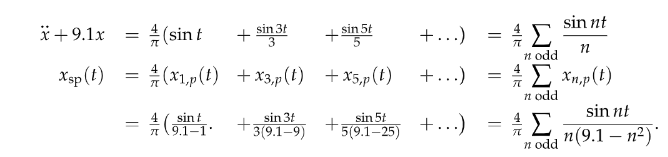
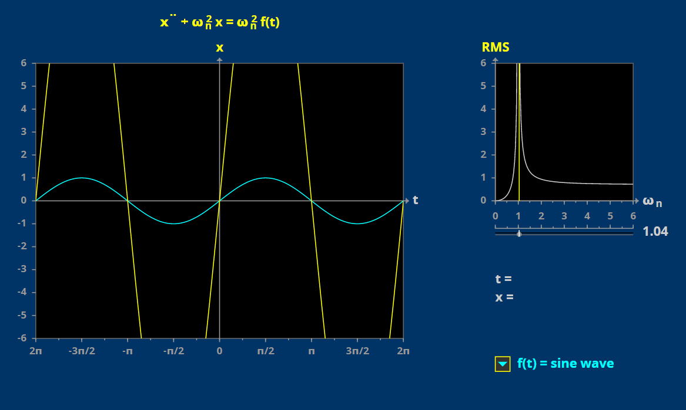
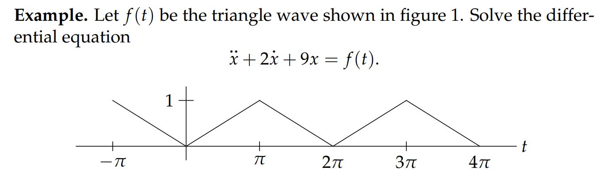
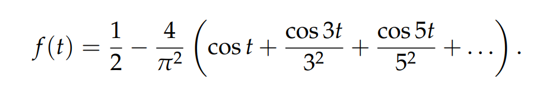
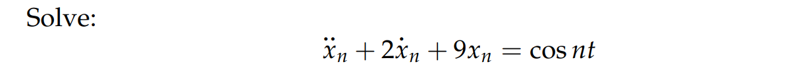
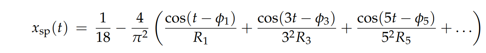
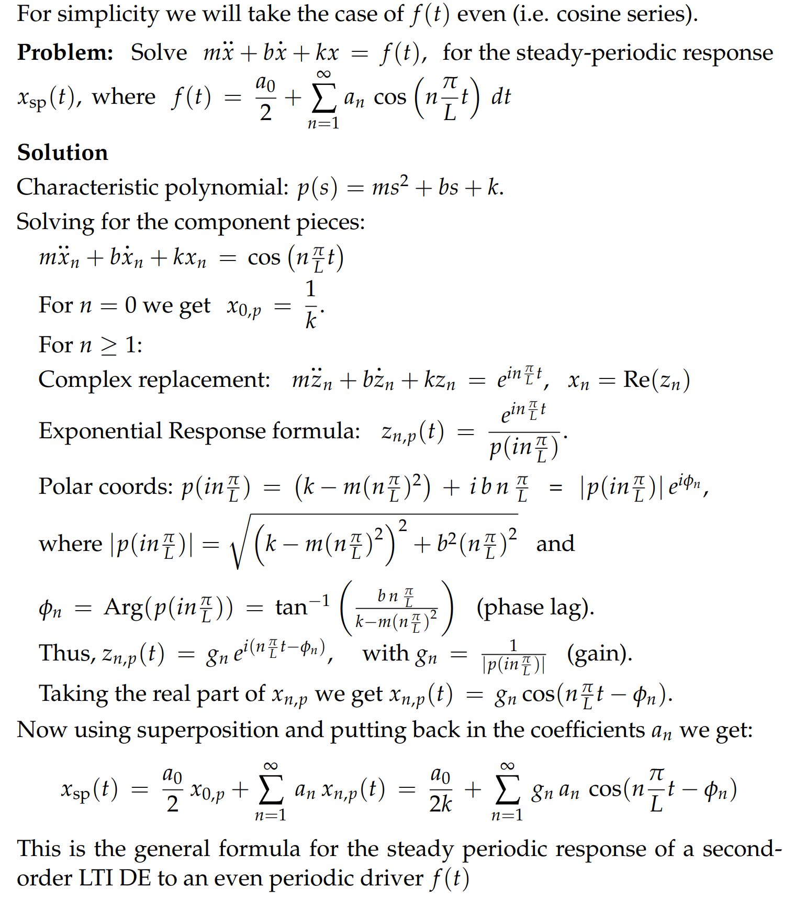
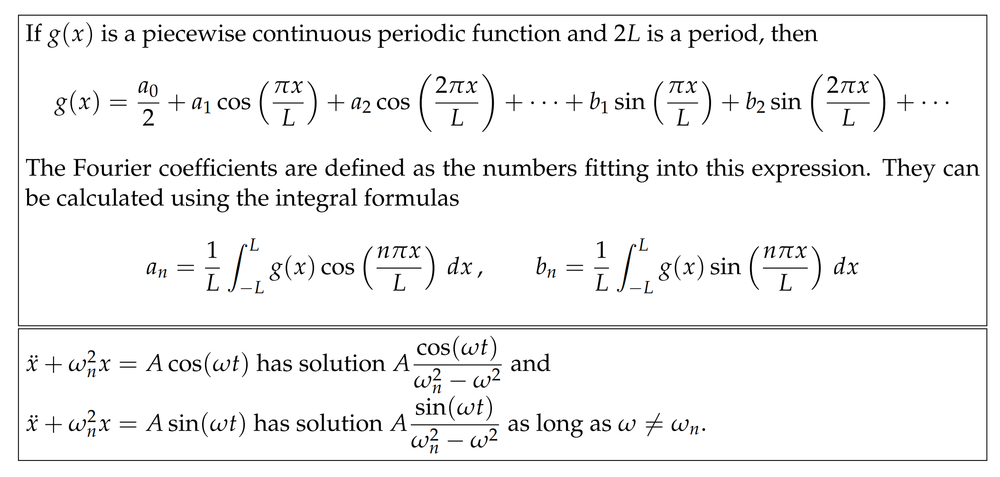
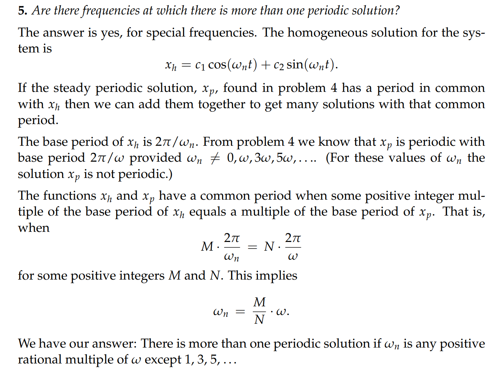
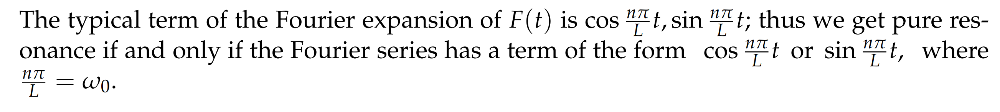

# 1 Intro
[Periodic Input.pdf](https://www.yuque.com/attachments/yuque/0/2022/pdf/12393765/1658059246832-25e1c2f2-6c2b-4ac4-bde4-c66a20ea4ad9.pdf)
> 对于一个周期输入$f(t)$, 我们有线性微分方程$p(D)x = f(t)$
> 我们可以使用`Superposition Principle`将右侧看成`Fourier Components`的线性组合，然后对每个`Fourier Components`我们求一个`Response`, 然后将他们线性组合起来求出这个微分方程的特殊解, 这个特殊解成为`Steady-Periodic Solution`用$x_{sp}$表示,。** 注意，如果说发生共振了，也就是**$w_n$**中任意一个取值和**$w_0$**一样了，那么**$x_{sp}$**就不存在，但是**$x_{p}$**还是存在的，可以通过**`**ERF**`**在**$p(a)=0$**的情况下的公式求出对应的**`**Response**`
> 本章节我们将使用`Fourier Series`用于声波分析

# 2 简谐振子
## 2.1 Undamped Harmonic Oscillator
### 作用
[求解方波实例.pdf](https://www.yuque.com/attachments/yuque/0/2022/pdf/12393765/1658051320125-ced16d4c-ad34-4c0c-bc07-3827410848aa.pdf)

> 一个自然频率为$w_n$的简谐振子可以从`Periodic Input Wave`的傅里叶级数中筛选出频率和$w_n$相近的`Fourier Componenets`, **体现在特殊解的振幅上(会趋近于无穷大, real resonance发生)**

> 我们要解$x''+w_0^2x = f(t)$，$f(t)$是一个周期输入, 我们将其进行傅里叶展开
> 然后对每一个形如$cos(wt),sin(wt)$的`Fourier Component`, 我们对$x''+w_0^2 = cos(wt)/sin(wt)$求一个特解, 然后将每个特解线性组合起来(`Superposition principle`)， 得到稳定周期解$x_{sp}$ 
> 通过改变我们的简谐振子的自然频率，我们可以从`Fourier Series`中筛选出我们想要的`Fourier Component`

### Applet
[Applet.pdf](https://www.yuque.com/attachments/yuque/0/2022/pdf/12393765/1658059927962-fabefe2b-be30-4ff0-b797-639bc1b16a9a.pdf)
> 我们在调整简谐振子$x''+w_0^2x = f(t)$的时候，在改变$w_0$的大小的时候，我们可以对$f(t)$中不同的`Fourier Components`做出回应，回应在趋近于无穷的振幅中体现，我们就可以通过简谐振子的$w_0$知道`Fourier Series`的构成了
> 

## 2.2 带阻尼的简谐振子
[Damped Harmonic Oscillators.pdf](https://www.yuque.com/attachments/yuque/0/2022/pdf/12393765/1658060179678-df36e052-76ef-4e5a-a058-f9c11559518c.pdf)
> 带阻尼的简谐振子同样也可以筛选出`Fourier Components`
> 几个关键步骤:
> 
> 
> 1. 将$f(t)$傅里叶展开
> 

> 2. 将每个`Fourier Components`(不同的$n$)作为系统输入求特殊解$x_{n,p}(t)$
> 

> 3. 使用`Superposition Principle`将$x_{n,p}$线性组合, 得到$x_{sp}(t)$，注意这里在$\phi_n \in [0,\pi]$
> 

## 2.4 周期输入总结
[周期输入总结.pdf](https://www.yuque.com/attachments/yuque/0/2022/pdf/12393765/1658061415907-7ac095de-9ea9-42ef-873e-df05a4b6ea16.pdf)

# 3 Hearing 
## Notes
> 当我们听到一个`Triads`的时候，输入就是三个`Sinusoidal Functions`的叠加
> 我们的内耳中的毛状细胞就好像是不同自然频率的简谐振子一样，通过和输入的`resonance`来筛选出`Fourier Components`
> 然后将简谐振子的`output`向大脑传输

## Applet
[Hearing Applet Guide.pdf](https://www.yuque.com/attachments/yuque/0/2022/pdf/12393765/1658062258304-a80f837f-971b-4ccd-a370-896d5541925c.pdf)
> 本质是共振的运用

# 4 练习
## Practice Problem
[Practice Problems.pdf](https://www.yuque.com/attachments/yuque/0/2022/pdf/12393765/1658127230337-fc11a854-0f31-4650-b5a5-e945bfcd45b2.pdf)

> 当$w_n = w$的时候，共振发生，通过`ERF`我们有特殊解$x_p = \frac{tsin(wt)}{p'(iw)}$, 但我们说此时我们没有$x_{sp}$(稳定周期解), 或者说此时的$x_p$不具有周期性，毕竟我们多了一个`factor`$t$, 使得$x_p$不再是一个周期函数
> 但反过来说，如果$w_n$无限接近于$w$,我们可以通过`Response`的巨大振幅来判断我的输入波中有$w_n$频率的波段，借此将其筛选出来。

## Problem Sets
### PS1
[Problem Set 1.pdf](https://www.yuque.com/attachments/yuque/0/2022/pdf/12393765/1658127307372-913ecc06-141f-459a-964a-5564a465ad79.pdf)
> 探究对于一个周期为$L$的输入$F(t)$，微分方程$mx''+kx = F(t)$会不会产生共振，也就是有没有$x_{sp}$存在
> 我们只需要判断$F(t)$的傅里叶展开中有没有和$w_0=\sqrt{\frac{k}{m}}$频率一致的`Fourier Components`
> 
> 注意: $P = 2L$,$L$是半周期

### PS2
[Problem Set 2.pdf](https://www.yuque.com/attachments/yuque/0/2022/pdf/12393765/1658127307376-5b3ce92d-c425-4a82-a17e-1d45182fb3f8.pdf)
> 这道题非常好，值得反复看，理解在不同的$w_n$下是否有`Periodic Solution`
> 但是本质就是$w_0$不能和输入波的傅里叶展开中的任何一项的频率一致, 否则就没有`Periodic Solutions`

