[Step and Delta Functions_Introduction.pdf](https://www.yuque.com/attachments/yuque/0/2022/pdf/12393765/1658143175029-fc05ad98-81af-4aec-b358-6981eb95731e.pdf)
# 1 Step Function
[Step and Box Functions.pdf](https://www.yuque.com/attachments/yuque/0/2022/pdf/12393765/1658134695906-3014b105-f8de-438a-ad5e-7c077d13e2e9.pdf)
## Unit Step Function
> `Step Function`代表了我们理想中的`switch`，或者`CPU`的时钟信号(从低电压`0`跳到高电压`1` )
> 实际生活中，我们的信号从`0`到`1`实际上是有一个`transition period`的，也就是渐渐地从`0`到`1`变化的, 甚至可能出现`overshoot`的情况，比如下图: 
> 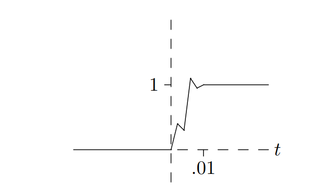
> 但我们可以使用来代表这种理想化的函数

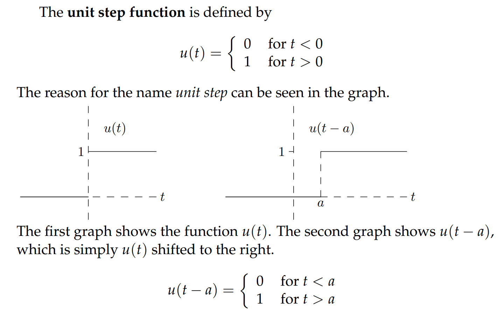
> 有几点需要注意:
> 1. 也被叫做`Heaviside Function`
> 2. **在零处是跳跃间断点**
> 3. **在零点没有定义, 因此在零处没有极限，没有导数，也不连续**

## Box Function
> 如果我们假定我们的灯在时间点`a`点亮， 在时间点`b`熄灭, 理想状况下我们可以用`Cases Format`定义一个`Box Function`, 我们也可以使用两个`Step function`的组合来定义这个`Box Function`(`U-Format`)

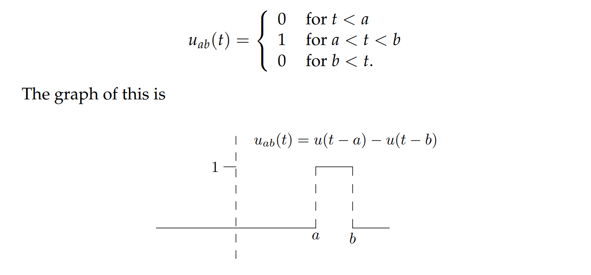

## Switches
> 如果我们想要对任何输入，将其变得和开关的行为一样，我们可以在它前面乘上一个`Box Function`

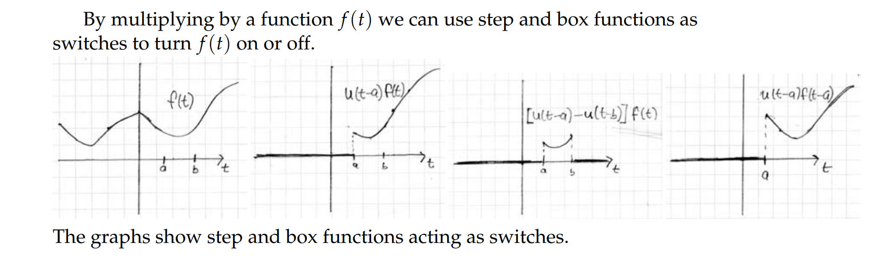
> - 表示对于一个函数, 从时间点开始，函数的输出为,之前都是`0`
> - 表示对于一个函数, 在时间段内，函数的输出为, 其余都是`0`

## Application
> 有了`Step Function`和`Box Function`, 我们可以有另一种方式表示分段函数

### Cases Format -> U Format
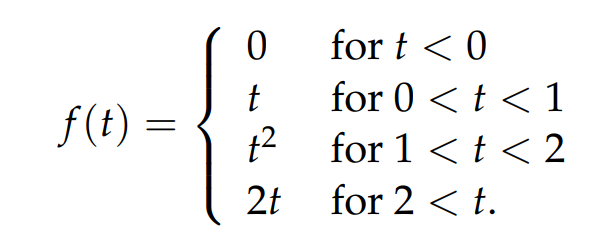
> 

### U Format -> Cases Format
> 

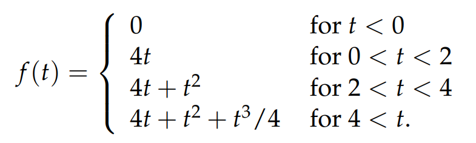

# 2 Delta Functions**⭐⭐⭐**
[Delta Functions_Unit Impulse.pdf](https://www.yuque.com/attachments/yuque/0/2022/pdf/12393765/1658143319939-893b8913-1875-4fb9-ae48-42c69712c342.pdf)
> 对于一个`discontinuous`的函数来说，比如我们的`unit step function`; 一般而言不是处处可导的，所以我们发明出了一种能够在不连续函数的间断点表示导数的方法， 称为`Generalized Derivatives`

## Intuition
> 假设我们有一个输入函数表示在不同条件下物质累积的速率，单位是`kg/year`，那么在`[0,t]`的时间段内，总共积累的物质是, 根据微积分基本定理，我们有
> 这里我们假设只在很短的时间段内是非零的, 其余时间都是`0`,并且假设,于是对于的函数图像，我们可以有多种猜测（类似于概率论中的均匀分布）
> 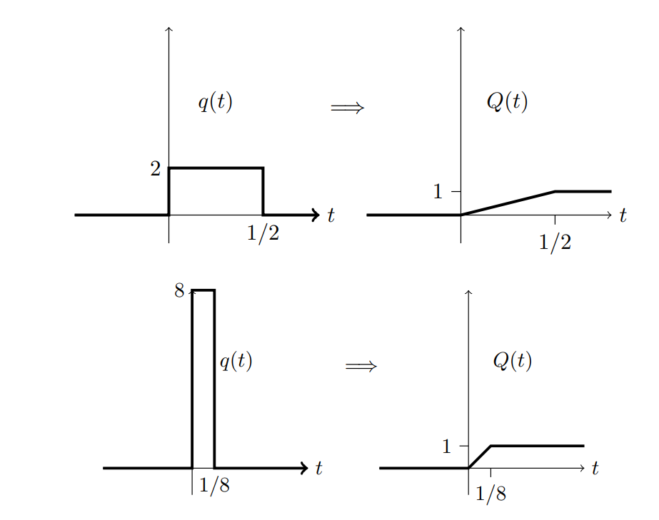

## Definition
> **我们定义Delta Function 是: **
> 这里是轴上的非零区间的宽度，在非零区间的函数值是, 所以当趋近于, 我们得到的是一个很高的针一般的函数图像
> 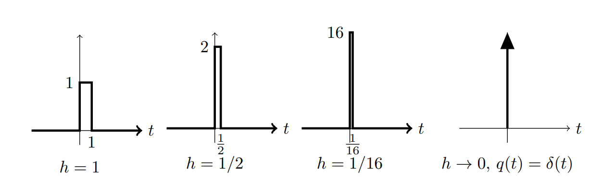

## Properties**⭐**
> 1. 最关键的性质，后面的性质由此展开:
> 

> 2. 一个关键点是，是积分面积为`1`的函数的极限形态
> 
所以我们有: 
> 有效积分区间其实只有在零附近的很小的一段

:::info

3. 对于任何连续函数来说，我们有

和 
因为函数除了以外任何地方的值都是
:::
:::success

4. 对于任何连续函数, 我们有

和
:::
> 5. ,但由于在处是非连续的，我们在处定义一个`generalized derivative`, 就是这里的, **在第三小节中介绍**

> 6. 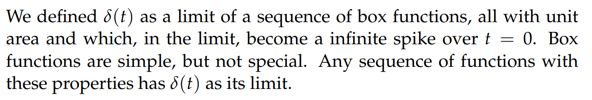

:::info

7. 函数,可以抽象成任何积分面积为`1`的函数，但是有效积分区间挤在零附近的很小一段区间内
:::
> 8. 不是一个真正的函数，只是一个`Generalized Function`

:::success

9. 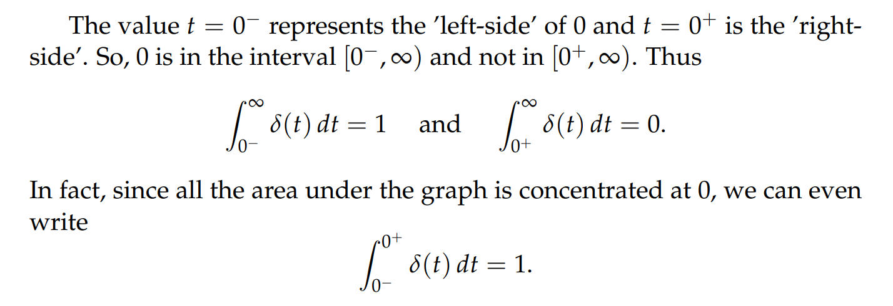
:::

## Examples of Integration
:::success
给了我们很多有价值的信息, 尤其是在求积分的时候， 下面的例子充分展现了其价值:
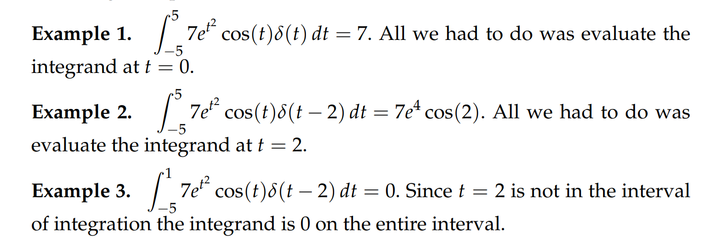
:::

# 3 Generalized Derivatives**⭐⭐⭐**
## Definitions
:::success
对于`Unit Step Function`来说，我们有
注意到的导数在`0`处不存在，于是我们启用`Generalized Derivative`来弥补
首先，我们定义, 由微积分基本定理可知
由性质`9`，我们可以知道, 所以, 所以是的反导数,
于是
:::

## Graphs
:::info
对于一个有跳跃间断点的函数
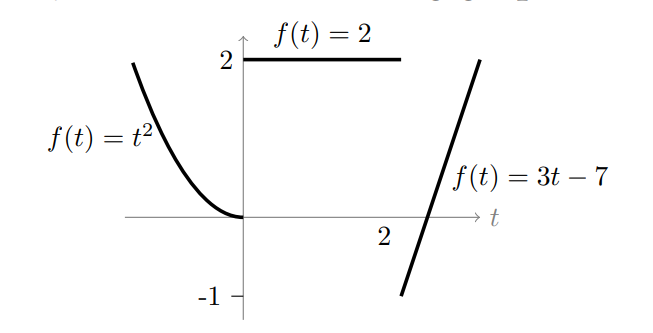
我们对其求导：
这里前面的系数是间断点两侧极限之差(**右极限减左极限**)，向上为正方向
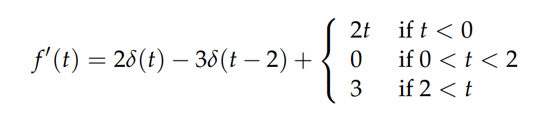
**画出这个导函数****, 这个函数叫做**`**Generalized Derivative**`**, 描述了一个不连续函数的导数****的取值信息和原函数****的跳跃点信息。**
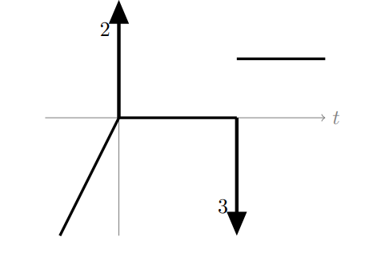
**这个函数的作图有几个注意点:**

- 箭头的起始点在轴上
- 箭头长度无所谓，但是角标数字必须得标出，表示函数间断点处的左右极限之差的绝对值。
- 箭头方向看图即可。左极限小于右极限，箭头朝上；左极限大于右极限，箭头朝下。
:::

## Regular and Singular Notations
:::success
**在本课程中，我们的**`**Generalized Function**`**简单的表示为**`**regular function**`**+**`**singular part**`**(**`**delta functions**`**的线性组合)**
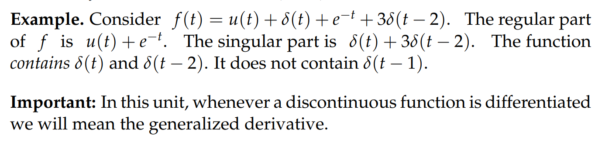
:::

# 4 练习
## Quizzes
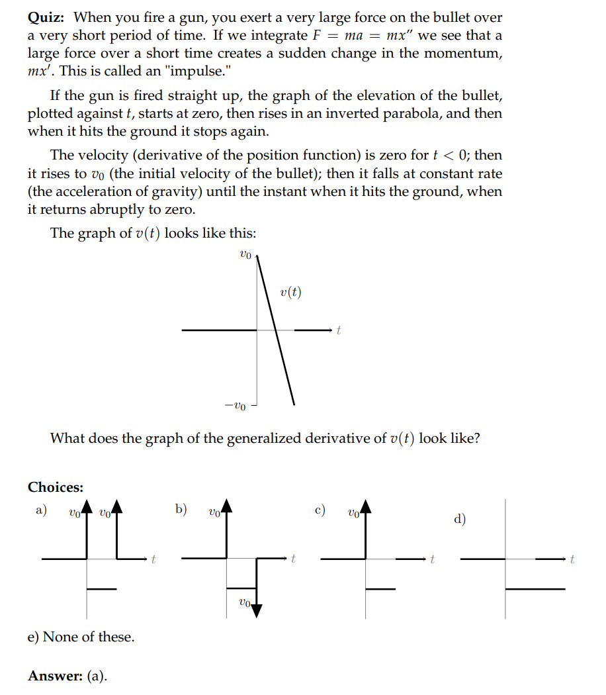

## TA Session
:::success

1. Find **generalized derivatives** of 

画图可知:
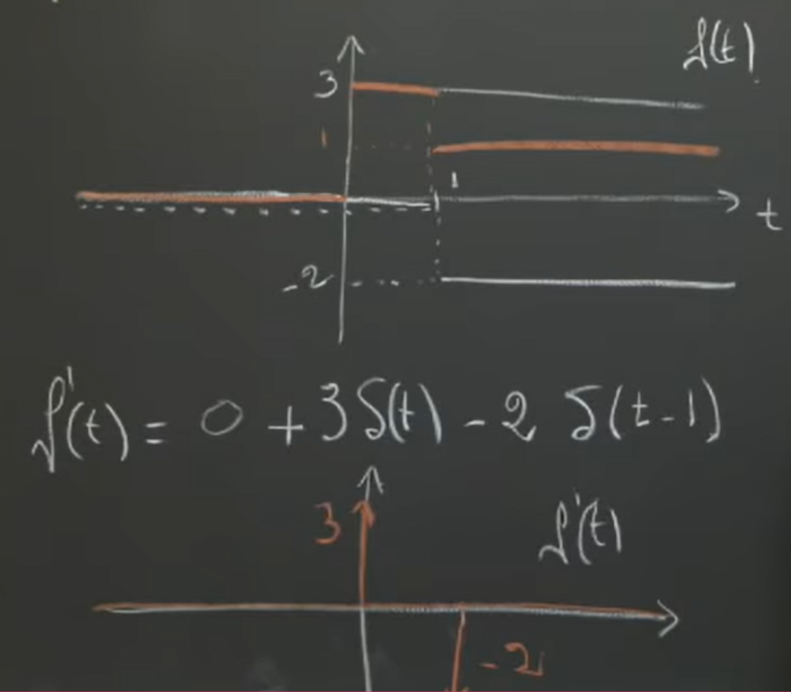
:::
:::success

2. Find generalized derivatives of

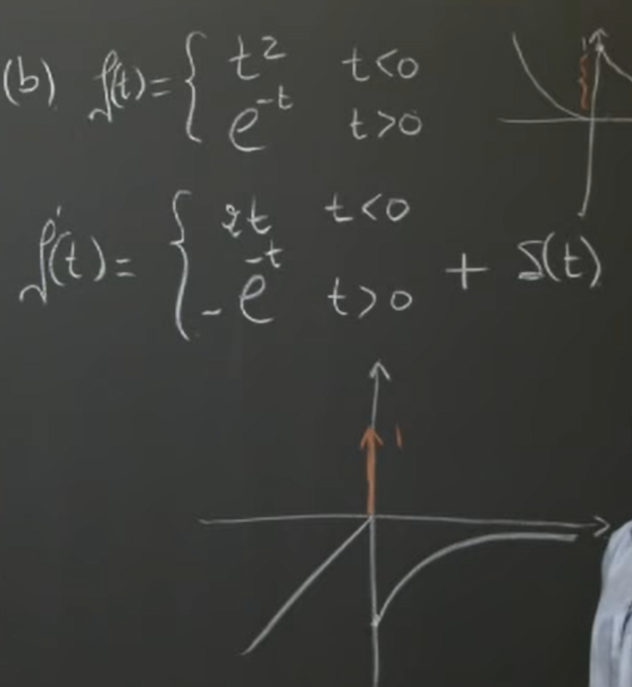
:::

## Practice Problems**⭐⭐⭐**
[Practice Problems.pdf](https://www.yuque.com/attachments/yuque/0/2022/pdf/12393765/1658149601625-f0935de0-4189-4e98-a598-8d69bf271089.pdf)
:::info
对于一个`piece-wise smooth`的分段函数: 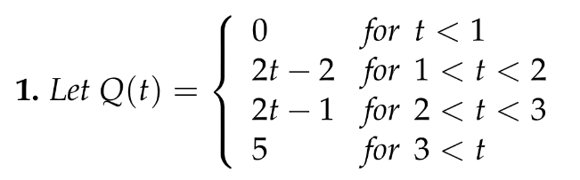
如果我们要求它的`Generalized Derivative`, 我们有两种方法

1. 我们可以将其从`Case Format`转换成`U Format`, 因为`U Format` 下，我们有方便我们直接转换成`Generalized Functions`，我们将看成一个个`Box Function`的组合, 得到,然后求**, 注意在求****的导数的时候，要用性质**`**4**`**计算结果**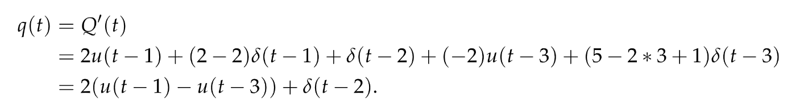
2. 我们直接根据画出的图像信息刻画出`Generalized Functions`

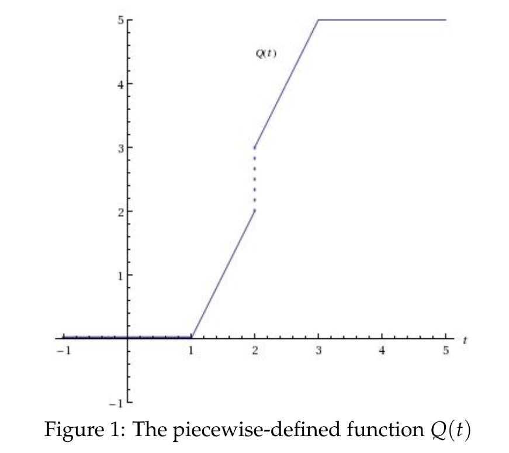
, 然后把转换成`U Format`即可
其实如果有了这个(`General Derivative`), 我们对其做积分，就可以还原出原来的函数图像了，对于不连续的函数也适用，这就是函数的用武之地
:::

## Problem Set
[Problem Set.pdf](https://www.yuque.com/attachments/yuque/0/2022/pdf/12393765/1658149627308-4f395e3b-faee-4f37-8b11-e51ae2a420bf.pdf)
:::info
在画`Generalized Functions`的图的时候，几个注意点：
箭头的起始点在轴上，箭头右下角的角标大小是间断点函数左右极限之差的绝对值，方向看左右极限之差的正负情况, 正的话向上，负的话向下.
:::
