[Step and Delta Functions_Introduction.pdf](https://www.yuque.com/attachments/yuque/0/2022/pdf/12393765/1658143175029-fc05ad98-81af-4aec-b358-6981eb95731e.pdf)
# 1 Step Function
[Step and Box Functions.pdf](https://www.yuque.com/attachments/yuque/0/2022/pdf/12393765/1658134695906-3014b105-f8de-438a-ad5e-7c077d13e2e9.pdf)
## Unit Step Function
> `Step Function`代表了我们理想中的`switch`，或者`CPU`的时钟信号(从低电压`0`跳到高电压`1` )
> 实际生活中，我们的信号从`0`到`1`实际上是有一个`transition period`的，也就是渐渐地从`0`到`1`变化的, 甚至可能出现`overshoot`的情况，比如下图: 
> 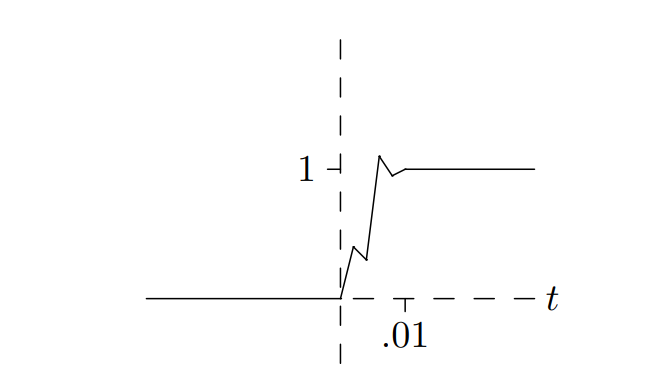
> 但我们可以使用$u(t)$来代表这种理想化的函数

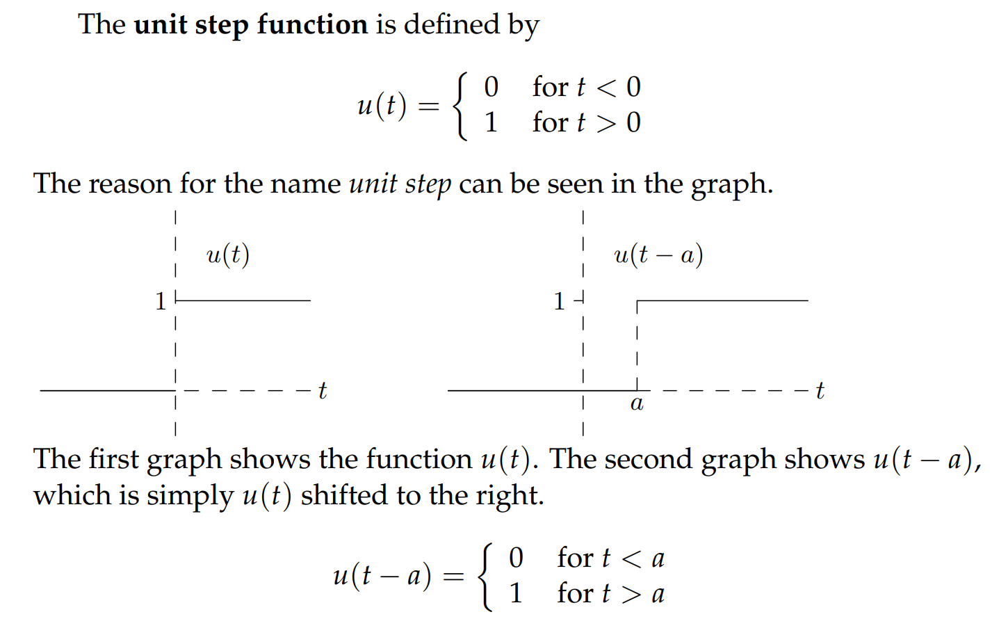
> 有几点需要注意:
> 1. $u(t)$也被叫做`Heaviside Function`
> 2. $u(t)$**在零处是跳跃间断点**
> 3. $u(t)$**在零点没有定义, 因此在零处没有极限，没有导数，也不连续**

## Box Function
> 如果我们假定我们的灯在时间点`a`点亮， 在时间点`b`熄灭, 理想状况下我们可以用`Cases Format`定义一个`Box Function`, 我们也可以使用两个`Step function`的组合来定义这个`Box Function`(`U-Format`)

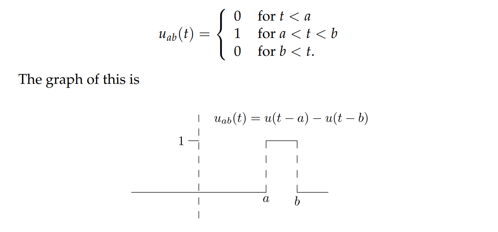

## Switches
> 如果我们想要对任何输入$f(t)$，将其变得和开关的行为一样，我们可以在它前面乘上一个`Box Function`

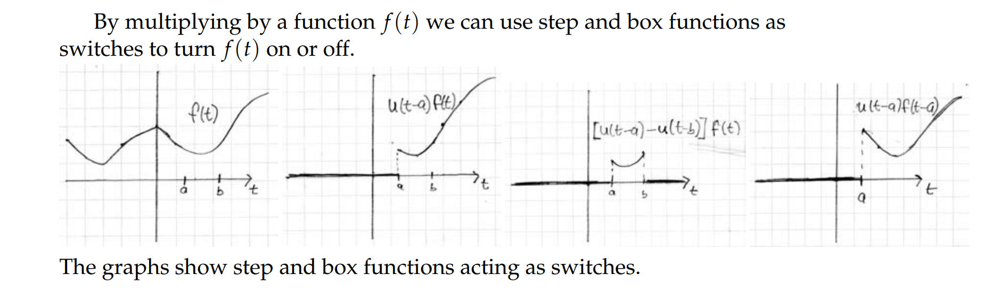
> - $u(t-a)f(t)$表示对于一个函数$f(t)$, 从$a$时间点开始，函数的输出为$f(t)$,之前都是`0`
> - $[u(t-a)-u(t-b)]f(t)$表示对于一个函数$f(t)$, 在$a到b$时间段内，函数的输出为$f(t)$, 其余都是`0`

## Application
> 有了`Step Function`和`Box Function`, 我们可以有另一种方式表示分段函数

### Cases Format -> U Format
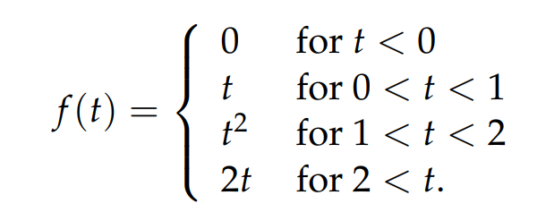
> $f(t) = [u(t)-u(t-1)]t+[u(t-1)-u(t-2)]t^2+u(t-2)*(2t)$

### U Format -> Cases Format
> $f(t) = u(t)*(4t) + u(t-2)*t^2+u(t-4)*\frac{t^3}{4}$

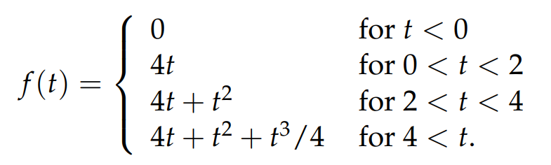

# 2 Delta Functions**⭐⭐⭐**
[Delta Functions_Unit Impulse.pdf](https://www.yuque.com/attachments/yuque/0/2022/pdf/12393765/1658143319939-893b8913-1875-4fb9-ae48-42c69712c342.pdf)
> 对于一个`discontinuous`的函数来说，比如我们的`unit step function`; 一般而言不是处处可导的，所以我们发明出了一种能够在不连续函数的间断点表示导数的方法， 称为`Generalized Derivatives`

## Intuition
> 假设我们有一个输入函数$q(t)$表示在不同$t$条件下物质累积的速率，单位是`kg/year`，那么在`[0,t]`的时间段内，总共积累的物质是$Q(t) = \int_{0}^{t}q(t) dt$, 根据微积分基本定理，我们有$\dot{Q}(x)=q(t)$
> 这里我们假设$q(t)$只在很短的时间段内是非零的, 其余时间都是`0`,并且假设$Q(t)=1$,于是对于$q(t)$的函数图像，我们可以有多种猜测（类似于概率论中的均匀分布）
> 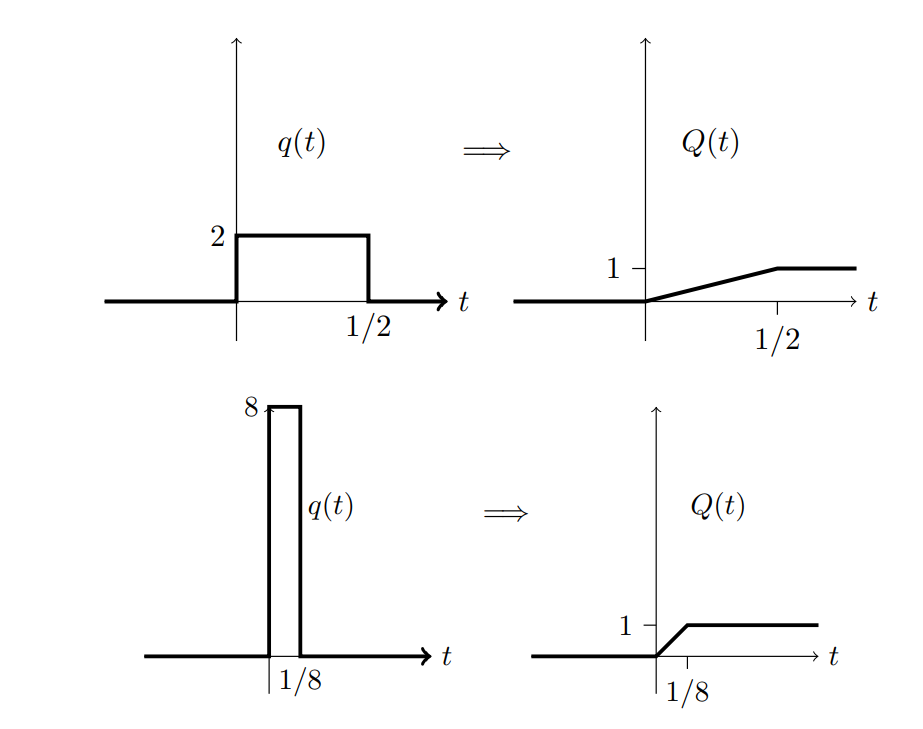

## Definition
> **我们定义Delta Function 是: **$\delta(t)=\lim_{h\to 0}q_h(t)=\begin{cases}0& if \space t\neq 0\\\infty& if \space t=0\end{cases}$
> 这里$h$是$t$轴上的非零区间的宽度，$q(t)$在非零区间的函数值是$\frac{1}{h}$, 所以当$h$趋近于$0$, 我们得到的是一个很高的针一般的函数图像
> 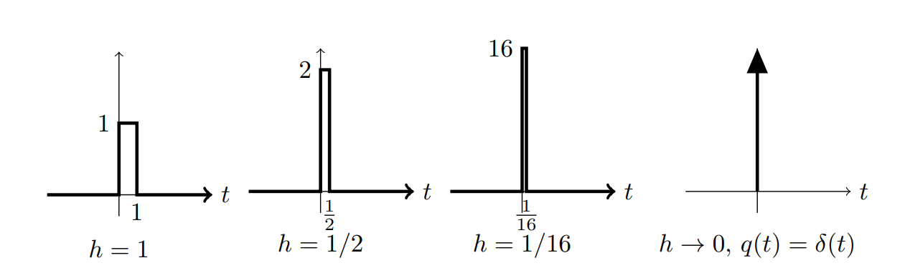

## Properties**⭐**
> [!property]
> 1. 最关键的性质，后面的性质由此展开:
> $\delta(t)=\begin{cases}0& if \space t\neq 0\\\infty& if \space t=0\end{cases}$
> 2. 一个关键点是，$\delta(t)$是积分面积为`1`的函数的极限形态
> 所以我们有: $\int_{c}^{d}\delta(t)dt=\begin{cases}1& if \space c< 0<d\\0& otherwise\end{cases}$
> 有效积分区间其实只有在零附近的很小的一段
> 3. 对于任何连续函数$f(t)$来说，我们有$f(t)\delta(t) = f(0)\delta(t)=\infty$和$\int_{c}^{d}f(t)\delta(t)dt=\begin{cases}f(0)& if \space c< 0<d\\0& otherwise\end{cases}$因为函数$\delta(t)$除了$t=0$以外任何地方的值都是$0$
> 4. 对于任何连续函数$f(t)$, 我们有$f(t)\delta(t-a) = f(a)\delta(t-a)=\infty$和$\int_{c}^{d}f(t)\delta(t-a)dt=\begin{cases}f(a)& if\space c< a <d\\0& otherwise\end{cases}$
> 5. $\delta(t)=u'(t)$,但由于$u(t)$在$t=0$处是非连续的，我们在$t=0$处定义一个`generalized derivative`, 就是这里的$\delta(t)$, **在第三小节中介绍**
> 6. 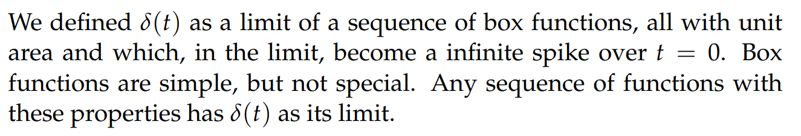
> 7. 函数$\delta(t)$,可以抽象成任何积分面积为`1`的函数，但是有效积分区间挤在零附近的很小一段区间内
> 8. $\delta(t)$不是一个真正的函数，只是一个`Generalized Function`
> 9. 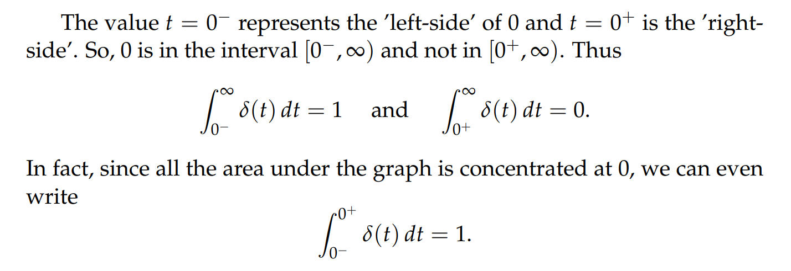

## Examples of Integration
> [!example]
> $\delta(t)$给了我们很多有价值的信息, 尤其是在求积分的时候， 下面的例子充分展现了其价值:
> 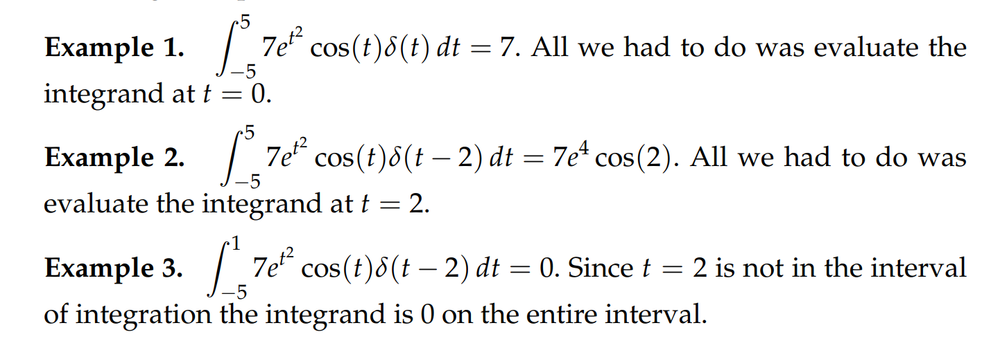

# 3 Generalized Derivatives**⭐⭐⭐**
## Definitions
> [!def]
> 对于`Unit Step Function`来说，我们有$u'(t)=\begin{cases} 0&if \space t\neq 0 \\\infty&if\space t=0\end{cases}$
> 注意到$u(t)$的导数在`0`处不存在，于是我们启用`Generalized Derivative`来弥补
> 首先，我们定义$f(t)=\int_{-\infty}^t\delta(\tau)d\tau$, 由微积分基本定理可知$f'(t) = \delta(t)$
> 由性质`9`，我们可以知道$f(t)=\begin{cases}0 & if\space t<0\\ 1&if \space t>0\end{cases}$, 所以$f(t)=u(t)$, 所以$u(t)$是$\delta(t)$的反导数,
> 于是$u'(t)=\delta(t),\forall t$

## Graphs
> [!example]
> 对于一个有跳跃间断点的函数$f(t)$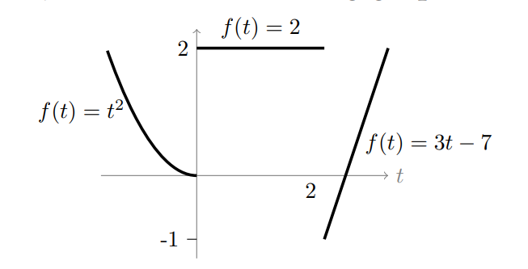
> 我们对其求导：
> 这里$\delta(t)$前面的系数是间断点两侧极限之差(**右极限减左极限**)，向上为正方向
> 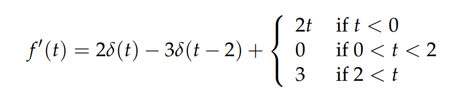
> **画出这个导函数**$f'(t)$**, 这个函数叫做**`**Generalized Derivative**`**, 描述了一个不连续函数的导数**$f'(t)$**的取值信息和原函数**$f(t)$**的跳跃点信息。**
> 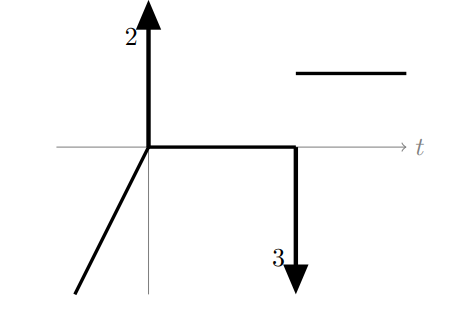
> **这个函数的作图有几个注意点:**
> - 箭头的起始点在$x$轴上
> - 箭头长度无所谓，但是角标数字必须得标出，表示函数间断点处的左右极限之差的绝对值。
> - 箭头方向看图即可。左极限小于右极限，箭头朝上；左极限大于右极限，箭头朝下。

## Regular and Singular Notations
:::success
**在本课程中，我们的**`**Generalized Function**`**简单的表示为**`**regular function**`**+**`**singular part**`**(**`**delta functions**`**的线性组合)**
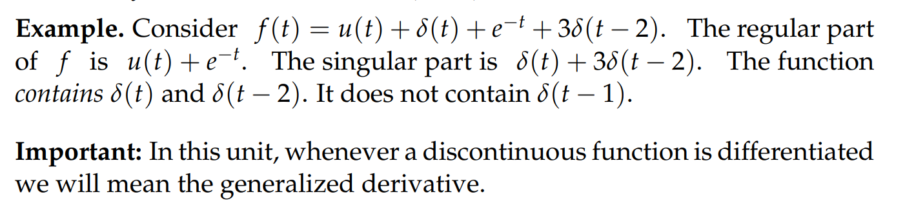
:::

# 4 练习
## Quizzes
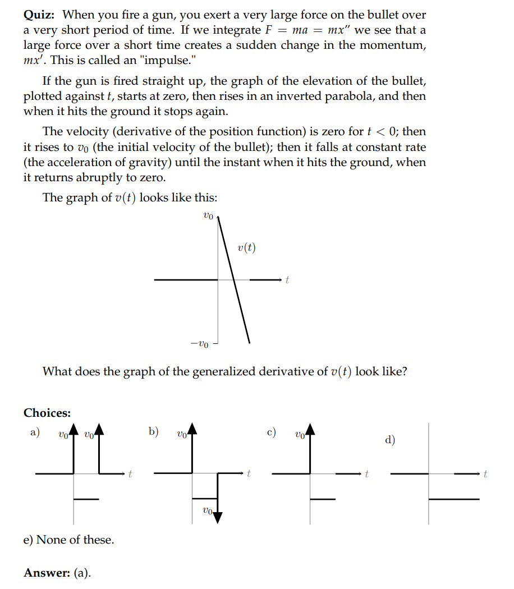

## TA Session
:::success

1. Find **generalized derivatives** of $f(t) = 3u(t)-2u(t-1)$

画图可知:
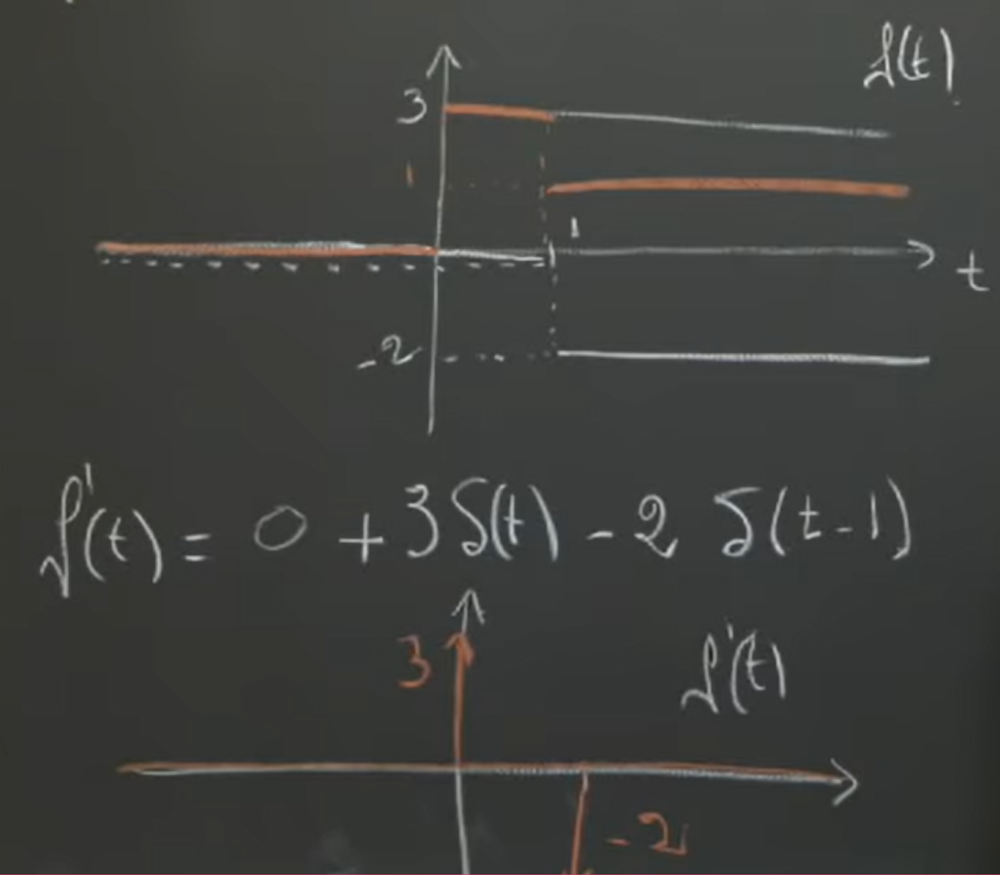
:::
:::success

2. Find generalized derivatives of$f(t) = \begin{cases}t^2&t<0\\e^{-t}&t>0 \end{cases}$

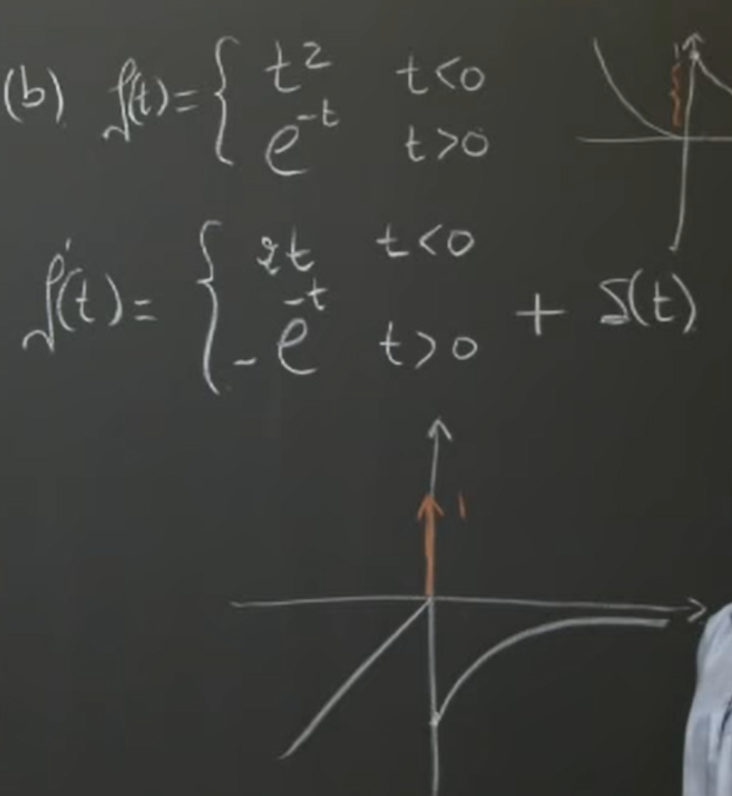
:::

## Practice Problems**⭐⭐⭐**
[Practice Problems.pdf](https://www.yuque.com/attachments/yuque/0/2022/pdf/12393765/1658149601625-f0935de0-4189-4e98-a598-8d69bf271089.pdf)
:::info
对于一个`piece-wise smooth`的分段函数: 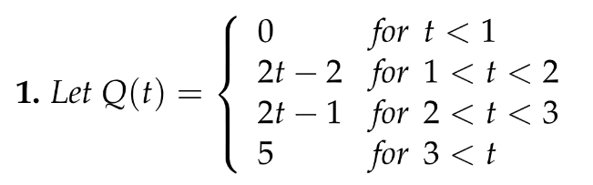
如果我们要求它的`Generalized Derivative`, 我们有两种方法

1. 我们可以将其从`Case Format`转换成`U Format`, 因为`U Format` 下，我们有$u'(t-a)=\delta(t-a)$方便我们直接转换成`Generalized Functions`，我们将$Q(t)$看成一个个`Box Function`的组合, 得到$Q(t) = (2t-2)(u(t-1)-u(t-2))+(2t-1)(u(t-2)-u(t-3))+5u(t-3)=(2t-2)u(t-1)+u(t-2)+(5-2t+1)u(t-3)$,然后求$Q'(t)$**, 注意在求**$f(t)u(t-a)$**的导数的时候，要用性质**`**4**`**计算结果**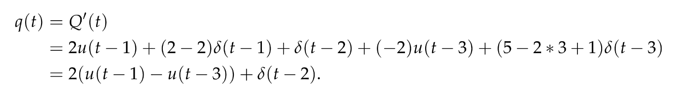
2. 我们直接根据画出的$Q(t)$图像信息刻画出`Generalized Functions`

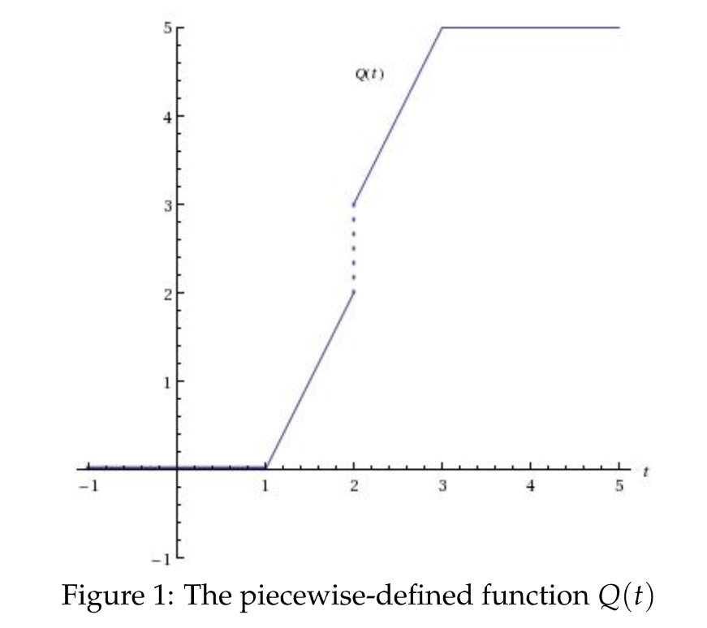
$q(t)=Q'(t)=\delta(t-2)+\begin{cases} 0&if\space t<1 \\ 2& if\space 1<t<2 \\ 2&if\space 2<t<3\\0 & if\space t>3\end{cases}$, 然后把$q(t)$转换成`U Format`即可
其实如果有了这个$q(t)$(`General Derivative`), 我们对其做积分，就可以还原出原来的函数图像了，对于不连续的函数也适用，这就是$Delta$函数的用武之地
:::

## Problem Set
[Problem Set.pdf](https://www.yuque.com/attachments/yuque/0/2022/pdf/12393765/1658149627308-4f395e3b-faee-4f37-8b11-e51ae2a420bf.pdf)
:::info
在画`Generalized Functions`的图的时候，几个注意点：
箭头的起始点在$x$轴上，箭头右下角的角标大小是间断点函数左右极限之差的绝对值，方向看左右极限之差的正负情况, 正的话向上，负的话向下.
:::
