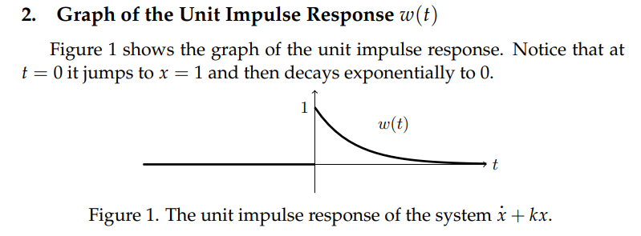
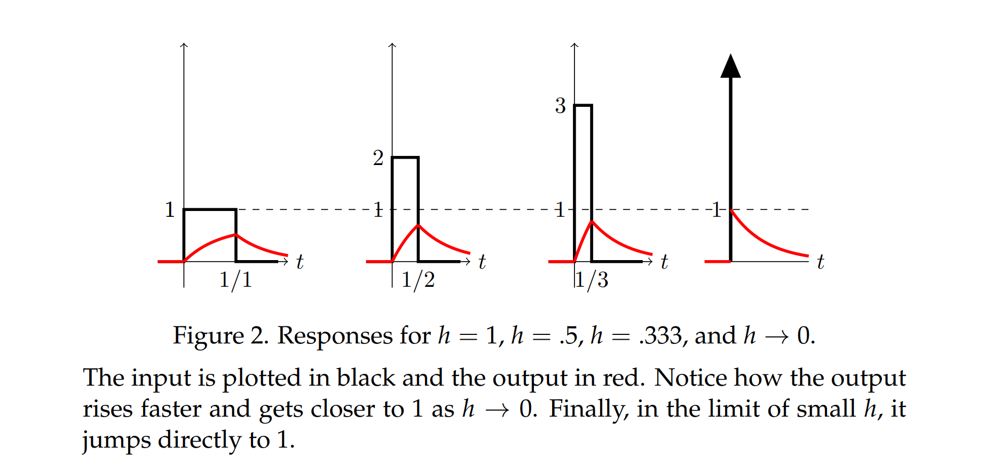
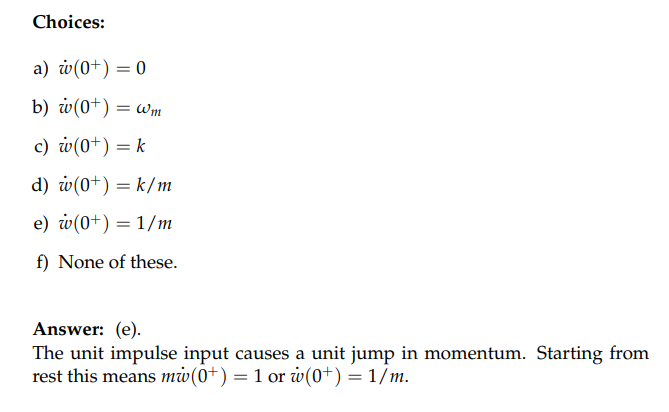

[intro.pdf](https://www.yuque.com/attachments/yuque/0/2022/pdf/12393765/1658221649869-84fbe68c-35dc-4efa-ba80-d60f01e78151.pdf)
# 1 Initial Condition
[Initial Conditions.pdf](https://www.yuque.com/attachments/yuque/0/2022/pdf/12393765/1658221659473-fe1733c5-93cc-4ecf-8663-79a6bd0ed5b3.pdf)
## Intro
:::info
对于一个连续的输入信号，我们对`Initial Conditions`根本不用考虑那么多
而对于类似像`Unit Step Function`和`Delta Function`这样的不连续输入来说，$u(0),\delta(0)$没有定义
所以我们需要`Pre-conditions`和`Post-Conditions`来补充这种情况
:::
## Pre/Post-Initial Conditions
:::info

- `**Pre-Initial Conditions**`: 形如$x(0^-),\dot{x}(0^-)$这样的初始条件
- `**Post-Initial Conditions**`: 形如$x(0^+),\dot{x}(0^+)$这样的初始条件

:::

## Rest Initial Conditions(RIC)
> [!important]
> 
> **也就是在小于**`0`**且无限接近于零处的**`initial condition`**的值是**`0`

## Examples
### Example 1: First Order Unit Step Input
:::info

**我们发现：**

- $x(0^+)=0=x(0^-)$, 所以`Post Initial Condition`和`Pre Initial Condition`一样， 所以$x(t)$是连续的
- 但是一阶导: $\dot{x}(0^-)=0\neq \dot{x}(0^+)=1$
:::

### Example 2: First Order Delta Input
> [!example]
> 

### Example 3: Second Order Unit Input
:::info

:::

### Example 4: Second Order Delta Input
:::info

:::

### 总结
:::info
$n\geq 1$

- 对于`n`阶微分方程, $u(t)$的输入导致$x(t)$在$t=0$处,  $n$阶以上导数是跳跃间断的
- 对于`n`阶微分方程, $\delta(t)$的输入导致$x(t)$在$t=0$处,  $n-1$阶以上导数是跳跃间断的
- **直观来讲，**$\delta(t)$**的输入比**$u(t)$**更容易使得我们的**$x(t)$**变得不连续**

:::

# 2 First Order Unit Step Response
[First Order Unit Step Response.pdf](https://www.yuque.com/attachments/yuque/0/2022/pdf/12393765/1658241091174-202f360e-824b-43ad-85d0-09d4348f1933.pdf)
## Unit Step Response
### Defintion
:::info
对于$\dot{x}+kx=ru(t)，x(0^-)=0,k,r \space constant$来说, 我们可以将其看成是在对一个放射性元素的衰变建模

$x(t)$表示铀元素在$t$时刻的存量, $k(year^{-1})$表示衰变常数, $ru(t)$表示我手动加入铀元素的速度，单位是$kg/year$,$u(t)$是`Step Function`
我们在上一小节看到，如果输入信号是像$ru(t)$那样$t=0$处突然变化的话，我们的`Reponse`其实不会间断，而是呈现一个`Continuous`的状态, 原因是在$dt$的时间内输入为$rdt$几乎可以忽略不计，**相当于右侧没有输入**，**那我的**`**System Response**`**在**`**0**`**附近当然不会有什么突变行为**
:::

### Solving 
#### WIth Assumption x(0) is continuous
> 这里我们假设$x(t)$在$t=0$处连续

> 我们对$\dot{x}+kx=ru(t)，x(0^-)=0,k,r \space constant$分成两段来看:
> - $t<0$时，$u(t)=0$, 所以微分方程变为$\dot{x}+kx=0$, 由`Integrating Factors`得$x(t)=Ce^{-kt}$, 由于这里我们的$x(0^{-}) =0$, 所以$C=0,x(t)=0$
> - $t>0$时，$u(t)=1$,所以微分方程变为$\dot{x}+kx = r$,就是一个`Constant Coefficient First Order Linear ODE`, 这时候$x(t) = \frac{1}{q(t)}(\int rq(t)dt+C),q(t)=e^{\int kdt}=e^{kt}$, 所以$x(t)=(\frac{r}{k})+ce^{-kt}$ ; **我们假设**$x(0)=0$, 我们有$c = -\frac{r}{k},x(t)=(\frac{r}{k})+ce^{-kt}$
> 
最终，我们将$t>0$和$t<0$的情况合在一起,得到: $x(t)=\begin{cases} 0&for\space  t<0\\ \frac{r}{k}(1-e^{-kt}) & for \space t>0\end{cases} =\frac{r}{k}(1-e^{-kt})u(t)$

:::info
当$r=1$时，$x(t)$就是`Unit Step Response`
$v(t)=u(t)(\frac{1}{k})(1-e^{-kt})$
:::

#### Without Assumption About Continuity
> 这里我们不再假设$x(t)$在$t=0$处连续了

> 

:::warning

:::
:::success
我们将这个$x(t)$代入原始微分方程$\dot{x}+kx=ru(t)=\begin{cases} 0&for \space t <0 \\ r&for\space t>0\end{cases}$
但是由于涉及到求导$\dot{x}$，并且我们不知道$x(0)$处是否连续，我们将$x(t)$写成待带有`Unit Step Function`的形式以便转换成带有`Delta Function`的`General Derivative`: $x(t)=(\frac{r}{k}+c_2e^{-kt})u(t)$,$x'(t)=-kc_2e^{-kt}u(t)+(\frac{r}{k}+c_2e^{-kt})\delta(t)$
于是在代入微分方程之后，我们有: $\dot{x}+kx\newline=-kc_2e^{-kt}u(t)+(\frac{r}{k}+c_2e^{-kt})\delta(t)+ru(t)+kc_2e^{-kt}u(t)\newline=(\frac{r}{k}+c_2e^{-kt})\delta(t)+ru(t)$
所以$\dot{x}+kx=(\frac{r}{k}+c_2)\delta(t)+\begin{cases}0&for\space t<0\\ r&for\space t>0\end{cases}$
和原来的对比: $\dot{x}+kx=\begin{cases} 0&for \space t <0 \\ r&for\space t>0\end{cases}$
所以$\frac{r}{k}+c_2=0$,  $c_2=-\frac{r}{k}$
所以$x(t)=(\frac{r}{k}-\frac{r}{k}e^{-kt})u(t)=u(t)(\frac{1}{k})(1-e^{-kt})$和上面一样
:::
:::success
当$r=1$时，这个解的图像是

因此，即使在没有假设$x(t)$在$t=0$连续的前提下，求得我们的$x(t)$还是连续的
:::

## Example
:::success

:::

## 总结
:::success
对于形如$\dot{x}+kx=ru(t)=\begin{cases} 0&for \space t <0 \\ r&for\space t>0\end{cases}$的微分方程，$x(t)=u(t)(\frac{1}{k})(1-e^{-kt})$是连续的

# 3 First Order Unit Impulse Response
[First Order Unit Impulse Response.pdf](https://www.yuque.com/attachments/yuque/0/2022/pdf/12393765/1658307813403-c1e58514-008e-4ca4-8f67-3e5cfffcc38e.pdf)
## Unit Impulse Response
### Definition
:::info
对于$\dot{x}+kx=\delta(t)，x(0^-)=0,k,r \space constant$来说, 我们仍然可以将其看成是在对一个放射性元素的衰变建模

- 在$dt$时间内，`Unit Function`几乎没有给系统任何的额外输入
- 和`Unit Step Function`不同的是, `Delta Function`在$dt$时间内是直接给了系统$1$单位的输入，使得`System Response`$x(t)$在$t=0$处发生突变
:::

### Solving
:::info

相当于我们在$t=0$时给这个系统补充了$1\space kg$的铀元素, 此时还没有开始衰变，所以我们有$x(0)=1$的条件 

- 对于$t<0$,我们**确定输入为**`**0**`, 但因为我们不确定$x(t)$在$t=0$处是否连续，**所以使用**`**Pre-initial Condition**`
- 对于$t=0$的时候，我们开始有输入了，我们需要根据这个输入是$u(t)$还是$\delta(t)$来判断$x(0)$这个`Initial Condition`长什么样子， 如果是$u(t)$,那么$x(0)=0$，如果像本例中的$\delta(t)$，我们就有$x(0)=1$
:::

### Graph
:::success

:::

## A limit of box functions **⭐⭐⭐**
### Definition
> 假设我们的`Box Function`是$u_{0h}(t)=\begin{cases} 0&for \space t<0 \\ \frac{1}{h}&for\space 0<t<h\\0&for\space t>h \end{cases}$,它满足$\lim_{h\to 0}u_h(t)=\delta(t)$,且和$x$轴围成的总面积是`1`
> 对于微分方程$\dot{x}+kx=u_h(t),x(0^{-})=0$，我们分段求解

### Solving
> 使用`Integrating Factor`:
> - $t<0$, $\dot{x}+kx=0$,$x(t)=\frac{\int0dt}{e^{kt}}=\frac{C}{e^{kt}}=C_1e^{-kt}$
> - $0<t<h$, $\dot{x}+kx=\frac{1}{h}$, $x(t)=\frac{\int \frac{1}{h}e^{kt}dt}{e^{kt}}=\frac{\frac{1}{kh}e^{kt}+C}{e^{kt}}=\frac{1}{kh}+C_2e^{-kt}$
> - $t>h$,$\dot{x}+kx=\frac{1}{h}$,$x(t)=C_3e^{-kt}$
> 
**这里由于**`**Box Function**`**在间断点的行为和**`**Unit Step Function**`**是一致的，所以我们可以认为**$\dot{x}+kx=u_{0h}(t)$**就是一个**`**Unit Step Input**`**, 于是**$x(t)$**应该是连续的**
> 分段考虑`Initial Conditions`(本质是$x(t)$在`Unit Step`行为下的连续性):
> - 首先$t<0$时，我们有`Pre-initial conditions`:$x(0^-)=0$,得到$t<0$时, $C_1=0$
> - 然后在$t=0$时，由于`Box Functions`其实和`Unit Step`性质很像, 在$t=0$之后的$dt$中几乎没有给系统任何输入, 也就是$x(t)$连续，所以$x(0)=0$, 于是$\frac{1}{kh}+C_2e^{-k\times 0}=0$.$C_2=-\frac{1}{kh}$
> - 在$t=h$时候，还是`Unit Step`的行为, 同时我们要考虑$x(t)$在$t=h$处连续，于是$x(h)=\frac{1}{kh}-\frac{1}{kh}e^{-kh}$, 所以$C_3e^{-kh}=\frac{1}{kh}-\frac{1}{kh}e^{-kh}$,$C_3=\frac{e^{kh}-1}{hk}$ 
> 
解的形式如下:
> 
> 取极限：
> 
> 这个解和我们的`Unit Impulse Response`一样，也就是说，$\delta(t)$作为输入时候的行为和一个`Box Function`的极限是一样的
> 

## Example

# 4 Second Order Unit Step Response
[Second Order Unit Step Response.pdf](https://www.yuque.com/attachments/yuque/0/2022/pdf/12393765/1658308713252-1fd64adc-552d-40c3-8788-ba18281c5cbe.pdf)
## Unit Step Reponse
### Definition
> 

### Solving
#### With Continuity Assumption
> 
> 

#### Without Continuity Assumption
> 
> 

## Example
> 

# 5 Second Order Unit Impulse Response
[Second Order Unit Impulse Response.pdf](https://www.yuque.com/attachments/yuque/0/2022/pdf/12393765/1658308738214-660bdc21-ae92-4d92-b9ed-56e0e466c1ad.pdf)
## Defnition
> 对于$\ddot{x}+b\dot{x}+kx=f(t)$来说，如果我们的输入形如$c\delta(t-a)$, 由于是二阶系统，所以可以理解为对$\ddot{x}$进行了一个$\delta(t)$的输入，使得$\dot{x}$的输入发生了和`Unit Step`行为一样的突变, 且突变量为$c$
> 怎么`justify`它呢？我们可以这样想，对于$\ddot{x}$来说，假设有$\delta(t)$的输入，我们对其积分, $\int\ddot{x}dt$相当于在给$\dot{x}$在$dt$内直接加上一个数值, 由于$\int \delta(t)dt$是`1`，所以$\dot{x}$发生了突变，突变量是$1$,所以我们有了以下性质：
> 

## Explanations On Properties
### Explanation 1
> 对应了我们在**没有连续性假设的情况下**推导出$x(t)$连续的方法

> 

### Explanation 2
> 物理学的解释: 动量定理

> 

### Explanation 3: Limit of Box Functions
> 

## Example: 动量
> 
> 
> $\delta(t)$的输入相当于给物体的动量($p=mv$)瞬间增加$1$,但是物体的瞬时位移$x$还是`0`
> 
> 这里关于$\dot{w}(0^+)=\frac{1}{m}$的理解非常关键，由于$\dot{w}$表示的是动量大小，而对于一个$\delta(t)$输入，其在$dt$内产生的效果就是对$m\ddot{x}$的积分产生一个瞬时的大小为`1`的输入,。因为$m\ddot{x}$的积分等于$m\dot{x}$, 所以$m\dot{x}$的值直接向上突变`1`, 然后$\dot x(0^+)=\frac{1}{m}$, 这里非常重要。

## Solving Examples
### Solving

Key

### Checking the Solutions
> 
> 

## The Mearning of the Phrase `Unit Impulse Response`
> 

# 6 Higher Order Unit Impulse Response
[Higher Order Unit Impulse Response.pdf](https://www.yuque.com/attachments/yuque/0/2022/pdf/12393765/1658308765565-93794d55-50b0-489e-8795-3324973866f9.pdf)
> 

# 真正的总结
> 面对一个微分方程, $A\ddot{x}+B\dot{x}+C=\delta(t)$**with rest IC(**$x(t)=0, t<0$**)**, 我们可以这样判断它的各阶导数是否连续
> 设想一下，我们在对$\ddot{x}$积分的时候，实际上是在勾勒$\dot{x}$的形状，而与此同时$\int \delta(t)$表示我们勾勒$\dot{x}$形状的每一个时间步的递增速率，由于$\delta (t)$的性质，$\int \delta(t)dt$是$1$, 也就是$\dot{x}$发生突变, 突变量就是$\frac{1}{A}$
> 既然$\dot{x}$发生突变，我们可以理解为对$\dot{x}$有一个`Unit Step`的输入$u(t)$, 而$\int_{t\in (t,t+\Delta t),\Delta t\to 0} u(t)dt$是$0$, 所以$\int \dot{x}$不发生突变，也就是$x$不发生突变，是连续的

# Quizzes**⭐**
## Unit Step Reponse

**Key**

## Unit Impulse Response: Post-Initial Conditions
### First Order Case

Key

### Second Order Case

Key

# Practice Problems**⭐⭐⭐**
[Practice Problems.pdf](https://www.yuque.com/attachments/yuque/0/2022/pdf/12393765/1658308936905-a6cd59bb-3960-40a4-98a5-9c9239c3a27d.pdf)
## Problem 1

**1. Unit Step Responses h(t)**
**2. Unit Impulse Responses w(t)**
**3. Graph**

## Problem 2

**1. Unit Impulse Responses h(t)**

**2. Graph**

## Problem 3

**1. Unit Impulse Responses w(t)**
> `Time Invariance`在`2.6`节中提到, 是**线性微分方程的一个重要性质**

# Problem Sets
## Problem Set 1
[Problem Set 1.pdf](https://www.yuque.com/attachments/yuque/0/2022/pdf/12393765/1658308904034-d143fc17-55e9-42e9-abb7-4f10fbc0fba8.pdf)

**1. Unit Step Response**对于$(D+kI)x=u(t)$，我们有微分方程$\dot{x}+kx=u(t),x(0^-)=0$
结合`Integrating Factor`和`Rest IC`我们有$x(t) = \begin{cases}0&t<0 \\ \frac{1}{k}+Ce^{-kt} & t>0\end{cases}$
因为是$u(t)$的输入，所以$x(0^+)=0$,所以$C=-\frac{1}{k}$, 于是$x(t)=\frac{1}{k}(1-e^{-kt})u(t)$
**2. Unit Impulse Response**对于$(D+kI)x=\delta(t)$，我们有微分方程$\dot{x}+kx=\delta(t),x(0^-)=0$
结合`Integrating Factor`和`Rest IC`我们有$x(t) = \begin{cases}0&t<0 \\ Ce^{-kt} & t>0\end{cases}$
因为是$\delta(t)$的输入，所以$x(0^+)=1$,所以$C=1$, 于是$x(t)=e^{-kt}u(t)$

**1. Unit Step Response**对于$(D^2+w_0^2I)x=u(t)$，我们有微分方程$\ddot{x}+w_0^2x=u(t),x(0^-)=0,\dot{x}(0)=0$
结合`Characteristic Equation`和`Rest IC`我们有$x(t) = \begin{cases}0&t<0 \\ C_1cos(w_0t)+C_2sin(w_0t)+\frac{1}{w_0^2} & t>0\end{cases}$
因为是$u(t)$的输入，所以$x(0^+)=0,\dot{x}(0^+)=0$ ,所以$C_1=-\frac{1}{w_0^2},C_2=0$, 于是$x(t)=u(t)\frac{1}{w_0^2}(1-cos(w_0t))$
**2. Unit Impulse Response**对于$(D^2+w_0^2I)x=\delta(t)$，我们有微分方程$\ddot{x}+w_0^2x=\delta(t),x(0^-)=0,\dot{x}(0)=0$
结合`Characteristic Equation`和`Rest IC`我们有$x(t) = \begin{cases}0&t<0 \\ C_1cos(w_0t)+C_2sin(w_0t) & t>0\end{cases}$
因为是$u(t)$的输入，所以$x(0^+)=0,\dot{x}(0^+)=1$ ,所以$C_1=0,C_2=\frac{1}{w_0}$, 于是$x(t)=u(t)\frac{1}{w_0}sin(w_0t)$

## Problem Set 2**⭐⭐⭐**
[Problem Set 2.pdf](https://www.yuque.com/attachments/yuque/0/2022/pdf/12393765/1658308918922-28e5818e-82ed-48d0-badb-885613ee48a6.pdf)

**(a)**
**(b)**
**(c): Time Invariance over derivative**
**(d): Reverse Calculation and Time Invariance**具体方法就是把给出的`response`当成结果带进原来的微分方程

方法如下：

1. 看右侧是什么类型的输入, 以$\delta(t)$输入为例
   1. 看解的形式，是$w(t)=u(t)f(t)$, 说明$w(t)=0,t<0$, 于是结合`Rest IC`, $w(0^-)=0,\dot{w}(0^-)=0,...,w^{(n-1)}(0^-)= 0$
   2. 对于$t>0$,$w(t)=f(t)$, 于是我们对这时候的$w(t)$各阶导$w(0^+)=0,\dot{w}(0^+)=0,...,w^{(n-1)}(0^+)\neq 0$,发现 $n-1$阶导不连续，说明我们的$p(D)$是$n$阶的
   3. 构造$t>0$时的微分方程$(a_nD^{(n)}+...+a_{1}D+a_0I)x=\delta(t)=0$, 将$w(t)=f(t)$带进去求系数, 利用$t>0$时的多项式之间的线性无关性求得$a_0\sim a_{n-1}$的系数，然后用$w^{(n-1)}(t)$的值求$a_n$的系数, 最后获得完整的多项式

总之都是先通过解的各阶(包括零阶)的连续性($w^{(i)}(0^-)和w^{(i)}(0^+)是否相等$)判断微分方程的阶数，然后将解代入微分方程求系数
 
 
