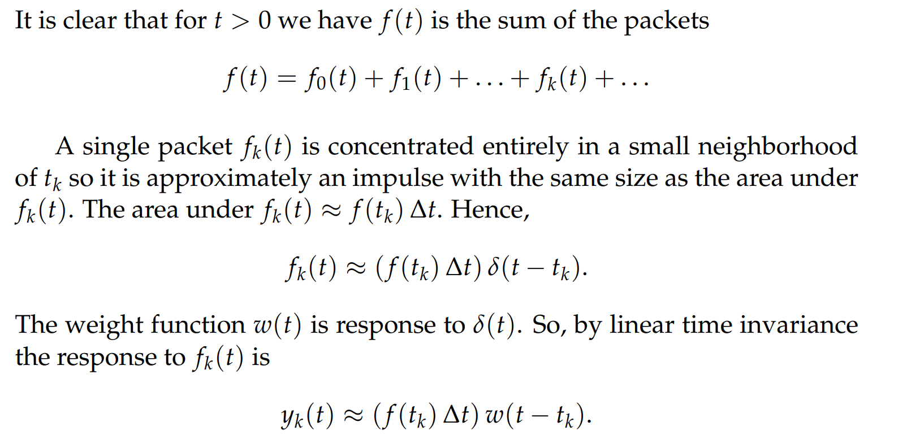

# 1 Convolution
## Intro
[Intro.pdf](https://www.yuque.com/attachments/yuque/0/2022/pdf/12393765/1658395626237-83465e9f-4b05-4484-8a49-c78bc88ce144.pdf)

## Defintion and Properties
[Definition and Properties.pdf](https://www.yuque.com/attachments/yuque/0/2022/pdf/12393765/1658396006693-f6a8e0d3-bf63-46d2-b7dd-e136be8ac485.pdf)
### Definition

### Examples
#### Transformation with convolution
> 

**Key**

#### Solviing IVP
> 
> 在`1.6`节中有求`IVP`的两种方法总结

**Key**

#### f(t)*1
> What is the convolution for $f(t)*1$?

**Key**$f(t)*1 = \int_{0}^{t}f(u)\times 1du=\int_{0}^{t}f(u)dt$

### Properties**⭐⭐⭐**
#### Basic Properties
> 
> **其中关于**`**Commutivity**`**的证明, 注意换元时微分符号也要变化**
> 
> **关于**`**Associativity**`**的证明**
> 
> 
> 

#### Intermediate Properties
> 
> 蓝框选中的这个`Property`是在`3.4.2`中出现的`Delta Function`的重要性质

# 2 Green's Formula
## Recaps
> 

> 

## Green's Formula Definition
[Green's Formula.pdf](https://www.yuque.com/attachments/yuque/0/2022/pdf/12393765/1658396127109-ddb24e08-7d32-4a79-87d8-56787a650884.pdf)
> 
> 
> - It tells us the response to any input** once we know the unit impulse response**. 
> - It gives us that** response as an integral** which can be computed numerically if necessary. 
> - For many physical systems the **impulse response** can be measured directly or deduced from measurements. 
> - So, Green's formula gives us a method for predicting the system's response to any input.  

## Weight Function
### Definition
> 介绍了卷积的一种直观解释

>  The unit impulse response is also called the **weight function .**
>  If we think of an integral as a `sum` , then Green's formula shows that the solution `y(t)` to$(1)$ is given as **a weighted sum of the small bits of input**, $f(τ) dτ$ is the amount of input at time $\tau$ before time$t$. Each piece is weighted by $w(t − τ)$.  这个$w(t-\tau)$就是权重大小, 在下面的例子中可以看到，这里的$w(t-\tau)=e^{-k(t-\tau)}$

### Example⭐⭐⭐
> **问：At time t, how much waste is in left total? **

> - `Initial amount` $A_0$, `decay factor`$k$, $A(t)=A_0e^{-kt}$, 
> - $f(t)$是`dumping rate`就是在$t$时间我动态加入的速率(`kilos / year`) ,`Dumping rate is the amount dumped in` $[t_i,t_{i+1}]$= $f(t)\Delta t$, $\Delta t$越小越精确
> - `Amount dumped in` $[u_i,u_{i+1}]=f(u_i)\Delta u$
> - `Amount that has been decayed since time `$u_i$`viewing from time` $t$: $f(u_i)\Delta ue^{-k(t-u_i)}$
> - `Total Amount left at time t`: $\sum_{i=1}^{n}f(u_i)e^{-k(t-u_i)}\Delta u$
> - 当$\Delta u\to 0$, $\int_{0}^{t}f(u)e^{-k(t-u)}du=f(t)*e^{-kt}$, 这就是卷积的形式

> 因此，卷积也可以看成是一个`Weighted Sum`在极限状态下的积分表示

## Proof for Green Formula
[Proof of Green's Formula.pdf](https://www.yuque.com/attachments/yuque/0/2022/pdf/12393765/1658396181808-db9f4e1f-a092-46ad-bc0e-4c58986bdc63.pdf)
### Statements
> 
> 也就是说如果我们知道一个系统在`Unit Impulse`的输入下的`Repsonse`, 我们就可以通过卷积公式求出对于任意$f(t)$输入下系统的`Response`

### Proof
#### 分割时间轴
> 

#### 离散化输入
> 
> 

#### 使用`Delta`函数
> 
> **注意:**
> -  这里的$(f(t_k)\Delta t)$表示我在$\Delta t\to 0$的时候$f(t_k)$的`Spike`的高度， 像一根针一样，所以我们求这个`Spike`附近的$\Delta t$范围内的面积$f(t_k)\Delta t$, 表示的就是我$\Delta t\to 0$过程中`Spike`的大小(维持不变)，但是通过积分可以得到`Spike`的高度(`Delta Function`的性质`2`)
> - 实在觉得难理解的话可以类比`Weight Function`中的`Example`中关于$f(t)\Delta t$的表述来理解, $f(t)$是输入速率，需要乘上$\Delta t$才能表示输入的量
> - 这里的$\delta(t-t_k)$其实没什么意义，毕竟只是为了描述我们的输入只在$t_k$附近的很小的区域有值
> - 然后，$f(t_k)\Delta t\delta(t-t_k)$作为$t_k$时刻的输入，`Response`就是$f(t_k)\Delta tw(t-t_k)$, $w(t-t_k)$就是`Weight Function`
> - 然后每一个$t_k$相加，让$\Delta t\to 0$, 得到积分表达式，这个积分的形式就是卷积

#### 使用Superposition
> 
> 
> $T$就是现在的时间，$t$就是现在之前的时间， $f(t)$就是$T$之前的在时间$t$处的输入,  所以我们有了后续的`Causality`原则

### Causality⭐⭐⭐
> 

## Examples
[Examples of Green's Formula.pdf](https://www.yuque.com/attachments/yuque/0/2022/pdf/12393765/1658396191581-8bea42a1-312d-4016-befc-14414d6ff285.pdf)
### Example 1: Solving IVPs with Green Formula
> 

**Key**

### Example 2: Finding particular solution
> 

**Key**
在`3.5.3`中有使用常规方法求解这个微分方程的方法

# 3 Applet
[Guidance Video.mp4](https://www.yuque.com/attachments/yuque/0/2022/mp4/12393765/1658396312667-20adb473-471e-4cff-addb-fbf3fe3c947b.mp4)
## Simple Example

> **高亮块就是我新增的贡献(随着时间递减)**
> **高亮块的左边界，就是我们在**$\Delta t$**时间内的输入，每个**$\Delta t$**内的输入都是**$f_k(t)\Delta t$**,**
> **所以仔细观察图像我们可以发现卷积积分的东西就是我们在最终的**$t$**时刻之前连续投放放射性物质(放射性物质按照一个 **`**weight function**`**衰变)在**$t$**时刻最终累积剩下的仿射性物质的总量，就是图中的蓝色的面积总和, **`**Step Size**`**越小，我们求得的面积就越精确**
> **用于河道放射性污染物治理的存量统计，非常有用**

## Another Example

# Practice Problems
[Practice Problems.pdf](https://www.yuque.com/attachments/yuque/0/2022/pdf/12393765/1658405449632-22f65b3c-ab0a-4207-89c1-a5ce4ca3a37f.pdf)
## Assertion

## P1: 计算卷积（换元）⭐⭐⭐
> 

Key

## P2: Justify the Assertion⭐⭐⭐
> 

Keys
Justification on Assertion
Let's make this thing clear:
对于这个`Assertion`, 我们要证明是的$t>0$时，$x(t)=\int_{0^-}^{t^+}q(\tau)d\tau$成立

1. 我们可以通过证明$\dot{x}(t)=q(\tau)$来间接证明这个式子成立
2. 我们将$q(t)$看成一个`Generalized Function`, 且`Regular Part`是$q_r(t)$, `Singular Part`是$\sum_{i=1}^{n}\delta_i(t)$
3. 对于`Regular Part`, 由微积分基本定理可知，成立
4. 对于`Singular Part`, 说实话有点难懂

 
## P3: 卷积的重要理解⭐⭐⭐⭐⭐
> 

**a)**
非常重要, 这里其实说`Effectively Pick Out`不太准确，因为我们只有通过积分才能将$f(a)$的值提取出来，如果不对$f(a)\delta(t-a)$积分的话是得不到$f(a)$的值的
**b)**

几个重要的理解纠正:

- 首先是定义: $f*g(t)=\int_{0^-}^{t^+}f(\tau)g(t-\tau)d\tau=\int_{0^-}^{t^+}f(t-\tau)g(\tau)d\tau(By \space Associativity)$
- 然后是$f(t)*g(t-a)=\int_{0^-}^{t^+}f(t-\tau)g(\tau-a)d\tau$, 这里$g(\tau)$可以和$g(t)$做一个对应, 表示`Weight Function`, 那$g(t-a)$自然就对应被积函数中的$g(\tau -a)$了。 

## P4: 验证`Unit Impulse`
> 

**a)**
要注意注意再注意: 只要式子里出现$u(t)$, 就要在$t>0$时看成$u(t)=1$
**b)**
**c)**
对于连续函数$f(t)$，我们的积分符号使用$\int_{0}^{t}f(t)dt$就行， 如果是不连续函数就用$\int_{0^-}^{t^+}f(t)dt$

# Problem Set
[Problem Set.pdf](https://www.yuque.com/attachments/yuque/0/2022/pdf/12393765/1658405492192-1260ec7e-795d-42fa-b81e-81675f17abb4.pdf)
## P1: 指数积分⭐⭐⭐
> 

Keys
**要使用**`**Complex Replacement**`**, 在**`**1.7.2**`**中有详细介绍**

## P2: 卷积求解⭐⭐
> 

Key

## P3: Commutivity⭐⭐
> 

Key

## P4: Associativity⭐⭐
> 

Key
