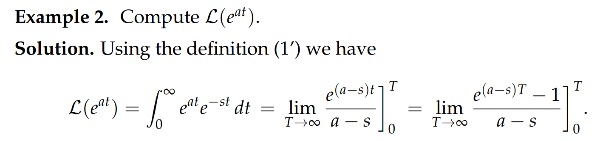
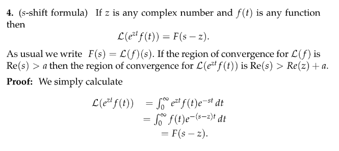
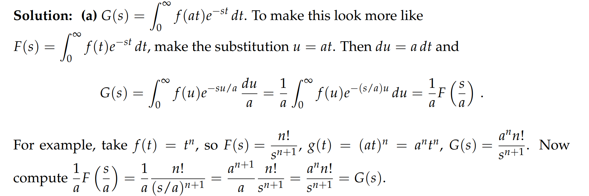

# 1 什么是拉普拉斯转换?
## 1.1 概述
[Intro.pdf](https://www.yuque.com/attachments/yuque/0/2022/pdf/12393765/1658661229803-5030bf35-4c64-4440-93a7-ff97b1069dfd.pdf)
### 1.1.0 拉普拉斯转换源于何处
参考: [https://zhuanlan.zhihu.com/p/107378411](https://zhuanlan.zhihu.com/p/107378411)
> 拉普拉斯变换源于幂级数  ，在计算机表示法中不将系数$a_n$看作是常数，而将其视为$n$的函数，即  。
> 将幂级数公式中的 $a(n)$ 和幂级数求和 $A(x)$ 联系起来：
> 
> 给定系数执行幂级数求和的操作，给出一个特定的联系，即取一个定义在正整数上的离散函数，操作得到一个连续函数。
> 如果将离散的幂级数公式写成连续函数的积分形式即为：
> 
> $A(x)=\sum_0 a(n)x^n\Delta n\sim A(x)=\int_0^{\infty}a(t)x^tdt$, 这里$\Delta n \to 0$
> 通常我们希望`Weight Function`是以指数形式出现，因为指数函数以$e$为底数，因此写成  。于是有  。
> 为保证此广义积分收敛，要求$0<x<1$，则有$lnx<0$，于是记$lnx=-s$。将$a(t)$记为$f(t)$则积分公式变为  。这就是拉普拉斯变换的公式，最常用的标记为 $\mathcal{L}(f(t))=F(s)$; 也可以简单地写成$f(t) \rightsquigarrow

F(s)$
> 注意“变换”和“算子”的区别，算子输入 $f(t)$，得到 $g(t)$ ，而变换输入 $f(t)$，得到 $F(s)$，**自变量发生了变换**。实际应用中 $t$通常代表时间，而$s$ 代表频率。
> 拉普拉斯变换是线性变换，满足  。
> 本质上，拉普拉斯转换就是将一个无穷级数的和表示为一个`Piecewise Continuous`的函数和一个指数阶函数的乘积的积分

### 1.1.1 拉普拉斯转换能干嘛?
> **之前我们探讨过**`**Linear Operator**`**将一个函数作为输入，输出一个函数的导数，但是至少自变量是不变的，而拉普拉斯转换会将自变量改变**
> 拉普拉斯转换输入一个函数$f$, 输出一个函数$g$, **但是自变量不相同**, 就好比是$f(t)\to F(s)$, $s$可以是复数
> $f(t)$和$F(s)$本质是对相同现象的不同描述，$f(t)$是在时间空间探讨信号，而$F(s)$是在频率空间探讨信号
> 
> 
> 

### 1.1.2 优点⭐⭐⭐
> 

## 1.2 标准定义
[Definition of Laplace Transform.pdf](https://www.yuque.com/attachments/yuque/0/2022/pdf/12393765/1658661799599-64ff9703-39d9-4ea7-8f38-962e0977e7c2.pdf)

### 1.2.1 定义
> 一个实变函数$f(t)$的拉普拉斯转换的结果是一个另一个函数$(\mathcal{L}f)(s)$，$s$一般是复数
> 
> **有几个注意点: **
> - $\mathcal{L}f(s)$只定义在那些使得`Improper Integral`$\int_{0^-}^{\infty}f(t)e^{-st}dt$收敛的$s$上, 也就是**定义域有限制**
> - $s$**可以是复数**
> - 积分的符号中使用了$0^-$,表明和`Convolution`一样, 被积函数是可以为$\delta(t)$函数的，也就是**被积函数可以是**`**Generalized Functions**`
> - 和`Convolution`一样, **拉普拉斯转换只关心输入函数在**$(0^-,\infty)$**上的行为**
> 

> **关于**`**Improper Integral**`**的定义, 本质就是积分上下限的极限为**$\pm\infty$
> 

### 1.2.2 一些记号⭐⭐⭐
#### 简写
> 

#### 匿名函数表示
> 

#### 函数偏移
> 

#### 总结⭐⭐⭐
> 

## 1.3 一些实例⭐⭐⭐
### 例1: f(t)=1 的拉普拉斯转换
> 
> **这里回顾了一下**`**Improper Integral**`**的概念**
> $s=0$的时候$\frac{e^{-sT}-1}{-s}\to \infty$, 所以积分发散
> 这里可以看到，拉普拉斯函数将$f(t)=1$转换成$F(s)=\frac{1}{s}(s> 0)$

### 例2: 计算拉普拉斯转换
> 
> 
> 至此，我们得到了拉普拉斯转换表中的两项
> 第二项就是我们说的`Exponential Shift Formula`

### 例3: 三角函数的拉普拉斯转换
> 计算$f(t)=cos(at)$的拉普拉斯转换

Key$cos(at)=\frac{e^{iat}+e^{-iat}}{2}$
所以根据例`2`中得到的公式，我们很快得到: $\mathcal{L}(f)(s)=\frac{1}{2}(\frac{1}{s-ia}+\frac{1}{s+ia})=\frac{s}{s^2+a^2},s>0$
由对称性，$sin(at)\rightsquigarrow\frac{a}{s^2+a^2},s>0$

## 1.4 Linearity
> 
> 类比矩阵转换$\bf A(x+y) = Ax+Ay$

# 2 F(s)收敛区间/定义域
[Domain of F(s).pdf](https://www.yuque.com/attachments/yuque/0/2022/pdf/12393765/1658664830262-675da84a-ed0d-407c-8ee9-41b3fa9a4243.pdf)

## 2.1 关于复数`s`和收敛区间⭐⭐⭐
> 

###### 

## 2.2 Complex Frequency⭐⭐⭐
> 

## 2.3 是否有拉普拉斯转换⭐
### 有拉普拉斯转换的函数
> **指数阶的函数都是有拉普拉斯转换的**
> 
> 注意是$|f(t)|<Me^{at},\exist a,\exist M, \forall t$, **换句话说，如果我们想要证明一个函数是**`**n**`**阶的，我们可以认为这个函数和**`**n**`**阶函数之间之差一个常数倍, 这个思想在**`**Asymtotic Analysis**`**中显得非常重要。**
> 
> **注意：**
> 注意这里第一行中的$n>0$, 这四个函数都比指数阶要小，所以`Exponential Order`是`0`， 换句话说，如果一个函数$f(t)$的`Exponential Order`是`0`，则这个函数满足$\lim_{t\to \infty}\frac{f(t)}{e^{at}}=0$, 也可以是$|f(t)|<Me^{at},\exist a,\exist M, \forall t$
> **一些推导：**
> 1. $f(t)=sin(t)$是`Exponential Order 0`的函数, 因为$|sin(t)|=1\leq e^{0t}$
> 2. $f(t)=t^n$是`Exponential Order 1`的函数。令$q(t)=\frac{t^n}{e^t}< M,\exist M$, 因为对于$q(t)$来说，当$t\to \infty$, 我们使用洛必达法则，$q(t)=\frac{t^n}{e^t}\sim \frac{0}{e^{t}}=0$
> 
而$q(\infty)\to 0,q(0)\to0$， 所以$\exists M,q(t) < M$, 所以$f(t)<Me^{1t}$
> 
> **注意:**
> $\frac{1}{t}$没有拉普拉斯转换:  $\int_0^{\infty}e^{-st}\frac{1}{t}dt$发散，因为被积函数$\to \infty$
> **总结：**
> - `Exponential Order`为`0`的函数在拉普拉斯转换的时候收敛区间是$Re(s)>0$, $s$是被积函数中的那个复数
> - 所有指数阶函数都没有拉普拉斯转换

### 没有拉普拉斯转换的函数
> 

> 
> $e^{t^2}>e^{kt}$, 不管$k$有多大, 所以不满足$|f(t)|<Me^{at}$

### 证明指数阶函数有拉普拉斯转换
> 
> 这里$|e^{ikt}|=1$, `k`是任意实数, 因为由欧拉公式$e^{ikt}=cos(kt)+isin(kt)$， 看成复平面内的坐标，得到上述结论
> 这里用到了夹逼原则，就是说如果$0<f(t)<g(t)$, 如果$\int_0^{\infty}g(t)dt$收敛, 则$\int_0^{\infty}f(t)dt$收敛。

## 2.4 Domain of F(s)
> 

## 2.5 t^n的拉普拉斯转换⭐⭐
> 我们要求$\int_0^{\infty}t^ne^{-st}dt=t^n\frac{e^{-st}}{-s}\big|^{\infty}_0-\int_0^{\infty}nt^{n-1}\frac{e^{-st}}{-s}dt$
> 因为$\lim_{t\to \infty}\frac{t^ne^{-st}}{-s},(s>0)=\frac{1}{s}\lim_{t\to \infty}\frac{t^n}{e^{st}}=0(By\space L'hospital\space Law)$
> 所以$t^n\frac{e^{-st}}{-s}\big|^{\infty}_0 =0-0=0$
> 所以$\int_0^{\infty}t^ne^{-st}dt=0-\frac{n}{s}\int_0^{\infty}t^{n-1}e^{-st}dt$, 得到一个简化的`Laplace Transform`的形式
> 所以$\mathcal{L}(t^n)=\frac{n}{s}\mathcal{L}(t^{n-1})=...=\frac{n!}{s^n}\mathcal{L}(t^0)$, $\mathcal{L}(t^0)=\frac{1}{s}$
> 所以$\mathcal{L}(t^n)=\frac{n!}{s^{n+1}}$

## 2.6 Quiz
> 

Key**使用**`**2.5**`**中的递归公式即可**

# 3 常见拉普拉斯转换及推导
## 3.1 常用拉普拉斯转换表
> **转换表第一版**

[Laplace Transform Table.pdf](https://www.yuque.com/attachments/yuque/0/2022/pdf/12393765/1658665759125-5afbf948-bb9e-4942-97b6-90dc53ddaa6b.pdf)

## 3.2 一些拉普拉斯的推导⭐⭐
[More Entries for Laplace Transform Table.pdf](https://www.yuque.com/attachments/yuque/0/2022/pdf/12393765/1658665774563-fee6e35c-30fd-4735-bdb2-2e2039c103cc.pdf)

### 3.2.1 Complex Replacement
> 

### 3.2.2 s-shift Rules
> 
> 
> 

### 3.2.3 t-derivatice Rules
> 我们要求函数$f(t)$的导数的拉普拉斯转换，也就是$\mathcal{L(f')}$
> 我们要使用分部积分法进行求解
> 首先我们先复习一下分部积分法：
> $\int_{0}^t u(t)v'(t)dt = (u(t)v(t))\big|_{0}^{t}-\int_{0}^{t}u'(t)v(t)dt$
> 还有一种写法也比较常见: $\int udv = (uv)\big|_{0}^{t}-\int vdu$, 这是忽略自变量的写法，本质上和上面的写法含义一致。可以想象$u=u(t), dv=v'(t)dt$

:::success
对于$\mathcal{L(f'(t))}$来说,  我们有:
$\int_{0^-}^{\infty}f'(t)e^{-st}dt=\int_{0^-}^{\infty}e^{-st}f'(t)dt=\int_{0^-}^{\infty}e^{-st}d(f(t))$, 这里$d(f(t))=f'(t)dt$
我们使用分部积分: $\int_{0}^{\infty}e^{-st}d(f(t))= e^{-st}f(t)\big|_0^{t}-\int_{0}^{\infty}(-s)e^{-st}f(t)dt=\lim_{T\to \infty}e^{-st}f(t)\big|_0^{T}+\int_{0}^{t}se^{-st}f(t)dt\newline =e^{-sT}f(t)-f(0^-) + sF(s)= sF(s)-f(0^-),Re(s)>0$
**所以我们得到了有一个重要公式: **$\mathcal{Lf'(t)}=sF(s)-f(0^-)$
**以下都是关于函数导数的拉普拉斯转换:**

:::

### 3.2.4 s-derivative Rules
:::success
在`Unit 3.9.1.2`中详细推导
:::

# 4 Delta Function的拉普拉斯转换
[Laplace Transform for the Delta Function.pdf](https://www.yuque.com/attachments/yuque/0/2022/pdf/12393765/1658665898740-8b5dfc81-3b1f-40ac-acac-d9d55bdbbe70.pdf)
> 
> 这里用到了`Delta Function`的性质`3`

# 5 Practice Problems
[Practice Problems.pdf](https://www.yuque.com/attachments/yuque/0/2022/pdf/12393765/1658752066298-6a6c6da3-86c4-4c42-95be-41d87463d340.pdf)

## P1: Laplace Transform: Basics
> (1) Recall the definition of the Laplace transforma of $f(t)$
> (2) Compute directly:
> (a) $\mathcal{L}(1)$
> (b) $\mathcal{L}(e^{at})$
> (c) $\mathcal{L}(\delta(t))$and give domains of convergence
> (3) Use (a) to give $\mathcal{L}[7+8e^{2t}+9e^{-3t}]$
> (4) Recall $\mathcal{L}(cos(wt))$and $\mathcal{L}(sin(wt))$

Key(1): $\int_{0^-}^{\infty}f(t)e^{-st}dt$
(2): 
(a): $\mathcal{L}(1)=\int_{0^-}^{\infty}e^{-st}dt=\lim_{T\to \infty}\frac{e^{-sT}}{-s}\big|^T_{0}=\begin{cases} \frac{1}{s} & \mathcal{Re}(s)>0 \\ diverges&\mathcal{Re(s)}\leq0\end{cases}$, 因为$s=a+bi$, 但是$\mathcal{Im}(s)=b$不影响积分收敛性
(b): $\mathcal{L}(e^{at})=\int_{0^-}^{\infty}e^{(a-s)t}dt=\lim_{T\to \infty}\frac{e^{(a-s)T}}{a-s}\big|^T_{0}=\begin{cases} \frac{1}{s-a} & \mathcal{Re}(s)>a \\ diverges&\mathcal{Re(s)}\leq a\end{cases}$
(c): $\mathcal{L}(\delta(t)e^{-st})=\int_{0^-}^{\infty}\delta(t)e^{-st}dt=e^{-s\times 0}=1$(性质`3`), **which converges for all s (thanks to the delta function)**
(3): $\mathcal{L}[7+8e^{2t}+9e^{-3t}]=\mathcal{L}(7)+\mathcal{L}(8e^{2t})+\mathcal{L}(9e^{-3t})=\frac{7}{s}+\frac{9}{s-2}+\frac{9}{s+3}$ 
(4): $\mathcal{L}(cos(wt))=\frac{s}{s^2+w^2},\mathcal{L}(sin(wt))=\frac{w}{s^2+w^2}$

## P2: Compute Laplace Transform
> 

Key

# 6 Problem Sets
[Problem Set 1.pdf](https://www.yuque.com/attachments/yuque/0/2022/pdf/12393765/1658752291913-108162d2-3305-4acf-bcf9-6c3ef4cbc4d1.pdf)
[Problem Set 2.pdf](https://www.yuque.com/attachments/yuque/0/2022/pdf/12393765/1658752291951-7a365859-c195-4287-849a-9920df1d05cf.pdf)

## P1: 拉普拉斯转换的定义
> 

Key
类比`2.1`中的推导即可, 本质上$z$和$s$都是复数

## P2: 计算拉普拉斯函数
> 

Key

## P3: 三角函数写成指数⭐⭐
> 

Key
**两个重要公式:**
$cos(wt) = \frac{e^{iwt}+e^{-iwt}}{2}$
$sin(wt) = \frac{e^{iwt}-e^{-iwt}}{2}$

## P4: 积分换元⭐⭐
> 

Key
本质就是找到函数变换($f(t)\rightsquigarrow g(t)$)后相应的拉普拉斯函数之间的变换($F(s)\rightsquigarrow  G(s)$)

## P5: 二重积分⭐⭐⭐
> 

Key
这道题非常好，值得反复看, 尤其是积分区域的确定

## P6: 分段连续函数收敛区间⭐⭐
> 

Key

