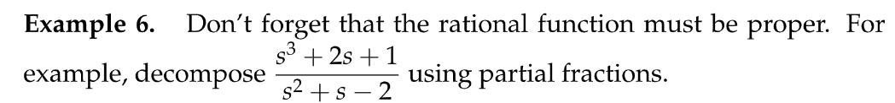
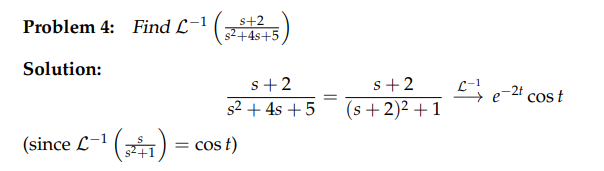

:::info
本章我们介绍如何将一个拉普拉斯转换后的函数$F(s)$转换成转换前的样子$f(t)$
例如: $F(s)=\frac{1}{s-5}\rightsquigarrow e^{5t}=f(t)$
又例如我们要求$F(s)=\frac{1}{s(s+3)}$的$\mathcal{L}^{-1}$, 是$F(s) =\frac{1}{3}(\frac{1}{s}-\frac{1}{s+3})\rightsquigarrow  \frac{1}{3}(1-e^{-3t})=f(t)$
我们需要巩固一下`**Heaviside Cover Up Method和Partial Fractions**`的技巧，来应对这种形式的求解
:::

# 1 Partial Fractions⭐⭐
[Partial Fractions.pdf](https://www.yuque.com/attachments/yuque/0/2022/pdf/12393765/1658845490918-8aa719f7-465c-4a08-9587-ef447a3b7cfd.pdf)

## 1.1 Intro
:::info
这里我们介绍`Partial Fraction`，一个可以帮助我们将不在`Laplace Transform Table`中的转换变成表中有的形式，然后就可以愉快地套用公式了; 
回到开始的例子，$F(s)=\frac{1}{s(s+3)}$, 在表中没有对应的拉普拉斯转换, 我们就可以使用`Partial Fractions`将其转换为$F(s) =\frac{1}{3}(\frac{1}{s}-\frac{1}{s+3})$, 其中$\frac{1}{s}, \frac{1}{s+3}$都可以在表中找到对应的转换
:::

## 1.2 Rational Functions
### 什么是有理函数
:::info
**首先我们需要介绍一下什么是**`**Rational Functions**`
它本质上就是两个有理函数的比值: $\frac{p(s)}{q(s)}$, 比如$\frac{s+1}{s^2+7s+9}$, $\frac{s^2+7s+9}{s+1}$
**但是，我们要对这两个有理函数做一个区分**

- 我们称左边的有理函数为`Proper Rational Function`, 因为他的分子的阶数比分母的小
- 我们称右边的有理函数为`Improper Rational Fuction`,因为他的分子的阶数比分母的大
:::

### 长除法
:::info
对于`Proper Rational Function`来说，我们可以直接使用`Partial Fractions`方法对其进行展开
对于`Improper Rational Function`来说，我们必须先使用**长除法**`**Long Division**`将其转换成`Proper Rational Function`
具体的使用流程如下
:::
:::success

:::

### 总结
> - 一定得是`Proper Rational Function`我们才能使用下面要介绍的`Partial Fractions`方法
> - 如果是`Improper Rational Funtion`我们必须先将其转换成`Proper Rational Function`才能继续使用`Partial Fractions`方法, 因为这种情况下，分母上的`Factors`无论以何种方式组合，因为各种组合的最高阶数一定比分子小(根据定义)，所以无论如何都不能通过`Undetermined Coefficients`的方式配平系数

## 1.3 Partial Fractions
:::success
对于$\frac{p(s)}{q(s)}$中的`q(s)`因式分解的结果，取决于$q(s)=0$产生的根的线性表达式
换句话说，对于`Quadratic`的$q(s)$来说，假设$r_1$$r_2$是它的根，则$q(s) = (s-r_1)(s-r_2)$
而对于其他阶的$q(s)$来说，我们可能得到各种各样因式分解的形式
下面我们对几种常见的因式分解的形式进行讨论
:::

### 1.3.1 Linear Factors
> 假设我们的`q(s)`被因式分解为了不同的`Linear Factors`(定义为$(x-C)$)

> 
> 这个例子中我们通过`Partial Fractions`将有理函数转换为了两个`Laplace Transform`表中存在的转换项，于是可以直接查表达到逆转换结果。我们注意到分子上出现了系数$A$和$B$, 这些`Undetermined Coefficients`的目的是为了我们能够确保有理函数转换前后的形式一致
> **上述求解**$A$**和**$B$**我们有简化方法:**
> 
> 
> **总的来说，对于任意的**$\frac{p(s)}{q(s)}$**，我们有:**
> 

#### Another Linear Factor Example
> 

### 1.3.2 Quadratic Factors
> 

#### Example
> 

Key

#### 注意事项
##### 可以进一步分解的高次项
> 有些高次项可以被因式分解为低次的`Factors`,要注意
> 

##### 有理函数才能使用
> 

Key

#### 
##### 
### 1.3.3 Repeated Linear Factors
> 

#### Examples
##### E1
> 
> 

### 1.3.4 Repeated Quadratic Factors
> 

#### Example
> 
> 
> 

### 1.3.5 Complex Factors
> 

#### Example
> 

## 1.4 Heavside Cover-up Method
[Heavside Cover-up Method.pdf](https://www.yuque.com/attachments/yuque/0/2022/pdf/12393765/1658845535319-56ea03ed-cc9e-40af-a444-f7a550687dc8.pdf)
:::info
首先我们介绍`Heavside Cover-up Method`是什么
他可以帮助我们**更快速**确定一个`Linear Factors`的`Coefficient`
**注意: 只能用于**`**Linear Factors/Repeated Linear Factors**`**的分子的系数的快速确定，**`**Quadratic Factors**`**不适用**
**原因很简单:**
**对于一个形如**$\frac{1}{(x-a_1)(x-a_2)}$**的实数函数，我们可以将其使用**`**Partial Fractions**`**展开，变成**$\frac{1}{(x-a_1)(x-a_2)}=\frac{A}{x-a_1}+\frac{B}{x-a_2}$**，此时注意到我们的分子上面是不含有**$x$**的一次项的，于是我们可以左右两边同乘以**$x-a_1$**然后两边代入**$x=a_2$**得到系数**$B$**, 或者左右两边同乘以**$x-a_2$**然后两边代入**$x=a_1$**得到系数**$A$
**但是对于一个**`**Quadratic Factors**`**的实数函数**$\frac{1}{(x^2+a_1)(x-a_2)}=\frac{Ax+B}{x^2+a_1}+\frac{C}{x-a_2}$**, 如果我们还是像之前那样两边同乘以**$x^2+a_1$**由于分子上有**$x$**消不掉， 无法直接求出系数**$A,B$**， 但是可以通过两边同乘以**$x-a_2$**求出系数**$C$**, 所以说**`**Heavside Coverup**`**方法只能对**`**Quadratic Factors/ Repeated Quadratic Factors**`**做一些简化， 最终还是需要**`**undetermined coefficients**`**来求出所有系数的**
:::

# 2 三个拉普拉斯转换公式证明⭐
## 2.1 公式证明
[Repeated Quadratic Factors.pdf](https://www.yuque.com/attachments/yuque/0/2022/pdf/12393765/1658846026964-17f8317e-e243-41a2-9411-3211e807bbe0.pdf)
> 本章介绍了三个拉普拉斯转换公式的推导，运用的是`Partial Fraction`的知识
> 
> 推导过程使用了非常重要的指数函数和三角函数互相转换的公式，`Heaviside Cover-up Method`和拉普拉斯转换表

## 2.2 和`Resonance`的联系⭐
> 
> **这里讲的是一个重要思想，就是在频率空间的函数**$F(s)$**如果在分母上有**`**Repeated Factors**`**，则会在时间空间中有一个**$t$**的乘子。**
> 前面`Unit 2.7`我们提到了共振现象并研究了在输入频率$w_r$和系统自然频率$w_0$接近的时候，会发生共振现象，结果就是`Amplitude Response`非常大。
> 设想一下在系统没有阻尼的情况下: $\ddot{x}+w_0^2x=cos(wt)$, 此时特征多项式$p(iw)=w_0^2-w^2$, 如果$w=w_0$那么$x(t)=\frac{cos(wt)}{w_0^2-w^2}$无法定义, 所以我们会使用`ERF`公式求出在`Pure Resonance`的情况下系统的解是$x(t)=\frac{tcos(wt)}{2w}$, 振幅会随着时间的增加越来越大
> **这种带**$t$**的解的形式和我们拉普拉斯转换的结果之间有微妙的形式上的相似之处**

## 2.3 一些例子
[Laplace Inverse By Table Lookup.pdf](https://www.yuque.com/attachments/yuque/0/2022/pdf/12393765/1658846045199-941e2c9d-b071-4617-bfaa-acaaa5efebf5.pdf)

# 3 Problems
## Practice Problems
[Practice Problems.pdf](https://www.yuque.com/attachments/yuque/0/2022/pdf/12393765/1658920333301-74d746b6-eabe-437f-93c5-14b3d5d6d288.pdf)

### Some Formulas⭐
> 
> **其中, **`**s-shift Rules**`**,**`**s-derivative Rules**`**和**`**t-derivative Rules**`**都已在**`**3.7.3**`**中推导过**

### P1: Find the Laplace Transform
:::success

:::
**(1)**
**(2)**

**(3)**

## Problem Sets
[Problem Set.pdf](https://www.yuque.com/attachments/yuque/0/2022/pdf/12393765/1658921337743-bef1ceb7-fe72-414d-a9c9-cd35b01dff5b.pdf)
> 
> 这套题传达的重要思想是: 拉普拉斯转换可以叠加，比如第一题中$t^4$和$e^{\pi t}$可以看成是从左到右依次对$f(t)=1$的拉普拉斯转换$F(s)=\frac{1}{s}$进行各种偏移操作
> **但其实顺序没有任何关系，因为在积分符号中顺序打乱都没有关系。**

**(1): s-shift**
**(2): s-shift**
**(3): s-shift**
**(4): s-shift**
先对$F(s)$进行$e^{-2t}$偏移操作得到$F(s+2)$, 然后另$s+2=u$继续对$u$进行$cos(t)$操作得到$\frac{u}{u^2+1}$
**(5): Partial Fractions**
**(6): Partial Fractions**
