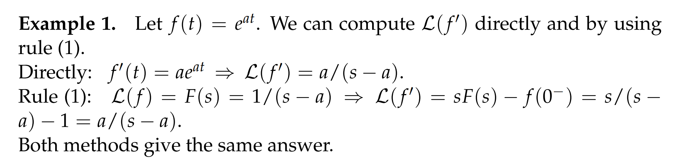
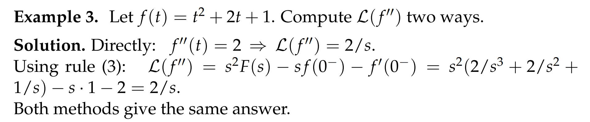
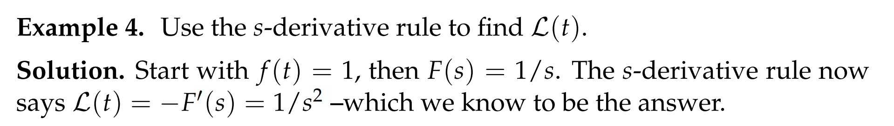
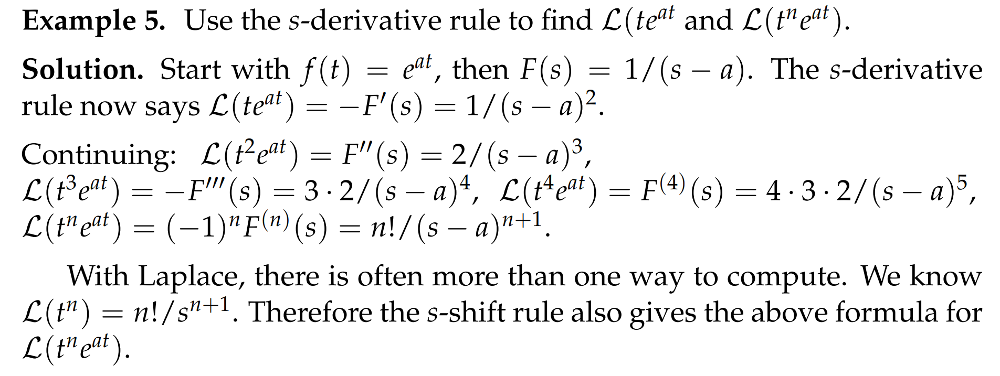
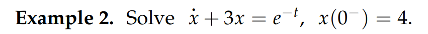
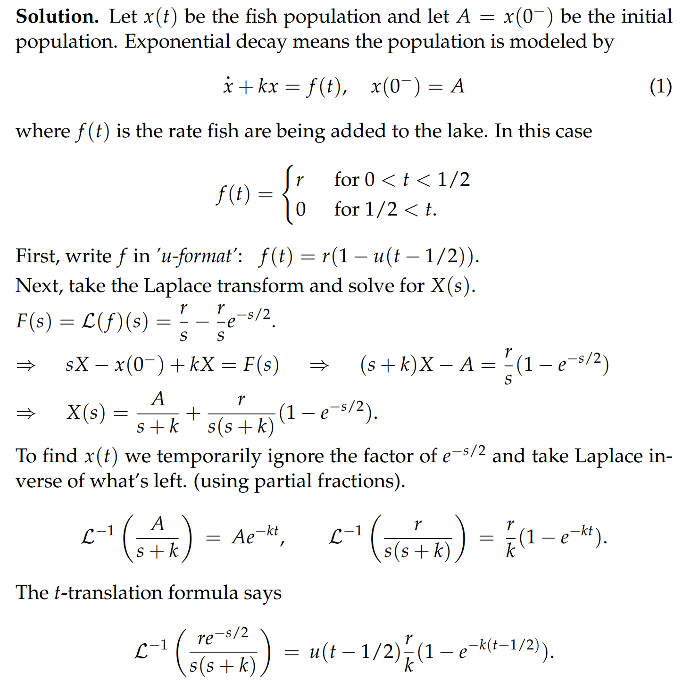
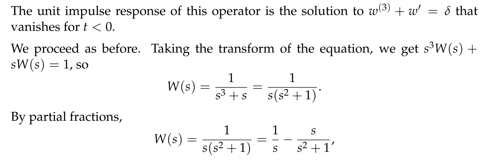
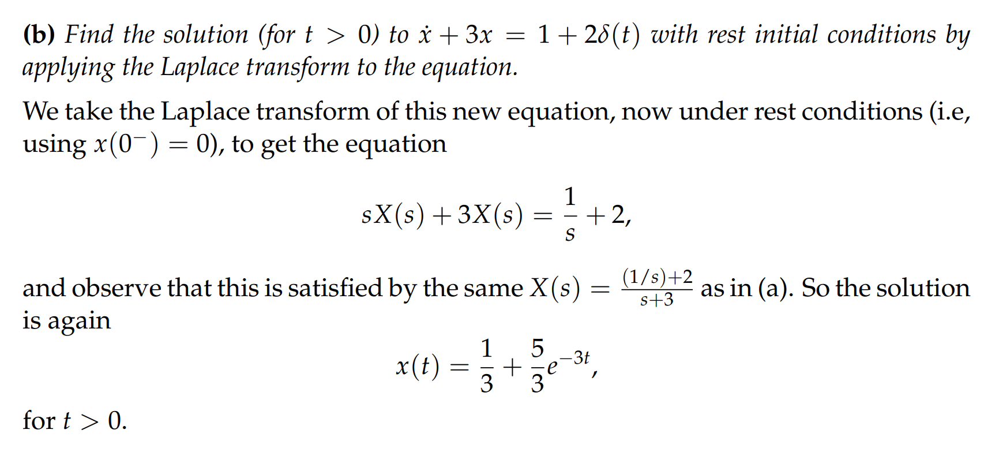
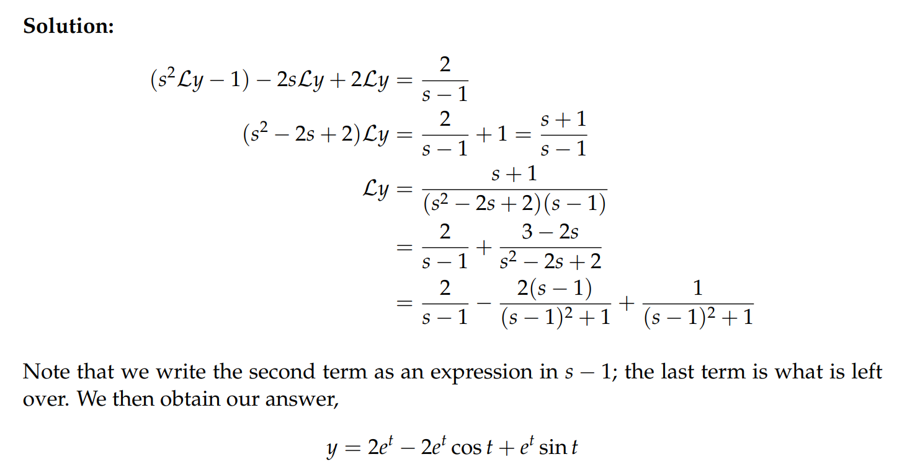

> 本章我们介绍如何用拉普拉斯转换来求解`LTI DE`的`IVP`问题
> 对于一个`LTI DE`$p(D)x=f(t)$, 如果$f(t)$是不连续`Discontinuous`的或者突变式`Impulsive`的, 使用拉普拉斯转换就会非常有用
> 本章的目标是探究函数$f(t)$的拉普拉斯转换和其导数$f'(t)$的拉普拉斯转换之间的关系， 目标是要找到形如$p(D)x=f(t)$（`with initial conditions`）的`IVP Problems`
> 我们将要讨论的方法是: 将等式两边都进行拉普拉斯转换，得到$\mathcal{L}(x(t))=X(s)$, 并对其求解，然后在使用逆拉普拉斯转换得到原来方程的解$x(t)=\mathcal{L}^{-1}(X(s))$

[Laplace Transform Table.pdf](https://www.yuque.com/attachments/yuque/0/2022/pdf/12393765/1658937541054-dc4ac4cb-2917-4df8-bf20-1727738645df.pdf)
> **转换表第二版（含导数）**

# 1 导数法则
[Derivative Rules.pdf](https://www.yuque.com/attachments/yuque/0/2022/pdf/12393765/1659178917226-a7ec5ce4-2995-4abd-a16a-c7e89998ad71.pdf)

## 1.1 t-derivative Rule⭐⭐
> 
> 

### Rule 1
:::info

对于$\mathcal{L(f'(t))}$来说,  我们有:
$\int_{0^-}^{\infty}f'(t)e^{-st}dt=\int_{0^-}^{\infty}e^{-st}f'(t)dt=\int_{0^-}^{\infty}e^{-st}d(f(t))$, 这里$d(f(t))=f'(t)dt$
假设$f'(t)$在$t=0$处连续，积分符号可以将$0^-$替换成$0$, 接着我们使用分部积分: $\int_{0}^{\infty}e^{-st}d(f(t))= e^{-st}f(t)\big|_0^{t}-\int_{0}^{\infty}(-s)e^{-st}f(t)dt=\lim_{T\to \infty}e^{-st}f(t)\big|_0^{T}+\int_{0}^{t}se^{-st}f(t)dt\newline =e^{-sT}f(t)-f(0^-) + sF(s)= sF(s)-f(0^-),Re(s)>0$
**所以我们得到了有一个重要公式: **$\mathcal{Lf'(t)}=sF(s)-f(0^-)$
对于$f(t)$来说，如果$f(t)$是`a`阶指数函数， 我们可以假设$f(t)=e^{at}$, 依此来判断收敛区间，比如在这个例子中，函数$f(t)$的拉普拉斯转换是$\int_{0^-}^{\infty}f(t)e^{-st}dt$, 此时收敛区间就是$Re(s)>a$的所有复数$s$
:::

### Rule 2
> 
> 

### 例子
#### E1: 指数阶连续函数
:::info

:::

#### E2: Unit Step Function
:::info

:::

#### E3: 计算二阶导数的拉普拉斯转换
:::info

:::

## 1.2 s-derivative Rule⭐⭐
### Rule
:::info

:::

### Proof
:::info

:::

### 例子
#### E1: 使用s-derivative rule
:::info

:::

#### E2:  使用s-derivative rule
:::info

:::

## 1.3 使用s-derivative 简化证明
:::info

:::

## 1.4 总结
:::info
我们可以发现:
对于`t-derivative Rule`，我们在对$f(t)$求导，结果就是$F(s)$乘上了一个$\bf s$因子
对于`s-derivative Rule`，我们在对$F(s)$求导，结果就是$f(t)$乘上了一个$\bf t$因子

:::

# 2 拉普拉斯转换的逆
[Precise Defintion of Laplace Inverse.pdf](https://www.yuque.com/attachments/yuque/0/2022/pdf/12393765/1659184142378-a66e3b20-baca-450b-bcc3-04abf0d1f62f.pdf)
## 2.1 值域
:::info
对一个拉普拉斯转换$f(t)\to F(s)$, 如果我们要求他的逆$\mathcal{L^{-1}(F(s))}$, 我们首先要研究$\mathcal{L}^{-1}(F)$的定义域和值域是什么
关于值域, 我们举一个例子：

通过观察拉普拉斯转换的形式$\int_{0^{-}}^{\infty}f(t)e^{-st}dt$, 我们可以看出，拉普拉斯转换只关注$f(t)$在$t>0$的部分，而不关心$t<0$时$f(t)$长什么样，于是我们可以猜测，$\mathcal{L}^{-1}$的值域，也就是拉普拉斯逆转换之后的函数在$t>0$时都是一样的，但是在$t<0$时不确定。上面的例子中， $\mathcal{L}^{-1}(\frac{1}{s})$在$t>0$上$f(t)=1$, 但是在$t<0$时可以是任何形态:

:::

## 2.2  逆转换结果的性质
:::info

拉普拉斯逆转换不关心$f(t)$在$t<0$上情况，也无法直接通过拉普拉斯逆转换确定，而是需要通过其他辅助条件确定完整的$f(t)$函数图像
:::

## 2.3 可去间断点
:::info
这一小节我们介绍有着相同拉普拉斯转换$F(s)$的$f(t)$和$f_1(t)$函数

他们在$t=a$处不同，尽管$\mathcal{L}(f(t))=\mathcal{L}(f_1(t))=\frac{1}{s}$(`This is because the integral is an area and the areas under two curves that differ like these are the same.`  )
由逆拉普拉斯转换的定义，我们有: $\mathcal{L}^{-1}(\frac{1}{s})=f(t)\space or\space f_1(t)$
我们可以任选一个，但是在物理学上我们倾向于选择连续函数$f_1(t)$, 比如$f_1(t)$可以描述一个物理量随着时间的连续变化。
回到那个间断点，我们称$f(t)$中$t=a$处的间断点为`Removeable discontinuity`（在适当改变$f(a)$之后函数可以变得连续。）
:::

## 2.4 可去间断点的定义
:::info

函数在$t=a$被定义，且$f(a^+)=f(a^-)\neq b$； 如果我们可以适当改变$f(a)$的值使$f(t)$变得连续, 则$t=a$处的间断点成为可去间断点。
:::

# 3 用拉普拉斯转换求解IVPs
[Laplace, Solving IVPs.pdf](https://www.yuque.com/attachments/yuque/0/2022/pdf/12393765/1659187817524-979f3801-a6e3-4a02-bbe0-d165aa4ea137.pdf)
## Example 1**⭐⭐⭐⭐**
:::info

:::
**Key**`Rest IC`在`Unit 3.5.1`中有定义

注意$x(0^+)$的确定，我们在`Unit 3.5`中有详细介绍

## Example 2**⭐⭐**
:::info

:::
Key

## Example 3**⭐⭐⭐**
:::info

:::
Key这里注意`**Unit Impulse Response**`**特指有**`**Rest IC**`**的**`**IVP**`**问题**

## Example 4: Unit Impulse Response
:::info

:::
Key

## Example 5: Partial Fractions
:::info

:::
Key

## Example 6: Repeated Quadratic Factors
:::info

:::
Key

# 4 IVPs and T-translation
[IVPs and t-translation.pdf](https://www.yuque.com/attachments/yuque/0/2022/pdf/12393765/1659188054568-03ae2b3d-bba3-4411-9289-ca7e14816398.pdf)
##  4.1 T-translation 概述**⭐⭐**
:::info
本小节我们介绍拉普拉斯转换和`LTI`的结合应用

这个性质可以用在我们已知`System Response`$f(t)$对应的$F(s)$, 然后在`System Input`向右偏移了`a`个单位后的`System Response`$f(t-a)$下对应的$F$是什么?
**在上面的例子中，**$w(t)$**(**`**Unit Impulse Reponse**`**)拉普拉斯转换后是**$F(s)$**,则**$w(t-2)$**在拉普拉斯转换后就是**$e^{-2s}F(s)$
确定了偏移后的$F$就能够通过逆拉普拉斯转换得到$w$(`Time-shifted Unit Impulse Response`)在$t>0$上的形态了
这也就是我们下文要介绍的`T-translation`的主要思想了。
:::

## 4.2 T-shift Rule**⭐⭐⭐**
### Rule
:::info

:::

### Proof
:::info

:::

## 4.3 Examples
### E1 逆拉普拉斯转换
:::info

:::
**Key**

### E2: 拉普拉斯转换
:::info

:::

### E3**⭐⭐**
:::info

:::

### E4**⭐⭐**
:::info

:::
Key

### E5**⭐⭐⭐**
:::info

:::
Key

# 5 IVP Examples
[IVP Examples.pdf](https://www.yuque.com/attachments/yuque/0/2022/pdf/12393765/1659188102330-d3ab6926-7fbb-481d-96d7-be190d99584c.pdf)

## Example 1: Step Function**⭐⭐**
:::info

:::
Key

## Example 2: Box Function**⭐⭐**
:::info

:::
Key

## Example 3: Impulse Train**⭐⭐**
:::info

:::
Key

# 6 Problems

## Practice Problems
[Practice Problems.pdf](https://www.yuque.com/attachments/yuque/0/2022/pdf/12393765/1659188171998-665f3079-a021-48f8-8787-c24de2b86697.pdf)

### Rules
:::info

:::

### P1: t-derivatice rule
:::info

:::
**(a)**
**(b)**

### P2: Unit Step/Impulse Response**⭐⭐**
:::info

:::
**(a) Unit Step Reponse**

**(b) Unit Impulse Response**
$v'(t)=w(t)$通过直接计算就可以得出相等

### P3: Laplace Transform**⭐⭐**
:::info

:::
**Key**

### P4: Unit Impulse Response**⭐⭐**
:::info

:::
**Key**

### P5: IVP Problem**⭐⭐**
:::info

:::
Key

### P6: Unit Impulse Response**⭐⭐**
:::info

:::
Key

我们看到，在输入是`Unit Impulse Function`的时候，我们可以使用`Laplace Transform`求解，比传统方法快很多，由于`Unit Impulse Response`是建立在`Rest Initial Conditions`, 也就是$x(0^-)=0,\dot{x}(0^-)=0, \ddot{x}(0^-)=0, ..., x^{(n)}(0^-)=0$， 所以$t<0$的时候一般$x(0)=0$, 相当于我们不用取考虑$t<0$时$x(t)$的情况，而恰巧，`Inverse Laplace Transform`求出的$f(t)$也是不考虑$t<0$的，加上`Impulse Input`在逆拉普拉斯转换之后的形式非常简单， 所以一旦我们看到要求`Unit Impulse Response`的时候，使用`Laplace Transform`就是首选的方法。

### P7: 解方程With Initial Conditions
:::info

:::
**(a)**

**(b)**

**(c)**

## Problem Sets
[Problem Set 1.pdf](https://www.yuque.com/attachments/yuque/0/2022/pdf/12393765/1659188197255-f569304a-a450-47a9-b6e0-6800c8e5c99b.pdf)
[Problem Set 2.pdf](https://www.yuque.com/attachments/yuque/0/2022/pdf/12393765/1659188226858-f50e6404-42c9-44e2-a01e-a8727febd81e.pdf)

### P1: First-Order
:::info

:::
**Key**

### P2: First-Order
:::info

:::
**Key**

### P3: Second-Order
:::info

:::
**Key**

### P4: Second-Order
:::info

:::
**Key**

### P5 Second-Order
:::info

:::
**Key**

### P6: 和特征方程的联系**⭐⭐**
:::info

:::
**Key**
只要题目是建立在`Rest IC`上的，那么使用拉普拉斯的方法能够很快确定一个`System Response`$x(t)$在$t>0$时的状态，且不用显式地求`IVP`, 非常的快捷。从题解中我们发现，只要题目是`Rest IC`, 在求解过程中左侧的系数就是我们的`Chracteristic Equation`。

### P7: 高阶微分方程**⭐⭐**
:::info

:::
**Key**

### P8: T-shift Rule
:::info
Find the Laplace Transform of $f(t)=u(t)-u(t-2\pi)sin(t)$using the t-shift rule.
:::
**Key**
### 
### 
### P9: 综合题**⭐⭐⭐**
> 

**(a)**
1. **Unit Impulse Response**

2. **Unit Step Response**

**(b) Unit Ramp Response**
1. **使用**`**Undetermined Coefficients**`

这里做一个小总结，
只要碰到输入是`Step Function`或者`Delta Function`, 且要求`Step/Impulse Response`的，我们默认都有`Rest IC`, 也就是说$x(t)$在$t<0$上的行为（特解和通解）我们都不用考虑，反正$x(t)=0,t<0$; 对于$t>0$, 我们按照常规方法计算特解，齐次解和通解。假设大于零时候的通解是$x_{t>0}(t)$, 则最终的通解是$u(t)x_{t>0}(t),t\in R$
本题中，由于输入是`Step Function`, 而且给定了`Rest IC`$x(0^-)=0$, 所以$x(0^+)=0$, 所以可以确定在$t>0$下的`Transient Solution`中的`Undetermined Coefficients`

2. **Convolutions**

3. **Laplace Transform**

