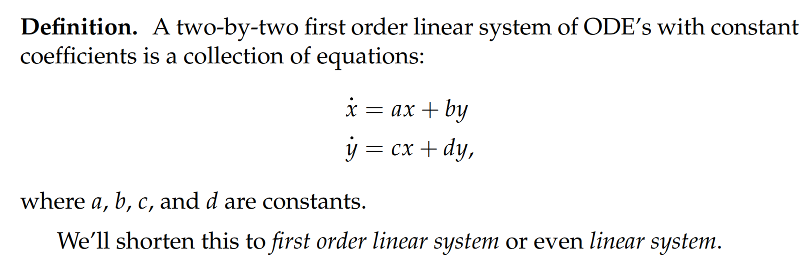
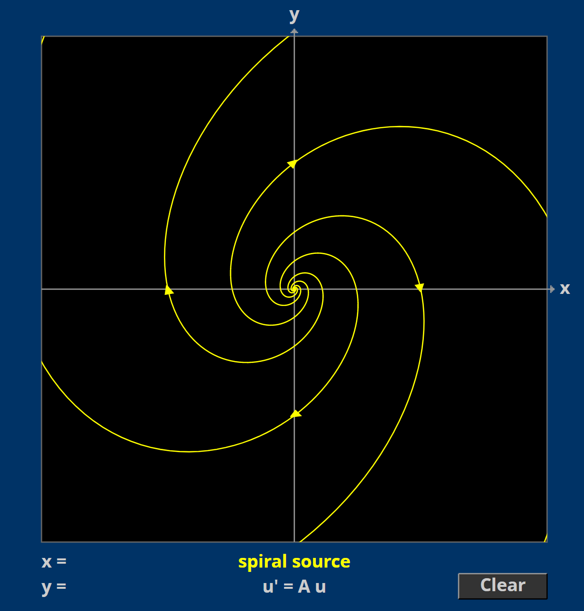
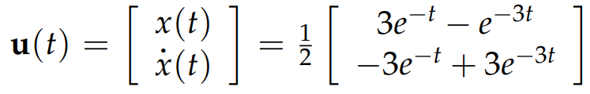
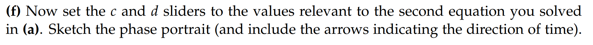

# 0 简介
[Intro.pdf](https://www.yuque.com/attachments/yuque/0/2022/pdf/12393765/1659517373952-95cbe772-2045-4c7a-8de6-f634f5d8e0c6.pdf)
:::info
本单元我们将要介绍微分方程组，在后续的`18.06SC`中也会有线性代数视角的解释
假设我们要建立关于猫的数量$c(t)$和老鼠$m(t)$的数量的微分方程，假设猫吃老鼠，不吃就饿死。

- 那么猫的数量变化率$\dot{c}$一定会涉及到老鼠数量的变化率$\dot{m}$。
- 同样的，老鼠的数量变化率$\dot{m}$一定会涉及到猫数量的变化率$\dot{c}$。

到现在为止，我们已经学习了单变量微分方程。然而，现实中的很多模型都是由多变量构成的，上面的猫和老鼠的就是其中一个例子。
:::
> 我们称这些模型是`Systems`(线性方程组)。在最后这个单元中，我们将会学习一些比较简单的一阶线性微分方程组 同时这个系统只含有两个变量。

> 本章节我们介绍$2\times 2$的一阶线性系统，我们将会学习怎么把一个$2\times 2$的一阶线性系统转换成单变量二阶线性微分方程。相反地，任意一个单变量二阶线性微分方程都可以从$2\times 2$的一阶线性系统中得出，这种观点会带给我们`ODE`以新的理解。
> 我们将会使用`Applets`辅助我们理解一个$2\times 2$的一阶线性系统， 我们也会使用矩阵和向量来抽象我们的$2\times 2$线性系统。

# 1 一阶线性微分方程组**⭐⭐⭐**

[First_Order Linear Systems.pdf](https://www.yuque.com/attachments/yuque/0/2022/pdf/12393765/1660220911739-87bad66e-4ad5-43a3-bfd1-152f7841add1.pdf)
## 1.1 定义
> 
> **简称**: 一阶线性系统（`First Order Linear System`）或者偶数线性系统(`Even Linear System`)
> 其实对于一个线性系统，我们最初始的定义方法可能是:
> $\begin{cases} \dot{x}=a(t)x+b(t)y +r_1(t)\cdots(1)\\\dot{y}=c(t)x+d(t)y+r_2(t) \cdots(2)\end{cases}$=, 也可以是这样的形式$\begin{cases} \dot{x}=f_1(x,y,t)\\\dot{y}=f_2(x,y,t)\end{cases}$，`Initial Conditions`是$x(t_0)=x_0,y(t_0)=y_0$
> 这里系数$a,b,c,d$都随着时间的变化而变化，同时我们还有输入$r_1(t),r_2(t)$, 本章讨论的`First-Order Linear System`集中讨论$a,b,c,d$是常数，且$r_1(t)=0,r_2(t)=0$的情况。同时，这种线性微分方程组也被称为`Autonomous Systems`, 在`4.5`中将介绍他的解的性质。

## 1.2 算例
### 算例1: 农场主的兔子
> `Farmer Jones`和`Farmer McGregor`的兔子
> 

### 算例2: 罗密欧与朱丽叶的推拉
> 
> 

## 1.3 推广到nxn
> 

## 

# 2 解线性系统**⭐⭐**
> 本小节我们介绍一种求解一个$2\times 2$的`First Order Linear System`， 本质上是就是消元，将`First Order Linear System`转换成一个单变量的高阶线性微分方程, **但是这个方法在数学领域不是很常用，因为他没有利用好线性系统中的矩阵的性质**。
> 利用矩阵本身性质的解法会在本章节的`4:使用矩阵猫叔微分方程组`和`Unit 4.2`中介绍
> 下面给出使用第一种求解方法的一些算例

## 2.1 方法概述
> 我们沿用`1.2`中的农场主的兔子的例子
> 

**Step 1: 消元**
**Step 2: 解高阶线性微分方程**
**Step 3: 得到另一个变量的解**
**Step 4: 使用Superposition Principle**
> 
> 
> 更常见的做法不是像本小节中介绍的将线性系统转化为高阶单变量线性方程，而是反过来将高阶线性方程转换为线性系统来求解，我们将会在`18.06SC`中看到线性代数在微分方程中的应用。当然本章也会介绍矩阵方法求解高阶线性方程的例子。

## 2.2 算例
:::info

:::
**Key**
### 

# 3 向量和矩阵复习
[Review of Vectors and Matrices.pdf](https://www.yuque.com/attachments/yuque/0/2022/pdf/12393765/1659538874897-ac6a4ce7-4a76-4eb3-92d8-a4db0d5d7a9b.pdf)
> 这里我们直接跳过，内容比较简单。

## 练习
### 练习1
> 

### 练习2
> 

### 练习3
:::info

:::
**Key**

# 4 使用矩阵描述微分方程组**⭐⭐⭐**
[Describing First Order System Using Matrix Notation.pdf](https://www.yuque.com/attachments/yuque/0/2022/pdf/12393765/1659539125324-0a1d7be8-c803-4fa0-9e08-b8cafb1212e0.pdf)
> 本小节我们将线性系统抽象为矩阵，尝试通过矩阵本身的性质得到线性系统的解。也是比较常用的方法。

## 4.1 定义
> 

## 4.2 解的描述
> 我们使用$\bf u(t)=\left(  \begin{array}{c} x(t)\\y(t)\end{array}\right)$来描述一个线性微分方程组$\begin{cases} \dot{x} = ax+by \\ \dot{y}=cx+dy\end{cases}$(也就是$\dot{u}(t)=\left(  \begin{array}{c} a&b\\c&d\end{array}\right)u(t)$)的解。
> **为了加深理解，我们沿用之前农场主的兔子的例子:**
> 
> 这个例子中我们已经得到$x(t)=c_1e^{0.5t}+c_2e^{0.2t}$,$y(t)=2c_1e^{0.5t}-c_2e^{0.2t}$
> 我们将其写成向量形式: $\bf u(t)=\left(  \begin{array}{c} x(t)\\y(t)\end{array}\right)=\left(  \begin{array}{c} c_1e^{0.5t}+c_2e^{0.2t}\\2c_1e^{0.5t}-c_2e^{0.2t}\end{array}\right)$
> 这样似乎得不到任何有价值的信息，所以我们将其换一种写法:
> $\bf u(t)=c_1*u_1(t)+c_2*u_2(t)$, 也就是利用了向量加法性质, 我们可以得到: 
> $\bf u(t)=c_1*u_1(t)+c_2*u_2(t)=c_1e^{0.5t}\left(  \begin{array}{c} 1\\2\end{array}\right)+c_2e^{0.2t}\left(  \begin{array}{c} 1\\-1\end{array}\right)$
> 所以$\bf u_1(t)=e^{0.5t}\left(  \begin{array}{c} 1\\2\end{array}\right)$, $\bf u_2(t)= e^{0.2t}\left(  \begin{array}{c} 1\\-1\end{array}\right)$
> 这里$\bf u_1(t)$和$\bf u_2(t)$都是方程组的解，我们称他们为`Basic Independent Solutions`或者`Normal Modes`, 而这些解的线性组合就是方程组的`General Solution`
> 

## 4.3 解的几何描述
> 类比我们在`Unit 1.11`中对于一阶自治微分方程的定义$\dot{y}=f(y)$, 我们定义一阶自治线性微分方程组，$\begin{cases} \dot{x}=f_1(x,y)\\\dot{y}=f_2(x,y)\end{cases}$， 注意右侧没有$t$, 系统完全自治
> 此时系统的解是$\begin{cases} x=x(t)\\y=y(t)\end{cases}$, 可以抽象为一些`Parametrized Curves`, 曲线上的点就是初始条件所在位置，也就是$(x_{t_0},y_{t_0})$
> 
> 也就是说，如果我们想要画出$\bf u(t)$, 图像是一系列的`Curves`, 具体哪一条`curve`由初值条件决定。

:::success
如果$\begin{cases} x=x(t)\\y=y(t)\end{cases}$是`Parametrized Curve`则$\begin{cases} \dot{x}=x'(t)\\\dot{y}=y'(t)\end{cases}$表示某一时刻的速度向量
那么到底什么是自治系统呢? 
自治系统就是我给定一个$(x,y)$, 系统输出($\dot{x},\dot{y}$), 因为$\begin{cases} \dot{x}=f_1(x,y)\\\dot{y}=f_2(x,y)\end{cases}$，也就是给定坐标输出速度向量的过程，抽象一下就是一个`**Velocity Field**`

:::
> 

## 4.4 Applet
[Linear Phase Portraits, Matrix Entry.pdf](https://www.yuque.com/attachments/yuque/0/2022/pdf/12393765/1659576685281-dba72b3f-423a-4151-8661-0f634ad43537.pdf)
### 农场主的兔子
> 我们沿用本小节`1.2`中的农场主的兔子的案例:
> 这是我们的方程组:$\begin{cases} \dot{x} = 0.3x+0.1y \\ \dot{y}=0.2x+0.4y\end{cases}$
> 方程的解是$\bf u(t)=\left(  \begin{array}{c} x(t)\\y(t)\end{array}\right)=\left(  \begin{array}{c} c_1e^{0.5t}+c_2e^{0.2t}\\2c_1e^{0.5t}-c_2e^{0.2t}\end{array}\right)$
> $\bf u(t)=c_1*u_1(t)+c_2*u_2(t)=c_1e^{0.5t}\left(  \begin{array}{c} 1\\2\end{array}\right)+c_2e^{0.2t}\left(  \begin{array}{c} 1\\-1\end{array}\right)$
> 所以$\bf u_1(t)=e^{0.5t}\left(  \begin{array}{c} 1\\2\end{array}\right)$, $\bf u_2(t)= e^{0.2t}\left(  \begin{array}{c} 1\\-1\end{array}\right)$
> 本题暂时无法使用`Applet`将图像画出，软件有一些`Bugs`

### 另一个例子
:::success
我们使用`2.2`中的算例来说说明另一个问题。

$\bf u(t)=\left(  \begin{array}{c} x(t)\\y(t)\end{array}\right)=\left(  \begin{array}{c} 3c_1e^{2t}-c_2e^{-2t}\\c_1e^{2t}+c_2e^{-2t}\end{array}\right)$
$\bf u(t)=c_1*u_1(t)+c_2*u_2(t)=c_1e^{2t}\left(  \begin{array}{c} 3\\1\end{array}\right)+c_2e^{-2t}\left(  \begin{array}{c} 1\\-1\end{array}\right)$
所以$\bf u_1(t)=\left(  \begin{array}{c} 3e^{2t}\\e^{2t}\end{array}\right)$, $\bf u_2(t)= \left(  \begin{array}{c} e^{-2t}\\-e^{-2t}\end{array}\right)$
**我们分析一下这两个**`**Modes**`**和解:**

- 对于$\bf u_1(t)$, 代表了一根穿过原点的，方向是$<3,1>$的参数方程, 观察参数方程的$x,y$坐标，我们发现，随着时间推移，沿着这根曲线运动的质点离原点越来越远。
- 对于$\bf u_2(t)$, 代表了一根穿过原点的，方向是$<1,-1>$的参数方程， 同样观察参数方程的$x,y$坐标，我们发现，随着时间推移，沿着这根曲线运动的质点离原点越来越近。
- 对于$\bf u(t)$, 他其实是$\bf u_1(t)$和$\bf u_2(t)$的线性组合

于是我们可以将$\bf u(t)$代表的`Parametric Curves`画出来，得到下面的图像。

:::

## 4.5 算例
### 算例1
:::info

:::
Key

### 算例2
> 

# 5 伴随矩阵**⭐⭐⭐**
[The Companion Matrix.pdf](https://www.yuque.com/attachments/yuque/0/2022/pdf/12393765/1659578899675-2bcdc83c-d753-4ae6-9df7-30b8e555cc35.pdf)
:::success
本小节我们将介绍如何从一个高阶线性微分方程转换成一个线性方程组。
这个过程被称为`Anti-Elimination`
总的来说，伴随矩阵的结构为$\begin{bmatrix} 0&1 \\ c&d\end{bmatrix}$, 在后续的`Applet`中体现。
:::

## 5.1 逆消元和伴随矩阵
> 假设我们有一个二阶齐次线性方程$\ddot{x}+b\dot{x}+kx=0\cdots (1)$
> 我们能够从这个二阶齐次线性方程中推得一个一阶线性微分方程组，推导步骤如下:
> 1. 我们介绍第二个变量$y=\dot{x}$, 代入$(1)$中，我们得到$\dot{y}+by+kx=0$, 也就是$\dot{y}=-kx-by$
> 2. 现在我们得到一个一阶线性微分方程组: $\begin{cases} \dot{x} = y \\ \dot{y}=-kx-by\end{cases}$
> 
所以对应的**系数矩阵**是$\left(  \begin{array}{c} 0&1\\-k&-b\end{array}\right)$, 我们称之为`**Companion Matrix**`
> 3. 这个方程组的解是$\bf u(t)=\left(  \begin{array}{c} x(t)\\y(t)\end{array}\right)=\left(  \begin{array}{c} x(t)\\\dot{x}(t)\end{array}\right)$, $\bf u(t)$记录了$(1)$的解和其导数
> 
**一定要注意这些用词:**
> - `First Order Linear System`的系数组合称为**系数矩阵**
> - 而通过`Anti-Elimination`将`Second Order Linear Equation`转化成`First Order Linear System`之后的系数矩阵称为**伴随矩阵**

## 5.2 算例
:::info
下面我们给出几个例子辅助说明
:::

### 算例1：解的参数曲线图像
> 考虑下列的二阶线性微分方程$\ddot{x}-\dot{x}+\frac{5}{4}x=0\cdots(1)$, 通过`5.1`中的`Anti-Elimination`的方法，我们可以得出这个二阶线性微分方程的**伴随矩阵**是$\begin{bmatrix} 0&1\\-\frac{5}{4}&1\end{bmatrix}$, 接着我们研究解$x(t)$的性质。
> 我们知道$(1)$的特征方程是$p(s)=s^2-s+\frac{5}{4}=(s-\frac{1}{2})^2+1$, 所以根是$r=(\frac{1}{2})\pm i$, 于是我们根据第二单元中的方法得到方程的通解, 我们重复一遍过程:
> $x(t)=e^{\frac{1}{2}t}(e^{it})=e^{\frac{1}{2}t}(c_1cos(t)+c_2sin(t))=e^{\frac{1}{2}t}\sqrt{c_1^2+c_2^2}cos(t-tan^{-1}(\frac{c_2}{c_1}))=Ce^{\frac{1}{2}t}cos(t-\phi), C\space is\space constant,\space\phi\in [0,2\pi]$
> 由`3.11.1.5`中我们知道解$x(t)$是指数阶函数，指数增长率是$\frac{1}{2}$,且按照$1$的角频率振动。另外，$\dot{x}(t)=C_2e^{\frac{1}{2}t}sin(t-\phi)$, $x(t)$和$\dot{x}(t)$的振动没有对齐，中间相差了$\frac{\pi}{2}$.
> 如果我们要画出$\bf u(t)=\left(  \begin{array}{c} x(t)\\\dot{x}(t)\end{array}\right)$的图像, 相当于要画出$\bf u(t)=\left(  \begin{array}{c} Ce^{\frac{1}{2}t}cos(t-\phi)\\Ce^{\frac{1}{2}t}sin(t-\phi)\end{array}\right)$的参数曲线, 我们可以将$\bf u(t)=\left(  \begin{array}{c} Ce^{\frac{1}{2}t}cos(t-\phi)\\Ce^{\frac{1}{2}t}sin(t-\phi)\end{array}\right)$抽象成$\bf u(t)=\left(  \begin{array}{c} Ce^{\frac{1}{2}t}cos(\theta_t)\\Ce^{\frac{1}{2}t}sin(\theta_t)\end{array}\right)$, 是不是就是我们熟悉的极坐标表达。
> 于是图像就是`Spiral`, 如下图所示。
> 

### 算例2：罗密欧与朱丽叶的推拉
:::info

1. **在**`**1.2**`**的算例**$2$**中我们介绍了罗密欧与朱丽叶的模型, 并将其转换为一阶**`**Linear ODE**`

$\begin{cases} R' = \frac{1}{4}R+J \\ J'=-\frac{17}{16}R+\frac{3}{4}J\end{cases}=>R''-R'-\frac{5}{4}R=0$ , 我们的系数矩阵是$\begin{bmatrix} \frac{1}{4}&1\\-\frac{17}{16}&\frac{3}{4}\end{bmatrix}$

2.  **Anti-Elimination**

现在我们从$R''-R'-\frac{5}{4}R=0$出发，进行`Anti-Elimination`, 通过使用$Y=R'$将一阶`Linear ODE`$R''-R'-\frac{5}{4}R=0转换为\begin{cases} R' = Y \\ Y'=\frac{5}{4}R+Y\end{cases}$, 这时候的**伴随矩阵**是$\begin{bmatrix} 0&1\\\frac{5}{4}&1\end{bmatrix}$

3. **结果**

注意到这样一通操作之后由于我们的研究对象变了，从原来的$(J,R)$变成了$(R,Y)$, 于是系数矩阵也发生了改变
:::

## 5.3 Applet
[Companion Matrices Guidance.pdf](https://www.yuque.com/attachments/yuque/0/2022/pdf/12393765/1659583074248-350231ee-853b-435e-8bcf-56622d18cc78.pdf)
[https://ocw.mit.edu/ans7870/18/18.03SC/linPhasePorMatrix.html](https://ocw.mit.edu/ans7870/18/18.03SC/linPhasePorMatrix.html)
:::info
再回到罗密欧与朱丽叶的例子: $\begin{cases} R' = \frac{1}{4}R+J \\ J'=-\frac{17}{16}R+\frac{3}{4}J\end{cases}$, 这个系统的系数矩阵是$\begin{bmatrix} \frac{1}{4}&1\\-\frac{17}{16}&\frac{3}{4}\end{bmatrix}$

:::

## 5.4 Quizzes
:::info

:::
**Key**

# 6 Problems
[Practice Problems.pdf](https://www.yuque.com/attachments/yuque/0/2022/pdf/12393765/1659593947478-5ecea585-1063-4eb3-8e4f-8e554f46c0ab.pdf)
[Problem Set 1.pdf](https://www.yuque.com/attachments/yuque/0/2022/pdf/12393765/1659593958452-854884b2-e5cf-4432-b8d8-8ab4c5f0b4d0.pdf)
[Problem Set 2.pdf](https://www.yuque.com/attachments/yuque/0/2022/pdf/12393765/1659593958611-5ab09efc-dcf5-4155-b5d0-050d264a5446.pdf)

## P1: 矩阵乘法
:::info

:::
**Key**

## P2: 线性变换
:::info

:::
**(a)**
**(b)**
**(c)**
**(d)**
**(e)**

## P3: 伴随矩阵**⭐⭐**
:::info

:::
**(a)**
**(b)**
注意这里求的`Independent Real Solutions`不包括系数
**(c)**
这里的`Envelopes`就是函数震荡的上下边界。
**(d)**

## P4: 复数乘法转矩阵**⭐⭐⭐**
:::info

:::
**(a)**
本题就是找使得$(a+bi)(x+yi)=(v+wi)$的矩阵$\bf A$, $<x,y>$作为输入, $<v,w>$作为输出。
**(b)**

## P5: 矩阵乘法
:::info

:::
**Key**

## P6: 矩阵基本性质
:::info

:::
**Key**

## P7: 转换成线性系统**⭐⭐**
:::info

:::
**(a)**
**(b)**

## P8: 解线性系统
:::info

:::
**(a）**
**(b）**

## P9: 综合题**⭐⭐⭐⭐⭐**
### P9(a) 线性方程转换
:::info

:::
**Key**
第一个方程的`Damping Type`是`Overdamped`, 不会振动
第二个方程的`Damping Type`是`UnderDamped`, 会振动，且振幅逐步减小。

### P9(b) 伴随矩阵1
:::info

:::
**Key**比较简单，分别是: 

### P9(c) 伴随矩阵1-Applet
:::info

:::
**Key**我们在$(a)$问中得到:
$u(t)=\begin{bmatrix}x(t)\\\dot{x}(t) \end{bmatrix}=\begin{bmatrix}c_1e^{-t}+c_2e^{-3t}\\-c_1e^{-t}-3c_2 e^{-3t}\end{bmatrix}=\newline c_1u_1(t)+c_2u_2(t)=c_1e^{-t}\begin{bmatrix}1\\-1  \end{bmatrix}+c_2e^{-3t}\begin{bmatrix} 1\\-3\end{bmatrix}$,
**我们也知道方程的解**$u(t)$**是一个参数曲线，是两个参数曲线上的点在同一时刻**$t$**的线性组合:**

- 第一个参数曲线是$e^{-t}\begin{bmatrix}1\\-1  \end{bmatrix}=\begin{bmatrix}e^{-t}\\-e^{-t}  \end{bmatrix}$  , 是一条沿着$<1,-1>$方向，朝着原点运动的轨迹
- 第二个参数曲线是$e^{-3t}\begin{bmatrix} 1\\-3\end{bmatrix}=\begin{bmatrix} e^{-3t}\\-3e^{-3t}\end{bmatrix}$，是一条沿着$<1,-3>$方向，朝向原点运动的轨迹
- **在图中就是用黄色框标出的曲线，而这两条曲线的线性组合就得到了线性方程组的所有解，也就是图中所有的弯曲的曲线。**

### P9(d) Phase Portraits
:::info

:::
**Key**我们要理解这个`Phase Portraits`的曲线图代表的是什么意思，坐标代表的是什么含义。如果我们知道一条曲线解$u(t)=\begin{bmatrix}x(t)\\\dot{x}(t) \end{bmatrix}$在$t=0$时刻在`Phase Portraits`上 的坐标, 题中提到，$t=0$时候，$u(0)=\begin{bmatrix}1\\0 \end{bmatrix}$, 也就是$x(0)=1,\dot{x}(0)=0$, 我们可以利用这个`Initial Conditions`来求解线性方程组。之前我们得到方程的`General Solutions`是$x(t)=c_1e^{-t}+c_2e^{-3t}$, 代入初值条件$x(0)=c_1+c_2=1,\dot{x}(0)=-c_1-3c_2=0$, 所以$\begin{cases} c_1=\frac{3}{2} \\c_2=-\frac{1}{2}\end{cases}$

接下来我们来描述一下解的情况,  $x(t)=\frac{3}{2}e^{-t}-\frac{1}{2}e^{-3t}$

- $t<-\frac{ln3}{2}$时，$x(t)<0$, $\dot{x}(t)=-\frac{3}{2}e^{-t}+\frac{3}{2}e^{-3t}>0$, $x(t)$为负且递增
- $t=-\frac{ln3}{2}$时，$x(t)=0$, $\dot{x}(t)=-\frac{3}{2}e^{-t}+\frac{3}{2}e^{-3t}>0$
- $-\frac{ln3}{2}<t<0$时, $0<x(t)<1$, $\dot{x}(t)=-\frac{3}{2}e^{-t}+\frac{3}{2}e^{-3t}>0$, $x(t)$为正且递增
- $t=0$时,$x(t)=1$, $\dot{x}(t)=-\frac{3}{2}e^{-t}+\frac{3}{2}e^{-3t}=0$, $x(t)$取到最大值, 为$1$
- $t>0$时,$0<x(t)<1$, $\dot{x}(t)=-\frac{3}{2}e^{-t}+\frac{3}{2}e^{-3t}<0$, 此时$x(t)\approx \frac{3}{2}e^{-t}$(`3.11`中的指数增长率中有提到关于`Dominant Term`的概念), 也就是说$x(t)\to 0,t\to \infty$

### P9(e) Time Invariance
:::info

:::
**Key**，实际上利用线性(自治)方程的`Time Invariance`, 任何在时间上的偏移都不会影响`Solution Curve`的走向，影响的只有$t$和$(x(t),y(t))$的对应关系。

### P9(f) 伴随矩阵2
:::info

:::
**Key**

### P9(g) Perpendicularity
:::info

:::
**Key**如果我们仔细观察这些从类似于$\ddot{x}+b\dot{x}+kx=0$转化成线性系统的伴随矩阵， 这些伴随矩阵通常结构为$\begin{bmatrix} 0&1\\c&d\end{bmatrix}$
对于这样的线性系统$\begin{bmatrix} \dot{x}\\ \dot{y} \end{bmatrix} =\begin{bmatrix} 0&1\\c&d\end{bmatrix}\begin{bmatrix} x\\y\end{bmatrix}$, 解是$u(t)=\begin{bmatrix} x(t)\\ \dot{x}(t)\end{bmatrix}$, $\dot{u}(t)=\begin{bmatrix} \dot{x}(t)\\ \ddot{x}(t)\end{bmatrix}$
当$u(t)$代表的参数方程穿过$x$轴的时候，$x(t)=x_t(x_t是常数),\dot{x}(t)=0$
所以$u(t)=\begin{bmatrix} x_t\\0\end{bmatrix}$, 而此时`**Tangent Vector(Velocity Vector)**`是$\dot{u}(t) =\begin{bmatrix} 0&1\\c&d\end{bmatrix}u(t)=\begin{bmatrix} 0\\cx_t\end{bmatrix}$
所以$\dot{u}(t)$作为一个向量，方向垂直于$x$轴
**这里要特别注意**: 如果我们知道了$\dot{u}(t)=0$, 并不代表$\ddot{u}(t)=0$, 一个典型的例子就是$u(t)=t^4$, 此时$\dot{u}(t)=4t^3$, $\ddot{u}(t)=12t^2\geq 0$, 也就是说$\ddot{u}(t)$不一定等于零。
`Velocity Vector`的概念在`18.02SC`中讲过。
