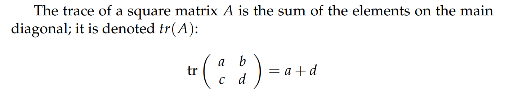
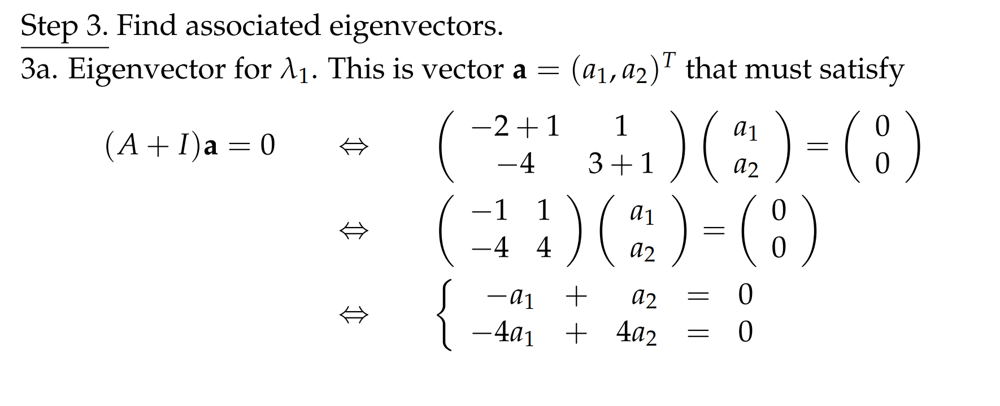
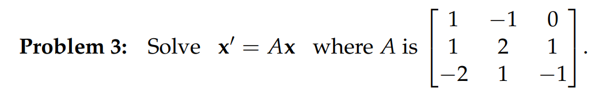

# 0 简介
[Intro.pdf](https://www.yuque.com/attachments/yuque/0/2022/pdf/12393765/1659602143895-c9417512-fe26-47e6-a88c-703abe63f6a8.pdf)
> 前面的小节中，我们学习了如何通过消元法来求解一阶线性方程组。我们将方程的解$u(t)=\begin{bmatrix} x(t)\\y(t)\end{bmatrix}$看成是一个向量，$(x(t),y(t))$看成是`xy-plane`平面中的一点。
> 本小节我们将探寻**系数矩阵**自身的性质来判断解的性质，也就是要利用矩阵的特征值和特征向量来详细讨论，在`18.06SC`中的`2.10`也有一些介绍

# 1 向量和矩阵：齐次系统
[Vectors and Matrices, Homogeneous Systems.pdf](https://www.yuque.com/attachments/yuque/0/2022/pdf/12393765/1659602752281-9df8a5d6-d8d3-4c64-9f5f-c05475ec3890.pdf)
> 本小节其实就是关于矩阵的一些常用性质的罗列。
> 这些常用性质的证明和几何意义在`18.02SC`中都有详细讲解, 所以这里不做重点。

## 1.1 行列式
> 
> 

## 1.2 迹
> 
> 

## 1.3 其他性质
> 
> 

## 
## 1.5 Quizzes
[Quizzes.pdf](https://www.yuque.com/attachments/yuque/0/2022/pdf/12393765/1659603130159-677139cb-71be-45eb-88d2-63f5f512528b.pdf)
> 

# 2 伴随矩阵和其特征值**⭐⭐**
[Companion Matrix and Its Eigenvalues.pdf](https://www.yuque.com/attachments/yuque/0/2022/pdf/12393765/1659603255897-8a81e303-6113-4e0d-b5ac-c7716b97a636.pdf)
> 本小节介绍**矩阵视角**下线性方程组的求解流程，也是我们**最常用的求解线性系统的方法**(而不是我们在`4.1`中介绍的消元法)

## 2.1 矩阵视角求解**⭐⭐⭐**
> **我们使用本单元的一个例子:**
> $\begin{cases} \dot{x}(t)=x+3y\\\dot{y}(t)=   x-y\end{cases}......(1)$, 我们使用矩阵的形式表达$\begin{bmatrix} \dot{x}(t)\\ \dot{y}(t)\end{bmatrix}=\begin{bmatrix} 1&3\\1&-1\end{bmatrix}\begin{bmatrix} x(t)\\y(t)\end{bmatrix}$
> **我们使用矩阵的视角来解这个线性系统: **
> 回顾`4.1.2.2`中的这个例子的解$\begin{cases} x(t)=3c_1e^{2t}-c_2e^{-2t} \\ y(t)=c_1e^{2t}+c_2e^{-2t}\end{cases}$
> 我们可以得到其`Independent Solutions`是$e^{2t}\begin{bmatrix}3\\1\end{bmatrix}$和$e^{-2t}\begin{bmatrix}-1\\1\end{bmatrix}$

:::success
所以**我们的新方法的关键就在于**得到形如$\begin{bmatrix}x(t)\\y(t) \end{bmatrix}=e^{\lambda t}\begin{bmatrix}a_1\\a_2\end{bmatrix}=\begin{bmatrix}a_1e^{\lambda t}\\a_2e^{\lambda t}\end{bmatrix}$, $a_1,a_2,\lambda$是未知参数， 我们的目的就是求这些未知参数: 

- 我们将这个解代入$(1)$式中，得到$\begin{cases} \lambda e^{\lambda t}a_1=a_1e^{\lambda t}+3a_2e^{\lambda t}\\\lambda e^{\lambda t}a_2=  a_1e^{\lambda t}-a_2e^{\lambda t}\end{cases}........................(2)$
- 我们将其写成矩阵形式:得到: $\lambda e^{\lambda t}\begin{bmatrix} a_1\\a_2\end{bmatrix}=e^{\lambda t}\begin{bmatrix} 1&3\\1&-1\end{bmatrix}\begin{bmatrix} a_1\\a_2\end{bmatrix}$
- 两边约去$e^{\lambda t}$, 得到: $\lambda\begin{bmatrix} a_1\\a_2\end{bmatrix}=\begin{bmatrix} 1&3\\1&-1\end{bmatrix}\begin{bmatrix} a_1\\a_2\end{bmatrix}.............................................(3)$
- 写成方程组的形式: $\begin{cases}\lambda a_1=a_1+3a_2\\\lambda a_2=  a_1-a_2\end{cases}..........................................................(\bf i)$
- 写成齐次线性方程组的形式: $\begin{cases}(1-\lambda) a_1+3a_2=0\\ a_1+(-1-\lambda)a_2=0\end{cases}.....................................(4)$
- 我们写成矩阵形式$\begin{bmatrix} 1-\lambda&3\\1&-1-\lambda \end{bmatrix}\begin{bmatrix}a_1\\a_2\end{bmatrix}=\begin{bmatrix} 0\\0 \end{bmatrix}$
- **我们想要**$a_1,a_2$**有非零解(**`**Non-trivial Solutions**`**)**, 所以得满足左侧矩阵的行列式为零，也就是$\left| \begin{array}{cc} 1-\lambda&3\\1&-1-\lambda \end{array}\right|=0$, 得到$\lambda^2-4=0,\lambda_1=2,\lambda_2=-2$。 注意，**这里必须有非零解，否则我们需要看看我们有没有算错**。
- 将$\lambda_1=2,\lambda_2=-2$分别代回$(\bf i)$中，解得$\lambda_1=2时,\begin{bmatrix}a_1\\a_2\end{bmatrix}=\begin{bmatrix}3\\1\end{bmatrix}$，$\lambda_1=-2时,\begin{bmatrix}a_1\\a_2\end{bmatrix}=\begin{bmatrix}1\\-1\end{bmatrix}$
- 因此，原方程$(1)$的两个`**Independent/Basic Solutions**`是$e^{2t}\begin{bmatrix}3\\1\end{bmatrix}$和 $e^{-2t}\begin{bmatrix}1\\-1\end{bmatrix}$, 这和之前用消元法得到的解一致。
- 最后使用`**Superposition Principle**`得到方程组的通解: $u(t)=c_1*e^{2t}\begin{bmatrix}3\\1\end{bmatrix}+c_2*e^{-2t}\begin{bmatrix}1\\-1\end{bmatrix}$
:::

## 2.2 Matrix Expansion**⭐⭐⭐**
:::info

**这里提到了**`**Matrix Expansion**`**的思想，也就是当我们要做如下变换:**
$\lambda \begin{bmatrix} x_1\\x_2\end{bmatrix}=\begin{bmatrix} a&b\\c&d\end{bmatrix}\begin{bmatrix} x_1\\x_2\end{bmatrix}$的时候，我们希望能够将左侧移到右侧，保持$\begin{bmatrix} x_1\\x_2\end{bmatrix}$不变，也就是我们在尝试进行$\begin{bmatrix} a&b\\c&d\end{bmatrix}-\lambda$的运算，这显然不行。所以我们要将左侧的$\lambda$展开成一个矩阵形式，也就是$\begin{bmatrix} \lambda&0\\0&\lambda\end{bmatrix}$
:::

# 3 特征值和特征向量**⭐⭐⭐⭐**
[General Case, Eigenvalues and Eigenvectors.pdf](https://www.yuque.com/attachments/yuque/0/2022/pdf/12393765/1659606368490-f89352f2-a985-4483-8663-d0c835c28eb1.pdf)
> 本小节我们将第二小节中的求解过程用特征值的方式再来复习一遍，并作出一定程度的深入。 **这种方法摆脱了变量数量的限制，可以在**$n\times n$**的线性系统中使用**。

## 3.1 简介
:::info
有了第二小节中的例子做基础，我们不难理解下面的一系列推广:

:::

## 3.2 标准解题步骤**⭐⭐**
### 写出解的表达式
:::info

:::

### 代回原方程
:::info
由于$D(ae^{\lambda t})=\lambda ae^{\lambda t}$, 我们代入原方程, 得到:

:::

### 小技巧: 扩充矩阵
:::info

:::

### 利用行列式性质求解系数
:::info

这其实就是在求伴随矩阵的特征值和特征向量的过程
:::

## 3.3 定义
:::info

:::

## 3.4 矩阵特征方程性质
### 矩阵的迹，矩阵的行列式
:::info
特征方程和矩阵的迹，矩阵的行列式都在这里体现:

:::

### 矩阵的精简和扩展形式
:::info

:::

## 3.5 特征值分析**⭐⭐**
### 两个实特征值
:::info

:::

### 小技巧: 求特征向量
> 
> 

### Normal Modes
> 

## 3.6 算例**⭐⭐⭐**
[Worked Example, Distinct Real Roots.pdf](https://www.yuque.com/attachments/yuque/0/2022/pdf/12393765/1659607505760-9336e00a-06bd-4822-8186-41941ad928a2.pdf)
> 

### 第一步: 对角线减去特征值
> 

### 第二步: 矩阵特征方程**⭐⭐**
> 
> **这时候要特别注意:** 我们采用矩阵特征值方法的时候得到的特征方程和我们采用消元法得到的$\ddot{x}-\dot{x}-2x=0$的特征方程$\lambda^2-\lambda-2=0$是完全一致的，其实这就是两种求解方法过程中的共性。

 

### 第三步: 求解特征方程
> 

### 第四步: 找到特征向量
> 
> 

### 第五步: 找到通解
> 

### 第六步: 求解IVPs
> 

## 3.7 将系统写成特征值形式
> 假设$\begin{bmatrix} x\\y\end{bmatrix}=\vec{u}$, 线性系统是$\bf \dot{\vec{u}}=A\vec{u}$, $\bf A=\begin{bmatrix} a&b\\c&d\end{bmatrix}$
> 我们假设$\vec{u}=\vec{\alpha}e^{\lambda t}$, 代入系统中，$\lambda\vec{\alpha} e^{\lambda t}=A\vec{\alpha}e^{\lambda t}$, 两边化简后$A\vec{\alpha}=\lambda\vec{\alpha}$
> 这里$\lambda$就是我们的特征值，$\vec{\alpha}$就是矩阵$A$的特征向量

 

## 3.8 Applet
[Matrix,Vector Applet.pdf](https://www.yuque.com/attachments/yuque/0/2022/pdf/12393765/1659613085229-0bc4d871-5e91-4a39-9d85-454ec22320cc.pdf)
[https://ocw.mit.edu/ans7870/18/18.03SC/matrixVector.html](https://ocw.mit.edu/ans7870/18/18.03SC/matrixVector.html)

### Q1 特征值为0的特征向量
> 
> 

### Q2 特征空间维数
> 

# 4 复数特征值**⭐⭐⭐**
[Complex Eigenvalues.pdf](https://www.yuque.com/attachments/yuque/0/2022/pdf/12393765/1659613234590-23d17e1b-5f77-4b91-8183-003817da623d.pdf)

## 4.0 本节概述
> 之前我们讨论的线性系统的矩阵的特征值都是实数，现在我们扩展到复数域进行探讨:
> 对于这样一个$\bf \dot{x}=Ax$线性系统来说，我们要求矩阵$\bf A$的特征值，我们需要求使得$|A-\lambda I|=0$的$\lambda$
> 在之前的小节中我们都是假设$\lambda$是实数，现在我们考虑$\lambda$是复数的情况。

## 4.1 求解
> 假设$\bf A = \begin{bmatrix} a&b\\c&d\end{bmatrix}$, 我们求其特征方程$\bf \lambda^2-tr(A)\lambda+det(A)=0$
> 也就是$\bf \lambda^2-(a+d)\lambda+(ad-bc)=0$
> 同时我们知道，线性系统$\begin{bmatrix} \dot{x_1}\\\dot{x_2}\end{bmatrix}=\begin{bmatrix} a&b\\c&d\end{bmatrix}\begin{bmatrix} x_1\\x_2\end{bmatrix}$的解是$\bf x=e^{(a+bi) t}v$, 其中$\bf v$是特征向量，$\bf a+bi$是复数特征值。因为$\bf \lambda$是复数，所以$\bf x$是复数。

## 

## 4.2 算例
:::success

:::
**Key**

## 4.3 算例推广
> 
> 
> 能够这样的原因就是$a+bi$中$\vec{a}$和$\vec{b}$可以看做单位坐标向量，互相垂直，所以可以先行组合出所有的解。

:::success

:::

## 4.4 定理
> 

:::success

:::

## 4.5 完整解题过程
> 

### Step 0
> 

### Step 1
> 

### Step 2
> 

### Step 3
> 
> 

### Step 4
> 

### Step 5
> 

# 5 重复特征值**⭐⭐⭐**
[Repeated Eigenvalues.pdf](https://www.yuque.com/attachments/yuque/0/2022/pdf/12393765/1659613267525-1920f848-e2eb-497a-8f1f-f6e3d5c8a789.pdf)
## 5.0 本节概述
> 本小节将介绍特征值重复的情况，特征值重复分为两种子情况， 以$2\times 2$的线性系统为例:
> - 特征值产出的线性无关的特征向量有两个，称为`Complete Eigenvalues`
> - 特征值产出的线性无关的特征向量只有一个，称为`Defective Eigenvalues`

## 5.1 2x2系统的重复特征值**⭐⭐**
> 

### 5.1.1 Complete Case
> 

### 5.1.2 Defective Case**⭐⭐⭐**
> 

### 5.1.3 注意事项
> 
> $2\times 2$的线性系统我们一般不使用矩阵方法处理这种特征值重复的问题，转而使用更简单的消元法。

## 5.2 2x2系统的算例**⭐⭐**
> 

### Step 1: 写出特征方程表达式
> 

### Step 2: 找到特征方程
> 

### Step 3 找到特征值
> 

### Step 4: 找到第一个特征向量
> 

### Step 5: 找到第二个特征向量
> 

### Step 6: 写出通解
> 通解是$\bf{u}(t) = c_1e^{-t}\begin{bmatrix} 1\\1 \end{bmatrix}+c_2(te^{-t}\begin{bmatrix} 1\\1\end{bmatrix}+e^{-t}\begin{bmatrix} 0\\1\end{bmatrix})=e^{-t}(c_1\begin{bmatrix} 1\\1\end{bmatrix}+c_2\begin{bmatrix} 1\\1+t\end{bmatrix})$

## 5.3 3x3系统的算例**⭐⭐**
### 5.3.1 背景
> 本算例中我们探讨一个`Three Chamber Mixing`热传导的问题:
> 假设有三个互相接触的密闭容器, 内部的温度分别是$X_1,X_2,X_3$, 各自之间的热传导系统均是$a$, 如下图所示:
> 

### 5.3.2 建模过程
> 根据我们在`Unit 1.9`中的热扩散模型，我们有$\begin{cases} X_1'=a(X_3-X_1)+a(X_2-X_1)\\ X_2'=a(X_1-X_2)+a(X_3-X_2)\\ X_3'=a(X_2-X_3)+a(X_1-X_3)\end{cases}$
> 令$a=1$, 在简单化简后，我们有$\begin{cases} X_1'=-2X_1+X_2+X_3\\ X_2'=X_1-2X_2+X_3\\ X_3'=X_1+X_2-2X_3\end{cases}$
> 这个线性系统的伴随矩阵是$\bf A=\begin{bmatrix} -2&1&1\\1&-2&1\\1&1&-2\end{bmatrix}$

### 5.3.3 特征值分析
> $\bf A=\begin{bmatrix} -2&1&1\\1&-2&1\\1&1&-2\end{bmatrix}$求$\bf |A-\lambda I|=0$
> 使用拉普拉斯展开得到$-(\lambda +2)^3+2-3(-2-\lambda)=0$
> 化简后得到$\lambda^3+6\lambda^2+9\lambda=0$, 所以$\lambda(\lambda^2+6\lambda+9)=0$, 所以$\lambda(\lambda+3)^2=0$
> 我们注意到$\lambda_1=0, \lambda_2=\lambda_3=-3$, 有两个重复特征值

### 5.3.2 求解特征向量
> 当$\lambda_1=0$时, $\bf\begin{bmatrix} -2&1&1\\1&-2&1\\1&1&-2\end{bmatrix}\bf\begin{bmatrix} v_1\\v_2\\v_3\end{bmatrix}=\bf 0$, 高斯消元求解得到$\bf v_1=\begin{bmatrix} 1\\1\\1\end{bmatrix}$, 这个特征向量对应的`Independent Solutions`是$\bf e^{0*t}\begin{bmatrix} 1\\1\\1\end{bmatrix}$, 也就是常数解，**这有其物理意义，就是在**$t\to \infty$**时，**$X_1,X_2,X_3$**(三个**`**Chambers**`**的温度趋于相同)**

> 当$\lambda_2=\lambda_3=-3$时, $\bf\begin{bmatrix} 1&1&1\\1&1&1\\1&1&1\end{bmatrix}\bf\begin{bmatrix} v_1\\v_2\\v_3\end{bmatrix}=\bf \begin{bmatrix}0\\0\\0\end{bmatrix}$, 高斯消元求解得到$\bf v_2=\begin{bmatrix} 1\\0\\-1\end{bmatrix}$,$\bf v_3=\begin{bmatrix} 1\\-1\\0\end{bmatrix}$, 这是`Complete Case`

### 5.3.3 通解
> $\begin{bmatrix} X_1(t)\\X_2(t)\\X_3(t)\end{bmatrix}=c_1\begin{bmatrix} 1\\0\\-1\end{bmatrix}e^{-3t}+c_2\begin{bmatrix} 1\\-1\\0\end{bmatrix}e^{-3t}+c_3\begin{bmatrix} 1\\1\\1\end{bmatrix}$
> 所以我们可以看到，在$t\to \infty$时，前两项趋于零，最后剩下常数项，表示最终系统的稳态。

## 5.4 nxn系统的重复特征值
> 详见 textbook by Edwards and Penney.  

# 6 Problems
[Problem Set 1.pdf](https://www.yuque.com/attachments/yuque/0/2022/pdf/12393765/1659613267524-e7910c43-ea0d-4162-b2c5-824c77aa54c5.pdf)
[Problem Set 2.pdf](https://www.yuque.com/attachments/yuque/0/2022/pdf/12393765/1659613267554-237cf2b3-381b-4a4d-a3bb-396692ff7937.pdf)

## P1 2x2线性系统的解
> 

**Key**

## P2 2x2线性系统的解
> 

**Key**

## P3 3x3线性系统的解
> 

**Key**
$\lambda = 1$时:

$\lambda = -1$时: 

$\lambda = 2$时:

## P4 2x2复数特征值
> 

**Key**

## P5 综合题
**Applet**: [Linear Phase Portraits: Matrix Entry](https://ocw.mit.edu/ans7870/18/18.03SC/linPhasePorMatrix.html)
> 
> $(c)$问中的矩阵说的是$(b)$中的那个矩阵$\bf A$

**(a)**

**(b)**

**(c)**
