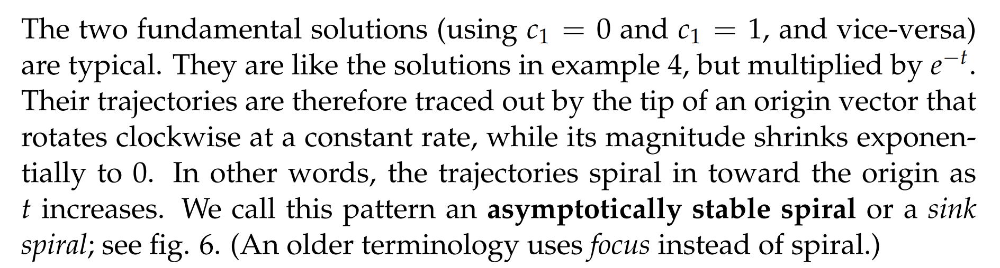
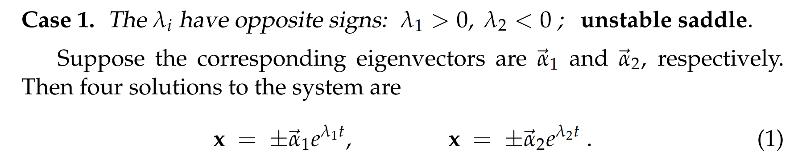
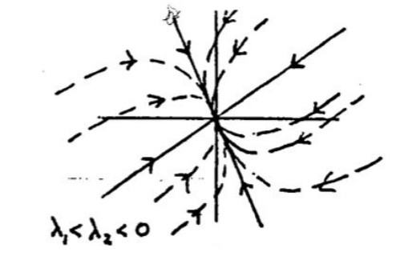
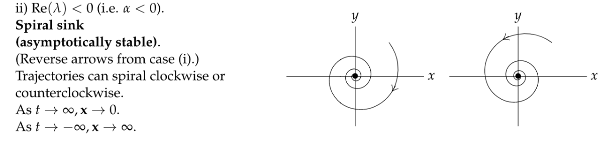
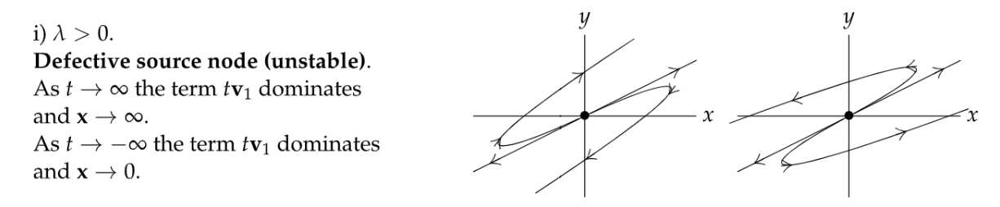

# 0 简介
[Intro.pdf](https://www.yuque.com/attachments/yuque/0/2022/pdf/12393765/1659670494963-add1e43b-7b16-48f0-b9fb-4764e764d459.pdf)
> 之前的章节我们介绍了怎么求线性系统的解，本章节我们介绍怎么将解画出来。
> 之前我们还介绍了说线性系统的解就相当于一系列的`Solution Curves`(`Trajectory`),我们称这些曲线构成的图为`Phase Portraits`
> 本章节我们也将介绍如何定性地分析`Phase Portraits`的大致走向， 从$2\times 2$的线性齐次系统$\bf x'=Ax$开始，逐步衍生到$2\times 2$的非线性微分系统
> 本章节还将介绍**特征值法则,** 作为矩阵特征值分析中的最为重要的一环**。**

# 1 相平面**⭐**
[The Phase Plane.pdf](https://www.yuque.com/attachments/yuque/0/2022/pdf/12393765/1659673061468-c3bb7ce6-1410-453c-9220-1daee8130921.pdf)
> 本小节简单介绍一些关于`Phase Plane`的概念，方便后续我们进一步介绍`Phase Portraits`的画法。

## 1.1 简介
> 
> 我们将从这类系统出发，介绍如何画出`Phase Portraits`

## 1.2 临界点(Critical Points)
> 
> 对于一个线性系统来说，永远会有一个`Critical Point`在$(0,0)$

## 1.3 Sketching Principle
> 曲线不相交原则
> 

# 2 线性系统作图**⭐⭐⭐**
**Applet**: [Linear Phase Portraits: Matrix Entry](https://ocw.mit.edu/ans7870/18/18.03SC/linPhasePorMatrix.html)
[Sketching the Basic Linear System.pdf](https://www.yuque.com/attachments/yuque/0/2022/pdf/12393765/1659673491574-e9041b65-2a7b-4ff6-a9b7-d70b3384a310.pdf)
> 本小节我们将介绍几种`Linear System`的解的曲线分类情况:

## 2.1 Unstable Saddle
### 2.1.0 概述
> 这种解的图像呈现鞍状，随着$t$的增大，质点坐标的趋近于正无穷

### 2.1.1 典范线性系统
:::info
我们给定以下线性系统:

:::

### 2.1.2 图像
> 
> 我们来观察`Solution Curves`在四个象限的行为进行分析。
> 1. 第一个`Independent Solution`:$u_1(t)=c_1\begin{bmatrix} 1\\1 \end{bmatrix}e^t$在第一象限的行为, 令$c_1>0$ ,得到$\begin{bmatrix} 1\\1 \end{bmatrix}e^t$, 由于$e^{t} >0,\forall t$, 曲线为第一象限的$y=x$直线但不过原点。
> 

> 2. 第一个`Independent Solution`:$u_1(t)=c_1\begin{bmatrix} 1\\1 \end{bmatrix}e^t$在第三象限的行为, 令$c_1<0$ ,得到$-\begin{bmatrix} 1\\1 \end{bmatrix}e^t$, 由于$e^{t} >0,\forall t$, 曲线为第三象限的$y=x$直线但不过原点。
> 

> 3. 第二个`Independent Solution`: $u_2(t)=c_2\begin{bmatrix} 1\\-1 \end{bmatrix}e^t$在二四象限的行为:
> 
, 注意，均不过原点
> 4. 原点本身也是一个解，也是一个`Solution Curve`
> 5. 其他的解我们可以使用一些基本代数: 
> 

> 
> 

## 2.2 Asymptotically Stable Node
### 2.2.0 概述
> **这种类型的**`**Solution Curves**`**被称为**`**Aymptotically Stable Node**`**或者**`**Sink Node**`
> 质点运动轨迹呈抛物线状且随着$t$的增大趋近于`Critical Point`。

### 2.2.1 典范线性系统
> 

### 2.2.2 图像
> 
> 

## 2.3 Unstable Node
### 2.3.0 概述
> 此类线性系统的曲线称为`Unstable Node`或是`Source Node`
> 质点运动轨迹和`2.2`中的相反，随着$t$的增大质点坐标趋近于无穷。 

### 2.3.1 典范线性系统
> 

### 2.3.2 图像
> 
> 

## 2.4 Stable Center
### 2.4.0 概述
> 
> 此类解的图像不会随着$t$增大或减小而溢出屏幕
> 我们不能称之为`Asymptotically Stable`, 因为它并没有趋近于`Critical Point`$(0,0)$

### 2.4.1 典范线性系统
> 
> 此时的特征值只有虚部。

### 2.4.2 图像
> 1. 找到曲线形状:
> 

> 2. 找到质点运动方向
> 

> 

## 2.5 Asymptotically Stable Spiral
### 2.5.0 概述
> 再次出现`Asymptotically Stable`, 说明质点运动趋近于$(0,0)$

### 2.5.1 典范线性系统
> 
> 此时的特征值有实部和虚部。

### 2.5.2 图像
> 1. 形状
> 

> 2. 运动方向
> 

> 

## 2.6 Unstable Spiral
### 2.6.1 典范线性系统
> 

### 2.6.2 图像
> 

# 3 线性系统作图推广**⭐⭐**
[Sketching More General Linear System.pdf](https://www.yuque.com/attachments/yuque/0/2022/pdf/12393765/1659673566343-e0aca3a0-091f-409f-9394-9f5f74a68f54.pdf)
## 3.0 序言
> 上一小节我们将不同的线性系统的解进行分类和作图，本小节我们从矩阵视角，也就是特征值的角度去理解`Solution Curves`的形态
> 
> **以下几种用例(**`**3.1~3.6**`**)都是建立在特征值是实数且不存在重根的条件下探讨。**

## 3.1 Unstable Saddle
### 3.1.1 成立条件
:::success

:::

### 3.1.2 作图
> 
> 

## 3.2 Asymptotically Stable Node
### 3.2.1 成立条件
:::success

:::
> 

### 3.2.2 重要注意点**⭐⭐⭐⭐⭐**
> 
> 
> 

## 3.3 Unstable Node
### 3.3.1 成立条件
> 

### 3.3.2 作图
> 
> 

## 3.4 Stable Center
### 3.4.1 成立条件
> 
> 此时特征值只有虚部。

### 3.4.2 作图**⭐⭐⭐**
> 

## 3.5 Stable/Unstable Spiral
### 3.5.1 成立条件
> 

### 3.5.2 作图
> 
> 

## 3.6 Other Cases
> 

## 3.7 总结
[Summary.pdf](https://www.yuque.com/attachments/yuque/0/2022/pdf/12393765/1659673566200-a563b404-a7d3-44cf-93c3-11d71e9fa90f.pdf)
> 
> 在我们画出$2\times 2$的线性齐次系统的时候，我们一般从寻找$\bf A$的特征值开始。

### 3.7.1 实数非零不重复特征值
> 

### 3.7.2 复数特征值
> 

### 3.7.3 其他情况
> 

# 4 迹-行列式图**⭐⭐⭐**
## 4.0 序言
> 本小节我们介绍`Trace-Determinant Diagram`

## 4.1 定义
> 

## 4.2 根的虚实性
> 

## 4.3 作图**⭐⭐⭐**
> 
> 
> ·	

## 4.4 Applet
**Applet**: [Linear Phase Portraits: Cursor Entry](https://ocw.mit.edu/ans7870/18/18.03SC/linPhasePorCursor.html)
[Linear Phase Portraits, Cursor Entry.pdf](https://www.yuque.com/attachments/yuque/0/2022/pdf/12393765/1659673565849-62de6a19-c136-4d9f-813f-337bc98a4152.pdf)

# 5 总结⭐⭐⭐⭐⭐⭐
[Computer-Generated Portrait Gallery.pdf](https://www.yuque.com/attachments/yuque/0/2022/pdf/12393765/1659673565889-507f3a58-71c3-4d8c-9789-e6c8fbaa15f9.pdf)
> 这些内容了解即可，用作后续参考

> 

## 

# 6 Problems
[Practice Problems.pdf](https://www.yuque.com/attachments/yuque/0/2022/pdf/12393765/1659673565792-da7074f5-596d-41f8-b6c3-7c0d23786847.pdf)
[Problem Set 1.pdf](https://www.yuque.com/attachments/yuque/0/2022/pdf/12393765/1659673565845-bfc6cf10-b986-43ae-8500-73663a7a87ef.pdf)
[Problem Set 2.pdf](https://www.yuque.com/attachments/yuque/0/2022/pdf/12393765/1659673566120-67442a6a-6c57-4d47-abd9-d7f4b7351585.pdf)

## P1 T-D Diagram⭐⭐⭐
> 假设线性系统的伴随矩阵是 $A_c=\begin{bmatrix} -1&-1\\1-c&-1\end{bmatrix}$
> 1. 当$c$从$0$到$\infty$变化的时候，在$T-D$图上标出$(T,D)$的轨迹
> 2. 画出不同情况下的`Phase Portraits`。

**(1)**我们知道$tr(A_c)=-1-1=-2$是固定值，而$det(A_c)$在变化。

**(2)**
我们对$c$的值进行逐情况讨论:

1. 此时$D>\frac{T^2}{4}$, 所以$2-c>\frac{4}{4}=1$, 所以$c<1$我们取$c=0$为例，此时$\lambda_1,\lambda_2$是共轭复数，且$Re(\lambda_1)<0,Re(\lambda_2)<0$, 因为解的形式是$e^{\lambda t}\vec{\bf v}$, 所以我们知道这是一个`Sink`, 因为特征值是复数，所以质点会有类似旋转的运动轨迹， 所以是`Spiral Sink`

2. 此时$D=\frac{T^2}{4}$, 所以$2-c=\frac{4}{4}=1$, 所以$c=1$，此时$\lambda_1=\lambda_2=-1$ , 同时由于我们对于这个重根特征值只有一个特征向量，所以是`Defective Case`, 此时的`Basic Solutions`是$\bf x_1=e^{\lambda t}\vec{\bf v_1},x_2=e^{\lambda t}(t\vec{\bf v_2}+\vec{\bf v_1})$, 因为$\lambda_{1,2}>0$, 所以我们知道这是一个`Unstable Case`, 所以是`Nodal Source`

3. 此时$0<D<\frac{T^2}{4}$, 所以$2-c<\frac{4}{4}=1$, 所以$c>1$,$\lambda_1,\lambda_2$是实数，因为`Tr`小于零，所以$\lambda_{1,2}<0$, 所以这是一个`Sink`, 同时因为没有旋转，所以是`Nodal Sink`

4. $D=0$, $c=2$, $\lambda^2+2\lambda=0$, 所以$\lambda_1=0,\lambda_2=-2$, 此时特征值是零的特征向量的方向上全都是`Critical Points`, 而我们知道$\lambda_2$对应的特征值是`Sink`的, 全部趋近于$\lambda_1$对应的特征向量方向上的`Critical Points`

5. 最后，是`Saddle`的情况

## P2: 边界条件⭐⭐⭐
> 

**Stable Solutions**
换句话说就是所有特征值的实数部分小于零

其中最后一种情况是在线性系统的伴随矩阵形如$\begin{bmatrix}c&0\\0&c \end{bmatrix}$的时候，特征值$\lambda=\lambda_1=\lambda_2=c$, 且特征向量为$v_1=\begin{bmatrix}1\\0\end{bmatrix}$和$v_2=\begin{bmatrix}0\\1\end{bmatrix}$的情况, 也就是`Scalar Matrix`的时候， 此时我们的解是$e^{\lambda t}(c_1v_1+c_2v_2)$, 由于$v_1$和$v_2$线性无关，所以$c_1v_1+c_2v_2$张成$R^2$空间内的任意向量。也就是上面所说的$\vec{c}$是任意向量的原因
**Scalar Matrix: **
**Unstable Solutions**
换句话说就是至少有一个特征值的实数部分大于零

**Neutrally Stable Solutions**
换句话说就是所有的特征值实数部分为零

**Other Corner Cases**

## P3: 黄鼠狼和田鼠⭐⭐⭐⭐⭐
**Applet**: [Linear Phase Portraits: Matrix Entry](https://ocw.mit.edu/ans7870/18/18.03SC/linPhasePorMatrix.html)
> 

**(a)**
**(b)**

这里$b=0$之所以是`For any vector`的原因在`P2`中有详细解释

## P4: 线性系统的定性行为⭐⭐⭐⭐
> 

**(a) T-D Diagram 轨迹**
**(b): T-D Diagram Boundary 作图****本小问探究当**$a$**发生变化的时候**`**T-D Diagram**`**的变化:**
, 本质上是要求沿着这条红线运动的时候，触碰到的红色边界时候的$a$的取值

1. `**Stable Center**`: 此时`tr(A)=0`, 此时$a=1$
2. `**Defective Cases**`: 此时$tr(A)^2=4det(A)$, 所以$a^2-2a+1=-4a+12$, 所以$a^2+2a-11=0$, 此时$a_{1,2}=-1\pm 2\sqrt{3}$
3. `**Degenerate Cases**`: 此时`det(A)=0`, $det(A)=0$, `-a+3=0`, 所以$a=3$

所以，当$a=1,-1+2\sqrt{3},3$时，图像触碰到红色边界。

**(c): 整个过程**整个过程可以看做这样的轨迹， 全称穿过五个区域四个边界, 如图所示: 

根据在$(b)$问中得出的边界条件下的$a$的值，我们很快给出:

**(d): 作图****详见**$(b)$**问**

## P5: 分析线性系统⭐⭐⭐
> 
> 

**(a): 特征多项式**
**(b): 求解特征值**
**(c): 分类讨论**
**(d): 计算c的值**

