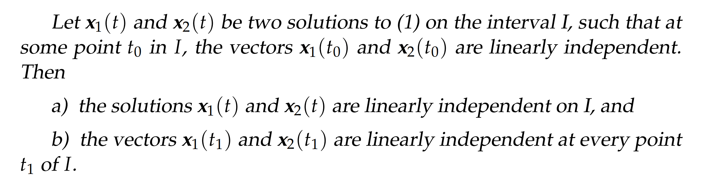
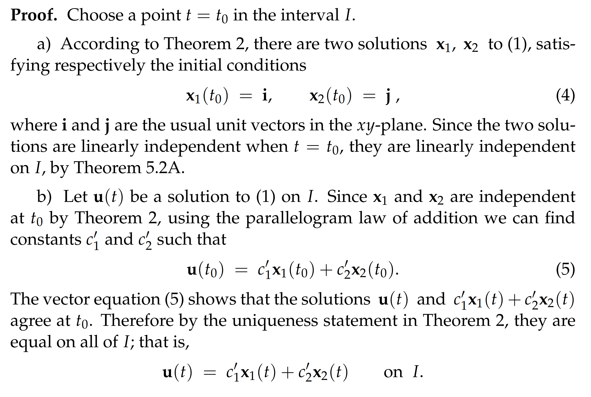
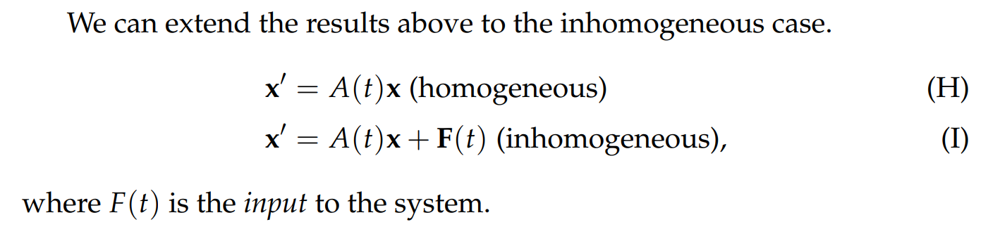
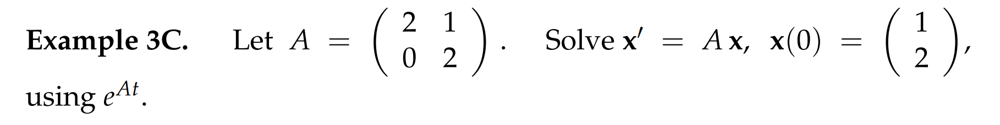
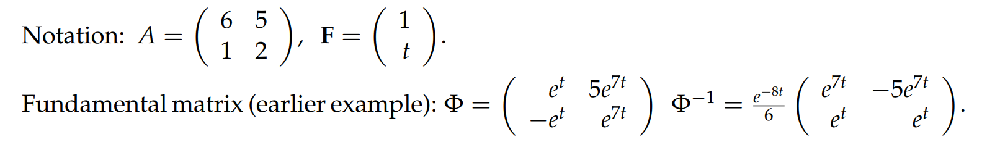

# 0 序言
[Intro.pdf](https://www.yuque.com/attachments/yuque/0/2022/pdf/12393765/1659703538145-a799d18f-3136-4854-968c-611fa5737c0b.pdf)
> 本章节我们将学习$n\times n$线性系统的解(而且不一定是常系数)
> **首先我们会学习一些线性系统的理论**，然后我们会讨论`Fundamental Matrix`, 这在解微分方程系统的时候是一个非常有用的工具。
> **我们还会使用**`**Fundamental Matrix**`**来推导**`**Variation of Parameters**`**公式**，用于求解非齐次线性方程系统。
> **接着我们会讨论矩阵指数并且用这个工具来表示**`**Fundamental Matrix**`. 矩阵指数有非常多好用的性质。
> **最后我们会简要提一下**`**Decoupling**`**相关术语**，这在工程师领域中很常用。
> 本章节很长但是内容很重要。

# 1 一般线性系统和线性无关性⭐⭐
[General Linear ODE Systems and Independent Solutions.pdf](https://www.yuque.com/attachments/yuque/0/2022/pdf/12393765/1659703538199-2d947bae-ff56-45e8-9497-cb53326e073b.pdf)
## 1.1 一般线性系统
> 之前我们学过的常系数一阶线性系统: $\bf x'=Ax$, $\bf A\in R^{n\times n}$. 通过求$\bf A$的特征值，找到$n$个特征值(重根或者不同)和其对应的$n$个特征向量。而从现在开始我们将要逐步转移到一般化线性系统的求解:
> 现在矩阵$\bf A(t)$变成了一个关于$t$的函数矩阵，我们称为`Matrix-Valued Function of t`
> 之后的小节中我们仍然以$\bf A$的记号代表线性系统的伴随矩阵，但是我们必须反应过来$\bf A$实际上是和$t$相关的。

## 1.2 线性无关性
### 1.2.1  定义
> 

### 1.2.2 符号定义的注意事项
:::success

:::

### 1.2.3 微分方程的基本解
> 
> 

# 2 存在性和唯一性定理⭐⭐⭐⭐
[The Existence and Uniqueness Theorem for Linear Systems.pdf](https://www.yuque.com/attachments/yuque/0/2022/pdf/12393765/1659703538638-0fde696d-4e29-4d1d-adde-342263fccf02.pdf)
## 2.0 概述
> 为了简化考虑，我们先考虑$2\times 2$的线性系统：
> $\begin{cases} x'=a(t)x+b(t)y \\y'=c(t)x+d(t)y  \end{cases}$, 用矩阵形式表示就是$\begin{bmatrix} x'\\y'\end{bmatrix}=\begin{bmatrix} a(t)&b(t)\\c(t)&d(t)\end{bmatrix}\begin{bmatrix} x\\y\end{bmatrix}.................(1)$
> 我们对$(1)$有两个比较大的疑问:
> 1. 线性系统的通解形式一定是$\bf x=c_1x_1+c_2x_2$吗? (其中$\bf x_i$是线性系统的基本解，$\bf x_i$不是$\bf x_j$的常数倍, $\bf x_i,x_j$线性无关)  
> 2. 我们如何知道这个$2\times 2$线性系统有两个线性无关的基本解（在常系数的情况下我们可以通过矩阵的特征值分析得到线性无关解的个数和具体结果，但是对于一般的系统来说我们还不知道）
> 
这些问题的答案都隐藏在后面的几个定理中

## 2.1 存在性和唯一性定理⭐⭐
### Theorem 1: 唯一性定理
:::success

唯一性定理说明，如果两个解$\bf x_1,x_2$代表的参数曲线相交了，那么$\bf x_1$和$\bf x_2$一定是同一个解, 换句话说就是任意两个解(`Solution Curves`不能相交, 相交了就是同一个)
数学语言就是: 如果$\bf x_1(t_1)=x_2(t_1),\exists t_1$, 则$\bf x_1(t)=x_2(t),\forall t$
:::

### Theorem 2A: 线性无关定理⭐⭐
:::info
在后面的`Theorem 2A`和`Theorem 2B`中，我们将假设$\bf A(t)$中的每一项都是连续的且在一个开区间$\bf I$上是连续的, 后面的两个定理在这个开区间$\bf I$上成立。这个开区间可以是整个$\bf x$轴
:::
> 

:::success

:::

### Theorem 2B: 通解定理
> 给定线性系统$\begin{bmatrix} x'\\y'\end{bmatrix}=\begin{bmatrix} a(t)&b(t)\\c(t)&d(t)\end{bmatrix}\begin{bmatrix} x\\y\end{bmatrix}..........................................................(1)$
> 

:::success

:::

## 2.2 一般化结论⭐⭐
[Existence and Uniqueness and Superposition in the General Case.pdf](https://www.yuque.com/attachments/yuque/0/2022/pdf/12393765/1659703538167-c9e76a32-3a35-4ed0-8bd2-c1b34c02fd8c.pdf)
:::success
本小节我们在一般化的线性方程条件下讨论存在性和唯一性定理

- 齐次线性系统
- 非齐次线性系统
:::
:::success

:::

### 2.2.1 线性和叠加
> 

### 2.2.2 存在性和唯一性
> 

# 3 朗斯基行列式⭐⭐⭐
[The Wronskian.pdf](https://www.yuque.com/attachments/yuque/0/2022/pdf/12393765/1659703538964-f20dfd5b-9f1f-49d9-a740-d13a0fa3a417.pdf)
## 3.0 序言
:::success
我们已经知道如何测试$n$个向量是线性无关的，就是通过将$n$个向量当做一个矩阵$\bf A$的列向量, 然后计算这个矩阵的行列式是否是$0$。当然，这是在矩阵的每一项都是常数的情况下。
现在我们的矩阵是$\bf A(t)$的形式，我们就要有新的方式来验证列向量的线性无关性，于是我们将要介绍朗斯基行列式的概念。
:::
## 
## 3.1 定义
> 

## 3.2 朗斯基消逝定理
> 
> 
> 

:::success

:::

# 4 基础矩阵⭐⭐⭐
[Foundamental Matrices.pdf](https://www.yuque.com/attachments/yuque/0/2022/pdf/12393765/1659703538187-9e1ff9a9-ab94-4c63-9e4f-8377201df95f.pdf)

## 4.0 序言
> 本小节我们介绍`Fundamental Matrix`，用于规范化表达线性系统的解

## 4.1 定义
> 
> 
> 

## 4.2 使用基础矩阵书写通解⭐⭐
> 

## 4.3 求解初值问题⭐⭐
> 

## 4.4 基础矩阵定理/矩阵微分⭐⭐⭐
> 
> 
> 
> **这里定义了矩阵微分**$\Phi'$**,其实就是对每一项进行微分。**

# 5 标准化基础矩阵⭐⭐⭐
[The Normalized Fundamental Matrix.pdf](https://www.yuque.com/attachments/yuque/0/2022/pdf/12393765/1659703538861-9b4ff502-fdef-43bd-b15c-1e99f65349e6.pdf)
> 
> 上一小节我们知道，一个线性系统的基础矩阵不是唯一的，那么有没有一个"最好的"基础矩阵呢?

## 5.1 基础矩阵的选取⭐⭐
:::success

本小节我们介绍两种基础矩阵的选取方法
:::

### 5.1.1 常规选取
> 如果我们的系统是常系数的，且系统的伴随矩阵的特征值是实数且各不相同，则我们可以将这个系统的`Normal Modes(Independent Solutions)`作为基础矩阵的列向量。
> 

### 5.1.2 标准化基础矩阵
> 我们还可以从中获得启发，与初值问题结合起来，比如说
> 

## 5.2 标准化矩阵的定义
> 
> 
> 

## 5.3 计算标化矩阵⭐⭐
> 本小节介绍两种选取标准化矩阵的求法
> 
> 
> `**Constant Matrix**`: `A matrix in which all the entries are constants.`

## 5.4 算例
### 算例1: 方法一求解
> 

**Key**

### 算例2: 方法二求解
> 

**Key**

# 6 矩阵指数⭐⭐
[The Exponential Matrix.pdf](https://www.yuque.com/attachments/yuque/0/2022/pdf/12393765/1659703538649-a9eeec24-7230-4d2f-83ff-0e02eb800cfa.pdf)
> 本小节我们介绍指数矩阵

## 6.0 序言
> 根据泰勒展开，我们知道：
> 
> 类比泰勒展开的定义，我们在`6.1`中给出矩阵指数的表达式

## 6.1 定义⭐⭐
> 
> 注意这里的$\bf A$是`Constant Matrix`

## 6.2 	矩阵指数与标准化矩阵⭐⭐⭐
> 类比我们在一阶线性微分方程$x'=ax$的解为$x(t)=ce^{at}$, $x(0)=x_0=c$, 我们有如下定理:
> 

:::success

:::

## 6.3 计算矩阵指数⭐⭐⭐
:::success

**下面总结一些**$\bf AB=BA$**的情况:**

1. $\bf A=cI=\begin{bmatrix} c&0\\0&c\end{bmatrix}$
2. $\bf B=-A$, 此时$\bf e^{A-A}=e^{A}e^{-A}$, 左侧$\bf e^{A-A}=e^0=e^{0t}=I$, 所以$\bf e^A\cdot e^{-A}=I$, 于是$\bf (e^{A})^{-1}=e^{-A}$
3. $\bf B=A^{-1}$, 此时$\bf AB=BA=I$

**证明为什么需要**$\bf BC=CB$**:**
$e^A = \displaystyle\sum_{n=0}^{\infty}\frac{A^n}{n!}.\quad(A\,为方阵,\,A^0=I)$
$\small\,AB=BA\,时由归纳法得\small\,(A+B)^n=\displaystyle\sum_{k=0}^n\binom{n}{k}A^{n-k}B^k,\; n=0,1,2,\ldots$
$(A+B)^2=A^2+AB+BA+B^2=A^2+2AB+B^2 等等. 于是$
$e^Ae^B={\small\displaystyle\sum_{k=0}^{\infty}\frac{A^k}{k!}\sum_{m=0}^{\infty}\frac{B^m}{m!}\overset{*}{=}\sum_{n=0}^{\infty}\sum_{m+k=n}\frac{A^m}{m!}\frac{B^k}{k!}=\sum_{n=0}^\infty\frac{(A+B)^n}{n!}=}e^{A+B}$
$以下论述是错的,e^{A+B}=e^Ae^B\,\not\hspace{-9px}\implies e^{t(A+B)}=e^{tA}e^{tB}：
现在来证明其逆命题：设e^{A+B}=e^Ae^B,则e^{t(A+B)}=e^{tA}e^{tB}
对t求导得(A+B)e^{t(A+B)}=Ae^{tA}e^{tB}+e^{tA}Be^{tB},右乘,e^{-tB}: Be^{tA}=e^{tA}B
再次对t求导后令t=0 即得BA=AB.$
参考: [http://bbs.mathchina.com/bbs/archiver/?tid-2049171.html](http://bbs.mathchina.com/bbs/archiver/?tid-2049171.html)
:::

## 6.4 算例
### 算例1
> 

**Key**
1. 由于$\bf A$是常系数矩阵, 所以$e^A=I+A+\frac{A^2}{2!}+...+\frac{A^n}{n!}$, 我们将结果写成矩阵形式得到: $\begin{bmatrix} 1+a+\frac{a^2}{2}+...+\frac{a^n}{n!}&0\\0&1+b+\frac{b^2}{2}+...+\frac{b^n}{n!}\end{bmatrix}=\begin{bmatrix} e^a&0\\0&e^b\end{bmatrix}=e^{A}$
2. $e^{At}=I+At+\frac{A^2t^2}{2!}+...+\frac{A^nt^n}{n!}$, 写成矩阵形式得到:

$\begin{bmatrix} 1+at+\frac{a^2t^2}{2}+...+\frac{a^nt^n}{n!}&0\\0&1+bt+\frac{b^2t^2}{2}+...+\frac{b^nt^n}{n!}\end{bmatrix}=\begin{bmatrix} e^{at}&0\\0&e^{bt}\end{bmatrix}=e^{At}$

### 算例2
> 

**Key**
1. 这个矩阵比较特殊，因为$\bf A^n=0,\forall n\geq 2$, 所以根据公式$e^A=I+A+\frac{A^2}{2!}+...+\frac{A^n}{n!}=I+A=\begin{bmatrix} 1&1\\0&1\end{bmatrix}$
2. 根据公式和$(1)$中的矩阵特殊性: $e^{At}=I+At+\frac{A^2t^2}{2!}+...+\frac{A^nt^n}{n!}=I+At=\begin{bmatrix} 1&t\\0&1\end{bmatrix}$

### 算例3
> 

**Key**

### 算例4
> 

# 7 非齐次线性系统, Variation of Parameters
[Inhomogeneous Case, Variation of Parameters Formula.pdf](https://www.yuque.com/attachments/yuque/0/2022/pdf/12393765/1659703538193-b8f3f684-6df6-4155-8232-5b8aa74fa718.pdf)
## 7.0 序言
> 本小节介绍非齐次线性系统如何使用基础矩阵来求解。
> 

## 7.1 参数变形- 不定积分⭐⭐⭐
> 
> 求出所有解$x(t)$,而参数$\bf C$还需要`IVP`来确定

> **其中**$(\Phi \cdot v)'=\Phi'\cdot v+\Phi\cdot v'$**的证明如下:**
> 假设$\Phi=\begin{bmatrix} a(t)&b(t)\\c(t)&d(t)\end{bmatrix}$, $v=\begin{bmatrix} u(t)\\v(t)\end{bmatrix}$
> 则$\Phi \cdot v=\begin{bmatrix} a(t)u(t)+b(t)v(t)\\c(t)u(t)+d(t)v(t)\end{bmatrix}$
> 于是$(\Phi \cdot v)'=\begin{bmatrix} a'(t)u(t)+a(t)u'(t)+b'(t)v(t)+b(t)v'(t)\\c'(t)u(t)+c(t)u'(t)+d'(t)v(t)+d(t)v'(t)\end{bmatrix}=\begin{bmatrix} a'(t)u(t)+b'(t)v(t)+a(t)u'(t)+b(t)v'(t)\\c'(t)u(t)+d'(t)v(t)+c(t)u'(t)+d(t)v'(t)\end{bmatrix}=\newline \begin{bmatrix} a'(t)u(t)+b'(t)v(t)\\c'(t)u(t)+d'(t)v(t)\end{bmatrix}+\begin{bmatrix} a(t)u'(t)+b(t)v'(t)\\c(t)u'(t)+d(t)v'(t)\end{bmatrix}=\newline \begin{bmatrix} a'(t)&b'(t)\\c'(t)&d'(t)\end{bmatrix} \begin{bmatrix} u(t)\\v(t)\end{bmatrix}+\begin{bmatrix} a(t)&b(t)\\c(t)&d(t)\end{bmatrix} \begin{bmatrix} u'(t)\\v'(t)\end{bmatrix}=\newline\Phi'\dot v+\Phi v'$

## 7.2 参数变形- 定积分⭐⭐
> 
> 直接求出`IVP`解, 参数$\bf C$可以直接确定.

## 7.3 算例
> 

**Key**

# 8 解耦(Decoupling)⭐⭐⭐
参考:  [https://zhuanlan.zhihu.com/p/107976972](https://zhuanlan.zhihu.com/p/107976972)
## 8.0 序言
> 之前我们讨论了对于$\bf x'=Ax$线性系统的两种视角的解法:
> 1. 求$\bf A$的特征值和特征向量, 解特征方程，求`Independent Solutions`,然后线性组合他们得到通解，然后解`IVP`问题求解
> 2. 使用指数矩阵, `IVP`的解是$\bf e^{At}x_0$，标准化基础矩阵是$\bf e^{At}=\Phi_0(t)\Phi(0)^{-1}$

> 本小节我们学习`Decoupling`的概念, 也是另一种求解方法，依然并不省力，相当于换一种语言来描述而已。但是不同的领域有不同的习惯，有的喜欢用基本矩阵，而有的就用今天介绍的解耦的方式来表达问题和答案。
> 解耦的本质就是将原来的变量$x,y$变换到$uv$坐标系下，这是`18.06SC`中基变换的相关内容。这里不对其原理做过多深究。

 
## 8.1 解耦的定义
> 所谓耦合，就是方程中导函数的表达式中同时出现了$x$和$y$。而解耦的方法，就是做一些线性变量替换$\begin{cases}u=ax+by \\v=cx+dy \end{cases}$, 来实现对原方程组的解耦，得到已解耦的方程组 $\begin{cases}u'=k_1u\\v'=k_2v\end{cases}$ 而对于这种方程已经可以分别求解了。
> 解耦方法的流行还在于，新的因变量在物理上可能有特殊的解释，有某些特殊的原因导致了它以这种状态存在。

## 8.2 算例
> **例**：底部有洞联通的两个容器盒，容器$1$的底面积是容器$2$的一半，容器$1$的液面高度为$x$，容器$2$的高度为$y$。联通洞的液体流速正比于洞的面积乘以液面高度差（高度差正比于压力差）。
> 

> **首先列出微分方程:**
> 列出微分方程 $\begin{cases}x'=c(y−x)\\2y'=c(x−y)\end{cases}$ 。$y$的导函数前面有参数$2$，这是因为同等流量对于容器$2$液面高度的影响受到其底面积的影响。为了简便运算，令参数$c$等于2。因此方程为 $\begin{cases}x'=−2x+2y\\y'=x−y\end{cases}$ 。
> 稍后会给出确定线性替换的普适方法，但是这里我们从物理问题本身入手去探讨如何进行代换，首先，高度差是直接反应压力差的参数，它比两个容器各自的高度更加利于讨论该问题，其次，容器内部的总液体量是不变的，由此可知可以进行如下线性替换$\begin{cases}u=x+2y\\v=x−y\end{cases}$，得到方程组 $\begin{cases}u'=0\\v'=−3v\end{cases}$ 。
> 解得 $\begin{cases} u=c_1\\v=c_2e^{−3t} \end{cases}$ ，得到 $\begin{cases}x=\frac{1}{3}(u+2v)=\frac{1}{3}(c_1+2c_2e^{-3t})\\y=\frac{1}{3}(u−v)=\frac{1}{3}(c_1−c_2e^{−3t}) \end{cases}$，即 $x=\frac{c_1}{3}\begin{bmatrix}1\\1\end{bmatrix}+\frac{c_2}{3}\begin{bmatrix}2\\-1\end{bmatrix}e^{−3t}$ 。

## 8.3 解耦的一般性方法
> 解耦要求特征值都是实数且都是`Complete Eigenvalues`。
> 新变量为 $\bf \begin{bmatrix}u\\v\end{bmatrix}=\begin{bmatrix}a_1&a_2\\b_1&b_2\end{bmatrix}\begin{bmatrix}x\\y\end{bmatrix}=D\begin{bmatrix}x\\y\end{bmatrix}$。写出反代换公式 $\bf \begin{bmatrix}x\\y\end{bmatrix}=E\begin{bmatrix}u\\v\end{bmatrix}$ 。则$\bf E$的列向量是矩阵$\bf A$两个特征向量 $\bf E=\begin{bmatrix}\alpha_1&\alpha_2\end{bmatrix}$ 。乘以$\bf E$进行坐标变换(基变换矩阵, 在`18.06SC`中有详细介绍)，实际上就是将原空间变换至$uv$空间，而$uv$空间中两个坐标方向对于矩阵$\bf A$的操作具有方向不变性，回想原坐标系下，只有特征向量方向才具有这种特性，因此实际上特征向量$α_1, α_2$， 分别对应着$uv$空间的坐标方向，即 $α_1$ 对应 $\begin{bmatrix}1\\0\end{bmatrix}$ ，$α_2$ 对应 $\begin{bmatrix}0\\1\end{bmatrix}$ 。
> $\bf (A−λI)α=0⇔Aα=λα$ 。
> **公式给出了特征值和特征向量的两种定义方式**
> - 前一种首先定义特征值 是使得行列式 $|A−λI| =0$的值，而特征向量 $α$则是方程组的非$0$解；
> - 后一种定义更有几何味道，把$\bf A$看作是对平面做了一个线性变换，而对某个特定的向量** **$α$，线性变换只是对它做了拉伸或者压缩，而特征值 $λ$ 就是拉伸或者压缩比例。
> 
因为不是从线代角度出发来全面论证这件事情，因此教授没有顺向去描述，没有一些线代的相关知识做背景，就难于把事情讲得特别通透，而Gilbert Strang的“微分方程和线性代数”在这方面比较有优势。

## 8.4 方法描述
> 1. 对于微分方程组$\bf x'=Ax$，做变量代换 $\bf x=Eu,u=\begin{bmatrix}u\\v\end{bmatrix}$ ，则方程为 $\bf Eu'=AEu$ ，其中$AE=A\begin{bmatrix}α_1&α_2\end{bmatrix}=\begin{bmatrix}Aα_1&Aα_2\end{bmatrix}=\begin{bmatrix}\lambda_1\alpha_1&\lambda_2\alpha_2\end{bmatrix}=\begin{bmatrix}α_1&α_2\end{bmatrix}\begin{bmatrix}\lambda_1&\\&\lambda_2\end{bmatrix}=E\begin{bmatrix}\lambda_1&\\&\lambda_2\end{bmatrix} ，因此有 Eu'=AEu=E\begin{bmatrix}\lambda_1&\\&\lambda_2\end{bmatrix}u$ ，得到 $\bf u'=\begin{bmatrix}\lambda_1&\\&\lambda_2\end{bmatrix}u$ ，即 $\begin{cases} u'=λ_1u\\v'=λ_2v\end{cases}$ 。
> 
通过选择特征向量作为新的基向量，方程组实现了解耦，常数就是特征值。得到的解为 $\begin{cases} u=c_1e^{\lambda_1t}\\v=c_2e^{\lambda_2t}\end{cases}$ 。
> 
> 2. 用上面介绍的普适方法解耦方程组 $\bf \begin{bmatrix}x\\y\end{bmatrix}'=\begin{bmatrix}-2&2\\1&-1\end{bmatrix}\begin{bmatrix}x\\y\end{bmatrix}$ 。
> 
首先得到特征方程为 $\bf λ^2+3λ=0$ ，求得特征值 $\bf λ_1=0,λ_2=−3$ ，对应的特征向量为 $\bf α_1=\begin{bmatrix} 1\\1 \end{bmatrix}$ 和$\bf α_2=\begin{bmatrix} -2\\1 \end{bmatrix}$。因此 $\bf E=\begin{bmatrix}1&-2\\1&-1\end{bmatrix}$ ，$\bf E^{-1}=\frac{1}{3}\begin{bmatrix}1&2\\-1&1\end{bmatrix}$。
> 所以有 $\bf \begin{bmatrix}u\\v\end{bmatrix}=\frac{1}{3}\begin{bmatrix}1&2\\-1&1\end{bmatrix}\begin{bmatrix}x\\y\end{bmatrix}$ ，即 $\bf \begin{cases}u=\frac{1}{3}(x+2y)\\v=\frac{1}{3}(x−y) \end{cases}$ ，和我们之前通过物理状态讨论的结果只差一个常数项。
> 在有些复杂问题中，通过这种方法找到的代换关系和新的因变量，从物理方面等于给出了新的性质或者状态的内在联系，有时候这种启发和求解方程同样重要。

# 9 Problems
[Practice Problems.pdf](https://www.yuque.com/attachments/yuque/0/2022/pdf/12393765/1659703538521-d7d50afa-c0f8-443b-868d-4b294d46e0a2.pdf)
[Problem Set 1.pdf](https://www.yuque.com/attachments/yuque/0/2022/pdf/12393765/1659703538564-05d9b2e3-3107-4a2c-83be-0dbd9d75c970.pdf)
[Problem Set 2.pdf](https://www.yuque.com/attachments/yuque/0/2022/pdf/12393765/1659703538620-ace8cf87-2f8a-4bd6-afee-2c87416c540d.pdf)

## Study Guide
> 

## P1: 矩阵指数⭐⭐⭐
> 假设$\bf A=\begin{bmatrix} 6&5\\1&2\end{bmatrix}$
> (1). 计算$\bf e^{At}$
> (2). 解$\bf v=Av$,`IC`是$\bf v(0)=\begin{bmatrix} 4\\1 \end{bmatrix}$

> **解题之前我们复习一下基础矩阵相关基本运算:**
> 首先为了得到解的表达式，我们需要求出矩阵特征值和特征向量， 特征方程是
> $\lambda^2-8\lambda+7=0$, 于是$\lambda_1=1,\lambda_2=7$
> 当$\lambda_1=1$时，$\bf v=\begin{bmatrix}1\\-1\end{bmatrix}$
> 当$\lambda_2=7$时， $\bf v=\begin{bmatrix} 5\\1 \end{bmatrix}$
> 于是我们有解$\bf u(t)=c_1e^t\begin{bmatrix} 1\\-1\end{bmatrix}+c_2e^{7t}\begin{bmatrix} 5\\1\end{bmatrix}$
> 写成基本矩阵形式$\bf u(t)=\Phi(t)\vec{c}=\begin{bmatrix} e^t&5e^{7t}\\-e^t&e^{7t}\end{bmatrix}\begin{bmatrix} c_1\\c_2\end{bmatrix}$
> 然后我们求初值问题：$\bf u(0)=\Phi(0)\vec{c}=\begin{bmatrix} e^0&5e^{7*0}\\-e^0&e^{7*0}\end{bmatrix}\vec{c}$, 于是$\bf \vec{c}=\Phi(0)^{-1}u(0)$
> 所以`IVP`的解是$\bf u(t)= \Phi(t)\vec{c}=\Phi(t)\Phi(0)^{-1}u(0)$
> 而标准化基本矩阵就是$\bf \tilde{\Phi_0(t)}=\Phi(t)\Phi(0)^{-1}$
> 因为$\bf e^{At} = \Phi(t)\Phi(0)^{-1}=\tilde{\Phi_0(t)}$(`6.2`中证明), 我们可以通过$\bf e^{At}$计算出标准化基本矩阵和初值问题的解。

**(1) 求e^(At)**$\bf e^{At}=\tilde{\Phi_0(t)}=\begin{bmatrix} e^t&5e^{7t}\\-e^t&e^{7t}\end{bmatrix}\begin{bmatrix} 1&5\\-1&1\end{bmatrix}^{-1}$
因为$2\times 2$矩阵的逆公式为$\begin{bmatrix} a&b\\c&d\end{bmatrix}^{-1}=\frac{1}{ad-bc}\begin{bmatrix} d&-b\\-c&a\end{bmatrix}$
所以$\bf e^{At}=\tilde{\Phi_0(t)}=\frac{1}{6}\begin{bmatrix} e^t+5e^{7t}&-5e^{t}+5e^{7t}\\-e^t+e^{7t}&e^{t}+e^{7t}\end{bmatrix}$
**(2): 求IVP**$\bf u(t)=e^{At}u(0)=\frac{1}{6}\begin{bmatrix} e^t+5e^{3t}&-5e^{t}+5e^{7t}\\-e^t+e^{7t}&e^{t}+e^{7t}\end{bmatrix}\begin{bmatrix}4\\1\end{bmatrix}=\begin{bmatrix} -e^t+25e^{7t}\\-e^t+5e^{7t}\end{bmatrix}$

## P2: 基础矩阵和矩阵指数⭐⭐
> 

**(a)**
**(b)**

**(c)**
**(d) 重点关注**⭐

## P3 特征值分析⭐⭐
> 

**(a) 原始方法求IVPs**
**(b) 基础矩阵**⭐⭐

**(c) 特征值**⭐⭐⭐
注意这里使用了`18.06SC`中`Unit 2.8`中的`P1`中关于特征值变换相关推导，关于矩阵做变换之后特征值发生改变，特征向量不变。
**(d) 反推伴随矩阵**⭐⭐⭐
这里$\bf B$和$\bf e^B$的特征向量保持不变s
因此，如果我们知道了解的形式，也可以反推出线性系统的伴随矩阵

## P4: 基础矩阵1: 实特征值
> 
> 找到基础矩阵和`IVP Solution`

**Key**

## P5: 基础矩阵2: 复特征值
> 
> 找到基础矩阵和`IVP Solution`

**Key**

## P6: 综合题: 复数矩阵⭐⭐⭐
> 

**(a) Decoupling**`Normal Mode`在`Unit 4.2`中定义
**(b) Normalized Pair of Solutions**
**(c) 反推伴随矩阵**
