> 本章节我们将介绍$2\times 2$自治系统并且介绍如何定性分析这类系统的性质。

# 1 微分方程组作图概念复习
[The Phase Plane.pdf](https://www.yuque.com/attachments/yuque/0/2022/pdf/12393765/1659831180371-00b91348-e7dd-4506-a730-0a09ae92a162.pdf)

## 1.1 定义
> 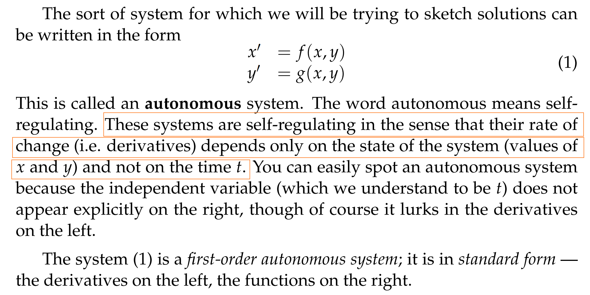

## 1.2 相平面**⭐⭐**
> 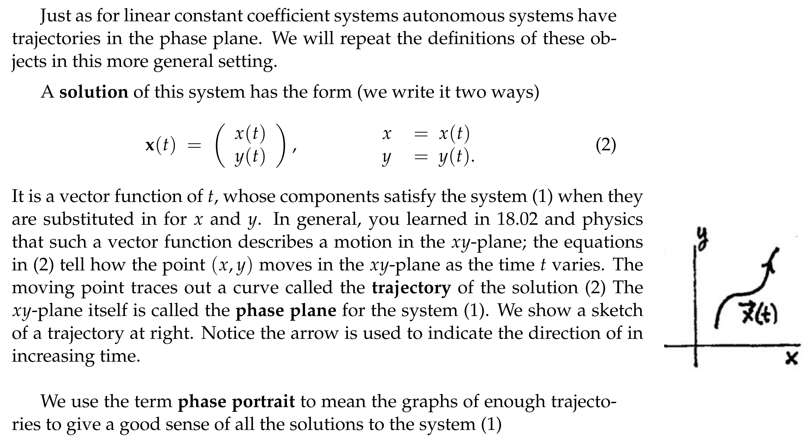

## 1.3 向量场/速度场**⭐⭐⭐⭐**
> 
> 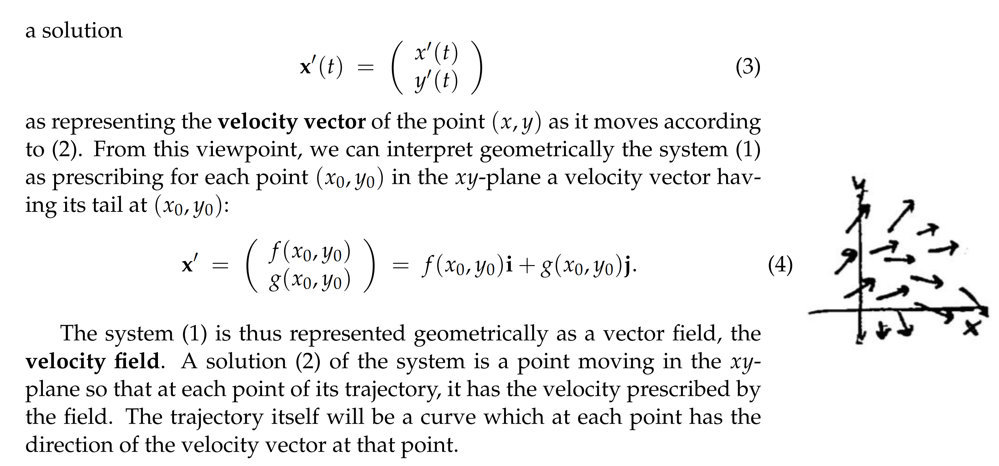

## 1.4 临界点(critical points)**⭐⭐**
> 和`1.11`中介绍的`nullcline`一样，我们可以先找到使得$f(x,y)$和$g(x,y)$都为零的$(x,y)$点, 这些点本身就是自治线性系统的解。

> 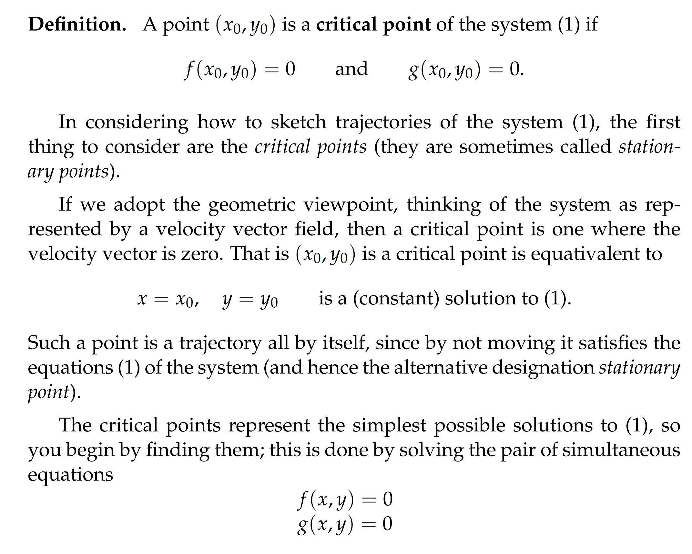

## 1.5 作图原则
> 和`Unit 4.3`中的一样, `Solution Curve`不能两两相交。
> 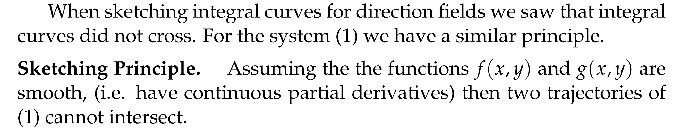

# 2 一阶自治微分方程组**⭐⭐**
[First Order Autonomous ODE Systems.pdf](https://www.yuque.com/attachments/yuque/0/2022/pdf/12393765/1659831732542-9975ab8c-e797-43fe-8c53-407cd36f5330.pdf)
## 2.0 序言
> 本小节我们探寻一阶自治微分方程组和一阶自治微分方程之间的联系。
> 我们还将探寻`Velocity Field`和`Direction Field`[Unit 1.3](https://www.yuque.com/alexman/dydxis/vsdnaq#mkHRh)之间的区别和联系。
> 本小节的主要内筒其实是讨论一个非线性方程组，它阐述了对于非线性方程组我们需要知道的三件事:
> 1. 转换成一阶方程
> 2. 边界线问题
> 3. 定性研究

## 2.1 非线性自治微分方程组
> 对于一个非线性自治微分方程组$\begin{cases} \frac{dx}{dt}=f(x,y)\\\frac{dy}{dt}=g(x,y)\end{cases}$。它的几何图像是一个速度场$\bf F=f\bf{i}+g\bf{j}$, 方程组的解$\begin{cases} x=x(t)\\y=y(t)\end{cases}$, 是一个曲线的参数方程，几何图像是一条轨迹。轨迹的切线方向就是速度场的方向，并且该点速度场的大小代表了在轨迹上运动的快慢。

## 2.2 转换成一阶方程**⭐⭐⭐**
> 参考在[Unit 1.3](https://www.yuque.com/alexman/dydxis/vsdnaq#mkHRh)中的关于方向场(`Direction Field`)的定义，我们知道，方向场只包含`Solution Curve`$(x(t),y(t))$在某一点的方向而不记录其速度；而向量场则是既记录速度由包含速度方向
> 得到这样的方向场，我们需要从$\begin{cases} \frac{dx}{dt}=f(x,y)\\\frac{dy}{dt}=g(x,y)\end{cases}$中消去变量$t$, 我们直接两式相除，得到: $\frac{dy}{dx}=\frac{g(x,y)}{f(x,y)}$, 我们将一个非线性方程组(关于$x,y,t$的)转变成了一个非线性方程(关于$x,y$的)
> 这个方程由于和$t$无关，所以其几何图像中就确实了速度信息，只剩下了斜率（方向场）的信息。
> 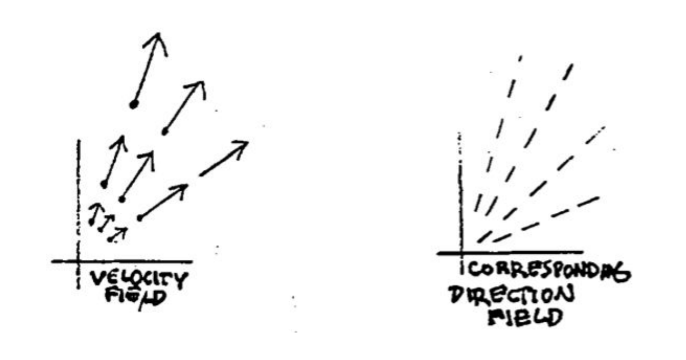
> 解函数 $h(x,y)=0$ 也不再是参数方程，其图像也从轨迹变为积分曲线。因此将方程组转换为一阶微分方程丢掉了很多信息，而人们愿意这么做是因为这可能是可解的方程，而对应的方程组不可解。

## 2.3 算例**⭐⭐**
> 假设我们有$\begin{cases}  x'=y\\y'=-x\end{cases}$, 我们可以得到两个线性无关的解$\begin{bmatrix} cost \\ -sint\end{bmatrix}$和$\begin{bmatrix} sint \\ cost\end{bmatrix}$, 同时其伴随矩阵是$\begin{bmatrix} 0&1\\-1&0\end{bmatrix}$, 特征方程是$\lambda^2+1=0$, 于是特征值为纯虚数，所以`Solution Curve`是同心圆。其实通过两个线性无关解消去$t$, 得到$x^2+y^2=c^2$, 是同心圆。
> 
> 而如果我们先将其转换为一阶方程的话: $\frac{dy}{dx}=-\frac{x}{y}$, 使用`Separation of Variables`得到$ydy=-xdx$, 所以$\frac{1}{2}y^2+\frac{1}{2}x^2=C$, 也就是同心圆。   

# 3 Problems
[Problem Set 1.pdf](https://www.yuque.com/attachments/yuque/0/2022/pdf/12393765/1659836465847-505d4f7e-4170-4248-97bc-808fda47ab16.pdf)
[Problem Set 1 Solutions.pdf](https://www.yuque.com/attachments/yuque/0/2022/pdf/12393765/1659836496071-5be9b981-5086-4299-8d46-8b9f5c2ae6e6.pdf)

## P1 找到临界点
> 

**Key**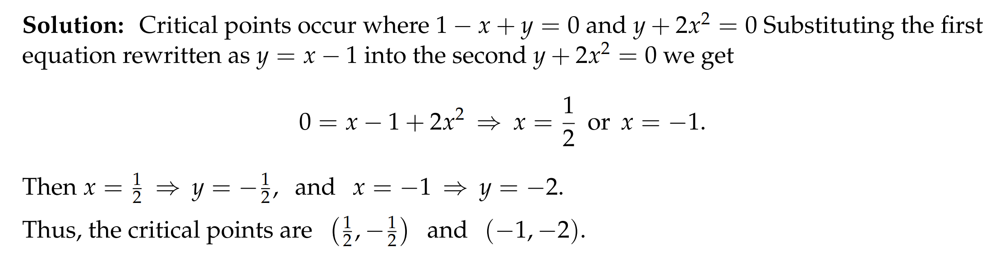

## P2 转换成一阶方程
> 

**Key**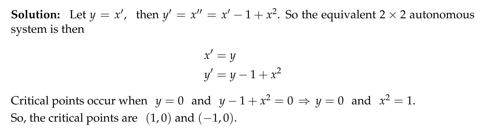

## P3 微分方程组的转化**⭐⭐**
> 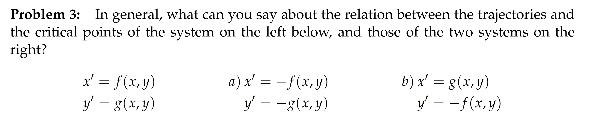

**(a)**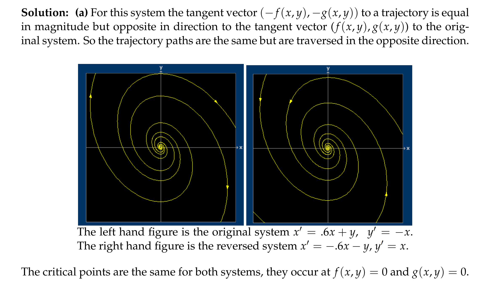
**(b)**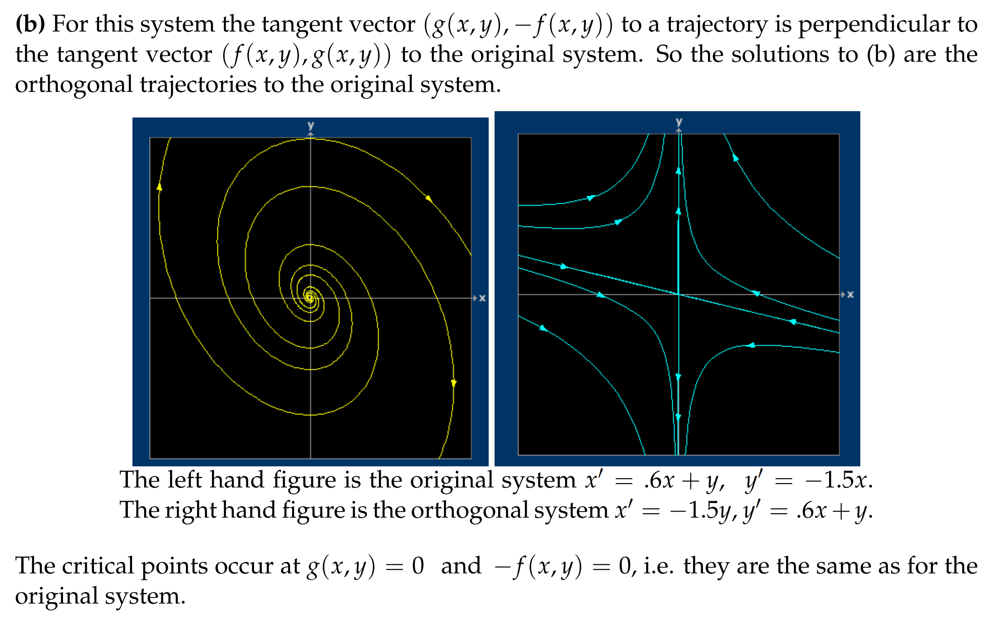
