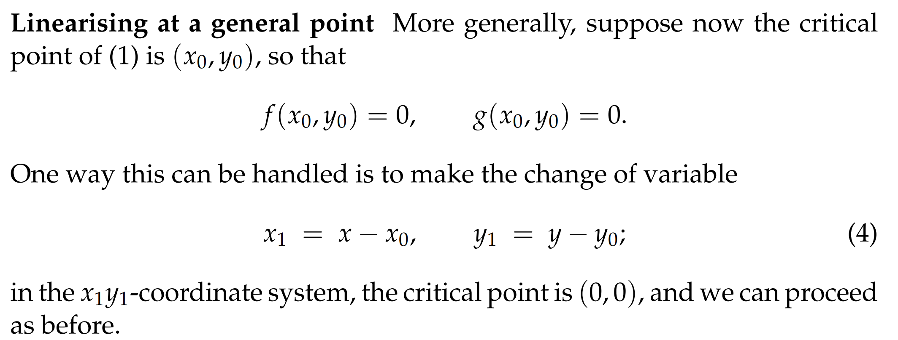
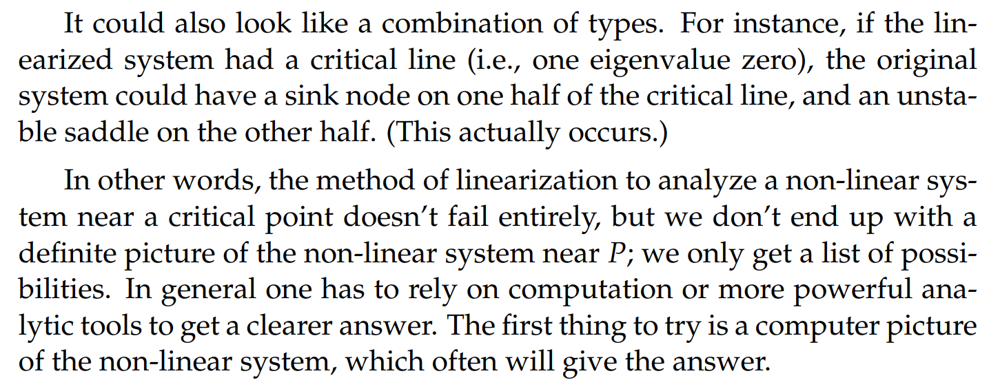
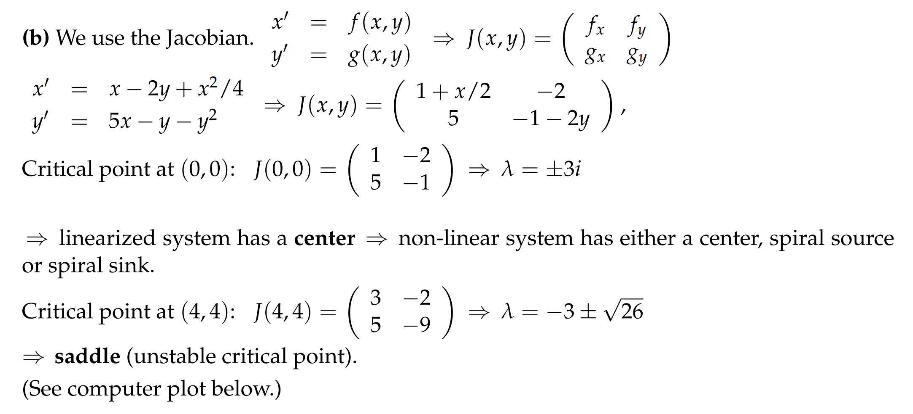

> 本小节我们将介绍如何对非线性自治微分方程组做图像的定性分析。

# 1 线性化**⭐⭐⭐**
[Sketching Non-linear Systems.pdf](https://www.yuque.com/attachments/yuque/0/2022/pdf/12393765/1659837074388-b4a61f5a-0fd5-4572-ad15-3c7f863c42c6.pdf)
> 在[切面近似](https://www.yuque.com/alexman/tn6ya7/roebmy#hK61g)中我们学习过线性化，得到一个切面，但是非线性微分方程组的线性化有所不同。

## 1.1 在原点线性化**⭐⭐**
### 1.1.1 方法概述
> 
> 注意这里方程组的右侧不能含有常数项，这是和切面近似最大的区别。

### 
### 1.1.2 算例
> 

**Key**
## 
## 1.2 在任意点线性化**⭐⭐**
### 1.2.1 方法概述
> 

### 1.2.2 算例
> 

**Key**

## 1.3 使用雅各比矩阵线性化**⭐⭐⭐**
> 使用`1.1`或者`1.2`中的线性化方法只有在方程组的右侧比较简单的情况下才可用，如果右侧非常的复杂，或者有好几个临界点，我们将使用本小节中的通用方法。

### 1.3.1 方法概述
> 
> 

# 2 绘制非线性微分方程组的图像**⭐⭐**
## 2.1 绘制流程**⭐⭐⭐**
> 
> 

## 2.2 注意事项**⭐⭐⭐**
> 
> 

## 2.3 算例
### 算例1
> 

**Key**

### 算例2**⭐⭐⭐**
> 

**Key**

# 3 结构稳定性**⭐⭐**
[Structural Stability.pdf](https://www.yuque.com/attachments/yuque/0/2022/pdf/12393765/1659842112142-d4d23259-e49e-4a1d-b813-2a8a6d7dd496.pdf)
[Structural Stability for Non-linear Systems.pdf](https://www.yuque.com/attachments/yuque/0/2022/pdf/12393765/1659842219751-cea490ce-c7e3-4ffb-804a-f6f6c8fc64ee.pdf)
## 3.0 序言
> 本小节我们探讨线性化之后的伴随矩阵的特征值有零，重复或者是纯虚数的情况下为什么线性化的方法不适用, 以及为什么无法使用线性化的方法进行作图。
> **概念梳理:**
> 与`Structural Stability`相对应的是`Borderline Cases(迹-行列式图的边界(degenerate或者defective cases))`
> - 对于**线性系统**来说，如果他的解不是`Borderline Cases`,则称之为结构稳定的。
> - 对于**非线性系统**来说，如果在它线性化之后得到的解是`Borderline Cases`,则这个线性化不是很好的估计, 且原非线性系统不是结构稳定的。

## 3.1 结构稳定性定义**⭐⭐⭐⭐**
> 如果一个微分方程组是结构稳定的，那么他的解的形状一定是`Nodes(不是Star或者degenerate), Saddles或者Spirals`中的一种， 此时他在临界点处的线性化是较好的近似，也可以使用第二小节中介绍的方法作图。
> 

## 3.2 定理及证明**⭐⭐**
> 
> 
> 

## 3.3 非线性方程组的结构稳定性
### 3.3.1 定理**⭐⭐**
> 
> 
> **总的来说：线性化在**`**Borderline Cases**`**不可靠。**
> 由于在`Borderline Cases`的时候，特征值任何微小的变化就会造成`Solution Curves`发生很大的改变。比如下面这个例子, 我的特征值仅仅变化了`0.2`，就得到了类型不一样的图像: 
> 

### 3.3.2 线性化的局限性**⭐⭐**
> 
> 

## 3.4 算例
### 算例1
> 
> 

### 算例2
> 

# 4 Borderline Cases**⭐⭐⭐⭐**
[The Borderline Geometric Types.pdf](https://www.yuque.com/attachments/yuque/0/2022/pdf/12393765/1659842233886-569f4b1d-185e-4426-a314-563473da6cea.pdf)
> 上一小节我们探讨了线性化时如果线性化后的系统不是结构稳定的，那么就不是一个很好的线性化。本小节我们对这些边界条件附近的行为做一个总结

## 4.1 特征值为纯虚数
> 

:::success

:::

## 4.2 有一个零特征值
> 

:::success

:::

## 4.3 重复特征值
> 

:::success

:::

## 4.4 总结
> 

# 5 非线性单摆**⭐**
参考: [https://zhuanlan.zhihu.com/p/108175043](https://zhuanlan.zhihu.com/p/108175043)
## 5.0 序言
> 本小节我们以刚性连接的(不是绳子)阻尼单摆为例建立一个非线性微分方程并分析其解的性质。

## 5.1 建立模型
### 5.1.1 写出一阶微分方程
> 
> 弧长公式[l=\theta*r 的证明](https://www.youtube.com/watch?v=TZEP07ind_M)
> 当$\theta$较小的时候，通常$<5\degree$的时候，$\theta$对应的弧长等于对应的弦长。
> **于是我们根据牛顿第二定律**$\bf ma=\vec{F}$**可以建立以下模型(假设此时单摆正在向右运动):**
> $\bf ml\theta''=-mgsin(\theta)-c_1l\theta'$,也就是$\bf \theta''+\frac{c_1}{l}\theta'+\frac{g}{l}sin(\theta)=0$
> 最终我们简写为: $\bf \theta''+c\theta'+ksin(\theta)=0.................................................(1)$
> 其中$\bf c$是阻尼系数，我们假设这个系统的`Underdamped`的，也就是当$\bf c$较小的时候(系统有一定的振动)

### 5.1.2 转化成线性方程组
> 由于$(1)$中的$sin(\theta)$的存在，方程组非线性，于是我们无法求出解析解，而应用无穷级数等方法也得不到精确解，应用计算机也是通过数值法来处理这个方程，而计算机应用各种改进型欧拉法时需要将方程化作一阶方程组。$w$代表角速度, 于是我们的**相平面就是**$\theta-w$**坐标系。**
> 于是我们将$(1)$转化成线性方程组: $\begin{cases} \theta'=w\\w'=-ksin\theta-cw\end{cases}$，我们取$\bf c=1, k=2$
> 所以系统是$\bf \begin{cases} \theta'=w\\w'=-2sin\theta-w\end{cases}............................................................(2)$

### 5.1.3 寻找临界点
> 对于$(2)$, 我们寻找$\bf \begin{cases} w=0\\-2sin\theta-w=0\end{cases}$的$\theta$和$w$
> 因此$\bf \begin{cases} w=0\\\theta=k\pi\end{cases}$, 看起来有无数个临界点，但其实从$\theta$的物理意义分析可知$\theta \in [0,\pi]$, 所以临界点只有两个$(0,0)$和$(\pi,0)$

 
### 5.1.4 临界点分析
> 1. 首先对$(0,0)$分析，将$(2)$进行线性化，得到: $\bf \begin{cases} \theta'=w\\w'=-2\theta-w\end{cases}..................(3)$
> 
其伴随矩阵为$\bf A=\begin{bmatrix} 0&-1\\-2&-1\end{bmatrix}$, 特征方程为$\lambda^2+\lambda+2=0$, 于是特征值是$\lambda_{1,2}=\frac{-1\pm \sqrt{-7}}{2}$, $Re(\lambda)=-\frac{1}{2}<0$, 所以是`Spiral Sink`(螺旋汇)。
> 若从$(1,0)$点出发，该点的斜率指向$(0,-2)$，因此曲线顺时针螺旋进入原点。
> 
> 它对应的物理过程就是，我们从角度为$1$而角速度为$0$的状态释放，角度减小角速度增大，穿过角度$0$点，角速度开始变小，直到角度到达反方向最大点，而此时角速度为$0$随后反向，过程不断重复，角速度能达到的极值点每个周期都在变小，所能达到的角度也在变小。
> 振幅逐渐减小，单摆逐渐向稳定点靠近。**这是一个稳定点。**

:::success

2. 对$(\pi,0)$分析的话，单摆的摆头在空中。按理说就会直接静止在那里。

平移到$(π,0)$点为中心进行绘图，则在$(1,1)$方向的直线上是远离$(π,0)$点，在$(1,-2)$的方向上是进入该点，因此这是一个“鞍”形。从略小于$π$的一个角度，角速度为$0$点出发，则角度减小，并且速率大幅变化。从略大于$π$的一个角度，角速度为$0$点出发，则角度增大，并且速度也正向大幅变化。
**这不是一个稳定点。**
:::

### 5.1.5 画出原非线性方程组的图
:::success
绘制大图。画出每个临界点周围的轨迹，补充一些内容。本例中在周期为$2π$的情况下，图形是重复的。在两种临界点之间按照趋势填充曲线，注意不可能在很近的范围内出现方向向量反向的状态。从角度为零出发，如果角速度很大，则不会朝向$(0,0)$点发展，可能是在$(π,0)$附近被弹出去，然后向着$(2π,0)$的方向发展，最后停止在那里。对应的物理状态就是旋转一圈然后在$0$点附近振荡停止。这就是其它临界点的意义所在。

:::

# 6 捕食者模型**⭐⭐**
参考: [https://zhuanlan.zhihu.com/p/108236018](https://zhuanlan.zhihu.com/p/108236018)
## 6.1 模型分析
> **我们使用捕食者模型为例构建一个非线性方程系统:**
> 假设我们的模型是$\begin{cases} x'=-ax+bxy \\y'=cy-dxy\end{cases}$, $x(t)$代表鲨鱼的数量，$y(t)$代表三文鱼的数量。其中参数都为正实数，代表两个种群数量对于自身以及对方的影响。
> 我们可以计算`Critical Point`（临界点）:
> $\begin{cases} -ax+bxy=0 \\cy-dxy=0\end{cases}$, 得到$\begin{cases} x_1=0 \\y_1=0\end{cases}$和$\begin{cases} x_2=\frac{c}{d} \\y_2=\frac{a}{b}\end{cases}$
> 1. **先看第一个临界点**$(0,0)$
> 

> 2. **讨论另一个临界点**
> 

## 6.2 转化成一阶自治微分方程
> 
> 
> 关于为什么是圆环而不是`Spiral`

## 6.3 Volterra Principle
> 

# 7 Problems
[Problem Set 1.pdf](https://www.yuque.com/attachments/yuque/0/2022/pdf/12393765/1659844825391-079a6661-0990-4095-870d-a02c70cb26e5.pdf)
[Problem Set 2.pdf](https://www.yuque.com/attachments/yuque/0/2022/pdf/12393765/1659844825313-df851b70-b3a0-4955-872f-2759b15a1a5b.pdf)

## P1: Logistic Model
> 考虑如下的捕食者系统:
> $\begin{cases} \dot{x}=x(3-x)-xy=f(x,y)\\ \dot{y}=y(1-y)+xy=g(x,y)   \end{cases}$
> 1. 解释这个系统
> 2. 找到所有的临界点，将系统线性化并且给出`Phase Portrait`
> 3. 讨论这个`Phase Portrait`

**(1)**这是个捕食者系统，$x(3-x)和y(1-y)$是`Logistic Growth`，具体解释参考[Logistic Model](https://www.yuque.com/alexman/dydxis/xd44bq#SjJWm)
**(2)**令$f(x,y)=g(x,y)=0$, 得到四个临界点$(0,0),(0,1),(3,0),(1,2)$
在四个临界点分别使用雅各比线性化, 得到:

| **临界点坐标** | $(0,0)$ | $(0,1)$ | $(3,0)$ | $(1,2)$ |
| --- | --- | --- | --- | --- |
| Jacobian | $\begin{bmatrix} 3&0\\0&1 \end{bmatrix}$ | $\begin{bmatrix} 2&0\\1&-1 \end{bmatrix}$ | $\begin{bmatrix} -3&-3\\0&4 \end{bmatrix}$ | $\begin{bmatrix} -1&-1\\2&-2 \end{bmatrix}$ |
| $\lambda_1,\lambda_2$ | $3,1$ | $2,-1$ | $-3,4$ | $\frac{-3\pm\sqrt{7}i}{2}$ |
| Geometric Type | Nodal Source | Saddle | Saddle | Spiral Sink |

**(3)**所有的临界点都是结构稳定的。

## P2: Linearization at (0,0)
> 

**Problem 1**

**Problem 2**

## P3: 任意临界点的线性化**⭐⭐**
> 

**Problem 3**

**Problem 4**
1. 得到临界点

2. 得到得到雅各比矩阵

3. 分析每个临界点

4. 画出图像

## P4: 结构稳定性1**⭐⭐**
> 
> 

**Key**

## P5: 结构稳定性2**⭐⭐**
> 

**Key**

## P6 临界点线性化
> 

**Problem 7**
**Problem 8**

**Problem 9**

## P7: 临界点和线性化**⭐⭐⭐⭐**
> 

**(a)**
只有实数才能是临界点。否则在`Phase Portraits`上画不出来。
**(b)**

## P8: 结构稳定性3**⭐⭐⭐**
> 

**Key**
