# 0 序言
**参考**: [https://zhuanlan.zhihu.com/p/108188632](https://zhuanlan.zhihu.com/p/108188632)
> 终于来到了最后一章节，我们将延伸之前的对`DE`定性分析的方法。
> 首先我们对之前一章节内容做一个复习:
> 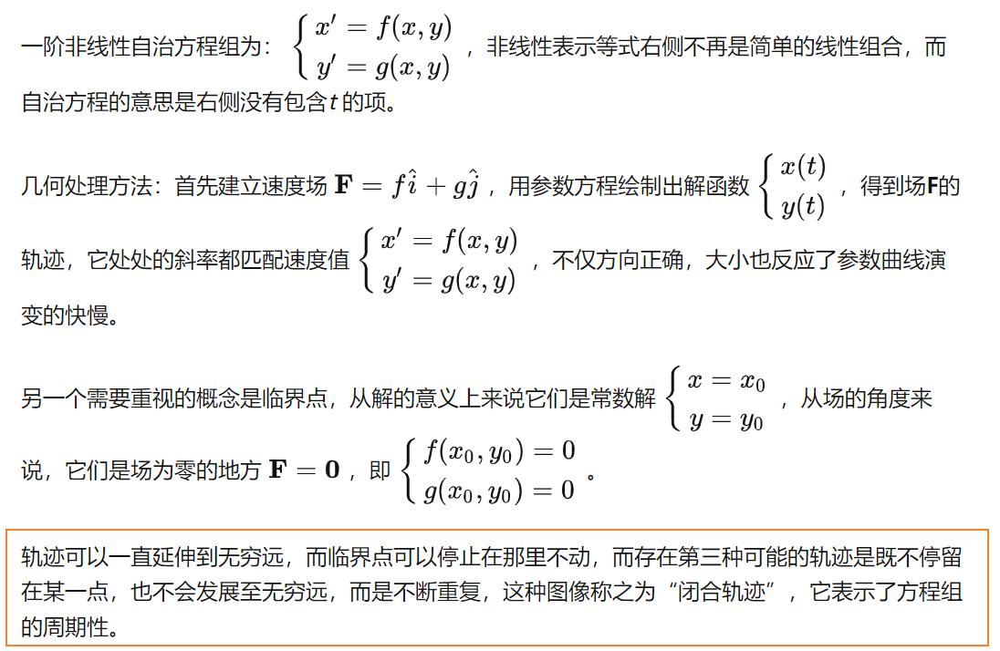
> 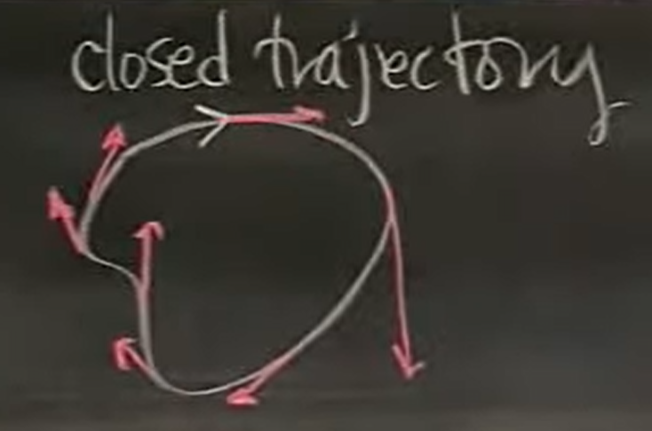
> 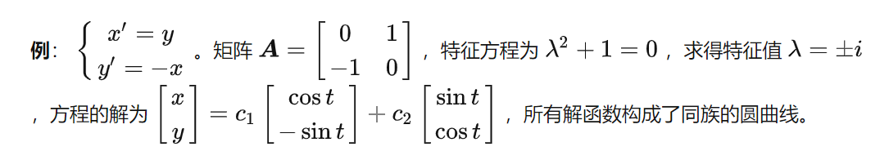
> 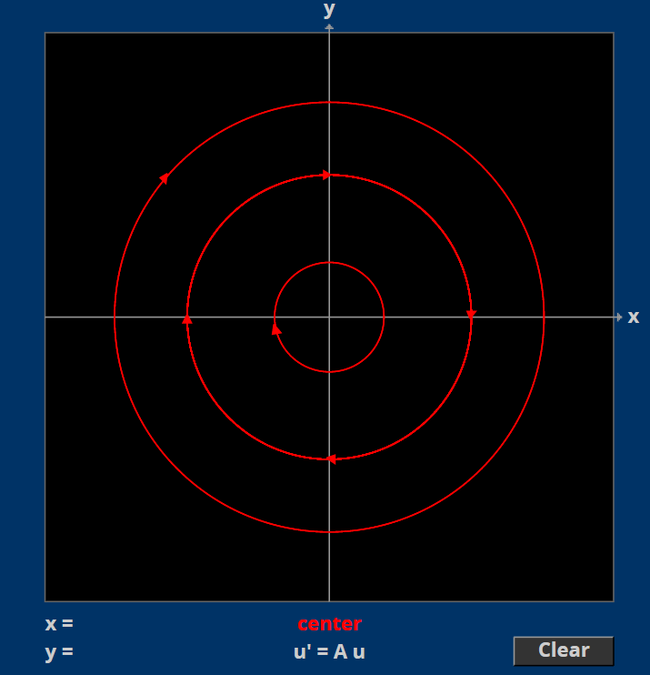

# 1 极限环
## 1.1 定义
[Limit Cycles.pdf](https://www.yuque.com/attachments/yuque/0/2022/pdf/12393765/1659863476880-5cd04db1-7885-412a-9911-3cb9353f46bd.pdf)
> 极限环是另一种闭合轨迹。它不像同族圆曲线，大家具有相似的结构，极限环是周围曲线的极限，不论是从内侧还是外侧，轨迹都逼近极限环，它是一个“稳定”的结构。（图片是维基的）
> 对于一个非线性方程系统$\begin{cases} x'=f(x,y)\\y'=g(x,y)\end{cases}$
> 他的解$\begin{cases}  x=x(t)\\y=y(t)\end{cases}$形成的参数曲线$\bf C$有可能是一个闭合的轨迹，且满足$\begin{cases}  x(t+T)=x(t)\\y(t+T)=y(t)\end{cases},\forall t$, 有了这个参数曲线$\bf C$, 它附近的曲线的行为应该和$\bf C$本身差不太多。一共四种情况:
> 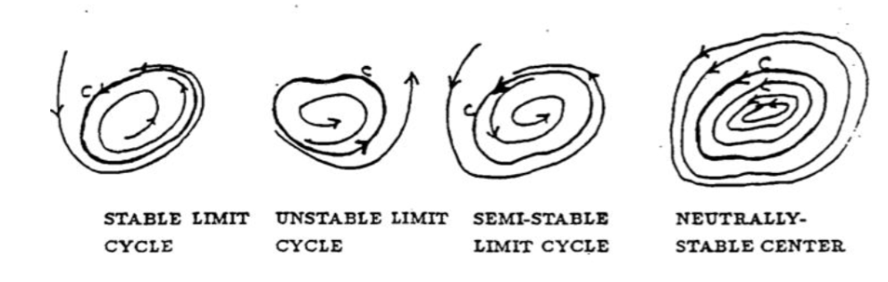
> `Stable Limit Cycle`: 内侧和外侧的曲线都逐渐靠近曲线$\bf C$
> `Unstable Limit Cycle`: 内侧和外侧的曲线都逐渐远离曲线$\bf C$
> `Semi-stable Limit Cycle`: 内侧曲线远离$\bf C$，外侧曲线靠近$\bf C$
> `Neutrally-Stable Center`: 内外侧曲线和$\bf C$不存在任何趋近或者远离$\bf C$
> 研究极限环的意义在于，在自然界中有这样的系统，它本身有自己的周期，如果影响它使它离开稳定状态，它会逐渐回到原先的周期状态。例如呼吸就是如此，呼吸系统受到各种激素和血液中二氧化碳水平的控制，即使人为加快呼吸或者放缓呼吸最终还是会回到正常状态。

## 1.2 极限环存在性
[Showing Limit Cycles Exist.pdf](https://www.yuque.com/attachments/yuque/0/2022/pdf/12393765/1659863476922-24e9035e-ffba-45f7-b9e7-43d8014c2f1a.pdf)
### 1.2.0 前言
> **存在性问题**：一个微分方程组如何知道其是否存在极限环，答案是没有方法确定。庞加莱-本迪克松定理（`Poincare-Bendixson`）是人们寻找极限环的唯一结论。即使计算机运算已经很发达，但是人们并不知道该到哪里去寻找极限环。所以实际上人们不知道如何寻找极限环，除非线性微分方程所代表的物理系统暗示存在某种周期性的东西。

### 1.2.1 庞加莱-本迪克松定理
> 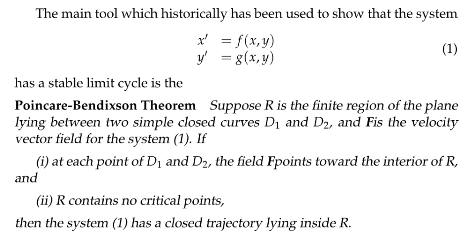
> 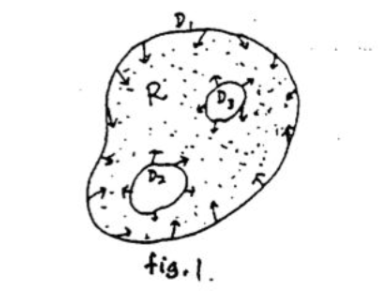
> **直觉性证明:**
> 我们从外侧的边界$\bf D_1$开始，因为在$\bf D_1$附近的速度场都指向$\bf D_1$内部，所以`Solution Curve`会进入$\bf R$区域。随着时间推移，这个`Solution Curve`不会离开$\bf R$, 因为速度场会拽着质点不让其逃逸出$\bf R$. 因为`Solution Curve`上的质点不会离开$\bf R$区域，那么当$t\to \infty$时，质点通常会趋近于一个临界点，但是定理的第二条说我们在$\bf R$区域内部不存在临界点，所以$\bf R$内部会有一个闭合轨迹，称为系统的极限环(这个极限环根据定义不可能是`Unstable Limit Cycle`,因为其外部的曲线都会趋近于它（因为速度场的方向向内）)

### 1.2.2 算例
#### 算例1
> 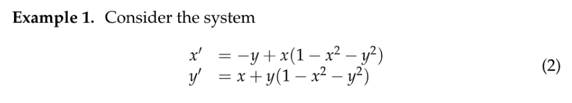
> 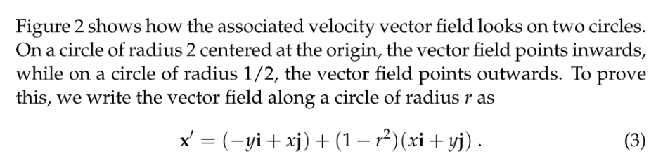
> 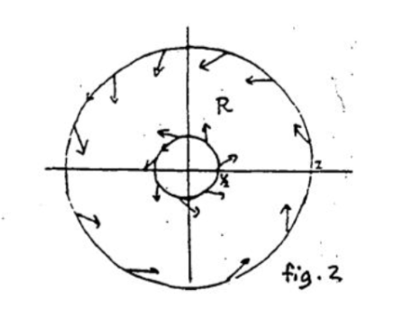
> 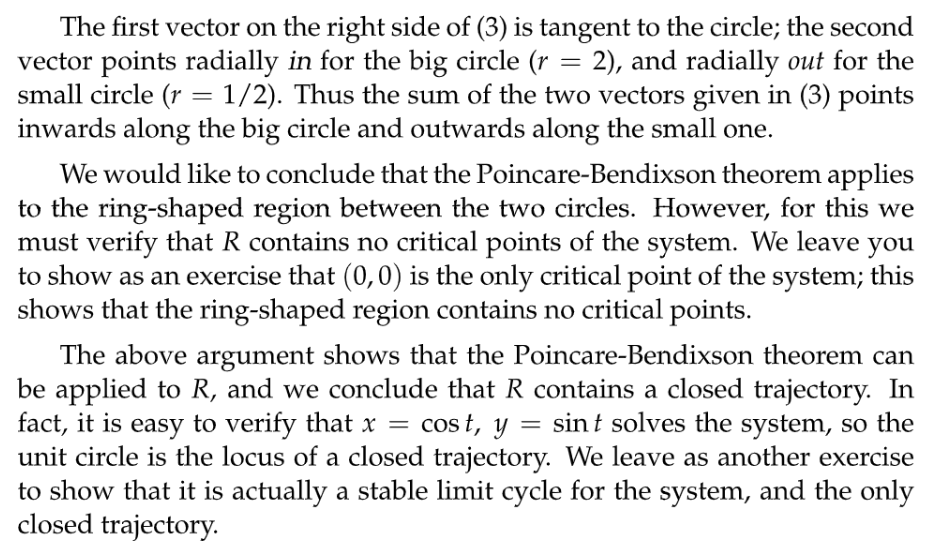

## 1.3 极限环不存在性
[Non-Existence of Limit Cycles.pdf](https://www.yuque.com/attachments/yuque/0/2022/pdf/12393765/1659863476900-3cae315a-4725-4b0f-a00d-fc384f23a644.pdf)

### 1.3.1 本迪克松准则
> 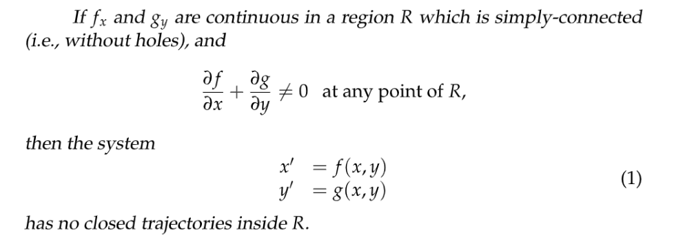
> 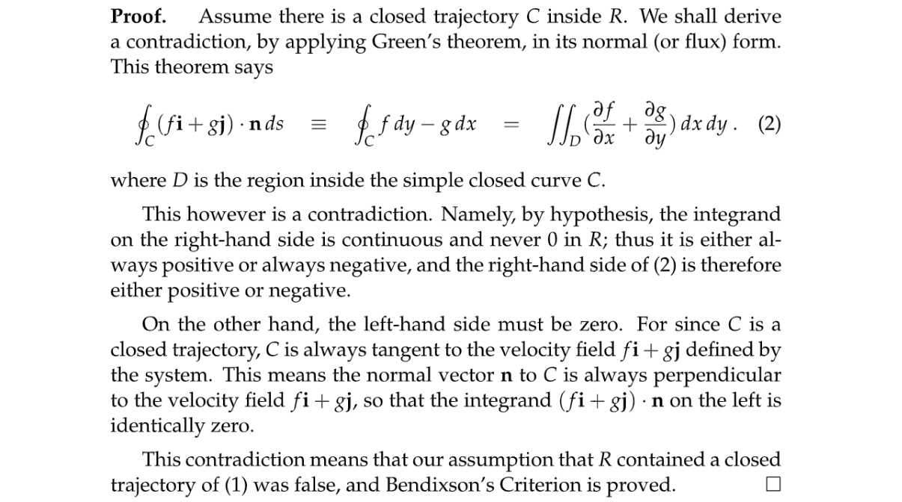

### 1.3.2 临界点准则
> 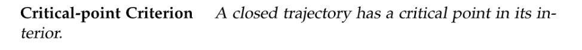

> 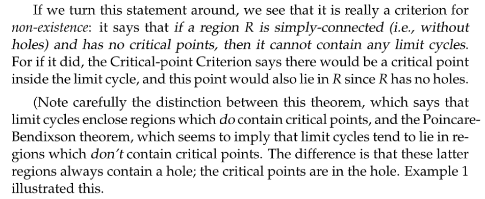

### 1.3.3 算例
#### 算例1
> 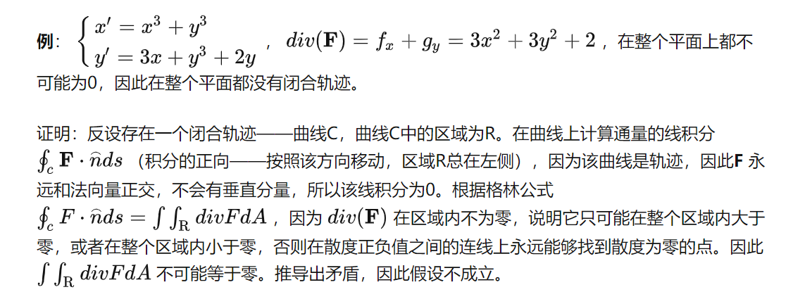

#### 算例2
> 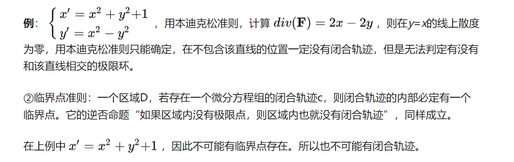

#### 算例3
> 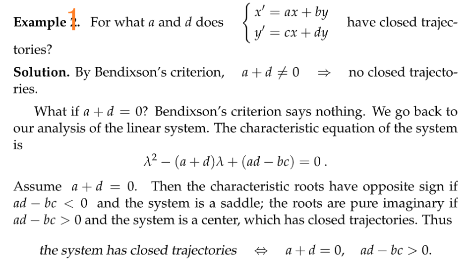

#### 算例4：未解之谜
> 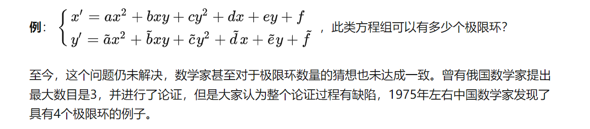

#### 

# 2 范德波尔方程
[The Van der Pol Equation.pdf](https://www.yuque.com/attachments/yuque/0/2022/pdf/12393765/1659863476863-db59f864-5979-46a9-8c43-054bad620ddc.pdf)

# 3 混沌态
[Chaos.pdf](https://www.yuque.com/attachments/yuque/0/2022/pdf/12393765/1659863476971-d827b460-9b41-488d-8668-6b0d8045df7f.pdf)

