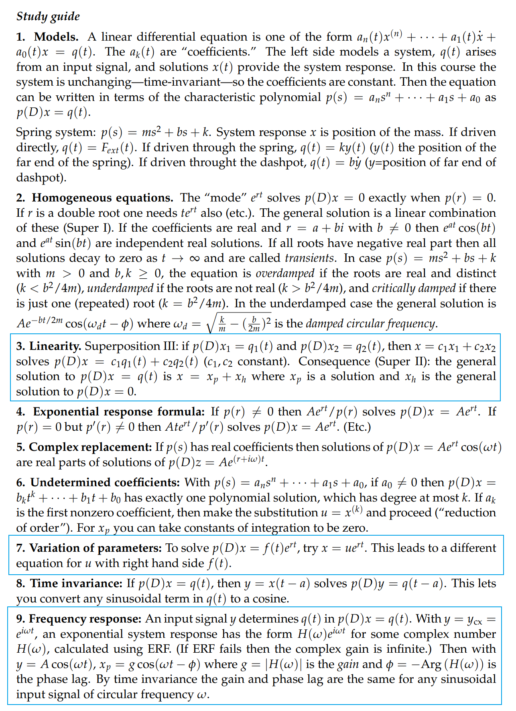
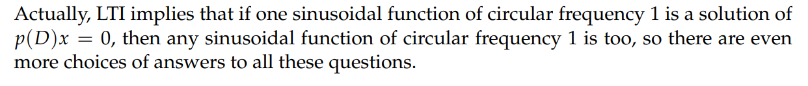
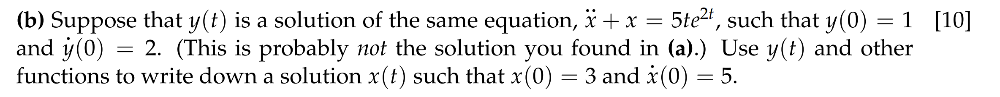
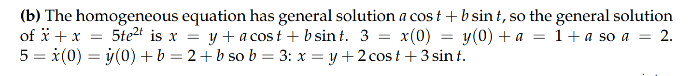
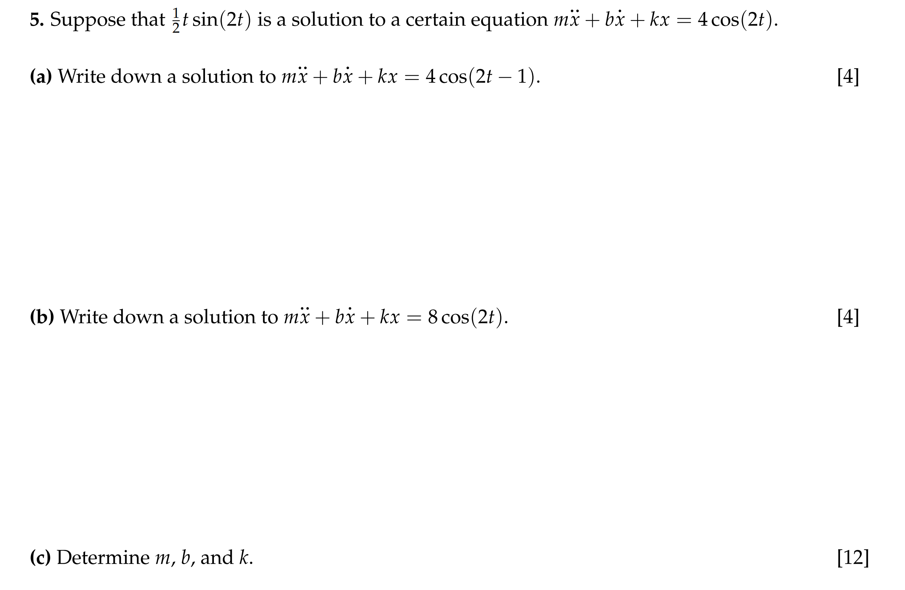
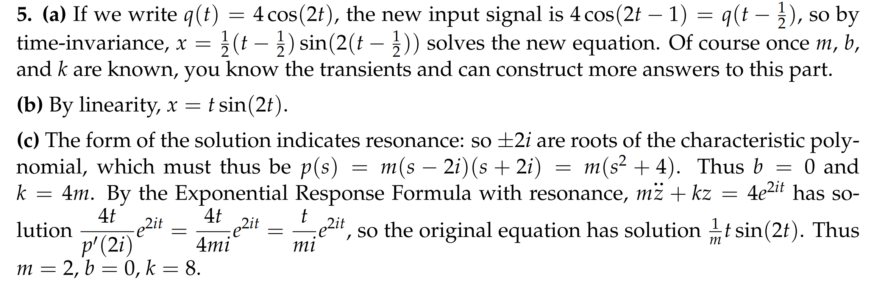

# Study Guide

# Practice Exam
[Unit2 Practice Exam.pdf](https://www.yuque.com/attachments/yuque/0/2022/pdf/12393765/1657423892037-7f69d665-0951-4972-be36-07868bc1caaa.pdf)
> 尤其注意这里的$\phi=-Arg(H(w))$一定成立
> 但是$\phi = Arg(p(iw))$不一定成立，如果分子上有复数，就不成立

# Exam 2
[Unit 2 Exam Solutions.pdf](https://www.yuque.com/attachments/yuque/0/2022/pdf/12393765/1657423903976-80f24348-23d4-41f8-a7e3-5aba7573358d.pdf)
> 如果题目中出现了`y is a solution of DE`,说明这个`y`是一个特殊解

## 重点
> **第五题非常经典**

