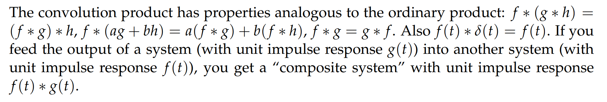
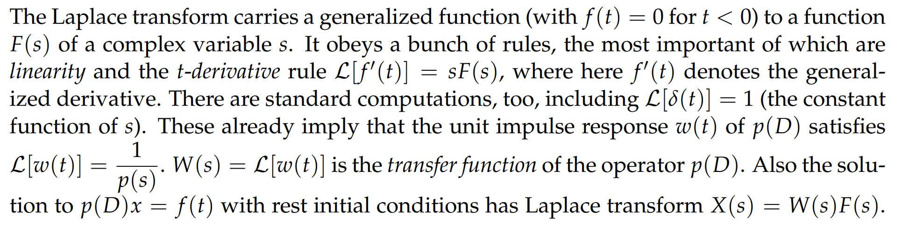

# 1 Practice Exam
[Practice Exam and Solutions.pdf](https://www.yuque.com/attachments/yuque/0/2022/pdf/12393765/1659432308897-d2f1e078-26a6-4a40-bf50-f3c92685f700.pdf)

## 1.1 Study Guide
### 1.1.1 Step and Delta
#### Step Function
> 我们可以将`Step Function`$u(t)$理解为一个分段连续函数,在$t<a$时值为$0$, 在$t>a$时值为$1$

#### Delta Function
> 我们可以将`Delta Function`理解为一个分段连续函数，只在零附近很小的区域积分为$1$
> 
> **详见**`**Unit 3.4.2**`**中的**`**Delta Function**`**的性质**`**5**`

#### Generalized Function
> 

### 1.1.2 Unit Impulse Response
> 本小节的所有讨论都是建立在`Rest IC`的情况下讨论的
> 

> 

### 1.1.2 Convolution
#### 定义
> 

#### 卷积基本性质**⭐⭐**
> 

### 1.1.3 拉普拉斯转换和转移函数
#### 基本定义
> 
> 

#### 运算性质
> 

### 1.1.4 Pole Diagrams**⭐⭐**
#### 基本性质
> 

#### Practical Resonant Frequency
> 

## 1.2 Some Properties and Formulas
### 1.2.1 Laplace Transform
:::info

:::

### 1.2.2 Fourier Coefficients
:::info

:::

# 2 Practice Hour Exam
## P1 Fourier Basics
> 

**(a)**
**(b)**

## P2 Step and Delta
> 

**(a)**
**(b)**
**(c)****我们使用两种方法解答:**

1. **将**$f(t)$**写成**`**Piecewise Smooth**`**的函数: **$f(t)=(1-t)(u(t)-u(t-1))+u(t-1)\newline=u(t)-u(t-1)-tu(t)+tu(t-1)+u(t-1)$, $f'(t)=\delta(t)-\delta(t-1)-(u(t)+t\delta(t))+(u(t-1)+t\delta(t-1))+\delta(t-1)\newline =\delta(t)-\delta(t-1)-u(t)-t\delta(t)+u(t-1)+t\delta(t-1)+\delta(t-1)\newline=\delta(t)-\delta(t-1)-u(t)-0*\delta(t)+u(t-1)+1*\delta(t-1)+\delta(t-1)\newline=\delta(t)+\delta(t-1)-(u(t)-u(t-1))$

这里运用了`Delta Function`的重要性质: $f(t)\delta(t-a) = f(a)\delta(t-a)$

2. **直接看图:**

我们知道函数在$t=0$和$t=1$处有一个跳跃间断点，由此可知这两点处函数值突变, 所以$f'(t)=\delta(t)+\delta(t-1)+\begin{cases}0&if\space t<0\\ -1&if\space 0<t<1\\ 0&if\space t>1\end{cases}$, 我们将其写成`U-format`即可得到$f'(t)=\delta(t)+\delta(t-1)-(u(t)-u(t-1))$

## P3 Convolution
> 

**(a)**
这里使用了卷积的性质$f*g=g*f$简化计算
**(b)**
其实这里写的具体一些应该是$x(t)=u(t)t^2e^{-t}$

## P4 Laplace Transform
> 

**(a)**
**(b)**

## P5 Poles
> 

**(a)**
**(b)**

# 3 Exam 3
[Exam 3.pdf](https://www.yuque.com/attachments/yuque/0/2022/pdf/12393765/1659432377746-d22f2d58-edaf-4f68-aa4d-ed8a7a3d24ef.pdf)
[Exam 3 Solutions.pdf](https://www.yuque.com/attachments/yuque/0/2022/pdf/12393765/1659432377812-a3069b9e-2295-41a6-95f1-a47b86216dfa.pdf)

## Reference Sheet
:::info

:::

## P1: Fourier Series
:::info

:::
**Key**

## P2: Generalized Function
:::info

:::
**(a)**
**(b)**
**(c)**

## P3 Step and Delta
:::info

:::
**(a)**本题非常容易错，首先我们已知$p(D)x=f(t)$的`Unit Impulse Response`
我们可以很快求出任意输入$f(t)$下的线性系统的解。
我们考虑使用卷积：$x(t)=\int_0^tw(t-\tau)u(\tau)d\tau$, 尤其要注意这里的顺序问题。由于我们知道$u(t)$在$t>0$上是$1$, $t<0$时是$0$，所以卷积简化成$\int_0^tw(t-\tau)d\tau$
我们也可以将卷积写成$\int_0^tw(\tau)u(t-\tau)d\tau$, 积分化简成$\int_0^tw(\tau)d\tau$,可以更快求解，答案相同
**(b)**
**(c)**

## P4 Laplace Transform
:::info

:::
**(a)**此题应用`T-Shift Rules`, 在`Unit 3.9.4.2`中有详细介绍

**(b)**

## P5 Pole Diagram
:::info

:::
**(a)**
**(b)**
方法在`Unit 3.10.5`中有详细介绍
