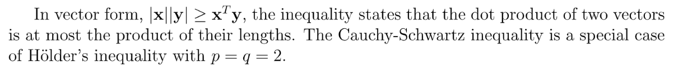
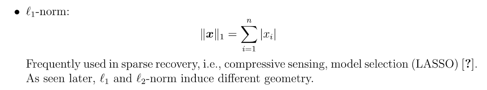
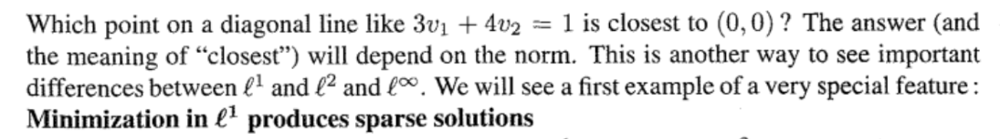
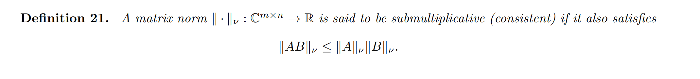
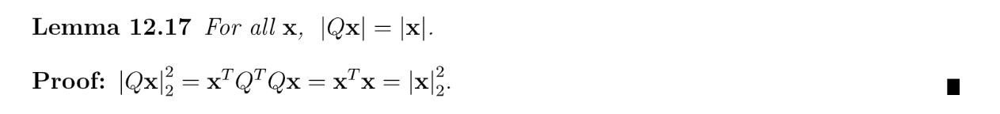

> Reading: 1.11 & Foundation of Data Science Section 12

[NotesOnNorms.pdf](https://www.yuque.com/attachments/yuque/0/2023/pdf/12393765/1675764020156-88c66559-7f51-432f-9e03-0ef6e523cfa3.pdf)
# 1 Norms of Vectors
## Definition
> **Formal Definition:**
> 
> **换句话说就是, when **$p\geq 1$**:**
> 1. **Non negativity(Semi-positive definiteness):** $||\mathbf{x}||_p\geq 0~~and~~||\mathbf{x}||_p=0\iff \mathbf{x}=0$
> 2. **Scaling(Absolute Homogenity):** $||\alpha\mathbf{x}||_p=|\alpha|||\mathbf{x}||_p$
> 3. **Triangle Inequality:** $||x+y||_p\leq ||x||_p+||y||_p$
> 
所有的`**Vector Norm**`都必须满足上述的三个个性质，否则就不是合法的`**Vector Norm**`。

## Useful Inequalities
> 下面我们介绍一下在`Norm`证明中常用的不等式。

### Cauchy-Schwartz Inequality
> 
> Only works for L2 Norm

**Proof**

### Jensen's Inequality
> 

**Proof using variational method**

### Young's Inequality
> 
> **注意:**$p,q,x,y\in \mathbb{R}^{+}$

**Proof(Convex Combination)****Quick Note on convex Combination:**
A convex combination is a linear combination of vectors in which the coefficients (or weights) used to combine the vectors are all nonnegative and sum to . In other words, a convex combination of vectors is a weighted average of those vectors, where the weights are all nonnegative and add up to .
For example, suppose we have two vectors  and  in a vector space . A convex combination of these vectors could be written as:

where alpha is a nonnegative coefficient (or weight) such that . This convex combination is a weighted average of  and , where the weight of  is alpha and the weight of  is .
**Now we use the property of convex combination to prove this inequality:**

### Holder's Inequality
> 
> **注意:** $p,q\in \mathbb{R}^{+}$, extends Cauchy-Schwartz Inequality to general cases. i.e. $l_p$norms

**Proof**
**Corollary(Apply Holder's Inequality)**

## Collections of Vector Norms
> 
> 
> **Exercise: **Prove that $||\mathbf{x}||_p$is a norm when $p\geq 1$

**Proof(Using Holder Inequality)**

1. **Positivity: **$||\mathbf{x}||_p=(|x_1|^p+\cdots+|x_p|^p)^{\frac{1}{p}}\geq 0$**, **and when $x_i=0,\forall i$, $||x||_p=0$
2. **Absolute Homogenity:** $\begin{align}||\alpha\mathbf{x}||_p&=(|\alpha x_1|^p+\cdots+|\alpha x_p|^p)^{\frac{1}{p}} \\&=(|\alpha|^p|x_1|^p+\cdots+|\alpha|^p|x_p|^p)^{\frac{1}{p}}\\&=|\alpha|(|x_1|^p+\cdots+|x_p|^p)^{\frac{1}{p}}\\&=|\alpha|||\mathbf{x}||_p\end{align}$
3. **Triangle Inequality:** $(\sum_{i=1}^n |x_i+y_i|^p)^{\frac{1}{p}}\leq (\sum_{i=1}^n |x_i|^p)^{\frac{1}{p}}(\sum_{i=1}^n|y_i|^p)^{\frac{1}{p}}$

根据`Triangle Inequality`, 首先我们有:
$|x_i+y_i|^p=|x_i+y_i|\cdot |x_i+y_i|^{p-1}\leq (|x_i|+|y_i|)|x_i+y_i|^{p-1}$
根据`Holder Inequality`, 我们有对于$\frac{1}{p}+\frac{1}{q}=1~~and~~p,q\in \mathbb{R}^{+}$:
$\begin{aligned} \sum_{i=1}^n |x_i|\cdot|x_i+y_i|^{p-1}&\leq (\sum_{i=1}^n|x_i|^p)^{\frac{1}{p}}(\sum_{i=1}^n (|x_i+y_i|^{p-1})^q)^{\frac{1}{q}}\\ \sum_{i=1}^n |y_i|\cdot|x_i+y_i|^{p-1}&\leq (\sum_{i=1}^n|y_i|^p)^{\frac{1}{p}}(\sum_{i=1}^n (|x_i+y_i|^{p-1})^q)^{\frac{1}{q}} \\\sum_{i=1}^n |x_i+y_i|^p&\leq  (\sum_{i=1}^n|y_i|^p)^{\frac{1}{p}}(\sum_{i=1}^n (|x_i+y_i|^{p-1})^q)^{\frac{1}{q}}+(\sum_{i=1}^n|x_i|^p)^{\frac{1}{p}}(\sum_{i=1}^n (|x_i+y_i|^{p-1})^q)^{\frac{1}{q}}\end{aligned}$
因为$\frac{1}{p}+\frac{1}{q}=1\implies (p-1)q=p$, 所以:
$\sum_{i=1}^n |x_i+y_i|^p\leq  (\sum_{i=1}^n|y_i|^p)^{\frac{1}{p}}(\sum_{i=1}^n |x_i+y_i|^p)^{\frac{1}{q}}+(\sum_{i=1}^n|x_i|^p)^{\frac{1}{p}}(\sum_{i=1}^n |x_i+y_i|^p)^{\frac{1}{q}}$
两边同时除以$(\sum_{i=1}^n |x_i+y_i|^p)^{\frac{1}{q}}$得到:
$\frac{\sum_{i=1}^n |x_i+y_i|^p}{(\sum_{i=1}^n |x_i+y_i|^p)^{\frac{1}{q}}}\leq  (\sum_{i=1}^n|y_i|^p)^{\frac{1}{p}}+(\sum_{i=1}^n|x_i|^p)^{\frac{1}{p}}$
因为$\frac{1}{p}+\frac{1}{q}=1\implies \frac{1}{p}=1-\frac{1}{q}$, 所以上述不等式变为:
$(\sum_{i=1}^n |x_i+y_i|^p)^{\frac{1}{p}}\leq  (\sum_{i=1}^n|y_i|^p)^{\frac{1}{p}}+(\sum_{i=1}^n|x_i|^p)^{\frac{1}{p}}$, 证毕。

### L-2 Norm
> 

### L-1 Norm
> 

### L-infty Norm
> 

## Theorems&Questions on Norm
### Finite Equivalance
> 

### Convexity
> 

### Why P>=1?
> 

**Proof**
**Graphical Explanations**

### Lemma
> 

## Textbook Notes
### Lp Norms
> 在所有的$L^p$Norm 中，只有当$1\leq p\leq \infty$才满足`Norm`的两个要求，`Rescaling`和`Triangle Inequality`
> 
> $l_0$norm = zero norm. $||v||_0=number~~of~~non-zero~~entry$
> (except for the origin)
> 
> 一个很有价值的发现是: 对于$l^p$Norm来说，当$p$从$0$到$\infty$变化的过程中，假设$\mathbf{v}\in \mathbb{R}^2$我们可以发现在二维平面上满足 $||\mathbf{v}||=1$的点组成的集合的图像会逐步扩张，成顶点为$(1,1),(1,-1),(-1,1),(-1,-1)$的正方形。

### Constrained Optimization
> 

### Inner Product Under L2 Norm
> 

### Inner Product Under S Norm
> $l^1$和$l^{\infty}$没有和$l^2$一样的`Dot Product`的写法。
> 

## 

# 2 Norm of Matrices
## Definition
> 

**Proof of the new matrix norm**

## Collections of Matrix Norms
### Frobenius Norm
> 
> **Why?**
> 

### Nuclear Norm
> 

### Induced Matrix Norms
#### Operator Norm
> 
> 我们看到，这里$||A||$是通过`Vector Norm`来定义的，所以称为`Induced Matrix Norms`

 

#### P-Norm
> 

### Generalized Induced Norm
#### Definitions
> 

#### Theorems
> 

**Proof**

### Show whether it's norm
> 

**Frobenius**

### Examples
**Example**

## Properties of Matrix Norms
### Submultiplicativity
#### Definition&Theorems
> 
> ** In other words, induced matrix norms are submultiplicative.  **

**Proof**

#### Operator 2-norm
> 

#### Frobenius Norm
> 

**Proof**

### Inequality
> 

### Orthogonal Invariant
#### Theorems
> 

#### Exercises
> 

### Miscellanous Properties
> 

## Textbook Notes
### Largest Growth Factor
> 

### Important Matrix Norms
> 
> 其中$||A||_2$尤为重要，因为他和我们学过的奇异值分解结合了起来，如下:
> 

**Important Properties**

# 3 Exercises
## P1 L1,L2, L-infty
> 

**Proof**Let $max(|v_1|,\cdots, |v_n|)=|v_m|$
$\begin{align}||v||_2^2&=|v_1|^2+|v_2|^2+\cdots+|v_n|^2\\&=|v_1||v_1|+\cdots +|v_n||v_n|\\&\leq |v_1||v_m|+\cdots |v_n||v_m|\\&=\sum_{i=1}^n |v_i|\times max(|v_i|)\\&=||v||_1\times ||v||_{\infty}\end{align}$

## P2 Cauchy-Schwarz Inequality
> 
> 注意`Cauchy-Schwarz Inequality`只对`L2 Norm`成立。

**Proof**

## P3 Application of P1&P2⭐⭐⭐⭐
> 

**Proof**假设$max(|v_1|,\cdots, |v_n|)=|v_m|$
首先对于$||v||_2\leq \sqrt{n}||v||_{\infty}$, 我们有:
$\begin{align}||v||_2&=\sqrt{|v_1|^2+\cdots |v_n|^2}\\&\leq\sqrt{|v_m|^2\times n} \\&=\sqrt{n}|v_m|\\&=\sqrt{n}||v||_{\infty}\end{align}$
对于$||v||_1\leq \sqrt{n}||v||_2$, 我们使用`P2`的思想, $w$的选取非常巧妙:

## P4 Dual Norms
> 
> `Holder's Inequality`对所有的`Vector Norm`都成立。

**Proof**

## P5 Inner Product
> 

**Solution**

## P6 Triangle Inequality
> 

**Proof**

## P7 Lemmas
> 

**Proof**
