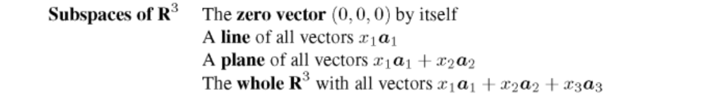
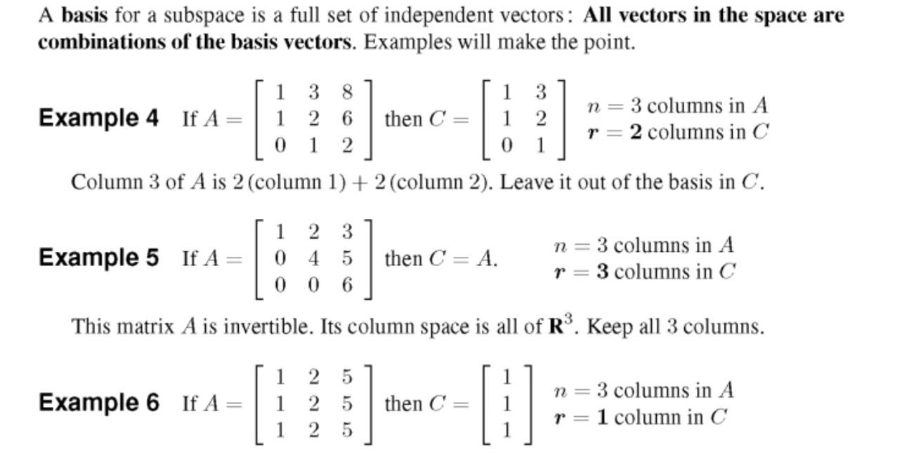
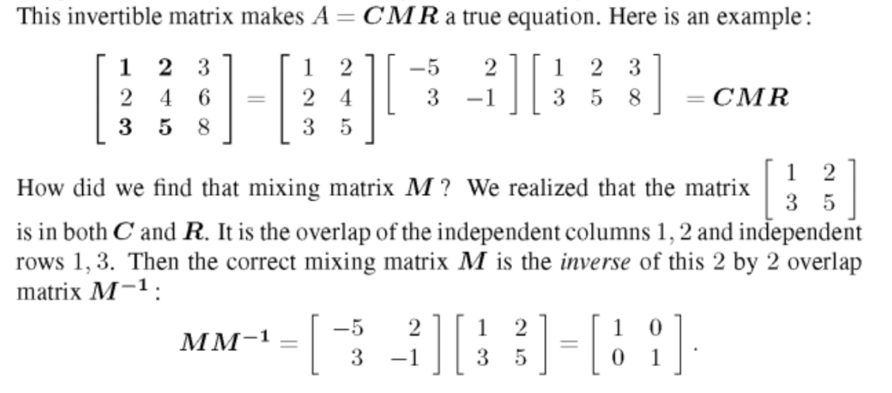
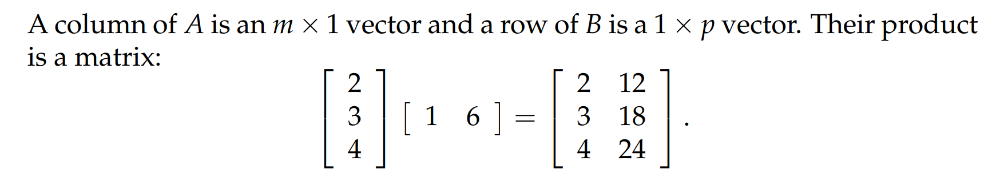

参考: [https://zhuanlan.zhihu.com/p/111617854](https://zhuanlan.zhihu.com/p/111617854)
:::info
本章我们将对矩阵的列空间和这个矩阵分解做一个详细的介绍。
:::

# 1 Ax的探究
## 1.1 Ax代表矩阵列空间
> 我们看下面的矩阵:
> , 我们给定任意的, 其中。
> 我们想要探究究竟代表了什么。
> 首先根据矩阵相乘的性质，我们有，这是矩阵各列的一种线性组合。讨论列向量的所有组合。设定矩阵，然后取所有，则所有输出向量实际上是无限多个向量。这些向量的集合称为的列空间，写作，列空间本质上也是一个向量空间，我们回顾一下一个向量空间所要具备的性质:
> 1. 向量在空间中
> 2. 空间对加法数乘操作封闭
> 
假设
> 首先时，向量确实在的列空间中。其次，任取 , , 其中, 
> 则, 对加法封闭，乘法封闭性证明类似。
> 然后一个自然而然的想法就是探究这个向量空间的维数。首先这个列空间一定是一个三维向量空间的子空间。
> 而一个向量子空间的维数等于这个向量空间的基向量列表的长度。对于矩阵的列空间来说，它的维数就是矩阵的秩。
> 

## 1.2 Ax中的元素
> 我们说一个向量在中当且仅当线性方程组有解。
> 比如就不在的列空间中。
> 原因就是线性方程组无解。

## 1.2 Ax的维数
> 矩阵的**列空间的维数**取决于其矩阵列向量的线性无关性。
> - (行秩等于列秩, 行空间的维数等于列空间的维数)
> - 我们可以通过高斯消元确定一个矩阵的主元列，并将其作为矩阵列空间的基向量。
> 
**对于上面的矩阵:**
> 
> 对于是一个随机矩阵，它的列向量是线性无关的，它的行向量是线性无关的，矩阵是可逆的，其列空间就是的全部。而有时矩阵列空间则是中一个较小的集合，一个平面或者一条直线。现在的矩阵的列空间是中一个二维平面，因为线性无关，而，于是矩阵的列秩和行秩均为。
> **再看另外一个矩阵:**
> 
> 很明显, 即, 这是一个`Rank-One Matrix`[秩一矩阵](https://www.yuque.com/alexman/so5y8g/yiwx2g#SpX0r)，我们知道对所有的秩一矩阵都可以做分解，其中是其列空间的基向量，是其行空间的基向量。
> 简单观察之后我们得到: 

# 2 CR/CMR 分解
## 2.1 CR分解过程算法
> 我们从矩阵的分解入手。来源于矩阵的列向量(`Column`的意思)
> **将矩阵分解为或者的过程是:**
> 1. 将矩阵的一组线性无关且能够张成其列空间的向量按列组成矩阵。
>    - 如果的第一列不全为零, 放入中。不全为零，放入中
>    - 如果的第二列和第一列线性无关(不是第一列的常数倍)，放入中。不是的常熟倍，放入中
>    - 如果的第三列不是第一列和第二列的线性组合，放入中。因为, 故
>    - 继续按列迭代直到所有列遍历完成，得到一个(矩阵)列的矩阵, 其列就是矩阵的列空间的基。剩下的没有被放入的列就可以由放入的列通过线性组合来得到。此时
> 
对于, 我们已经获得了,下面就要获得,这也很简单, 于是
> **我们来看几个例子:**
> 

## 2.2 Great Theorem in Linear Algebra
> `Gilbert Strang`教授在书中将这个分解称为`First Great Theorem in Linear Algebra`。因为这个分解在后续的大规模矩阵运算中将会发挥非常重要的作用。同时我们还注意到：
> 1. 是在经历高斯消元之后的`Row-reduced Echelon Form(Without zero rows)`, 记为
> 2. **定理: **对于任何矩阵来说，其线性无关列的数量等于线性无关行的数量。这里分解就证明了这个结论。
> 3. 中的每一行都是矩阵的行空间的基向量。
> 
我们仔细观察，可以产生两种解读:
> 1. 首先我们可以从的列向量的线性组合切入, 其中矩阵中的每一列都是的列的线性组合，线性组合的系数由决定。
> 2. 我们还可以从的行向量的线性组合切入，其中矩阵中的每一行都是的行的线性组合，线性组合的系数由决定。

## 2.3 CMR分解
> 和分解很类似，假设矩阵的秩为, 则的分解的构成要素如下：
> 1. 的列由的个线性无关的列构成
> 2. 的行由的个线性无关的行构成
> 3. 是由共享的元素组成的矩阵的逆矩阵。
> 

# 3 大规模矩阵乘法运算
> 如果你有一个巨大的矩阵，例如的次方大小的矩阵，内存无法处理所有元素，这时可能要对矩阵进行随机采样，获取一些特殊的列向量。用乘以随机向量，得到向量，它在矩阵的列空间中。如果想随机在列空间中找出一个向量，建议不要随机选择一个列向量，最好通过取随机向量得到混合列向量。而且，如果您想要个随机向量，则取个随机向量，在很多情况下这将使你对列空间有很好的了解。
> 顺便说一下，也是在的列空间中，因为它等于。

:::success
对于矩阵和矩阵来说，矩阵乘法运算一般需要次乘法运算。
:::
## 
## 标准方法
> The standard way of describing a matrix product is to say that $c_{ij}$ equals the dot product of row $i$ of matrix $\bf A$ and column $j$ of matrix $\bf B$. In other words,  $\bf C_{ij}=\sum_{k=1}^{n}A_{ik}B_{kj}$ ， 
> 此时对于中的每一个元素，都是由次乘法运算得来的，而中有个元素， 所以总共需要次乘法运算。

## 列视角
> 矩阵$\bf A$乘矩阵$\bf B$的第$j$列得到矩阵$\bf C$的第$j$列
> **这说明了矩阵**$\bf C$**的每一列都是矩阵**$\bf A$**的所有列的线性组合**

## 行视角
> 矩阵$\bf A$的第$i$行乘矩阵$\bf B$得到矩阵$\bf C$的第$i$行
> **这说明了矩阵**$\bf C$**的每一行都是矩阵**$\bf B$**的所有行的线性组合**

## 列乘以行视角
> 矩阵$\bf A$的第$j$列和矩阵$\bf B$的第$i$行相乘
> 
> 
> 这种视角对我们后续理解谱分解定理和特征值分解定理极其有帮助。
> 这种方法需要的乘法运算次数也是。

:::success
**推导：**
我们针对这个公式得出的矩阵$\bf C$中的每一个`Entry`进行对比
按照`Standard Form`计算: $\bf C_{ij}=\sum_{k=1}^{n}A_{ik}B_{kj}$
按照上述公式: $\bf C_{ij}=\sum_{k=1}^nA_{ik}B_{kj}$
所以行乘以列的公式成立
:::

# 4 Problem Set
4.1 

