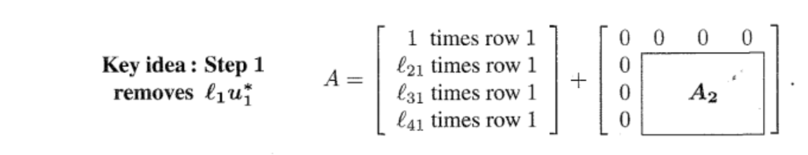

:::info
对应`Lecture 2`
:::

# 1 矩阵分解总括
:::info
**本小节我们总结一下矩阵的五种常用的分解并对其中的某些进行阐述:**

1. 矩阵分解，是下三角矩阵，是上三角矩阵。从矩阵消元得来。
2. 矩阵分解，通过格拉施密特方法得到，是一个正交矩阵(), 是一个上三角矩阵。
3. **对称矩阵** 正交对角化。是正交矩阵，的对角线上是也就是的和特征值。
4. **方阵**对角化。是的特征向量，的对角线上是的特征值。
5. **矩阵**奇异值分解，和都是正交矩阵,
-  是对称矩阵正交对角化得到的正交矩阵。
- 是对称矩阵正交对角化得到的正交矩阵。
-  含有的奇异值，通过对求特征值然后开根得到。

在后续的讲座中我们将深入探讨这些矩阵分解中的数学思想。
:::

## 1.1 对称矩阵正交对角化
:::info
我们以**对称矩阵** 正交对角化为例来阐述矩阵乘法的意义:
我们将其看成两个矩阵相乘的形式: , 然后使用前一个单元介绍的思想(`Columns times Rows`)，假设, , 则:
, 这相当于是个列向量组成的矩阵。

因为我们在的视角下表示矩阵乘法可以得到：

所以, 这就是我们的谱分解，也是非常常用的矩阵分解方法。
然后我们在这个谱分解的基础上可以得到:
:::

## 1.2 奇异值分解
:::info
奇异值分解的优势在于它对所有的矩阵都成立。它适用于长方形矩阵。而前面的有些分解取决于是否有足够的特征向量，并非每个矩阵都有足够的特征向量来完成这项工作，而`SVD`可以为每个矩阵工作。它有两个矩阵，而不是一组向量，它有两个不同的奇异向量集。
:::

# 2 矩阵基本空间与秩
## 2.1 四个基本空间
:::info
**Reading: 1.3**
**我们以矩阵为例,:**

1. 的列空间是向量的整数倍, 空间图像就是一条直线。
2. 的行空间是向量的整数倍, 空间图像也是一条直线。
3. 的零空间是向量的整数倍, 空间图像也是一条直线。
4. 的左零空间是向量的整数倍, 空间图像也是一条直线。

**书中给出的总结如下：**

:::

## 2.2 线性方程组的解
:::info
现在我们看到矩阵, 和前面的矩阵相比，列空间和左零空间(互相正交)没有变化，还是二维的直线。但是行空间变为了向量的整数倍，零空间变成了的线性组合， 是二维过原点的平面。

注意到矩阵的零空间的基不是互相正交的。于是我们可以使用格拉施密特正交化得到正交的，且同样能张成子空间的基向量, 在后续的学习中，我们会**更偏向于使用正交的基向量**，也会频繁地使用正交化。
:::

## 2.3 图
:::info
在[图和线性方程组](https://www.yuque.com/alexman/so5y8g/yocz3x)中我们已经学习过用线性方程组来表示闭合回路中的电流和电压。这里进行复习。

**如上图所示:**
右侧矩阵的每一行代表左侧的电路中的某一边()，每一列代表不同的节点()。
**我们开始探究矩阵的四大空间:**

1. **零空间**

通过简单观察这个矩阵可知，矩阵存在两列之和为, 这就意味着我们可以通过消元得到全为零的列，这表明矩阵的行列式为零，所以矩阵一定不可逆，所以, 然后我们观察发现矩阵最大线性无关列的数量为, 这说明, 。为了求零空间具体的样子，我们试着归纳出零空间中的向量的统一形式。我们令, 可知, 所以零空间的基为，是一条过原点的直线，也是的一维子空间。

2. **列空间: Voltage Law**

物理意义: 中的向量的每一个分量表示电路中某一边上的电流。且只要电路闭合，则这些分量的总和一定是
我们知道, 我们通过观察可知:

3. **左零空间: Current Law**

物理意义: 左零空间描述了在**没有外加电流的情况下**使得闭合回路成立的每条边上的电流值（方向需要自行确定）。如果无解，则表明电路不闭合。
数学公式: 左零空间的解满足

4. **行空间**

物理意义: 行空间描述了在**有外加电流的情况下**使得闭合回路成立的每条边上的电流值（方向需要自行确定）。如果无解，则表明电路不闭合。
数学意义:

:::
> **总结:**
> 

**四大基本空间**

## 2.4 矩阵的秩
:::info
本小节将介绍一些关于矩阵的秩的非常关键的结论：**当矩阵相乘时，秩不可能增加**。
下面我们给出四个重要结论:

1. 对于第一部分， 令, 则的每一列都是的所有列的线性组合，如果是一个零矩阵，那么也是一个零矩阵，这样, 即。如果都是可逆矩阵，则（试想一下我们在做初等行变换的时候实际上就是左乘了若干个可逆的初等变换矩阵，而矩阵的秩不变）。于是综上

对于第二部分：令 , 则
综上:

2. 如果, 则。

如果和的列空间的交集为, 比如说, , 则
综上

3. 这个结论可以通过([A^TA和A的零空间](https://www.yuque.com/alexman/so5y8g/qh5ruz#IWSKa)中已经证明)直接得到，因为, 
4. 这个结论就是支撑我们对矩阵进行分解的核心，我们利用前三个`Statements`来证明:

:::

# 3  消元与LU分解
:::info
分解主要针对于方阵。
:::

## 3.1 主元全不为零
> 对于一个主元不全为零的方阵来说, 分解的步骤如下：
> 
> 对于一个阶的方阵来说，得到最终的需要经历次运算。
> 如果我们将整个分解的过程写成矩阵的形式，我们有:
> 1. **Step 1: **, 其中, 就是第一个主元行。
> 

> 2. **Step 2: **, 其中,就是第二个主元行。
> 

> 最终，我们有:
> 
> 所以纵观整个分解过程：
> 

## 3.2 利用LU分解解线性方程组
> 

## 3.3 存在零主元
> 如果我们的矩阵存在零主元，比如，则我们在消元的时候需要做行交换，这就导致我们无法使用`3.1`中的方法直接得到分解的形式。而为了能够考虑到行交换带来的影响，我们会引入置换矩阵。
> 现在考虑的情况，我们需要做行交换将同一列中的非零项提到的位置，如果有多个满足条件，则我们倾向于选择最大的那个, 比如下面的例子， 矩阵: 
> 
> 这个例子中, 于是我们选择了作为备用主元，并将第三行作为第一个主元行。
> 1. **Step 1: **, 其中, 就是的第三行。
> 

> 2. **Step 2: **, 其中, 就是的第一行, 消元过程结束。
> 

> 3. 注意到右侧第一个矩阵，它不是下三角矩阵，所以我们需要进行行交换操作, 也就是左乘一个置换矩阵:
> 

> 最后，为了保持等式右侧的表达式(下三角矩阵乘以上三角矩阵)，我们只需要在左侧左乘一个即可。
> 

**置换矩阵**
置换矩阵是正交矩阵的一种，于是正交矩阵的性质, 也都有。

