> Reading: 1.5~1.6
> Reference: [https://zhuanlan.zhihu.com/p/111953729](https://zhuanlan.zhihu.com/p/111953729)

# 1 正交性
## 1.1 正交向量
> 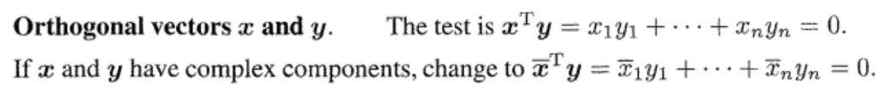

**Examples**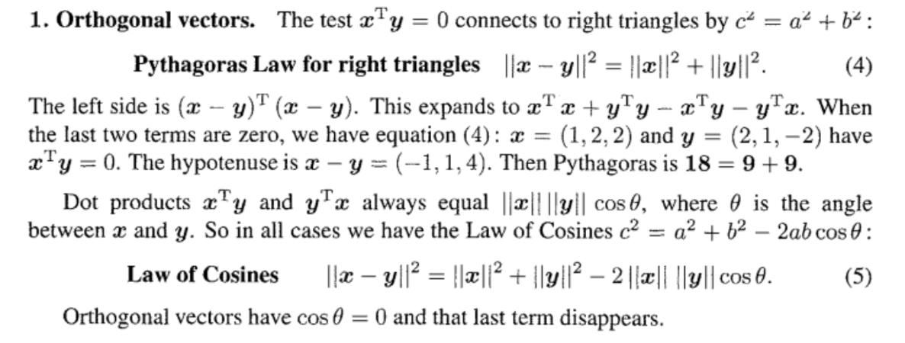

## 1.2 子空间的标准正交基
### 1.2.1 Basics
> 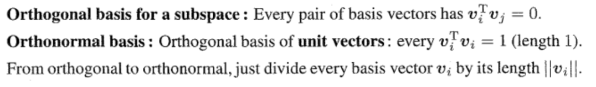

### 1.2.2 Hadamard Matrix
> 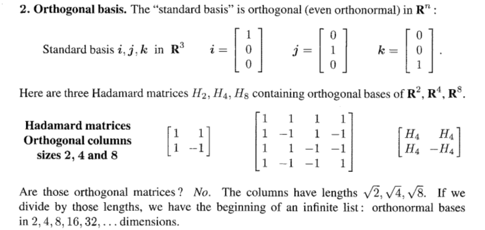

### 1.2.3 Wavelet/Haar Basis
> 我们来谈讨一下小波矩阵，它和Hadaward很像。
> 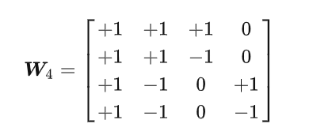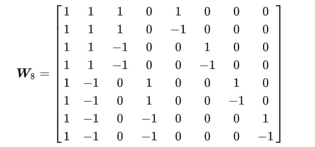
> 注意小波矩阵的元素有，这意味着小波基的长度会变化，也就是重新缩放。这就是小波基和`Hadamard`之间的区别。这就是`Haar`小波，他在发明`wavelet`一词之前的许多年就提出了这种结构，以及`Haar`矩阵和`Haar`函数。
> 该矩阵的一个优点是非常稀疏。第一个列向量的作用是取平均，而第二个向量是在求差值，后面的向量则是在小范围内求差值。这就是小波矩阵，后面有很多学者寻找不同的小波基，比如`Ingrid Daubechies`大约在年左右，发现了很多小波家族，她发现了很多正交矩阵，它们具有良好的属性。

## 1.3 正交子空间
> 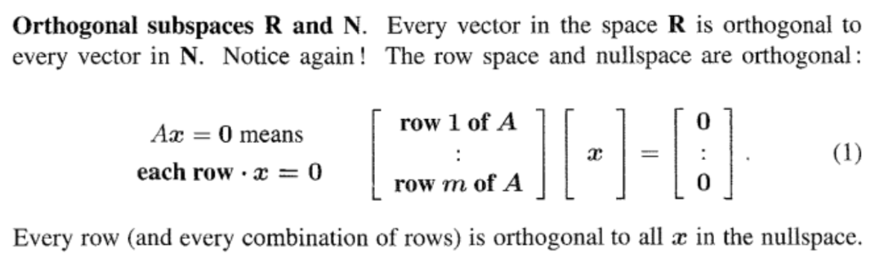

## 1.4 有标准正交列的矩阵/投影矩阵
> 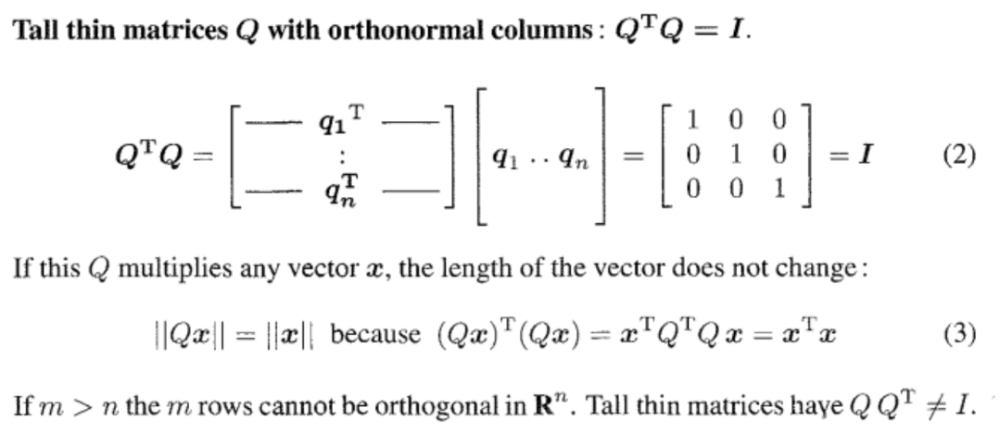
> **构造投影矩阵:**
> 也就是说，**对于任何有标准正交列**`**Orthonormal Columns**`**的矩阵, 都有成立，但是不一定成立。**
> **当且仅当是方阵时，即的左右逆都存在时，才有成立。**
> 对于任意矩阵来说，我们可以通过高斯消元找出其主元列，将主元列形成一个新的列满秩的矩阵（使得存在），则这个的列空间和一致。然后我们可以通过公式构造投影矩阵，则对于任意向量来说:
>          1. , 则。
>          2. , 则就是在的列空间上的投影。
>          3. , 则, 表示投影为一个点。
> - **如果的各列是标准正交列**，则我们将用表示, 此时我们可以直接通过来构建一个投影矩阵, 因为, 注意**投影矩阵一定是一个方阵。**
> - **如果只有一列，此时我们用向量表示，则投影到方向上的投影矩阵是**
> 
**投影矩阵的性质:**
> 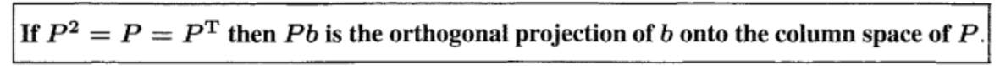
> 可以验证，投影矩阵具有以下三个性质：
> 1. , 投影矩阵
> 2. , 对称矩阵
> 3. 如果是投影矩阵，则也是投影矩阵
> 
我们只需要验证是否满足上面的性质和
>    - 
>    - 

**Examples**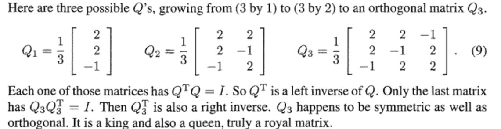
形成的投影矩阵:
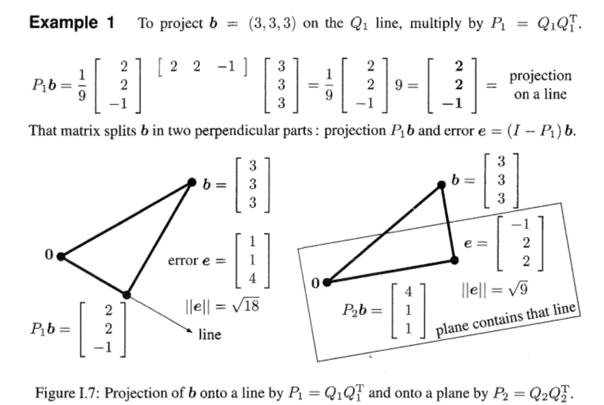
形成的投影矩阵:
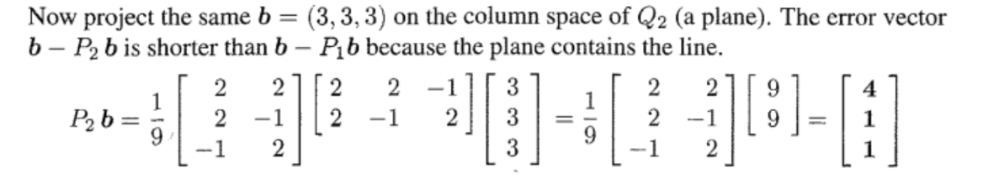
形成的投影矩阵: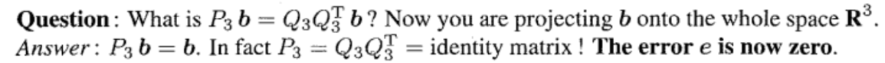

## 1.5 正交矩阵(方阵)
> 在[正交矩阵的几何性质](https://www.yuque.com/alexman/so5y8g/xtfo06#pdv2b)中，我们已经介绍过了几种常见的正交矩阵，比如旋转矩阵，置换矩阵和镜像翻转矩阵，这里我们做一个总结：

### 1.5.1 基本性质
> 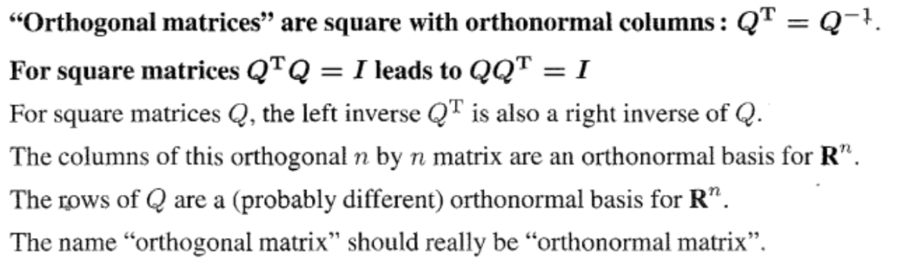

### 1.5.2 旋转矩阵
> 对于一个正交矩阵来说，我们知道, 同时, 于是我们可以使用极坐标形式，令, 代入第三个式子中得到, 于是, 代入第一个式子中得到, 于是, 于是, 我们选取, 得到旋转矩阵的关于角度的表达式:
> 
> **这个矩阵的功能就是将向量逆时针旋转而不改变其长度。**

### 1.5.3 置换矩阵
> 置换矩阵没什么好说的，如果左乘就相当于将行调换顺序，如果右乘就相当于将列调换顺序。

### 1.5.4 翻转矩阵 
> 假设现在有一个单位向量, 我们想求任意向量关于的镜像对称(是对称轴)向量，并想通过左乘一个矩阵来实现这个操作，我们可以这样推导：
> **代数推导:**
> - 对于任意的向量, 在上的投影是, 则`Error`就是, 而其镜像是
> - 实例: 假设, 则, 于是我们发现任何在左乘一个之后都变成了, 符合我们的镜像操作。
> 
> 在书中对于翻转矩阵的定义有一些不同，它是假设是我们的翻转方向, 垂直于翻转对称轴。则此时关于的投影是, 则转轴方向的向量是, `Error`是, 则翻转过后的向量是。其中翻转矩阵被定义为:
> 
> - 我们可以验证是对称矩阵，也是正交矩阵:
> 
, 于是是一个对称矩阵
> , 于是是一个正交矩阵。
> **参数化表示: **
> 既然是正交矩阵，那么其一定可以写成关于参数的形式, 假设我们采用定义， 则我们假设:
> , 所以
> 根据其正交性我们有， 令, 我们有: ，此时我们注意到与轴所成的夹角就是, 因为。
> 所以对于一个翻转矩阵, 他的对称轴与轴所成的夹角就是, 这个性质非常重要。

### 1.5.5 Householder Reflection
> 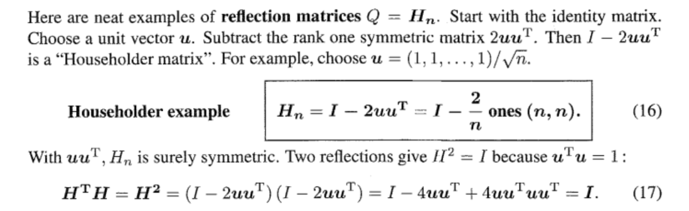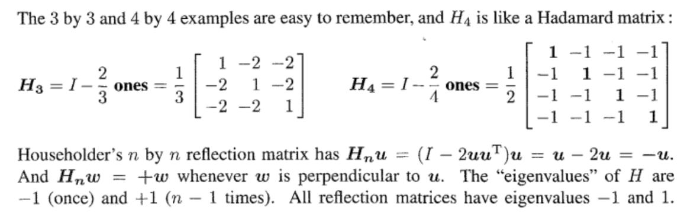

### 1.5.6 正交矩阵相乘
> 对于任意两个正交矩阵, 他们的乘积也是一个正交矩阵。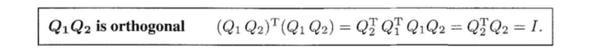
> 对于上面总结的三类常见正交矩阵，我们有如下的结论:
> 1. **旋转矩阵旋转矩阵旋转矩阵**
> 
> 可以发现，这个矩阵仍然是一个旋转矩阵，且旋转角度是, 也就是两次旋转角度相加。
> 2. **镜像翻转矩阵镜像翻转矩阵旋转矩阵**
> 
> 可以发现两个翻转矩阵(转轴分别为和) 相乘得到的是一个旋转角度为的旋转矩阵。
> 3. **旋转矩阵翻转矩阵旋转矩阵**
> 
> 可以发现旋转角为的矩阵和转轴为的矩阵相乘得到的是一个矩阵是一个旋转角度为的旋转矩阵。

## 1.6 正交基及其应用
> 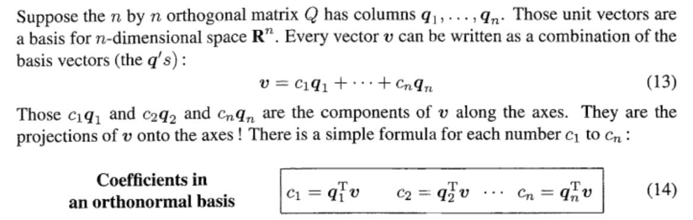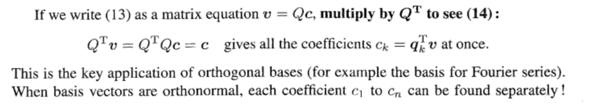
> 这里介绍了一个重要的性质就是说：当基向量互相正交的时候，则对于任意一个由这些正交基的线性组合出的向量通过左乘就可以得到对应的线性组合的系数。

# 2 特征值/特征向量/对角化
## 2.1 特征值和特征向量
### 2.1.1 定义
> 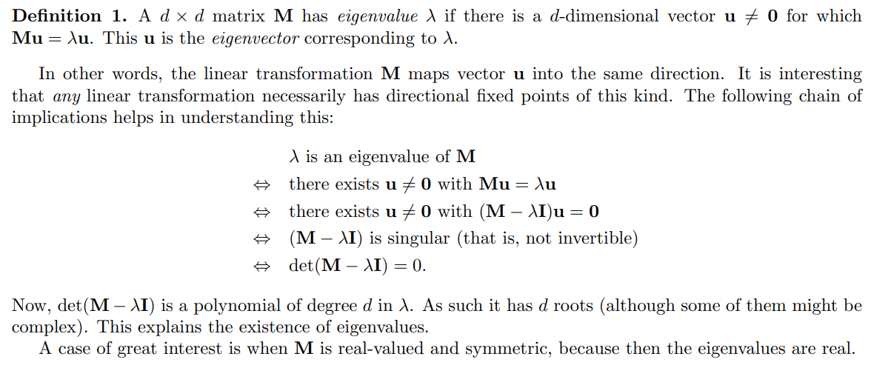

### 2.1.2 求解方法
> 

## 2.2 特征值/向量的性质
### 2.2.1 简化链式线性变换
> 当我们对一个向量线性变换的时候，我们选择左乘一个矩阵得到转换后的向量 
> 而当我们多次对向量做线性变换的时候，我们有:
> , 且

### 2.2.2 使用特征向量作为基
> 假设我们有一个性质很好的矩阵, 他有个特征值, 又恰好有个互相正交的特征向量作为正交基, 则对于任意向量, 我们可以将其写成线性组合的形式:
> 
> 于是我们对使用线性变换得到:
> 
> 如此应用次:
> 
> 这个性质对于一个`Homogeneous Linear System/Population Translation`非常有用, 后面我们会做系统梳理。

### 2.2.3 矩阵的迹和行列式
> **对于任意方阵而言，其特征值的和等于其**
> **对于任意方阵而言，其特征值的积等于其**
> **要证明这两个结论，我们首先需要了解高次韦达定理:**
> 对于一个多项式, 假设他有这个根，则我们可以将写成的形式:
> 
> 于是我们得到高次韦达定理:
> 1. 
> 2. 
> 3. 
> 
**证明:**
> 1. 应用到特征值上，由于我们在求解特征值的步骤就是寻找所有满足的解，而是一个关于的次多项式：, 而其中的系数使我们需要通过矩阵的性质得到的。
> 
首先, 所以如果我们对第一行做拉普拉斯展开，发现只有第一个代数余子式与系数()相乘能够得到和，其他的代数余子式的最高次项就只有, 也就是，于是, , 证毕。
> 2. 我们知道, 于是我们令, 则，而我们还知道，如果的解是(可以重复)，则, 于是, 于是联立可得，证毕。

### 2.2.4 线性无关性与正交性
> 1. **对于不同的  所对应的特征向量线性无关。**
> 
**如果对于不同的**  所对应的特征向量线性相关的话，那么满足下面等式：
>  ,那么等式两边同时乘以矩阵，得到  ,化简为：
>  ，又因为根据等式  可以得到， ，带入到  ，得到  ,又因为  不相同且，**则造成矛盾, 于是线性无关。**
> 2. **对于对称矩阵的两个不同的特征值的任意对应的特征向量分别为**$\bf x_1$** 和**$\bf x_2$**， 则他们正交。**
> 
我们有$\bf Ax_1=λ_1x_1$ ，左乘$\bf x_2^T$得$\bf x_2^TAx_1=λ_1x_2^Tx_1$ 。
> 而又有 $\bf x_2^TAx_1=(A^Tx_2)^Tx_1=λ_2x_2^Tx_1$ 。因此有$\bf (λ_1−λ_2)x_2^Tx_1=0$，而两特征值不等，所以可得两特征向量正交。

### 2.2.5 特征值的偏移
> 

### 2.2.6 复数特征值
> 对于一个旋转矩阵$\bf Q=\begin{bmatrix} 0&-1\\1&0\end{bmatrix}=\begin{bmatrix} cos(90^。)&-sin(90^。)\\sin(90^。)&cos(90^。)\end{bmatrix}$是一个$90$度旋转矩阵。从矩阵的迹和行列式的值可以得到$\lambda_1+\lambda_2=0，\lambda_1\lambda_2=1$。他的特征多项式是$\bf \lambda^2+1=0$, 所以$\bf \lambda =\pm i$
> **性质;**
> 1. 如果一个矩阵有复数特征值$a+bi$则他的共轭复数$a-bi$也是矩阵的特征值。这个性质可以由求根公式得到。
> 2. **实数特征值让特征向量长度伸缩，复数特征值让其伸缩且同时旋转一定角度**，因为对于一个复数来说, 我们可以将其表示成一个矩阵的形式: , 而右侧的矩阵就是我们的旋转正交矩阵。详见[用旋转矩阵表示复数乘法](https://www.yuque.com/alexman/cbermo/duu65g#bTmba)。

### 
## 2.4 对角化, 几何重数和代数重数
> **Reference:** Taboga, Marco (2021). "Linear independence of eigenvectors", Lectures on matrix algebra. https://www.statlect.com/matrix-algebra/linear-independence-of-eigenvectors.

### 2.4.1 几何重数和代数重数
> **标准定义:**
> 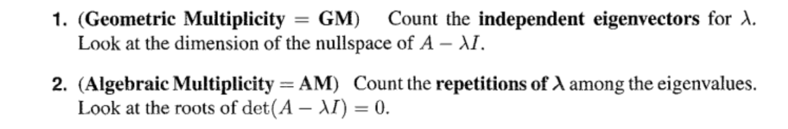
> 对于任何方阵来说，都有几何重数小于代数重数，即
> 假设是一个的矩阵，假设是的特征值(可能重复)
> 1. 如果**没有重复的特征值**，即是不同的，则:
>    - 是线性无关的
>    - 每个特征值的几何重数和代数重数都是
>    - 这些特征向量张成整个维子空间
>    - 
>    - 矩阵_**可以对角化**_。
>    - 比如，矩阵, , ,
> 2. **Complete Case: **如果**有重复的特征值**，即中可能存在某些, 他在特征多项式中的次数为（代数重数大于等于）, 且的零空间的维数恰好也是, 则:
>    - 是线性无关的
>    - 这些特征向量张成整个维子空间
>    - 
>    - 矩阵_**可以对角化**_。
>    - 比如，矩阵, , ,
> 3. **Defective Case:** 如果**有重复的特征值**，即中可能存在某些, 他在特征多项式中的次数为（代数重数大于等于）, 但是的零空间的维数恰好小于, 则:
>    - 找不到个线性无关的特征向量
>    - 特征空间的维数小于
>    - 
>    - 矩阵**_不能对角化_**。
>    - 比如，矩阵, ,。
> 
注意，一个矩阵能不能对角化和这个矩阵是否可逆没有必然联系。
> 如果一个矩阵能够对角化，且所有特征值均不等于零，则矩阵才可逆。

**判断逻辑**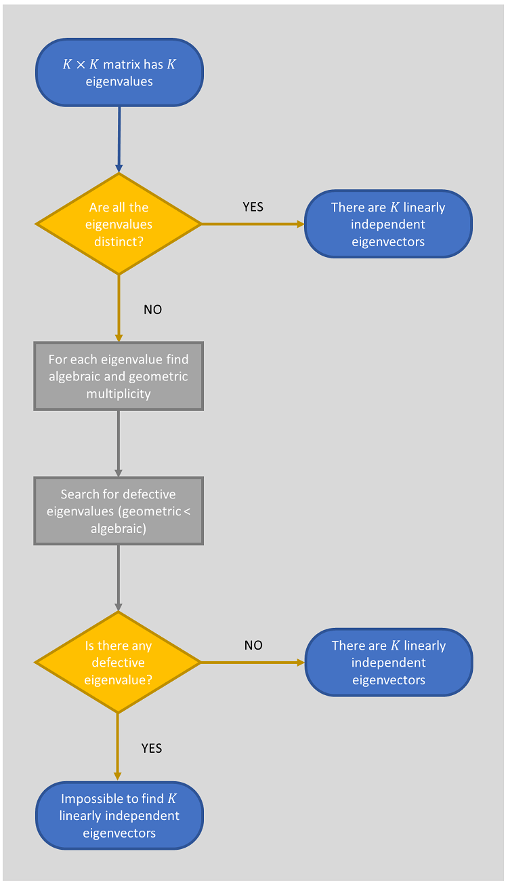

### 2.4.2 对角化与对称矩阵
> 对于任意一个矩阵能够进行对角化的条件就是这个矩阵有个线性无关的特征向量（）, 如果我们将其按列组成矩阵, 则, 的对角线上就是其个特征值。
> 而对于一个的对称矩阵，他一定可以进行对角化(证明需要使用`Schur Theorem`)，且我们称对称矩阵的对角化为正交对角化: , 其中是一个正交矩阵。**对称矩阵永远有实数的特征值, **反对称矩阵`antisymmetric matrices`$\bf A^T=-A$，具有纯虚数的特征值

**对角化算例**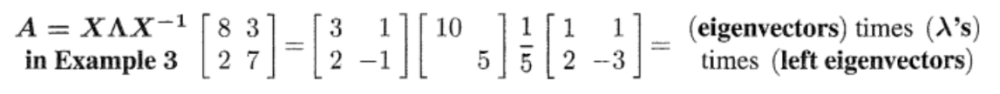
**对称矩阵有实数特征值的证明**对于一个实对称矩阵$\bf A$, 其特征值和特征向量满足$\bf Ax=\lambda x\cdots(1)$

1. $\bf (1)$两边同时取共轭: $\bf \overline{A}\overline{x}=\overline{\lambda}\overline{x}$, 因为$\bf A$是实矩阵，所以$\bf \overline{A}=A$
2. $\bf (1)$两边同时取转置: $\bf (A\overline{x})^T=(\overline{\lambda}\overline{x})^T$, 得到$\bf \overline{x}^TA^T=\overline{x}^T\overline{\lambda}^T\cdots(2)$
3. $\bf (2)$两边同乘以$\bf x$, 加上$\overline{\lambda}^T=\overline{\lambda}$得到: $\bf \overline{x}^TA^Tx=\overline{x}^T\overline{\lambda}x\cdots(3)$
4. $\bf (1)$两边同时乘以$\bf \overline{x}^T$, 得到: $\bf \overline{x}^TAx=\overline{x}^T\lambda x\cdots(4)$
5. 观察$(3)$和$(4)$, 因为$\bf A$是对称矩阵，所以$\bf A^T=A$, 所以$\bf \overline{x}^TA^Tx=\bf \overline{x}^TAx$, 因此$\bf \overline{x}^T\overline{\lambda}x=\overline{x}^T\lambda x\cdots(5)$
6. 观察$(5)$, 移动到等式左边，得到$\bf \overline{x}^Tx(\overline{\lambda}-\lambda )=0$
7. 假设$\bf x= \begin{bmatrix} a_1+b_1i \\a_2+b_2i\\\vdots\\a_n+b_ni\end{bmatrix}$, 则$\bf \overline{x}^T= \begin{bmatrix} a_1-b_1i &a_2-b_2i&\cdots&a_n-b_ni\end{bmatrix}$，于是我们有$\bf \overline{x}^Tx= \begin{bmatrix} a_1^2+b_1^2 \\a_2^2+b_2^2\\\vdots\\a_n^2+b_n^2\end{bmatrix}$因为$\bf x$是特征向量，所以$\bf x\neq 0$, 加上$a_i^2+b_i^2\geq 0$, 我们得到$a_i^2+b_i^2> 0$, 于是$\bf \overline{x}^Tx\neq 0$,于是$\overline{\lambda}-\lambda=0,\overline{\lambda}=\lambda, \lambda$是实数

### 2.4.3 诺尔当型和相似矩阵
#### 相似矩阵
> - $\bf A$和$\bf B$均是$n\times n$方阵，若存在可逆矩阵$\bf M$，使得 ，则$\bf A$和$\bf B$为相似矩阵。固定不变，任意改变我们的特征向量，比如缩放，得到新的特征向量矩阵, 于是得到, 这样我们可以构造一类矩阵，它们的特征值一致。
> - 如果一个矩阵$\bf A_{n\times n}$有$n$个线性无关的特征向量(`Complete Case`), 则其可以对角化$\bf A=M\Lambda M^{-1}$ , 其中$\bf \Lambda$是对角阵, $\bf M$是由$\bf A$的特征值对应的特征向量作为列构成的方阵。 其中$\bf \Lambda\sim A$， 实际上$\bf \Lambda$和$\bf A$特征值相同，而特征向量不同, 原因如下:
> 
, 等式两边乘以得到, 于是的特征		向量是
> - 在整个（从到的线性变换过程中）：
> 
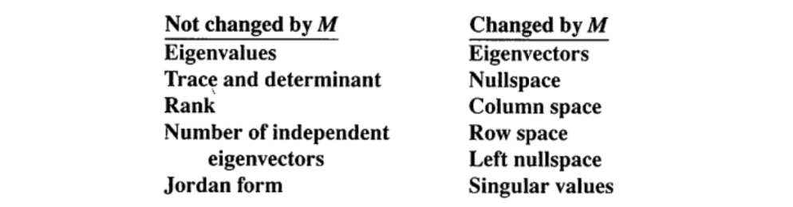

**相似矩阵实例**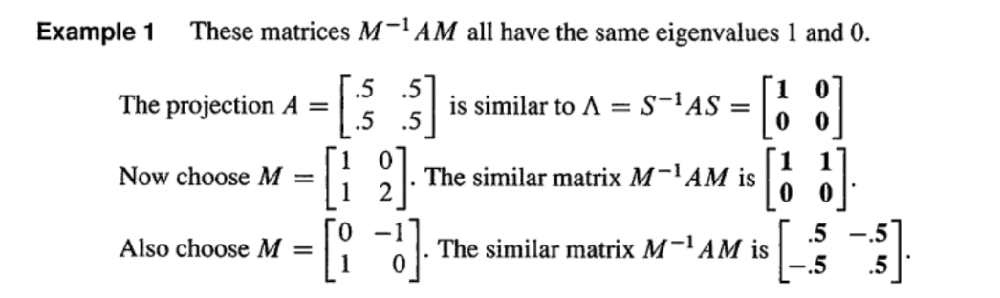

#### 诺尔当型
> **基本概念**
> 现在我们考虑这样一种方阵$\bf T_{n\times n}$，他只有少于$n$和特征向量(`Defective Case`), 此时矩阵不能按照常规方法对角化得到对角阵，此时我们可以将$\bf M$的选取放宽到任意可逆方阵，$\bf \Lambda$的选取也不在是对角阵，而是一个新的形式的矩阵，成为`Jordan Matrix`, 他可以使得任意$n\times n$方阵$\bf T$写成$\bf T =MJM^{-1}$的形式。
>    - **相似矩阵**具有**相同的特征值和特征向量个数, 以及相同的**`**Jordan Matrix**`**。**
>    - 而如果两个矩阵有相同的特征值(重数不一定一致)和特征向量个数，但是有其中一个**重特征值**的`Jordan Block`不相同，则这两个矩阵也不相似。
> 
**若尔当理论**：
> - 任意$n$阶矩阵$\bf A$都与一个若尔当矩阵$\bf J$相似。若尔当矩阵中的每一个若尔当块对应一个特征向量。
> - 若矩阵具有$n$个不同的特征向量，则可以对角化，此时其若尔当标准型$\bf J$就是对角矩阵$\bf Λ$。
> - 如果$\bf A$有重复特征值，则其对应的若尔当矩阵的上对角线每多一个$1$, 就少一个特征向量。
> 
**适用场景:**
> 其实也谈不上什么应用，只是说在面对一些性质不太好的方阵的时候，比如前文介绍的几何重数小于代数重数的方阵不能对角化，而是只能采用近似对角化的形式$\bf A=MJM^{-1}$($\bf J$是`Jordan Matrix`,不是对角阵; $\bf M$是可逆矩阵)
> 所以，对于任意方阵$\bf A$，如果我们要计算$\bf A^k$又正好碰上不能对角化的情况，我们就可以使用其近似对角化形式$\bf A^k=MJ^kM^{-1}$ 计算。
> 但是，`Jordan`标准型实际应用的场景不如前文介绍的对角化或者正交对角化广泛，因为用他的计算不稳定，这里摘录书中的原话:
> 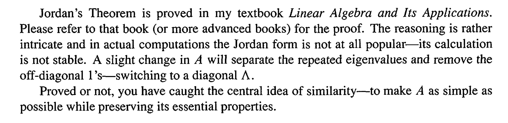

**特征值相同不意味着相似****两个矩阵具有相同的特征值和特征向量个数，但是其若尔当块的尺寸不同，两者也并不是相似矩阵**。如下面的两组矩阵
矩阵$\bf A= \begin{bmatrix} 0&1&0&0\\0&0&1&0\\0&0&0&0\\0&0&0&0\end{bmatrix}$ 与$\bf B= \begin{bmatrix} 0&1&7&0\\0&0&1&0\\0&0&0&0\\0&0&0&0\end{bmatrix}$ 为相似矩阵。
但矩阵$\bf A=\begin{bmatrix} 0&1&0&0\\0&0&1&0\\0&0&0&0\\0&0&0&0\end{bmatrix}$与$\bf C=\begin{bmatrix} 0&1&0&0\\0&0&0&0\\0&0&0&1\\0&0&0&0\end{bmatrix}$与并不是相似矩阵，两者具有不同的若尔当块。
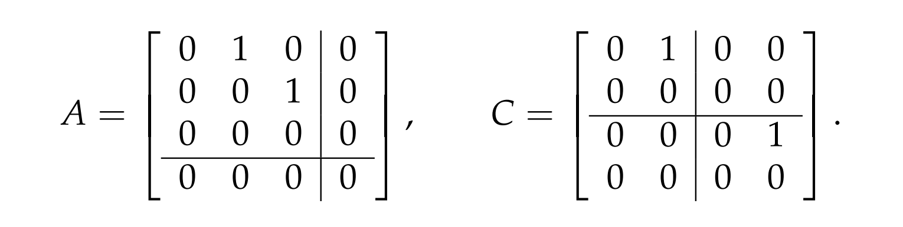

### 2.4.4 特征值和矩阵的秩
> 在总结之前，我们证明一个有用的结论:
> 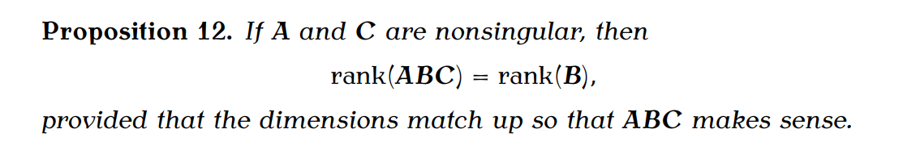
> **证明过程如下:**
> 令, 且我们知道, 所以我们有, 因为, 所以, 于是
> **有了这个性质我们知道，如果可相似对角化， 则:**
> - $\bf A$有$\bf n$个线性无关的特征向量, 且其几何重数等于代数重数, 证明略。
> - 如果$\bf λ$为$\bf A$的一个$k$重特征值$\bf λ$一定有$\bf k$个线性无关的特征向量，结论显然。
> - 矩阵$\bf A$所有的非零特征值的数量等于其秩
> 
, 所以, 而是一个对角矩阵，其对角线上的非零特征值的个数就决定了其秩的大小，证毕。
> - 如果$\bf r(A)=k$, 则$\bf λ=0$为$\bf A$的$\bf n−k$重特征值。这个结论可以直接由上面的结论推导出来。
> - 如果的所有特征值都非零，即, 则, 即可逆。

### 2.4.5 特征值与矩阵的主元
> 在[特征值与主元](https://www.yuque.com/alexman/so5y8g/bk3kq8#icORr)中我们建立过特征值和主元的联系([证明](https://www.yuque.com/alexman/so5y8g/bk3kq8#rVnzo))，这里我们做一个总结:
> 对于**对称矩阵**来说，一定有$n$个不同的线性无关的特征向量, 且
> - **主元的符号和特征值的符号相同**
> - **正的特征值的数量和正的主元的数量相同**
> - **当且仅当所有的主元为正时，对称矩阵的所有特征值都大于零。**

**Example**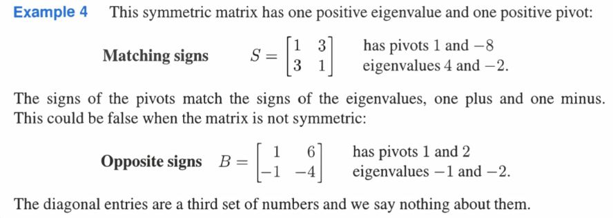

## 2.5 Applications
### 2.5.1 人口流动
> 

### 2.5.2 齐次微分方程组
> 

## 2.6 特殊矩阵的特征值
### 2.6.1 投影矩阵
> 1. 投影矩阵满足，且特征值只能是或者
> 
**证明:**
> 假设的特征值满足, 则
> 则, 所以
> 2. 投影矩阵的迹等于特征值的代数重数
> 
**证明：**
> 
> 3. 由于投影矩阵是对称矩阵，所以投影矩阵的迹也等于特征值的几何重数。

### 2.6.2 对称矩阵
> 对于一个方阵, 如果其满足, 则我们称其为对称矩阵。下面总结一些性质：
> 1. 行空间和列空间相同，这点很容易看出。
> 2. **所有特征值为实数**
> 
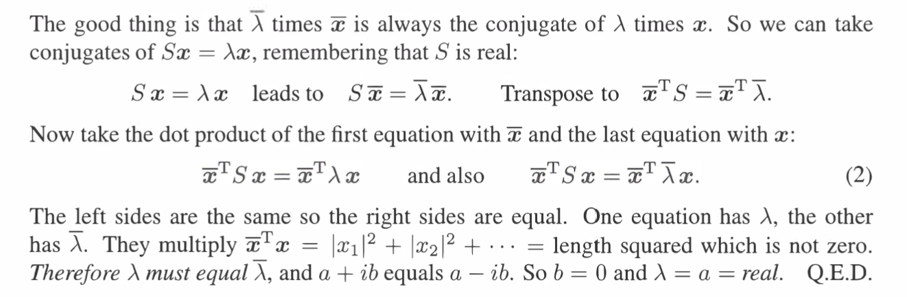

