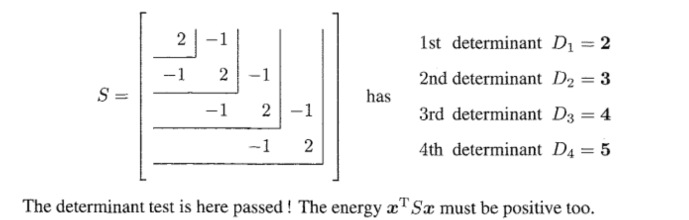

> Reading: 1.7

# 1 对称矩阵
## 1.1 定义与性质
> 如果一个矩阵$\bf S$满足$\bf S^T=S$则$\bf S$称为对称矩阵。
> 对于一个对称矩阵$\bf S_{d\times d}$:
> - 他有$d$个实数特征值$\lambda_1,\cdots, \lambda_d$(可以相同)
> - $d$个特征值对应的特征向量$\bf u_1\cdots, u_d$互相正交，组成可逆的正交矩阵$\bf Q$
> - 他一定可以正交对角化成$\bf S=Q\Lambda Q^T$的形式，这就是谱定理
> - **对称矩阵的行空间和列空间相同**

## 1.2 谱分解
> 

**Proof**
其中$\bf Q^Tu_i=\begin{bmatrix} ——\mathbf{u_1^T}—— \\ ——\mathbf{u_2^T}—— \\\vdots\\ ——\mathbf{u_i^T}——\\\vdots\\——\mathbf{u_d^T}—— \end{bmatrix}\mathbf{u_i}=\begin{bmatrix} 0_1\\0_2\\\vdots\\1_i\\\vdots\\0_d\end{bmatrix}=\mathbf{e_i}$
$\bf Qe_i$就相当于将$\bf Q$的第$i$列提取出来，也就是$\bf u_i$

## 1.3 特征值/特征向量
> 1. **对称矩阵有实特征值**，这是一个非常重要的性质。
> 
**引用书中的证明：**
> 
> 2. **对称矩阵不同特征值的特征向量相互正交(不光光是线性无关)**
> 
**引用书中的证明:	**				
> 

# 2 (半)正定矩阵
## 2.1 定义
> 

**Proof**

## 2.2 五种判定方法
### Postivity Test
> **所有的特征值大于零**
> 这个测试来源于对称矩阵能够进行谱分解。我们知道一个正定矩阵$\bf M$可以正交对角化$\bf M=Q\Lambda Q^T$,展开后得到谱分解$\mathbf{M}=\sum_{i=1}^n \lambda_i \mathbf{u_iu_i^T}$, 而根据正定矩阵的定义:$\bf x^TMx>0$, 我们有:
> $\mathbf{x^TMx}= \mathbf{x^T}\sum_{i=1}^n \lambda_i \mathbf{u_iu_i^T}\mathbf{x}=\sum_{i=1}^n \lambda_i||\mathbf{u_i^Tx}||^2>0$, 这个不等式对所有$\bf x$成立当且仅当$\lambda_i>0,\forall i$
> 于是我们只要判断$\lambda_i>0,\forall i$即可。

**Example**

### Energy Test
> **标准测试方法:**
> 
> **间接测试:**
> 
> **这个测试来源于正定矩阵的性质**

**证明间接测试**

### Independence Test
> 
> 这个测试来源于正定矩阵和$\bf A^TA$矩阵的一些性质:
> 1. 正定矩阵一定可逆。
> 2. 正定矩阵能够进行$\bf A^TA$(且$\bf A$的各列线性无关)分解。
> 3. $\bf Rank(A^TA)=Rank(A)$([证明](https://www.yuque.com/alexman/so5y8g/qh5ruz#IWSKa))
> 

**Proof**首先对于任何方阵，我们都能进行$\mathbf{LU}$分解，得到一个下三角矩阵$\bf L$(对角线上全是$1$)和一个上三角矩阵$\bf U$, 对角线上是主元(不全都是$1$)。
但是我们想让$\bf L$和$\bf U$的对角线上的元素都是$1$, 于是我们可以进行下列操作使得$\bf L$和$\bf U$的对角线上都是$1$:

注意到如果我们将一个正定矩阵$\bf S$写成$\bf S=LDU$, 那么因为$\bf S^T=S$， 所以$\bf U^TD^TL^T=LDU$, 于是我们令$\bf U=L^T$, 得到$\bf S=LDL^T$
令$\bf A^T=L\sqrt{D}$, 则$\bf S=(L\sqrt{D})(L\sqrt{D})^T=A^TA$
然后我们证明$\bf A$的各列线性无关。
因为正定矩阵的所有特征值大于零，且矩阵的行列式等于特征值的乘积，所以行列式的值大于零，即**正定矩阵**$\bf S$**一定可逆。**
因为$\bf S_{n\times n}$可逆，所以$\bf Rank(S)=n$($\bf S$满秩), 于是$\bf Rank(S)=Rank(A^TA)=Rank(A)=n$， 于是$\bf A$满秩，于是$\bf A$的列线性无关。证毕。

### Leading Determinants Test
> 

**Proof**[https://blog.csdn.net/phoenix198425/article/details/79149056](https://blog.csdn.net/phoenix198425/article/details/79149056)
**Example**

### Pivot Test
> 
> **证明这个**`**Test**`**涉及到一个非常重要的性质:**
> The $k-th$pivot equals the ratio $\frac{D_k}{D_{k-1}}$of the leading determinants(size $k$and $k-1$). 这个性质将行列式和主元联系到了一起。

**Sketch Proof & Example**

# 3 Problem Sets
