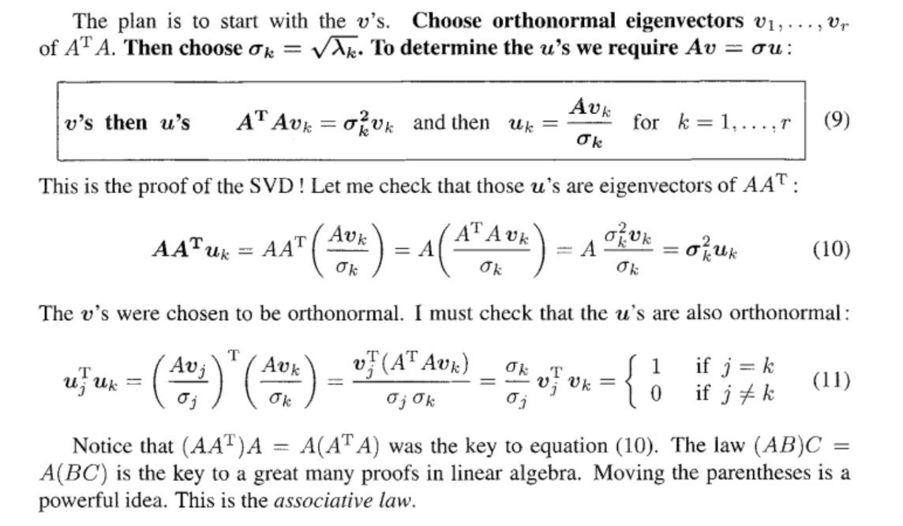
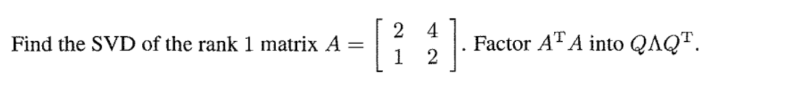

> **Reading: **1.8

# 1 Basic of SVD
## Preliminaries
> 
> 这里我们有两种解读`best-fit subspace`的方式. 
> 1. The subspace **minimizes the sum of squared distances** of the data points to it. This first interpretation and its use are akin to the notion of** least-squares fit **from calculus. But there is a difference: here we take the perpendicular distance to the line or subspace, whereas, in the calculus notion, given n pairs, $(x_1, y_1),(x_2, y_2), . . . ,(x_n, y_n)$, we find a line $l = \{(x, y)|y = mx + b\}$ minimizing the vertical squared distances of the points to it, namely, $\sum_{i=1}^n(y_i − mx_i − b)^2$.
> 2. The subspace **maximizes the sum of projections** squared of the data points on it. This says that the subspace contains the maximum content of data among all subspaces of the same dimension. The choice of the objective function as the sum of squared distances seems a bit arbitrary and in a way it is. But the square **has many nice mathematical properties.** 

## Singular Vectors
> 首先我们来定义`Singular Vectors`。假设我们手头有一个矩阵$\mathbf{A}\in \mathbb{R}^{n\times d}$, 其每一行都可以看做一个$d$维数据点。
> 假设我们有一条过原点的`Best Fit Line`。假设向量$\mathbf{v}$是沿着这条`Line`上的一个单位向量。那么对于矩阵$\mathbf{A}$的每一行$\mathbf{a_i}$, 其在$\mathbf{v}$上的的投影长度是$|\mathbf{a_i\cdot v}|$, 于是从`Preliminary`中可知，如果我们要求`Best Fit Line`, 只需要将所有的投影长度的平方相加，表示为$||\mathbf{Av}||_2^2$, 将其最大化即可。

## Full SVD
> 对于任意矩阵$\mathbf{A}\in \mathbb{R}^{m \times n}$, 我们可以对其进行奇异值分解如下：
> $\mathbf{A=U\Sigma V^T}$, 其中$\mathbf{U}\in \mathbb{R}^{m\times m},\mathbf{V}\in \mathbb{R}^{n\times n}$, $\mathbf{\Sigma}\in \mathbb{R}^{m\times n}$。$\mathbf{U,V}$都是正交方阵。
> 
> **写成类似奇异值方程:**
> 1. 关于$\mathbf{V}$:
> 
但是换一个角度看$\mathbf{A=U\Sigma V^T}$这个式子, 右乘$\mathbf{V}$并利用$\mathbf{V^TV=I}$的事实我们得到:
> $\mathbf{AV=U\Sigma}$
> **所以：**
>    - $\mathbf{Av_i=\sigma_i u_i},~~\forall 1\leq i\leq r$, 其中$r=\mathbf{Rank(\Sigma)}$, 且$r\leq min\{m,n\}$, 这些$\mathbf{v_i}\in \mathbb{R}^n,\mathbf{v_i}\in \mathbf{Row(A)}$
>    - $\mathbf{Av_i=0},~~\forall r\leq i\leq max\{m,n\}$, 这些$\mathbf{v_i}\in \mathbf{Null(A)}$(零空间)
> 2. 关于$\mathbf{U}$:
> 
但是换一个角度看$\mathbf{A=U\Sigma V^T}$这个式子, 左乘$\mathbf{U^T}$并利用$\mathbf{U^TU=I}$的事实我们得到:
> $\mathbf{U^TA=\Sigma V^T}$
> 两边取转置得到:
> $\mathbf{A^T U=V\Sigma^T}$
> **所以：**
>    - $\mathbf{A^Tu_i=\sigma_i v_i},~~\forall 1\leq i\leq r$, 其中$r=\mathbf{Rank(\Sigma^T)=Rank(\Sigma)}$, 且$r\leq min\{m,n\}$, $\mathbf{u_i}\in\mathbb{R}^m$,$\mathbf{u_i}\in Row(A^T)=Col(A)$
>    - $\mathbf{A^Tu_i=0},~~\forall r\leq i\leq max\{m,n\}$, 这些$\mathbf{u_i}\in \mathbf{Null(A^T)}$(左零空间)

## Piece of Rank One Matrices
> 

**Example**

## Reduced Form of SVD
> 
> 其中: $\mathbf{A}\in \mathbb{R}^{m\times n}$, $\mathbf{V_r}\in \mathbb{R}^{n\times r}$, $\mathbf{U_r} \in \mathbb{R}^{m\times r}$, $\mathbf{\Sigma_r}\in \mathbb{R}^{r\times r}$
> 此时$\mathbf{V_r}$和$\mathbf{U_r}$均不再是方阵，但是$\mathbf{V_r^TV_r=I_n}$和$\mathbf{U_r^TU_r=I_m}$仍然成立，因为$\mathbf{u_i,v_i}$仍然都是标准正交列。
> 此时$\mathbf{v_1,\cdots, v_r}\in Row(A)$, 且$\mathbf{u_1,\cdots, u_r}\in Col(A)$

## Summary
> 

# 2 Brief Analysis of SVD(How)
## Basic Ideas
> 于是我们的目标就是要找到这样的$\mathbf{U,\Sigma, V}$, 方法就是利用$\mathbf{A^TA}$的优良性质:
> 1. $\mathbf{A^TA=V\Sigma^T U^TU\Sigma V^T=V\Sigma^T\Sigma V^T}$
> 2. $\mathbf{AA^T=U\Sigma V^TV\Sigma^T U^T=U\Sigma\Sigma^T U^T}$
> 
此时其实我们只要分别求出$\mathbf{A^TA}$的正交对角化分解和$\mathbf{AA^T}$的正交对角化分解即可完成。
> 

## Proof of SVD
> 

**Proof of AB and BA has the same eigenvalues**
**Examples**

## Geometry of SVD
> 

## SVD&Eigen-decomposition
> [https://www.yuque.com/alexman/so5y8g/psybsc#xAvbk](https://www.yuque.com/alexman/so5y8g/psybsc#xAvbk)

## Singular Vectors of A^T
> 

# 3 Ways to Construct SVD
## Power Method - Symmetric Matrix
> 

# 4 Exercises
## Important Facts
### P5 Transpose
> 
> 这里的`Norm`是`Orthogonal Invariant Norm`, 也就是左乘或者右乘一个`Orthogonal Matrix`不改变`Norm`大小的`Norm`, 常见的这样的`Norm`有`L2 Norm`和`Frobenius Norm`

**Proof**

### P6 Eigenvectors
> 

**Solution**

## Matrix Approximation
### P7 Low Rank Approximation
> 

**Solution**假设Norm是`Frobenius Norm`(所有奇异值的平方之和再开根)
假设$Rank(A)=k$, 则$A=\sum_{i=1}^k\sigma_iu_iv_i^T$, 所以$||A-\sigma_1u_1v_1^T||=\sqrt{\sum_{i=2}^k \sigma_i^2}$
$Rank(A-\sigma_1u_1v_1^T)=k-1$

## Norm&Submatrices⭐⭐⭐⭐⭐
### *Norm of Submatrices
> 

## Construct SVD
### P6 2x2 computation
> 

**Solution**$\mathbf{A^TA}=\begin{bmatrix} 9&12\\12&41\end{bmatrix}$, 特征方程: $\lambda^2-50\lambda +225=0$，于是$\lambda_1=45, \lambda_2=5$, 此时可知$\sigma_1=\sqrt{45}, \sigma_2=\sqrt{5}$, 然后求解$\mathbf{A^TA=V\Lambda V^T}$这个特征值分解, 得到特征向量:

### P8 3x3 computation
> 

**Solution**

### P12 Rank1 SVD
> 

**Solution**

## Parametrize SVD⭐⭐⭐⭐⭐
### P14 Geometry
> 
> 先逆时针旋转$\theta$, 然后拉伸，最后顺时针旋转$\phi$
> 
> 假设$A_{2\times 3}$是行满秩的。

**Solution****Part 1:**
Maximum number of $\sigma_i$'s are the minimum of $m$and $n$, which is $\min({m,n})=2$
因为假设是行满秩，所以一共有$2$个$\sigma$'s
**Part 2:**
我们需要两个角度参数来确定一个三维空间中的二维平面
需要一个角度参数在二维平面中确定一个向量。
所以一共需要三个角度参数。

### *P15 Geometry - 2⭐⭐⭐⭐⭐
> 

**Solution**
1. $3\times 3$:

因为$\mathbf{U,V}\in \mathbb{R^3}$, 是一个三维子空间，确定子空间需要两个参数，在子空间内确定向量需要一个参数，所以各需三个参数
$\mathbf{\Sigma}\in \mathbb{R}^3$, 需要三个`Scaling Factor`, 对应三个奇异值。
所以$\mathbf{U,V,\Sigma}$各需要三个参数。

2. $4\times 4$:

### P16 Degree of Freedom
> 

**Solution**因为`unit vector` 长度为$1$, 所以只需要知道四个`Entries`即可
因为知道了$v_1$的方向，且$v_2\perp v_1$, 所以只需要知道三个`Entries`即可。
后面的依次减一即可。
