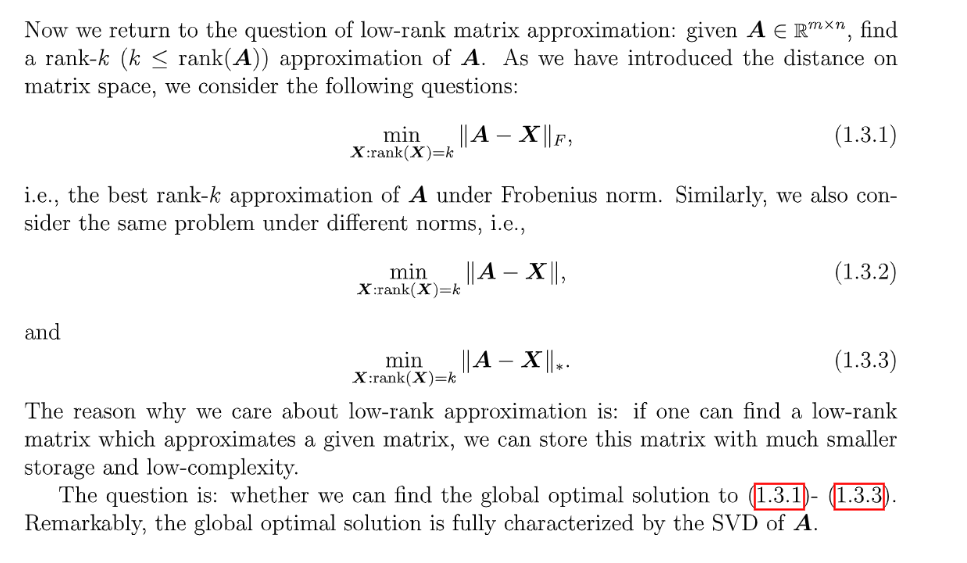
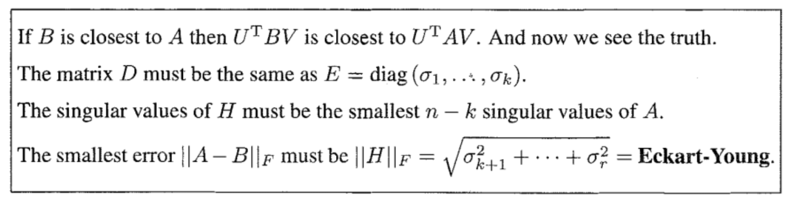
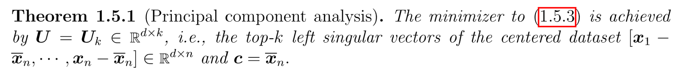
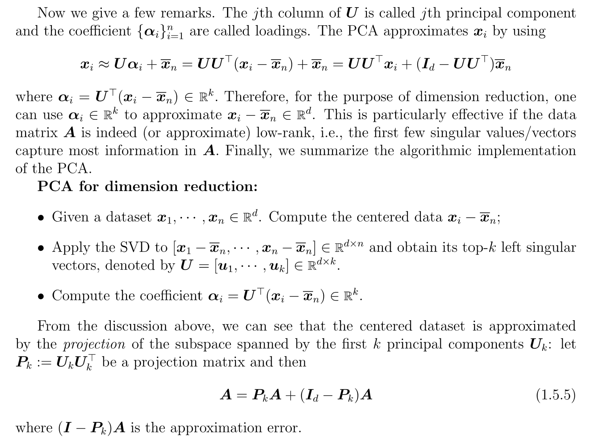
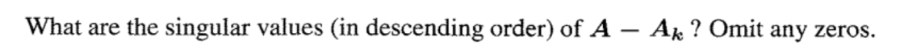

> **Reading: 1.9**

# 1 Best Rank K Approx
## Principle Components 
> 

## Eckart-Young Theorem
> 
> **证明后我们发现:**
> 

**Formal Proof for Operator Norm**
**Different Choices of Norm**
**Proof of the theorem Under L2 Norm(Using SVD)**
**Proof of the theorem Under Frobenius Norm(Strange)**
**Proof of the theorem Under Frobenius Norm(Simple)**

# 2 Principal Component Analysis
## Introduction
> `PCA`的本质是找一个`Low-dimensional subspace`(`affine set`)使得其能够`Approximate the original dataset`, 下面是`affine set`的定义: $S=\{x: Ax=b\}$, for given $A,b$。
> 我们从一个简单的例子入手: 
> 
> **Few Remarks:**
> 1. $\mathbf{u}$是我们要优化的方向向量，长度为$1$, 用$(-b, a)$表示。
> 2. 本质上`PCA`就是在求`dataset`的点距离$\mathbf{u}$所在的直线上的最小距离平方和，有点类似于最佳拟合曲线。

## Low Dimension Approx Perspective
### Problem Framework
> 
> **Few Remarks:**
> 1. $\mathbf{U}\in \mathbb{R}^{d\times k}$就是我们超平面的`Basis`向量，用$\mathbf{u_1,u_2,\cdots, u_k}$表示, 互相正交，即$\mathbf{U^TU=I_k}$
> 2. $\mathbf{\alpha_i}\in \mathbb{R^k}$, 表示的是$\mathbf{U}$各列如何进行线性组合。
> 3. $\mathbf{U\alpha_i+c-x_i}\in\mathbb{R}^{d\times 1}$，$d_i(\mathbf{U,c})=\|\mathbf{U\alpha_i+c-x_i}\|_2$表示的是某个数据点$\mathbf{x_i}$到这个超平面的`Vector L2-Norm`，为什么可以这样表示呢? 这里就需要利用到投影矩阵的概念，对于$\mathbf{U}$来说，他的投影矩阵是$\mathbf{U(U^{\top}U)^{-1}U^{\top}}$, 即$\mathbf{UU^{\top}}\in \mathbb{R}^{d\times d}$。$\forall \mathbf{v\in Col(U)}, \mathbf{UU^{\top}v=v}$。我们知道$\forall \mathbf{x_i} \in \mathbb{R}^{d\times 1}$, 他在$span(\mathbf{U})$上的投影是$\mathbf{u_i}$的线性组合，线性组合的系数就是$\mathbf{\alpha_i}$，于是投影就表示为$\mathbf{U\alpha_i+c}$, 于是$d_i$($\mathbf{x_i}$到超平面的距离)就是$\|\mathbf{U\alpha_i+c-x_i}\|_2$(是一个正交于超平面的向量)。
> 4. $\mathbf{U}$的列向量$\mathbf{u_i}$和$\mathbf{c}$是否需要正交呢? 即是否需要$\mathbf{u_i\perp c, \forall 1\leq i\leq k}$成立呢？答案是不需要

 

### Figure out alpha
> 
> **方法就是使用最小二乘法:**
> 最小二乘法的一般形式是$\min_{\mathbf{x}}\|\mathbf{Ax-b}\|_2$, 我们求解时一般转而求解$\mathbf{A^{\top}Ax=A^{\top}b}$(如果$\mathbf{A^{\top}A}$可逆)。
> 本题中的$\|\mathbf{U\alpha_i+c-x_i}\|_2$也可以看成最小二乘的形式，把$\mathbf{U}$看成$\mathbf{A}$, $\mathbf{\alpha_i}$看成$\mathbf{x}$, $\mathbf{x_i-c}$看成$\mathbf{b}$, 则$\mathbf{\alpha_i = (U^{\top}U)^{-1}U^{\top}(x_i-c)=U^{\top}(x_i-c)}$, 所以问题化为$\|\mathbf{UU^{\top}(x_i-c)+c-x_i}\|=\|\mathbf{(I-UU^{\top})(x_i-c)}\|$

 

### Figure Out c
> 
> 下一步就是给定$\mathbf{U}$求出$\mathbf{c}$的值, 方法是**矩阵求导术**, 对$\mathbf{c}$求偏导即可:
> 对于$\|(\mathbf{I-UU^{\top})(x_i-c)}\|_2^2=\mathbf{(x_i-c)^{\top}(I-UU^{\top})^{\top}(I-UU^{\top})(x_i-c)}$。我们知道$\mathbf{UU^{\top}}$实际上是一个投影矩阵，而投影矩阵有一个性质，就是$\mathbf{I-UU^{\top}}$仍然是_投影矩阵_，只是投影的空间不同。而且读者可以自行验证$\mathbf{I-UU^{\top}}$是_对称矩阵_，所以$\mathbf{(I-UU^{\top})^{\top}(I-UU^{\top})=(I-UU^{\top})(I-UU^{\top})=(I-UU^{\top})^{2}=I-UU^{\top}}$
> 于是$\mathbf{(x_i-c)^{\top}(I-UU^{\top})^{\top}(I-UU^{\top})(x_i-c)}=\mathbf{(x_i-c)^{\top}(I-UU^{\top})(x_i-c)}$, 然后利用矩阵求导公式$\mathbf{\frac{\partial x^T\mathbf{A}x}{\partial x}}=\mathbf{2Ax}$, 得到：
> 

### Figure Out U
> 

### Remarks
> 

## Statistical Perspective
### Problem Framework
> 

### Sample Covariance Matrix
> 

### Variational min-max Theorem
> 

# 3 Exercises
## Best Low Rank Approximation
### P1 A-Ak
> 

**Solution**Suppose $\mathbf{A}$is of rank $r$, then the singular values of $\mathbf{A-A_k}$are $\sigma_{k+1}, \cdots, \sigma_{r}$

### P2 Rank-1 Approx⭐⭐⭐⭐⭐
> 

**Solution**
1. $\mathbf{A}=\begin{bmatrix} 3&0&0\\0&2&0\\0&0&1\end{bmatrix}$, $\mathbf{AA^{\top}=A^{\top}A=\begin{bmatrix} 9&0&0\\0&4&0\\0&0&1\end{bmatrix}}$, 特征值是$\lambda_1=9, \lambda_2=4, \lambda_3=1$, 奇异值是$\sigma_1=3, \sigma_2=2.\sigma_3=1$, 左右奇异向量矩阵均是$\mathbf{I}$, 于是`Rank-1 Approximation`是$\sigma_1*\begin{bmatrix}1\\0\\0 \end{bmatrix}\begin{bmatrix}1&0&0 \end{bmatrix}=\begin{bmatrix} 3&0&0\\0&0&0\\0&0&0\end{bmatrix}$
2. $\mathbf{A}=\begin{bmatrix} 0&3\\2&0\end{bmatrix}$, $\mathbf{A^{\top}A=\begin{bmatrix} 4&0\\0&9\end{bmatrix}}, \mathbf{AA^{\top}=\begin{bmatrix} 9&0\\0&4\end{bmatrix}}$, 特征值是$\lambda_1=9, \lambda_2=4$, 奇异值是$\sigma_1=3, \sigma_2=2$, 奇异值$3$对应的$\mathbf{v_1=\begin{bmatrix}0\\1 \end{bmatrix},u_1=\begin{bmatrix}1\\0 \end{bmatrix}}$, 于是`Rank-1 Approximation`是$\sigma_1*\begin{bmatrix}1\\0\end{bmatrix}\begin{bmatrix}0&1 \end{bmatrix}=\begin{bmatrix} 0&3\\0&0\end{bmatrix}$
3. $\mathbf{A}=\begin{bmatrix} 2&1\\1&2\end{bmatrix}$, $\mathbf{AA^{\top}=A^{\top}A=\begin{bmatrix} 5&4\\4&5\end{bmatrix}}$, 特征值是$\lambda_1=9, \lambda_2=1$, 奇异值是$\sigma_1=3, \sigma_2=1$,$\sigma_1$对应的$\mathbf{v_1=\begin{bmatrix}1/\sqrt{2}\\1/\sqrt{2} \end{bmatrix},u_1=\begin{bmatrix}1/\sqrt{2}\\1/\sqrt{2} \end{bmatrix}}$, 于是`Rank-1 Approximation`是$\sigma_1*\mathbf{u_1v_1^{\top}}=\begin{bmatrix} 3/2&3/2\\3/2&3/2\end{bmatrix}$

### P3 Orthogonal Matrix
> 

**Solution**$\mathbf{A}$is orthogonal matrix, so $\mathbf{AA^{\top}=A^{\top}A=I}$, 此时`Rank-1 approximation`是$1*\begin{bmatrix} 1\\0\end{bmatrix}\begin{bmatrix}1&0  \end{bmatrix}=\begin{bmatrix}1&0\\0&0 \end{bmatrix}$

### P8 Rank 3 Approx
> 

**Solution**

## Norms
### P4 Eckart-Young⭐⭐⭐⭐⭐
> 

**Solution**$\|\mathbf{A-A_1}\|_{\infty}=\|\begin{bmatrix} 3/2&-3/2\\-1/2&1/2\end{bmatrix}\|_{\infty}=max(3,1)=3$

### P5 Isn't Orthogonal Invariant
> 

**Solution**

### P6 Frobenius Norm
> 

**Solution**Since $\sigma_1\geq\sigma_2>0$, we know that $\lambda_1\geq\lambda_2>0$. 
Also notice that $\mathbf{A}$is square matrix, we know that $\mathbf{A}$is full rank(since it has two non-zero eigenvalues). 
We know for a full rank square matrix if we do SVD on it, we have $\mathbf{A=U\Sigma V^{\top}}$where $\mathbf{U,\Sigma, V}$are all square matrices, then $\mathbf{A^{-1}=V\Sigma^{-1}U^{\top}}$, and we can immediately know that for $\mathbf{A^{-1}}$, its singular matrix is $\mathbf{\Sigma^{-1}}$where $\sigma_1'=\frac{1}{\sigma_2}$and $\sigma_2'=\frac{1}{\sigma_1}$.
Thus $\|\mathbf{A^{-1}}\|_2=\frac{1}{\sigma_2}$, $\|\mathbf{A^{-1}}\|_F^2=\frac{1}{\sigma_1^2}+\frac{1}{\sigma_2^2}$

## When SVD=Eigen-decom
> 

**Solution**
