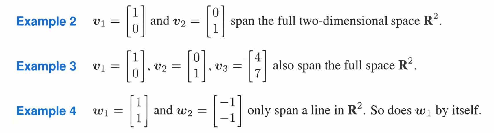

参考: [https://zhuanlan.zhihu.com/p/45822595](https://zhuanlan.zhihu.com/p/45822595)
> 本章介绍向量线性无关意味着什么, 以及如何使用线性无关的概念来帮助我们描述零空间在内的子空间
> 

# 1 线性无关 Linear Independence
## 1.1 基本定义
> 若 $c_1x_1+c_2x_2+⋯+c_nx_n=0$ 仅在$\bf c_1=c_2=⋯=c_n=0$ 时才成立，则称向量$x_1，x_2……x_n$是线性无关的。
> **矩阵视角:**
> 

## 1.2 线性方程中的线性无关
> 矩阵$\bf A$为$m\times n$矩阵，其中$m<n$（因此$\bf Ax=b$中未知数个数多于方程数）。则$\bf A$中具有至少一个自由变量，那么$\bf Ax=0$一定具有非零解。$\bf A$**的列向量可以线性组合得到零向量，所以**$\bf A$**的列向量是线性相关的。**
> 若这些线性相关的向量作为列向量构成矩阵$\bf A$，则方程$\bf Ax=0$只有零解$x=0$，或称矩阵$\bf A$的零空间只有零向量。
> 换而言之，若存在非零向量$\bf c$，使得$\bf Ac=0$，则这个矩阵$\bf A$的列向量线性相关。

## 1.3 空间中的线性无关性
> **我们给出几个有意思的性质: **
> - 在$\bf R^2$空间中，两个向量只要不在一条直线上就是线性无关的。
> - 在$\bf R^3$中，三个向量线性无关的条件是它们不在一个平面上。在`18.02SC`中我们也给出了几何上的解释，就是对于任意三个空间向量$\bf a,b,c$, 如果$\bf det(a,b,c)=0$, 说明$\bf a,b,c$张成的平行六面体的体积为$0$, 也就是说$\bf a,b,c$在同一个平面内, 也就是说$\bf a,b,c$线性相关
> - 若选定空间$\bf R^2$中的三个向量，则他们必然是线性相关的。例如，如下的三个向量$\bf v_1，v_2,v_3$是线性相关的。由我们研究方程组得到的结论，此矩阵构成的方程$\bf Ax=0$必有非零解，即三个向量线性相关。
> - 如果矩阵$\bf A_{m\times n}$的列向量为线性无关，则$\bf A_{m\times n}$所有的列均为主元列，没有自由列，矩阵的秩为$n$。若$\bf A_{m\times n}$的列向量为线性相关，则矩阵的秩小于$n$，并且存在自由列。

# 2 张成空间 Spanning Space
> **当一个空间是由向量**$\bf v_1，v_2……v_k$**的所有线性组合组成时，我们称这些向量张成了这个空间。例如矩阵的列向量张成了该矩阵的列空间。**
> 如果向量$\bf v_1，v_2……v_k$张成空间$\bf S$，则$\bf S$是包含这些向量的最小空间。
> 

# 3 基与维数
## 3.1 基本定义
> **向量空间的基是具有如下两个性质的一组向量**$\bf v_1，v_2……v_d$**：**
> - $\bf v_1，v_2……v_d$ 线性无关
> - $\bf v_1，v_2……v_d$ 张成该向量空间
> 
**空间的基告诉我们了空间的一切信息。**
> **比如**$\bf R^3$空间有一组基$\begin{bmatrix}1\\0\\0\end{bmatrix}$,$\begin{bmatrix}0\\1\\0\end{bmatrix}$,$\begin{bmatrix}0\\0\\1\end{bmatrix}$
> 因为它们满足$\bf c_1\begin{bmatrix}1\\0\\0\end{bmatrix}+c_2\begin{bmatrix}0\\1\\0\end{bmatrix}+c_3\begin{bmatrix}0\\0\\1\end{bmatrix}=\begin{bmatrix}0\\0\\0\end{bmatrix}$只有零解。并且这三个向量可以张成$\bf R^3$空间。
> 而$\begin{bmatrix}1\\1\\2\end{bmatrix}$,$\begin{bmatrix}2\\2\\5\end{bmatrix}$,$\begin{bmatrix}3\\3\\8\end{bmatrix}$则不能构成一组基，因为以它们为列向量组成的矩阵，有两个相同的行，消元肯定有自由列存在，因此这三个向量并非线性无关。
> **当判定线性相关性时，可以随时在矩阵、空间和方程组的概念之间切换，哪个判据更容易判定就用哪个，这里显然矩阵不可逆更容易看出来，因为存在行向量重复的情况。从这里也可以看到行向量线性相关则列向量不可能线性无关，矩阵行空间的维数等于列空间的维数。**
> 若以$\bf R^n$空间中的$\bf n$个向量为列向量构成的矩阵为可逆矩阵，则这些向量可以构成$\bf R^n$空间中的一组基。

## 3.2 子空间的基
> 向量$\begin{bmatrix}1\\1\\2\end{bmatrix}$,$\begin{bmatrix}2\\2\\5\end{bmatrix}$可以张成$\bf R^3$中的一个平面，但是它们无法成为$\bf R^3$空间的一组基。
> **空间的每一组基都具有相同的向量数**，这个数值就是**空间的维数（**`**dimension**`**）**。
> 所以$\bf R^n$空间的每组基都包含n个向量。

## 3.3 列空间的基
> 对于矩阵$\bf A=\begin{bmatrix} 1&2 &3&1 \\ 1&1&2&1 \\ 1&2&3&1 \end{bmatrix}$
> 矩阵$\bf A$的四个列向量张成了矩阵$\bf A$的列空间，其中第$3$列和第$4$列与前两列线性相关，而前两个列向量线性无关。因此前两列为主元列。他们组成了列空间$\bf C(A)$的一组基。矩阵的秩为$2$。
> 实际上对于任何矩阵$\bf A$均有：**矩阵的秩**$r$**=矩阵主元列的数目=列空间的维数**
> **注意：矩阵具有秩**`**rank**`**而不是维数**`**dimension**`**，而空间有维数而不是秩。**
> 当知道了列空间的维数，可以从矩阵列向量中随意选取足够数量(等于列空间维数)的线性无关的向量，它们每一组都可以构成列空间的一组基。

## 3.4 零空间的基
> 还是对于矩阵$\bf A=\begin{bmatrix} 1&2 &3&1 \\ 1&1&2&1 \\ 1&2&3&1 \end{bmatrix}$
> 这个矩阵的列向量不是线性无关的，矩阵$\bf A$的四个列向量张成了矩阵$\bf A$的列空间，其中第$3$列和第$4$列与前两列线性相关，包含两个自由元, 而前两个列向量线性无关, 对应两个主元
> 
> **其零空间**$\bf N(A)$**不止包含零向量。因为可以看出第**$3$**列是第**$1$**列和第**$2$**列的加和**
> - 所以向量$\begin{bmatrix}-1\\-1\\1\\0\end{bmatrix}$ 必然在零空间$\bf N(A)$之内(通过对自由元$x_3=1,x_4=0$)。
> - 同样还可以对$x_3=0,x_4=1$从而得到 $\begin{bmatrix}1\\0\\0\\1\end{bmatrix}$ 也在零空间之内。它们就是$\bf Ax=0$的两个特解。
> 
> **零空间的维数=自由列的数目=**$n-r$**，因此本例中**$\bf N(A)$**的维数为**$4-2=2$**。这两个特解就构成了零空间的一组基。**

## 3.5 标准基
> 
> 

## 3.6 判断矩阵基本空间的基
### 3.6.1 可逆矩阵的列是列空间的基
> 

### 3.6.2 主元列(行)是列(行)空间的基
> 

# 4 关于最简阶梯阵
## 4.1 列空间的基
> 我们可以通过将矩阵$\bf A$通过高斯消元行化简为最简阶梯阵$\bf R$
> 比如:
> 
> $\bf A$和$\bf R$的列空间在消元后的**列空间不同，所以其基也不同**，
> - $\bf A$的秩为$1$, 列空间的基为其主元列($\bf R$中的主元列位置) $\begin{bmatrix} 2\\3\end{bmatrix}$
> - $\bf R$的秩为$1$, 列空间的基为$\begin{bmatrix} 1\\0\end{bmatrix}$

 
 
## 4.2 算例
> 

# 5 总结
> 

# 6 作业
## P1: 找到最大的线性无关组**⭐⭐**
> 

Key
本题介绍了判断向量是否线性无关的方法之一: 就是将待判断的向量$\bf v_1,v_2,v_3,...,v_n$写成一个矩阵$\bf A=[v_1\space v_2\space v_3.....v_n]$, 然后判断$\bf Ax=0$的解的情况，如果只有平凡解($\bf x=0$), 则$\bf v_1,v_2,v_3,...,v_n$线性无关

## P2: 找到平面/直线的基**⭐⭐⭐⭐**
> 

**(a) 找到平面的基**本题比较新颖，一个平面的基可以理解为平面内两个线性无关的向量(这两个向量能够张成这个平面)
注意到题目中提到了`basis`是$\bf R^3$，这也提醒了我们应该从零空间的角度出发
我们将平面表达式抽象为一个线性方程$x-2y+3z=0$, 进而抽象成一个$\bf Ax=0$的线性系统，其中$\bf A = \begin{bmatrix} 1&-2&3\end{bmatrix}$
**求平面的基就相当于在这个平面内找两个线性无关的向量，也就是说找两个满足**$x-2y+3z=0$**且线性无关的解，那么也就是在求**$\bf A$**的零空间的基**
我们取自由元$y=1,z=0$, 得到$x=2$
取自由元$y=0,z=1$，得到$x=-3$
于是我们有零空间的两个特解$v_1=\begin{bmatrix} 2\\1\\0\end{bmatrix}$和$v_2=\begin{bmatrix} -3\\0\\1\end{bmatrix}$
所以平面$x-2y+3z=0$的基就是上述$v_1,v_2$
**(b) 找到直线的基**首先找到平面与$xy-plane$的交直线
令$z=0$,则$x-2y=0$
使用$(a)$中的抽象方法，令$\bf A=\begin{bmatrix} 1&-2\end{bmatrix}$
通过取自由元$y=1$得到$\bf A$的零空间的一个特解$v_1=\begin{bmatrix} 2\\1 \end{bmatrix}$
所以$v_1$就是直线$x-2y=0$的基
**(c) 找到垂直于平面的基**我们知道垂直于平面的所有向量都是方向向量$<1,-2,3>$的倍数，
所以垂直于平面的向量空间的基就是这个方向向量$<1,-2,3>$

